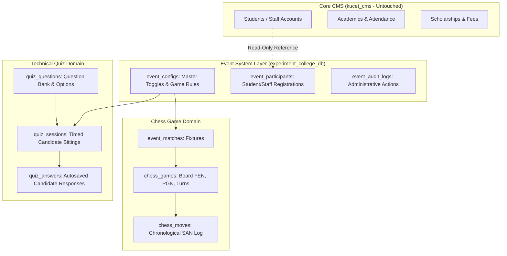

# College Event & Tournament System: Architecture & Games Blueprint

**System Version:** Multi-Game Tournament Engine (Chess MVP & Technical Quiz)  
**Git Branch:** `MY-EVENT`  
**Experimental Database:** `experiment_college_db`  
**Status:** Active, Tested & Synchronized with KUCET CMS Standards  

---

## 1. Executive Overview

The **KUCET College Event & Tournament System** is an isolated, modular multi-game competitive platform designed for college festivals, technical symposiums, esports competitions, and mind sports championships. It allows college administrators to:
1. **Toggle Tournament Modules:** Enable and disable tournament games on demand via individual master toggles (`chess`, `quiz`, etc.).
2. **Accept and Manage Participants:** Role-aware registrations for students and staff with departmental tagging.
3. **Run Real-Time Competitions:**
   - **Game 1 — Rapid Chess:** FIDE rule-compliant engine with live 2D boards, clock tracking, and move validation.
   - **Game 2 — Technical Quiz:** Timed competitive assessments with server-authoritative scoring, question bank management, autosave, and deterministic leaderboard tie-breaking.
4. **Independent Failure Domain:** Operating entirely within `experiment_college_db`, ensuring zero changes, risk, or dependencies on core `kucet_cms` tables (admissions, attendance, exams, fees, or authentication).

```text
                           ┌───────────────────────────┐
                           │   College Event Engine    │
                           │  (experiment_college_db)  │
                           └─────────────┬─────────────┘
                                         │
                 ┌───────────────────────┴───────────────────────┐
                 ▼                                               ▼
          ♟️ CHESS (Module 1)                          ⚡ TECHNICAL QUIZ (Module 2)
        (FIDE Rapid Rules & Board)                 (Timed Assessment & Live Leaderboard)
                 │                                               │
                 ├─ match fixtures                               ├─ question bank CRUD
                 ├─ move validator (chess.js)                    ├─ autosave & server timer
                 └─ arbitrated verification                      └─ deterministic ranking
```

---

## 2. Architecture & Data Isolation



---

## 3. Database Schema in `experiment_college_db`

### 3.1 Generic Event Tables
- `event_configs`: Master event configuration, description, rules JSON, `is_enabled`, and `registration_open` toggles.
- `event_participants`: Tournament registrations with department, user_type, and registration status (`REGISTERED`, `ACCEPTED`, `REJECTED`, `WITHDRAWN`).
- `event_audit_logs`: Audit trail for all organizer actions.

### 3.2 Chess Tournament Tables
- `event_matches`: Fixture records (Player White, Player Black, round, status, winner).
- `chess_games`: Live chess engine state (FEN, PGN, turn, checkmate/stalemate/draw flags, captured pieces).
- `chess_moves`: Full chronological move list with SAN, coordinates, and timestamps.

### 3.3 Technical Quiz Tables
- `quiz_questions`:
  - `id`: INT AUTO_INCREMENT PRIMARY KEY
  - `event_key`: VARCHAR(64) (`'quiz'`)
  - `question_text`: TEXT
  - `options_json`: JSON (array of options)
  - `correct_option_index`: INT (0..3)
  - `explanation`: TEXT
  - `marks`: DECIMAL(5,2) (default 2.00)
  - `negative_marks`: DECIMAL(5,2) (default 0.50)
  - `category`: VARCHAR(64) (e.g., 'Data Structures', 'Operating Systems', 'Networks', 'Database Systems', 'System Design')
  - `difficulty`: VARCHAR(32) ('EASY' | 'MEDIUM' | 'HARD')
  - `question_order`: INT
  - `is_active`: BOOLEAN
- `quiz_sessions`:
  - `id`: INT AUTO_INCREMENT PRIMARY KEY
  - `event_key`: VARCHAR(64)
  - `session_code`: VARCHAR(64) UNIQUE (e.g. `QUIZ-XXXXX`)
  - `user_id`: VARCHAR(64) (roll number or staff id)
  - `user_type`: VARCHAR(32) ('student' | 'staff')
  - `display_name`: VARCHAR(128)
  - `department`: VARCHAR(64)
  - `status`: VARCHAR(32) (`'IN_PROGRESS'` | `'SUBMITTED'` | `'EXPIRED'` | `'DISQUALIFIED'`)
  - `total_questions`: INT
  - `total_attempted`: INT
  - `total_correct`: INT
  - `total_incorrect`: INT
  - `total_unanswered`: INT
  - `score`: DECIMAL(6,2)
  - `max_possible_score`: DECIMAL(6,2)
  - `percentage`: DECIMAL(5,2)
  - `started_at`: DATETIME
  - `expires_at`: DATETIME (server-authoritative expiration)
  - `submitted_at`: DATETIME
  - `time_taken_seconds`: INT
- `quiz_answers`:
  - `id`: INT AUTO_INCREMENT PRIMARY KEY
  - `session_id`: INT
  - `question_id`: INT
  - `selected_option_index`: INT (nullable)
  - `is_marked_for_review`: BOOLEAN
  - `is_correct`: BOOLEAN
  - `marks_awarded`: DECIMAL(5,2)
  - `time_spent_seconds`: INT
  - `answered_at`: DATETIME
  - Unique index on `(session_id, question_id)` for idempotent autosaving.

---

## 4. Student Registration Workflow & Visibility Architecture

### 4.1 How Student Registration Works
1. **Admin Master Activation:** Super Admin navigates to `/admin/events` and toggles event activation (`is_enabled: true`) and registration status (`registration_open: true`).
2. **Student Navigation & Discovery:**
   - Logged-in students access the tournament hub via the **MY EVENT** link in the top navigation bar (`/events`) or the **MY EVENT / Tournaments** card on the student dashboard quick services.
   - The `/events` catalog presents all active tournaments with institutional badges (`Open`, `Upcoming`, `Completed`).
3. **Chess Championship Registration:**
   - On `/events/chess`, candidate clicks **"Register as Participant"**.
   - Roll number, name, and department are pre-filled from the active student session.
   - The client invokes `POST /api/events/participants` with `{ event_key: 'chess', user_id, display_name, department }`.
   - The system checks duplicate prevention and writes to `event_participants` with status `ACCEPTED`.
   - The UI immediately verifies registration via `GET /api/events/participants?event_key=chess&user_id={id}` and updates the button to **"Registered (Slot Confirmed)"**.
4. **Technical Quiz Candidate Sitting:**
   - On `/events/quiz`, candidate enters Roll Number and Name in the verification card and clicks **"Verify & Start Assessment"**.
   - `POST /api/events/quiz/session` verifies eligibility and opens a timed session (`quiz_sessions`) with server-locked start and expiration timestamps.
   - Candidate is routed to `/events/quiz/play?session={code}` to complete the assessment.

### 4.2 Participant Lifecycle States
- `REGISTERED`: Participant submitted registration, awaiting fixture scheduling or organizer approval.
- `ACCEPTED`: Participant is officially confirmed and paired into tournament fixtures.
- `REJECTED`: Participant registration was rejected due to department cap or ineligibility.
- `WITHDRAWN`: Participant withdrew before bracket generation.

---

## 5. Technical Quiz Invariants & Security Standards

### 5.1 Answer Sanitization Invariant
- Student GET endpoints (`/api/events/quiz/questions` and `/api/events/quiz/session`) **strip `correct_option_index` and `explanation`** from all question objects before transmitting to the client.
- Answers are evaluated **strictly server-side** in `QuizService.submitQuiz()`.

### 5.2 Server-Authoritative Timer & Autosave
- When a candidate starts a quiz, `started_at` and `expires_at` (`started_at + duration_minutes`) are locked in `quiz_sessions`.
- The client receives `remainingSeconds` and synchronizes the countdown timer.
- Client actions (option selection, clearing, marking for review) are immediately persisted via `POST /api/events/quiz/save-answer`.
- When time expires, the client automatically invokes submission, or the server auto-finalizes if expired during request processing.

### 5.3 Deterministic Leaderboard Ranking
- Ranking priority:
  1. **Score DESC** (Highest total marks awarded)
  2. **Time Taken ASC** (Lowest seconds spent)
  3. **Submitted At ASC** (Earliest completion timestamp)

---

## 6. How to Recreate `experiment_college_db`

If the experimental database `experiment_college_db` is dropped or needs to be re-initialized from scratch:

```bash
# 1-Step Database Recreation & Question Bank Seeding
npm run events:db:init
```

Alternatively, invoke the Node.js script directly:
```bash
node scripts/init-experiment-db.js
```

### What the Initialization Script Performs:
1. Connects to the MySQL/TiDB database server using the connection string from `.env` (`DATABASE_URL` or `EXPERIMENT_DB_URL`).
2. Executes `CREATE DATABASE IF NOT EXISTS \`experiment_college_db\` CHARACTER SET utf8mb4 COLLATE utf8mb4_unicode_ci`.
3. Creates generic event tables: `event_configs`, `event_participants`, `event_audit_logs`.
4. Creates chess tables: `event_matches`, `chess_games`, `chess_moves`.
5. Creates technical quiz tables: `quiz_questions`, `quiz_sessions`, `quiz_answers`.
6. Seeds default event configurations for `chess` and `quiz` with `registration_open = TRUE`.
7. Seeds 10 core computer science and engineering questions across Data Structures, Operating Systems, Computer Networks, Database Management Systems, and System Design into `quiz_questions`.

---

## 7. API Endpoints Map

| Route | Method | Access | Description |
| :--- | :--- | :--- | :--- |
| `/api/events/config` | GET / PUT | Public / Admin | Master event configuration and toggles |
| `/api/events/participants` | GET / POST | Public / Student | Participant registration and single-user status lookup (`?user_id=...`) |
| `/api/events/participants/[id]` | PUT / DELETE | Super Admin | Manage or reject participant registrations |
| `/api/events/chess/matches` | GET / POST | Public / Admin | Chess match fixtures and pairing creation |
| `/api/events/chess/matches/[id]` | GET / PUT | Public / Admin | Match state retrieval and arbiter result verification |
| `/api/events/quiz/config` | GET / PUT | Public / Admin | Quiz settings and master activation toggle |
| `/api/events/quiz/questions` | GET / POST | Public / Admin | Question bank (sanitized for students, full for admin) |
| `/api/events/quiz/questions/[id]` | PUT / DELETE | Super Admin | Updates or deletes an existing question |
| `/api/events/quiz/session` | POST | Public / Student | Starts or resumes an active quiz session |
| `/api/events/quiz/save-answer` | POST | Public / Student | Real-time autosave of selected option |
| `/api/events/quiz/submit` | POST | Public / Student | Server evaluation, scoring, and scorecard generation |
| `/api/events/quiz/leaderboard` | GET | Public | Ranked tournament leaderboard |
| `/api/events/quiz/admin/sessions` | GET / POST | Super Admin | Lists all student sessions and resets attempts |

---

## 8. KUCET Institutional UI/UX Design Compliance

The "MY EVENT" tournament module strictly adheres to the authentic KUCET College Management System visual standard:
- **Palette:** Kakatiya Navy primary (`#002A5C` / `#0b3578`), slate background (`bg-slate-50`), crisp borders (`border-slate-200`).
- **Typography:** Inter, uppercase tracking (`tracking-[0.18em]`) on section headers, standard table column styling.
- **Components:** Standard Breadcrumb navigation, institutional metric cards, accessible forms with explicit labels, and standard dialog modals.
- **Zero AI/Gaming SaaS Patterns:** Prohibits dark neon gradients, floating glassmorphic badges, and non-standard responsive layouts.

---

## 9. Testing & Build Verification

Run unit test suites:
```bash
npm run test:unit
```
Run production build:
```bash
npm run build
```

