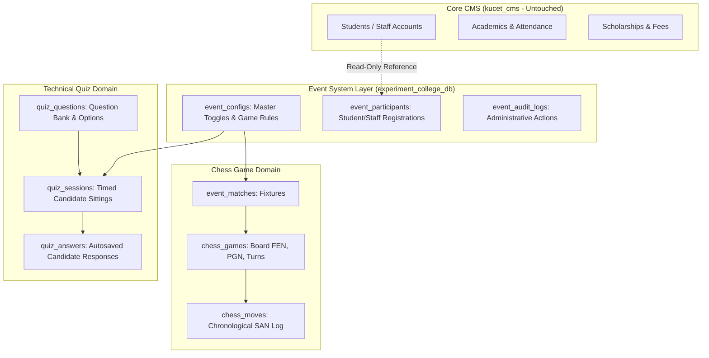

# College Event & Tournament System: Architecture & Games Blueprint

**System Version:** Multi-Game Tournament Engine (Chess MVP & Technical Quiz)  
**Git Branch:** `MY-EVENT-TECHNICAL-QUIZ`  
**Experimental Database:** `experiment_college_db`  
**Status:** Active, Tested & Fully Isolated  

---

## 1. Executive Overview

The **KUCET College Event & Tournament System** is an isolated, modular multi-game competitive platform designed for college festivals, technical symposiums, esports competitions, and mind sports championships. It allows college administrators to:
1. **Toggle Tournament Modules:** Enable and disable tournament games on demand via individual master toggles (`chess`, `quiz`, etc.).
2. **Accept and Manage Participants:** Role-aware registrations for students and staff with departmental tagging.
3. **Run Real-Time Competitions:**
   - **Game 1 — Rapid Chess:** FIDE rule-compliant engine with live 2D boards, clock tracking, and move validation.
   - **Game 2 — Technical Quiz:** Timed competitive assessments with server-authoritative scoring, question bank management, autosave, and deterministic leaderboard tie-breaking.
4. **Independent Failure Domain:** Operating entirely within `experiment_college_db`, ensuring zero changes, risk, or dependencies on core `kucet_cms` tables (admissions, attendance, exams, fees, or authentication).

```text
                           ┌───────────────────────────┐
                           │   College Event Engine    │
                           │  (experiment_college_db)  │
                           └─────────────┬─────────────┘
                                         │
                 ┌───────────────────────┴───────────────────────┐
                 ▼                                               ▼
          ♟️ CHESS (Module 1)                          ⚡ TECHNICAL QUIZ (Module 2)
        (FIDE Rapid Rules & Board)                 (Timed Assessment & Live Leaderboard)
                 │                                               │
                 ├─ match fixtures                               ├─ question bank CRUD
                 ├─ move validator (chess.js)                    ├─ autosave & server timer
                 └─ arbitrated verification                      └─ deterministic ranking
```

---

## 2. Architecture & Data Isolation



---

## 3. Database Schema in `experiment_college_db`

### 3.1 Generic Event Tables
- `event_configs`: Master event configuration, description, rules JSON, and `is_enabled` toggle.
- `event_participants`: Tournament registrations with department, user_type, and seed number.
- `event_audit_logs`: Audit trail for all organizer actions.

### 3.2 Chess Tournament Tables
- `event_matches`: Fixture records (Player White, Player Black, round, status, winner).
- `chess_games`: Live chess engine state (FEN, PGN, turn, checkmate/stalemate/draw flags, captured pieces).
- `chess_moves`: Full chronological move list with SAN, coordinates, and timestamps.

### 3.3 Technical Quiz Tables
- `quiz_questions`:
  - `id`: INT AUTO_INCREMENT PRIMARY KEY
  - `event_key`: VARCHAR(64) (`'quiz'`)
  - `question_text`: TEXT
  - `options_json`: JSON (array of options)
  - `correct_option_index`: INT (0..3)
  - `explanation`: TEXT
  - `marks`: DECIMAL(5,2) (default 2.00)
  - `negative_marks`: DECIMAL(5,2) (default 0.50)
  - `category`: VARCHAR(64) (e.g., 'Data Structures', 'Operating Systems', 'Networks', 'Database Systems', 'System Design')
  - `difficulty`: VARCHAR(32) ('EASY' | 'MEDIUM' | 'HARD')
  - `question_order`: INT
  - `is_active`: BOOLEAN
- `quiz_sessions`:
  - `id`: INT AUTO_INCREMENT PRIMARY KEY
  - `event_key`: VARCHAR(64)
  - `session_code`: VARCHAR(64) UNIQUE (e.g. `QUIZ-XXXXX`)
  - `user_id`: VARCHAR(64) (roll number or staff id)
  - `user_type`: VARCHAR(32) ('student' | 'staff')
  - `display_name`: VARCHAR(128)
  - `department`: VARCHAR(64)
  - `status`: VARCHAR(32) (`'IN_PROGRESS'` | `'SUBMITTED'` | `'EXPIRED'` | `'DISQUALIFIED'`)
  - `total_questions`: INT
  - `total_attempted`: INT
  - `total_correct`: INT
  - `total_incorrect`: INT
  - `total_unanswered`: INT
  - `score`: DECIMAL(6,2)
  - `max_possible_score`: DECIMAL(6,2)
  - `percentage`: DECIMAL(5,2)
  - `started_at`: DATETIME
  - `expires_at`: DATETIME (server-authoritative expiration)
  - `submitted_at`: DATETIME
  - `time_taken_seconds`: INT
- `quiz_answers`:
  - `id`: INT AUTO_INCREMENT PRIMARY KEY
  - `session_id`: INT
  - `question_id`: INT
  - `selected_option_index`: INT (nullable)
  - `is_marked_for_review`: BOOLEAN
  - `is_correct`: BOOLEAN
  - `marks_awarded`: DECIMAL(5,2)
  - `time_spent_seconds`: INT
  - `answered_at`: DATETIME
  - Unique index on `(session_id, question_id)` for idempotent autosaving.

---

## 4. Technical Quiz Core Features & Invariants

### 4.1 Security & Answer Sanitization Invariant
- Student GET endpoints (`/api/events/quiz/questions` and `/api/events/quiz/session`) **strip `correct_option_index` and `explanation`** from all question objects before responding.
- Answers are evaluated **strictly server-side** in `QuizService.submitQuiz()`.

### 4.2 Server-Authoritative Timer & Autosave
- When a candidate starts a quiz, `started_at` and `expires_at` (`started_at + duration_minutes`) are locked in `quiz_sessions`.
- The client receives `remainingSeconds` and synchronizes the countdown timer.
- Client actions (option selection, clearing, marking for review) are immediately persisted via `POST /api/events/quiz/save-answer`.
- When time expires, client automatically invokes submission, or the server auto-finalizes if expired during request processing.

### 4.3 Deterministic Leaderboard Ranking & Tie-Breaking
- Ranking priority:
  1. **Score DESC** (Highest total marks awarded)
  2. **Time Taken ASC** (Lowest seconds spent)
  3. **Submitted At ASC** (Earliest completion timestamp)

---

## 5. API Endpoints Map

| Route | Method | Access | Description |
| :--- | :--- | :--- | :--- |
| `/api/events/quiz/config` | GET | Public | Returns quiz settings and enabled state |
| `/api/events/quiz/config` | PUT | Super Admin | Updates quiz parameters and master toggle |
| `/api/events/quiz/questions` | GET | Public / Admin | Returns questions (sanitized for students, full for admin) |
| `/api/events/quiz/questions` | POST | Super Admin | Creates new question in question bank |
| `/api/events/quiz/questions/[id]` | PUT / DELETE | Super Admin | Updates or deletes an existing question |
| `/api/events/quiz/session` | POST | Public / Student | Starts or resumes an active quiz session |
| `/api/events/quiz/save-answer` | POST | Public / Student | Real-time autosave of selected option |
| `/api/events/quiz/submit` | POST | Public / Student | Server evaluation, scoring, and scorecard generation |
| `/api/events/quiz/leaderboard` | GET | Public | Returns ranked tournament leaderboard |
| `/api/events/quiz/admin/sessions` | GET / POST | Super Admin | Lists all student sessions and resets attempts |

---

## 6. Testing & Build Verification

Run unit test suites:
```bash
npm run test:unit
```
Run production build:
```bash
npm run build
```
