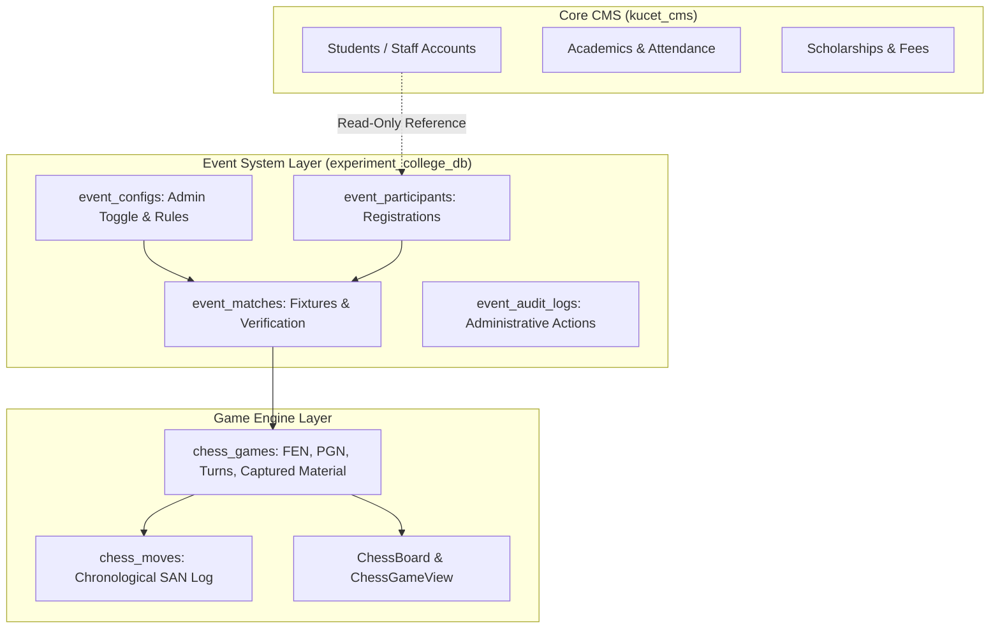

# College Event & Tournament System: Architecture & Future Games Blueprint

**System Version:** Module 1 — Chess MVP  
**Git Branch:** `MY-EVENT`  
**Experimental Database:** `experiment_college_db`  
**Status:** Complete & Fully Isolated  
**Test Suite Verification:** 64 test files (502 unit tests passing)

---

## 1. Purpose of the College Event System

The **KUCET College Event & Tournament System** is an isolated, multi-game competitive platform designed for college festivals, technical symposiums, esports competitions, and mind sports championships. It allows college administrators to:
1. Enable and disable tournament events on demand via a master toggle.
2. Accept and manage participant registrations for students and staff.
3. Automatically generate round-by-round fixtures and assign sides (e.g., White vs. Black in Chess).
4. Provide a live interactive gaming arena where legal moves and game states are authoritatively managed by the server.
5. Record, arbitrate, and officially verify match results.

The system is engineered as an **extensible hub** where multiple competitive games can be added over time without modifying the core College Management System (CMS) or disrupting academic, admission, attendance, or financial operations.

```text
                           ┌───────────────────────────┐
                           │   College Event Engine    │
                           │(experiment_college_db)    │
                           └─────────────┬─────────────┘
                                         │
                 ┌───────────────────────┼───────────────────────┐
                 ▼                       ▼                       ▼
          ♟️ CHESS (Active)       🎯 FUTURE GAME 2        🧠 FUTURE GAME 3
        (FIDE Rules & Board)     (e.g., Carrom/Table)      (e.g., Coding/Quiz)
```

---

## 2. Architecture & Design Principles



### Key Design Tenets:
1. **Strict Database Isolation:** Event tables are hosted in `experiment_college_db`. No tables in `kucet_cms` are altered or migrated.
2. **Server Authoritative Rule Validation:** Clients can never submit arbitrary moves, declare themselves winners, or manipulate game state. Every move is validated by the backend chess engine.
3. **Failure Isolation:** Any runtime issue in `experiment_college_db` or the chess module fails gracefully within the `/events` domain, leaving the main CMS portal 100% operational.
4. **Minimal Blast Radius:** Core CMS files are untouched, with only one tiny menu entry added for the superAdmin sidebar navigation.

---

## 3. Database Separation & Configuration

### 3.1 Connection Configuration
- **Database Client:** `src/modules/events/db/index.js` (`eventDb`)
- **Connection Pool:** `src/modules/events/db/connection.js`
- **Schema:** `src/modules/events/db/schema.js`
- **Idempotent Initializer:** `src/modules/events/db/init.js`

### 3.2 Environment Variables
| Variable | Description | Default / Local Development Fallback |
| :--- | :--- | :--- |
| `EXPERIMENT_DATABASE_URL` | Complete MySQL connection URI | Optional (uses `EXPERIMENT_DB_*` if absent) |
| `EXPERIMENT_DB_HOST` | Database host | `process.env.DB_HOST` (`127.0.0.1`) |
| `EXPERIMENT_DB_PORT` | Database port | `process.env.DB_PORT` (`3306`) |
| `EXPERIMENT_DB_USER` | Database user | `process.env.DB_USER` (`cms_user`) |
| `EXPERIMENT_DB_PASSWORD` | Database password | `process.env.DB_PASSWORD` |
| `EXPERIMENT_DB_DATABASE` | Target experimental database | `experiment_college_db` |
| `EXPERIMENT_DB_SSL` | SSL encryption flag | `process.env.DB_SSL` (`false`) |

### 3.3 Tables Belonging Exclusively to `experiment_college_db`
1. `event_configs`: Master event configuration, description, rules, and the live `is_enabled` toggle.
2. `event_participants`: Registrations from students and staff with status (`REGISTERED`, `ACCEPTED`, `REJECTED`, `WITHDRAWN`).
3. `event_matches`: Fixture records (Player White, Player Black, round, scheduled time, status, winner, verification status).
4. `chess_games`: Live chess state (FEN, PGN, current turn, check/checkmate/stalemate flags, captured pieces JSON).
5. `chess_moves`: Full chronological move list with SAN, from/to squares, promotions, and timestamps.
6. `event_audit_logs`: Audit trail for all organizer actions.

---

## 4. Admin Master Toggle & Event Lifecycle

### 4.1 Master Toggle: ENABLED / DISABLED
- Located in the Admin Event Management Console at `/admin/events/chess`.
- Controlled via `PUT /api/events/config`.
- Updates `event_configs.is_enabled` and logs an administrative audit entry.

### 4.2 Lifecycle State Transitions

```text
[DISABLED]
   │
   ▼ (Admin enables Chess Event via Admin Panel)
[ENABLED] ──> Registration Window Opens
   │
   ▼ (Contenders register; Admin accepts participants)
[MATCH CREATION] ──> Admin assigns White/Black players & Round
   │
   ▼ (Admin clicks "Publish Match")
[PUBLISHED] ──> Players enter Match Arena
   │
   ▼ (First legal move executed)
[IN_PROGRESS] ──> Players alternate turns (e2->e4, e7->e5...)
   │
   ├─► Checkmate ──────┐
   ├─► Resignation ────┼──► [COMPLETED] ──> Admin verifies result ──> [VERIFIED]
   ├─► Stalemate ──────┤
   └─► Mutual Draw ────┘
```

---

## 5. Chess Game Implementation & Rules

### 5.1 FIDE Chess Engine Integration
- Built with `chess.js` for 100% compliant FIDE rules.
- Validates all piece movements (King, Queen, Rook, Bishop, Knight, Pawn).
- Supports castling (kingside and queenside), en passant captures, and pawn promotions (Queen, Rook, Bishop, Knight).
- Automated terminal state detection: Checkmate (`isCheckmate()`), Stalemate (`isStalemate()`), Threefold Repetition (`isThreefoldRepetition()`), Insufficient Material (`isInsufficientMaterial()`), and 50-move rule.

### 5.2 Live Board & Arena UI
- **Interactive Board (`ChessBoard.js`):**
  - Crisp vector piece graphics (SVGs).
  - Selected square highlight (amber ring).
  - Legal destination indicators (emerald dots on vacant squares, emerald rings on capturable pieces).
  - King in check indicator (pulsing red radial glow).
  - Last move highlight (sky blue background on source and destination).
  - Pawn promotion modal dialog.
  - Perspective flipping (White view vs. Black view).
- **Match Arena (`ChessGameView.js`):**
  - Player scorecards with captured pieces tray and real-time point differentials (`+1`, `+3`, etc.).
  - Pulsing turn banner ("White to move" / "Your Turn").
  - Two-column move history in Standard Algebraic Notation (SAN).
  - Resignation and mutual draw offer/acceptance controls.
  - Live state polling every 2.5 seconds ensuring cross-device synchronization.

---

## 6. Security, Authorization & Failure Isolation

1. **Move Authorization:** Server verifies that `match.player_white_user_id === session.userId` when it is White's turn, and `match.player_black_user_id === session.userId` when it is Black's turn. Third parties and spectators cannot execute moves.
2. **Client Non-Authoritative:** Game outcome is derived by the backend engine upon move execution or explicit resignation/draw agreements. Clients cannot arbitrarily declare winners.
3. **Direct URL Protection (`EventGuard.js`):** Direct visits to `/events/chess` or `/events/chess/match/[id]` check `event_configs.is_enabled`. If disabled, non-admin visitors are blocked and shown an institutional inactive notice.
4. **Data Isolation:** The event database has no write access to student academic or financial records. Participant records only reference `roll_no` / `user_id` in read-only form.
5. **Independent Failure Domain:** If the experimental database encounters an error, the error is isolated to the event module. All standard CMS modules continue operating uninterrupted.

---

## 7. How to Add a New Game (Step-by-Step Guide)

When introducing a new game (e.g. `carrom`, `quiz`, `table-tennis`, `badminton`), follow this standardized protocol:

### Step 1: Create Game Subdirectory
Create a dedicated game directory under `src/modules/events/games/<game_key>/`:
```text
src/modules/events/games/<game_key>/
├── <Game>Board.js       # Game board / interaction component
├── <Game>GameView.js    # Arena view with scoreboards & controls
└── <game>-utils.js      # Game constants, scoring rules, icons
```

### Step 2: Define Game State Tables in `experiment_college_db`
In `src/modules/events/db/schema.js`, add game-specific state tables linked by `match_id`:
```javascript
export const carromGames = mysqlTable('carrom_games', {
  id: int('id').primaryKey().autoincrement(),
  match_id: int('match_id').notNull().unique(),
  white_points: int('white_points').default(0).notNull(),
  black_points: int('black_points').default(0).notNull(),
  current_turn: varchar('current_turn', { length: 8 }).notNull().default('w'),
  status: varchar('status', { length: 32 }).default('IN_PROGRESS'),
  created_at: timestamp('created_at').defaultNow().notNull(),
  updated_at: timestamp('updated_at').defaultNow().onUpdateNow().notNull(),
});
```

### Step 3: Implement Game Domain Service
Create `src/modules/events/services/<Game>EngineService.js` handling:
- Game initialization
- State transitions & move validation
- Terminal condition checking (winning points, timeout, forfeit)

### Step 4: Add API Endpoints
Create routes under `src/app/api/events/games/<game_key>/`:
- `move/route.js` or `score/route.js` (validating player turn and action)

### Step 5: Add Student & Admin Pages
- Admin management page: `src/app/admin/events/<game_key>/page.js`
- Student lobby: `src/app/events/<game_key>/page.js`
- Match arena: `src/app/events/<game_key>/match/[id]/page.js`

### Step 6: Add Unit Tests
Add dedicated test suite in `tests/unit/events/<game_key>-engine-service.test.js`.

---

## 8. Festival Shutdown & Archival Workflow

At the conclusion of a college festival or tournament season:
1. **Disable Tournament Event:** Super Admin flips the **Chess Event** toggle to **DISABLED** in `/admin/events/chess`.
2. **Seal All Results:** Run verification on any remaining completed matches.
3. **Database Snapshot:** Export an archive snapshot of `experiment_college_db`:
   ```bash
   mysqldump -u cms_user -p experiment_college_db > backups/experiment_college_db_2026.sql
   ```
4. **Data Retention:** The data remains safely preserved in `experiment_college_db` for historical records without taking up space or creating schema debt in `kucet_cms`.

---

## 9. Merging & Production Safety Guidelines

1. All tournament development must remain on the branch `MY-EVENT`.
2. Never execute `npm run db:push` against production.
3. Keep `experiment_college_db` isolated from production databases at all times.
4. Verify all tests (`npm run test:unit`) and production build (`npm run build`) pass before requesting a pull request review.
