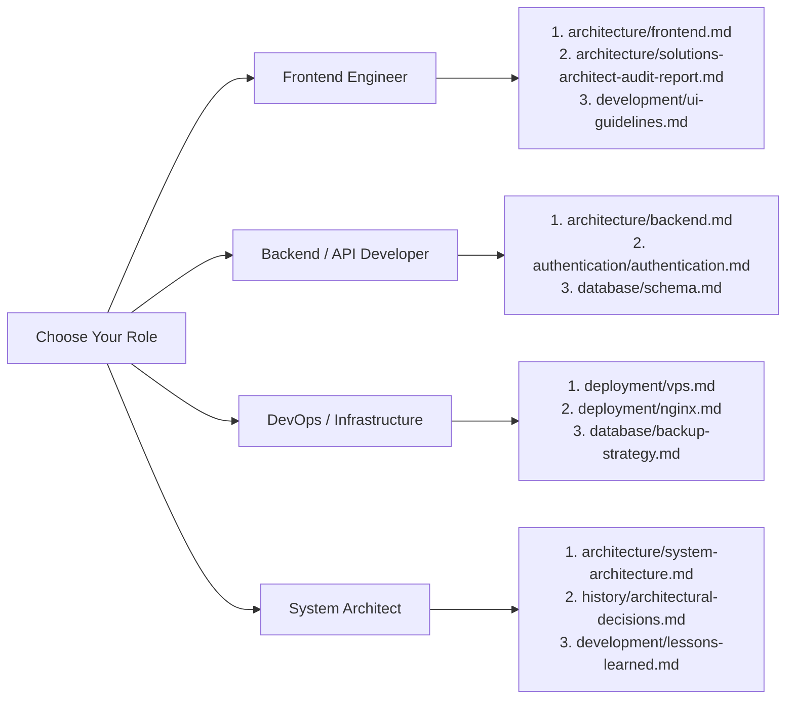

# 📚 KUCET CMS Documentation — Master Technical Knowledge Base

Welcome to the official canonical technical documentation for the **Kakatiya University College of Engineering and Technology (KUCET) College Management System (CMS)**. This documentation suite provides an exhaustive, production-grade architectural and operational blueprint designed for software engineers, database administrators, system architects, and administrative personnel.

---

## 🎯 System Overview & Mission

The **KUCET College Management System** is an enterprise web platform orchestrating academic administration, proxy-free attendance intelligence, student lifecycle registry, financial ledgers, and digital certificate verification across four primary institutional roles: **Super Admin**, **Head of Department (HOD)**, **Staff / Faculty**, and **Student**.

---

## 📂 Master Directory Hierarchy Map

```text
DOCUMENTATION/
├── README.md                                  # Master Index & Knowledge Base Blueprint (You are here)
│
├── architecture/                              # Core Architecture & System Blueprints
│   ├── system-architecture.md                 # High-Level Architecture, DDD, & Core Stack
│   ├── frontend.md                            # React 19 RSC, Tailwind CSS 4, Client State, Optimistic UI
│   ├── backend.md                             # Node.js 20 ESM, wrapHandler, Services, Pino Logging
│   ├── database.md                            # TiDB Cloud MySQL, Drizzle ORM, Connection Pooling
│   ├── storage.md                             # Strategy Pattern Storage, Cloudinary CDN, Local Fallback
│   ├── deployment.md                          # Hostinger VPS, Docker Compose, Nginx Reverse Proxy
│   └── solutions-architect-audit-report.md    # Frontend RSC, Server Action & Performance Audit
│
├── authentication/                            # Security, Identity & Session Management
│   ├── authentication.md                      # JWT jose Auth, Multi-Role Cookies, Token Flow
│   ├── authorization.md                       # Zero-Trust RBAC Matrix, Role Boundaries
│   └── session-management.md                  # Active Sessions Table, SSE Remote Revocation, Logout
│
├── database/                                  # Database Schemas & Migrations
│   ├── schema.md                              # Identity, Academic, Operations, Finance, Security Schemas
│   ├── migrations.md                          # Safe 4-Step Drizzle Migration Standard (0000-0013)
│   └── backup-strategy.md                     # Automated DB Dumps, S3/Cloudinary Snapshots, PITR
│
├── deployment/                                # Infrastructure & Server Operations
│   ├── vps.md                                 # Hostinger Ubuntu VPS Provisioning & Hardening
│   ├── nginx.md                               # Reverse Proxy SSL Termination, Caching, Rate Limiting
│   ├── ssl.md                                 # Let's Encrypt Certbot Configuration & Auto-Renewal
│   └── render.md                              # Cloud Preview Environment Specifications
│
├── development/                               # Engineering Standards & Developer Guide
│   ├── ai-agent-guide.md                      # AI Coding Agent Mandates, Verification Checklist
│   ├── coding-standards.md                    # JS/TS Style, React 19 Rules, Edge Header Buffering
│   ├── lessons-learned.md                     # 12 Inviolable Rules, Defensive Guardrails, Post-Mortems
│   ├── naming-conventions.md                  # Relative Storage Keys, UUID Randomization, Roll Numbers
│   ├── project-conventions.md                 # DDD Domain Layout, Service Boundaries, Scoping
│   └── ui-guidelines.md                       # Tailwind 4 Theming, Mobile Drawers, WCAG 2.1 AA
│
├── features/                                  # Detailed Feature Domain Specifications
│   ├── staff-management.md                    # Staff Onboarding Wizard, Admin Approval, HOD Matrix
│   ├── admissions.md                          # Multi-Stage Admission Engine, Roll Number Generator
│   ├── attendance.md                          # 4-Mode Attendance: Manual, PIN, GPS Geofence, QR
│   ├── certificates.md                        # React-PDF Generator, HMAC Signing, QR Verification
│   ├── examinations.md                        # Internal Assessment & Mid-Exam Marks Entry
│   ├── fees.md                                # Scholarship Sanctions (RTF/MTF), Ledger Auditing
│   ├── notifications.md                       # Web Push (VAPID), Realtime Broadcasts, Email Dispatch
│   ├── reports.md                             # Academic Reports, Condonation Analytics, CSV Export
│   └── requests.md                            # Student Digital Document & Profile Update Requests
│
├── pages/                                     # UI Page Inventory & Component Blueprints
│   ├── admin-pages.md                         # Super Admin Console (/admin/*)
│   ├── staff-pages.md                         # Institutional Staff Portal (/staff/*)
│   ├── faculty-pages.md                       # Faculty Classroom Console (/staff/faculty/*)
│   ├── hod-pages.md                           # Department Head Console (/staff/hod/*)
│   ├── student-pages.md                       # Student Portal (/student/*)
│   └── clerk-pages.md                         # Legacy Clerk Reference & Migration Guide
│
├── storage/                                   # File Storage & Asset Pipeline
│   ├── file-storage.md                        # Storage Engine Architecture & Strategy Provider
│   ├── cloudinary-history.md                  # Cloudinary Pipeline Reset & Migration Forensics
│   ├── self-hosted-storage.md                 # Local Disk Fallback (/var/www/kucet-storage)
│   └── uploads.md                             # Media Promotion Lifecycle (PFP, Signatures, Receipts)
│
├── history/                                   # Historical Audits, ADRs & Release Notes
│   ├── architectural-decisions.md             # System Architectural Decision Records (ADRs)
│   ├── migration-history.md                   # Database Migrations Log (0000_... to 0013_...)
│   ├── resolved-incidents.md                  # Forensic Post-Mortems (Sessions 176 - 205)
│   ├── old-cloudinary-migration.md            # Legacy Cloudinary Migration Forensics
│   ├── session-206-release-notes.md           # Session 206 Changelog (Web Push, QStash, Sentry)
│   ├── session-207-testvanilla-changes.md     # Session 207 Staff Restructure & Schema Forensics
│   └── session-207-pr-changes-and-workflow-audit.md # PR & Workflow Audit
│
└── troubleshooting/                           # Diagnostics & Operational Runbooks
    ├── debugging-guide.md                     # Step-by-Step Problem Resolution Playbook
    ├── common-errors.md                       # Known Error Codes, Root Causes & Fixes
    └── known-issues.md                        # Active Workarounds & Platform Considerations
```

---

## 🧭 Topic Navigation Matrix

| Topic Area | Primary Document | Companion References |
| :--- | :--- | :--- |
| **System Overview & DDD Layers** | [`architecture/system-architecture.md`](./architecture/system-architecture.md) | [`architecture/backend.md`](./architecture/backend.md), [`development/project-conventions.md`](./development/project-conventions.md) |
| **Frontend, React 19 & RSC** | [`architecture/frontend.md`](./architecture/frontend.md) | [`architecture/solutions-architect-audit-report.md`](./architecture/solutions-architect-audit-report.md), [`development/ui-guidelines.md`](./development/ui-guidelines.md) |
| **Authentication & Cookie Engine** | [`authentication/authentication.md`](./authentication/authentication.md) | [`authentication/session-management.md`](./authentication/session-management.md), [`authentication/authorization.md`](./authentication/authorization.md) |
| **Database Schema & ORM** | [`database/schema.md`](./database/schema.md) | [`database/migrations.md`](./database/migrations.md), [`architecture/database.md`](./architecture/database.md) |
| **Storage Strategy & Relative Keys** | [`architecture/storage.md`](./architecture/storage.md) | [`storage/file-storage.md`](./storage/file-storage.md), [`storage/uploads.md`](./storage/uploads.md) |
| **Staff & Faculty Onboarding** | [`features/staff-management.md`](./features/staff-management.md) | [`pages/staff-pages.md`](./pages/staff-pages.md), [`pages/faculty-pages.md`](./pages/faculty-pages.md) |
| **HOD Matrix & Timetables** | [`pages/hod-pages.md`](./pages/hod-pages.md) | [`features/attendance.md`](./features/attendance.md), [`features/examinations.md`](./features/examinations.md) |
| **Admissions & Roll Numbers** | [`features/admissions.md`](./features/admissions.md) | [`pages/staff-pages.md`](./pages/staff-pages.md), [`database/schema.md`](./database/schema.md) |
| **Attendance & PIN/GPS/QR** | [`features/attendance.md`](./features/attendance.md) | [`pages/faculty-pages.md`](./pages/faculty-pages.md), [`pages/student-pages.md`](./pages/student-pages.md) |
| **Certificates & Verification** | [`features/certificates.md`](./features/certificates.md) | [`features/requests.md`](./features/requests.md), [`pages/student-pages.md`](./pages/student-pages.md) |
| **Hostinger VPS & Nginx** | [`deployment/vps.md`](./deployment/vps.md) | [`deployment/nginx.md`](./deployment/nginx.md), [`deployment/ssl.md`](./deployment/ssl.md) |
| **Coding Standards & Invariants** | [`development/coding-standards.md`](./development/coding-standards.md) | [`development/lessons-learned.md`](./development/lessons-learned.md), [`development/ai-agent-guide.md`](./development/ai-agent-guide.md) |
| **Incident Forensics & ADRs** | [`history/resolved-incidents.md`](./history/resolved-incidents.md) | [`history/architectural-decisions.md`](./history/architectural-decisions.md), [`history/session-207-testvanilla-changes.md`](./history/session-207-testvanilla-changes.md) |
| **Debugging & Error Runbooks** | [`troubleshooting/debugging-guide.md`](./troubleshooting/debugging-guide.md) | [`troubleshooting/common-errors.md`](./troubleshooting/common-errors.md), [`troubleshooting/known-issues.md`](./troubleshooting/known-issues.md) |

---

## 👤 Tailored Reading Paths



---

## 🔒 Inviolable System Guardrails

```text
┌───────────────────────────────────────────────────────────────────────────────┐
│                      INVIOLABLE SYSTEM INVARIANTS                             │
├───────────────────────────────────────────────────────────────────────────────┤
│ 1. NEVER use `npm run db:push` (Always use db:generate -> audit -> db:migrate)│
│ 2. NEVER use roll numbers or PII as filenames (Use crypto.randomUUID())       │
│ 3. DB storage keys MUST be relative (e.g., kucet/students/pfp/abc.webp)       │
│ 4. ALWAYS wrap client image sources with getAssetUrl(key)                     │
│ 5. NEVER attach HTML DOM props (onError, onClick) to @react-pdf components     │
│ 6. ALWAYS validate API inputs using Zod schemas inside wrapHandler            │
│ 7. Use Pino logger (@/lib/logger) — bare console.log is strictly prohibited  │
│ 8. Buffer multi-cookie headers in Edge proxy using raw newCookiesToSet array  │
│ 9. High-frequency DB helpers (getCurrentCalendarSession) MUST use 5-min cache │
│ 10. Realtime broadcasts MUST execute only AFTER database transactions commit   │
└───────────────────────────────────────────────────────────────────────────────┘
```

---

## 🔄 Quick Commands Reference

```bash
# Start local development server (Turbopack)
npm run dev

# Run Vitest unit test suite (49 test files, 347 tests)
npm run test:unit

# Run ESLint compliance check
npm run lint

# Production standalone build verification
npm run build

# Database schema migration workflow
npm run db:generate   # Generate versioned migration SQL
npm run db:migrate    # Apply migration to TiDB Cloud
```

---

For deep dives into specific topics, select the corresponding markdown link from the [Master Directory Hierarchy Map](#-master-directory-hierarchy-map) above.
