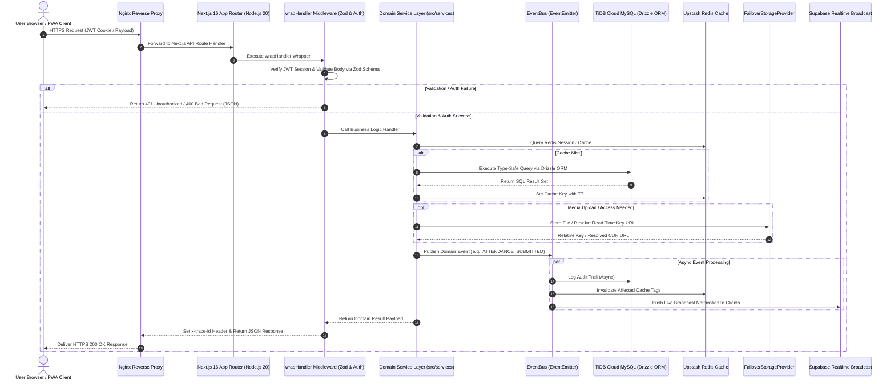

# 📚 KUCET CMS Documentation — Master Index

Welcome to the official technical documentation repository for the **Kakatiya University College of Engineering and Technology (KUCET) Management System**. This documentation suite provides an exhaustive, production-grade architectural and operational blueprint designed for software engineers, database administrators, system architects, and administrative clerks.

---

## 🎯 Purpose & Scope

The **KUCET College Management System (CMS)** is an enterprise institutional governance platform developed to unify fragmented academic, administrative, financial, and operational workflows into a secure, high-performance digital ecosystem.

### Core Objectives
- **Zero-Trust Security & Data Protection**: Enterprise role-based access control (RBAC), AES-256-GCM field encryption, blind indexing for PII (Aadhaar & Mobile), and Zod schema validation.
- **Institutional Governance**: Full lifecycle management of student admissions, roll number allocation, attendance tracking, government scholarships (RTF/MTF), internal marks, and digital certificate verification.
- **High-Availability Architecture**: Multi-cloud failover storage (S3/R2 → Cloudinary → Local Disk), distributed caching with Redis, serverless TiDB Cloud database, and real-time broadcasting via Supabase Realtime.
- **Seamless User Experience**: Mobile-first design, Progressive Web App (PWA) offline capabilities, optimistic UI updates (`useOptimistic`), and responsive role-specific portals (Student, Faculty, HOD, Clerk, Admin).

---

## 📂 Directory Hierarchy Map

The `DOCUMENTATION/` directory is organized into domain-specific modules. Below is the complete structural tree of all current and planned documentation files:

```
DOCUMENTATION/
├── README.md                           # Master Index & Overview (You are here)
├── architecture/
│   ├── system-architecture.md          # High-Level Architecture, DDD, & Core Stack
│   ├── frontend.md                     # Next.js 16 App Router, React 19, Tailwind CSS 4, PWA
│   ├── backend.md                      # Node.js 20, wrapHandler Zod Validation, EventBus, Pino
│   ├── database.md                     # TiDB Cloud MySQL, Drizzle ORM Schemas, Connection Pooling
│   ├── storage.md                      # Universal Storage Layer, Failover Strategy, Key Invariant
│   └── deployment.md                   # VPS Topology, Docker Compose Stack, Nginx, CI/CD Pipeline
├── authentication/                     # Security, Auth Flow, JWT Session Management
├── database/                           # Extended DB Migrations, Entity Definitions, & Indexing
├── deployment/                         # Server Setup, SSL, Environment Specs, Docker Configs
├── development/                        # Local Dev Setup, Git Workflow, Code Guidelines
├── features/                           # Deep Dives into Admissions, Scholarships, Certificates
├── history/                            # System Evolution, Migration History, Changelogs
├── pages/                              # Portal Page Mapping & UI Component Catalog
├── storage/                            # Media Promotion, Cloudinary Assets, S3/R2 Setup
└── troubleshooting/                    # Runbooks, Common Edge Cases, System Diagnostics
```

---

## 👤 Reading Paths by Role

To help team members find relevant technical information quickly, follow the tailored reading paths below:

| Role | Primary Focus Areas | Recommended Reading Sequence |
| :--- | :--- | :--- |
| **Frontend Engineer** | Next.js App Router, React 19 Actions, Tailwind 4, PWA, Optimistic UI | 1. [system-architecture.md](./architecture/system-architecture.md)<br>2. [frontend.md](./architecture/frontend.md)<br>3. [storage.md](./architecture/storage.md) |
| **Backend & API Developer** | API Handlers, `wrapHandler` Zod Validation, Domain Services, EventBus | 1. [system-architecture.md](./architecture/system-architecture.md)<br>2. [backend.md](./architecture/backend.md)<br>3. [database.md](./architecture/database.md) |
| **Database Administrator (DBA)** | TiDB Cloud, Drizzle Schemas, Connection Pooling, Key Resolution | 1. [database.md](./architecture/database.md)<br>2. [backend.md](./architecture/backend.md)<br>3. [system-architecture.md](./architecture/system-architecture.md) |
| **DevOps & Infrastructure Engineer** | Hostinger VPS, Docker Compose, Nginx Reverse Proxy, Storage Failover, CI/CD | 1. [deployment.md](./architecture/deployment.md)<br>2. [storage.md](./architecture/storage.md)<br>3. [system-architecture.md](./architecture/system-architecture.md) |
| **Security Auditor** | JWT Auth, Zod Validation, Pino Redaction, Audit Logging, Cryptography | 1. [backend.md](./architecture/backend.md)<br>2. [database.md](./architecture/database.md)<br>3. [system-architecture.md](./architecture/system-architecture.md) |
| **Academic Clerk & Domain Lead** | Admissions Engine, Scholarship Rules, Certificate Workflows, Attendance | 1. [system-architecture.md](./architecture/system-architecture.md)<br>2. [backend.md](./architecture/backend.md) |

---

## 🔍 Quick Lookup Table

| Topic / Requirement | Key Components Involved | Primary Specification Document |
| :--- | :--- | :--- |
| **High-Level System Diagram** | Domain-Driven Design, TiDB, Redis, Supabase | [system-architecture.md](./architecture/system-architecture.md) |
| **React 19 & Server Actions** | Next.js 16, `useOptimistic`, Mobile Drawers | [frontend.md](./architecture/frontend.md) |
| **PWA & Offline Queuing** | Service Worker, IndexedDB (`idb-attendance.js`) | [frontend.md](./architecture/frontend.md) |
| **API Security & Validation** | `wrapHandler`, Zod, Pino Logger, Trace ID | [backend.md](./architecture/backend.md) |
| **Asynchronous Domain Events** | `EventBus.js`, Wildcard Auditing, Cache Tags | [backend.md](./architecture/backend.md) |
| **Database Schema & Pooling** | TiDB Cloud, Drizzle ORM, SSL/TLS, mysql2 | [database.md](./architecture/database.md) |
| **Media & Storage Failover** | `FailoverStorageProvider`, Cloudinary, S3/R2 | [storage.md](./architecture/storage.md) |
| **Storage Key Invariant Rule** | Relative Keys (`kucet/...`), Read-Time Resolution | [storage.md](./architecture/storage.md) |
| **VPS Docker & Nginx Stack** | Hostinger KVM 2, Nginx HTTP/2, Docker Compose | [deployment.md](./architecture/deployment.md) |

---

## 🔄 System Flow Diagram

The following Mermaid sequence diagram illustrates the lifecycle of a user request moving through the KUCET CMS application layers:



---

## 📖 Glossary of Technical & Domain Terms

| Term | Definition & Context in KUCET CMS |
| :--- | :--- |
| **DDD (Domain-Driven Design)** | Architectural pattern separating system logic into bounded contexts (`identity`, `academic`, `attendance`, `finance`, `operations`, `registry`, `security`, `archive`). |
| **`wrapHandler`** | Unified API middleware wrapping Next.js route handlers to perform JWT authentication checks, Zod schema validation, AsyncLocalStorage tracing, Pino structured logging, and automatic database exception sanitization. |
| **Storage Key Invariant Rule** | Core rule dictating that database tables MUST ONLY store relative immutable keys (e.g., `kucet/students/pfp/abc.webp`), NEVER full URLs or vendor bucket names. URLs are dynamically resolved at read-time. |
| **`FailoverStorageProvider`** | Resilient storage implementation that attempts file uploads to a primary provider (e.g., S3/R2) and automatically falls back to secondary (Cloudinary) or tertiary (Local Disk) providers on failure. |
| **Drizzle ORM** | Lightweight, type-safe TypeScript/JavaScript ORM used to interface with TiDB Cloud MySQL, ensuring strict schema enforcement and zero runtime query generation overhead. |
| **TiDB Cloud** | Distributed MySQL-compatible HTAP database delivering serverless elasticity, horizontal scaling, and ACID transactional consistency across institutional operations. |
| **RTF (Reimbursement of Tuition Fee)** | Government scholarship component calculated dynamically by `ScholarshipService.js` based on student category, course tier, and fee limit thresholds. |
| **MTF (Maintenance Fee / Epass)** | Government stipend component managed by the CMS scholarship module for eligible residential and day-scholar students. |
| **`safeJsonParse`** | Defensive utility in `src/lib/json-utils.js` that inspects strings prior to calling `JSON.parse()`, preventing runtime syntax errors and log spam when handling mixed database values. |
| **Pino Structured Logging** | High-performance JSON logger with AsyncLocalStorage context tracking (`runWithContext`) and automatic PII redaction for passwords, Aadhaar numbers, and mobile numbers. |
| **Supabase Realtime** | WebSocket broadcasting engine used for instant push notifications, live session status bars, and real-time attendance updates. |
| **Upstash QStash** | Serverless HTTP-based message queue used for executing background tasks, batch media processing, and scheduled database backups without blocking API threads. |
| **`useOptimistic`** | React 19 hook leveraged in the frontend to render state mutations instantaneously before server response confirmation, ensuring zero-perceived latency. |

---

> 💡 **Navigation Note**: To explore specific architectural subsystems, proceed to the target documentation file using the links provided above. For overall system structure, start with [System Architecture](./architecture/system-architecture.md).
