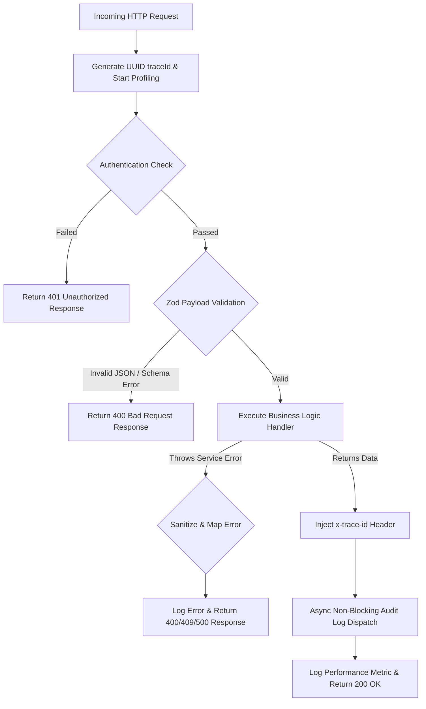

# ⚙️ Backend Architecture & Service Ecosystem

This document provides an exhaustive specification of the **KUCET College Management System (CMS)** backend application layer, detailing the Node.js 20 LTS runtime environment, App Router API Route Handlers, the `wrapHandler` Zero-Trust Zod validation wrapper, the Domain-Oriented Service Layer, the asynchronous Domain Event Bus, Pino structured logging, defensive JSON parsing, and high-performance in-memory caching.

---

## 📌 Related Documentation
- [Master Index](../README.md)
- [System Architecture](./system-architecture.md)
- [Database Architecture](./database.md)
- [Storage Architecture](./storage.md)
- [Deployment Architecture](./deployment.md)

---

## 🟢 Node.js 20 LTS Runtime Environment

The backend server runs on **Node.js 20 LTS** in native ECMAScript Modules (ESM) mode (`"type": "module"` in `package.json`).

### Key Runtime Guarantees
- **AsyncLocalStorage Context Isolation**: Enables request-scoped trace IDs (`traceId`) and user context to propagate implicitly through asynchronous call stacks without passing context parameters manually to every internal function.
- **Native Web API Standard**: Leverages standard `Request`, `Response`, `NextResponse`, `Headers`, and `URLSearchParams` primitives.
- **High-Performance Crypto Primitives**: Native Web Crypto API for generating UUIDs (`crypto.randomUUID()`) and executing AES-256-GCM encryption for sensitive database fields.

---

## 🛣️ App Router API Route Handlers

API endpoints are declared under `src/app/api/` following Next.js 16 conventions. Route files export HTTP verb handlers (`GET`, `POST`, `PUT`, `PATCH`, `DELETE`).

```
src/app/api/
├── admin/
│   ├── payments/route.js             # Financial transaction auditing
│   └── clerks/route.js               # Administrative clerk management
├── clerk/
│   ├── admission/
│   │   ├── students/route.js         # Finalizing student admissions
│   │   └── bulk-import/route.js      # Excel migration batch processing
│   ├── scholarship/
│   │   └── summary/[rollno]/route.js # RTF/MTF scholarship status per student
│   └── students/[rollno]/route.js    # Student record retrieval and updates
├── student/
│   ├── login/route.js                # Student authentication & JWT issuance
│   └── me/route.js                   # Authenticated student profile endpoint
└── health/route.js                   # System health monitoring check
```

---

## 🛡️ `wrapHandler` Zero-Trust Zod Validation Layer

To guarantee that invalid payloads or unauthorized requests never reach core domain services, every API route handler is wrapped with the **`wrapHandler`** middleware defined in `src/lib/api-utils.js`.

### Pipeline Execution Sequence



### Complete Implementation Blueprint (`src/lib/api-utils.js`)

```javascript
import { NextResponse } from 'next/server';
import { getAuthUser } from './auth-utils';
import logger from './logger';
import { z } from 'zod';

export function wrapHandler({ handler, schema, auth, audit }) {
  return async (req, context) => {
    const start = Date.now();
    const traceId = crypto.randomUUID();
    const ip = req.headers.get('x-forwarded-for')?.split(',')[0] || '127.0.0.1';
    const method = req.method;
    const url = req.nextUrl.pathname;

    return logger.runWithContext({ traceId }, async () => {
      try {
        let user = null;
        let validatedData = {};

        // 1. Authentication Check
        if (auth) {
          const roles = Array.isArray(auth) ? auth : [auth];
          for (const role of roles) {
            user = await getAuthUser(role);
            if (user) break;
          }
          if (!user) {
            return NextResponse.json({ error: 'Unauthorized' }, { status: 401 });
          }
        }

        // 2. Strict Zod Schema Validation
        if (schema && ['POST', 'PUT', 'PATCH'].includes(method)) {
          try {
            const body = await req.json();
            validatedData = schema.parse(body);
          } catch (err) {
            if (err instanceof z.ZodError) {
              return NextResponse.json({ 
                error: err.errors?.[0]?.message || 'Invalid input payload',
                details: err.errors 
              }, { status: 400 });
            }
            if (err instanceof SyntaxError) {
              return NextResponse.json({ error: 'Malformed JSON payload' }, { status: 400 });
            }
            throw err;
          }
        }

        // 3. Execute Domain Handler
        const result = await handler(req, { data: validatedData, user, context, ip });
        const response = result instanceof NextResponse ? result : NextResponse.json(result);

        // 4. Inject Telemetry Headers
        response.headers.set('x-trace-id', traceId);

        // 5. Asynchronous Audit Logging (Non-blocking)
        if (audit && response.status >= 200 && response.status < 300) {
          logAudit(req, {
            userId: user?.id || user?.student_id,
            action: audit.action,
            payload: validatedData
          }).catch(err => logger.error({ err }, '[AUDIT_FAILED]'));
        }

        return response;

      } catch (error) {
        // Sanitize database error messages before returning to client
        let displayError = error.message;
        if (displayError?.toLowerCase().includes('failed query:')) {
          displayError = 'A database operation failed. Please try again.';
        }
        logger.error({ err: error.message, stack: error.stack, method, url }, '[API_CRASH]');
        return NextResponse.json({ error: displayError || 'Internal server error' }, { status: 500 });
      }
    });
  };
}
```

---

## ⚡ In-Memory Academic Session Caching (`src/lib/academic-utils.js`)

In Session 205 (Commit `24f342f91edc9f1aafb02b2fb9abc80c494dd683`), an in-memory caching mechanism was added to `getCurrentCalendarSession()` inside `src/lib/academic-utils.js` to eliminate redundant database queries across high-frequency middleware and API requests.

### Technical Implementation

```javascript
let cachedSession = null;
let cacheTimestamp = 0;
const CACHE_TTL = 1000 * 60 * 5; // 5 minutes (300,000 ms)

export async function getCurrentCalendarSession() {
  const nowTime = Date.now();
  if (cachedSession && (nowTime - cacheTimestamp < CACHE_TTL)) {
    return cachedSession;
  }

  // Query semesters table across 4 fallback priorities:
  // Priority 1: Currently Active Semester
  // Priority 2: Latest Completed Semester
  // Priority 3: Nearest Upcoming Semester
  // Priority 4: Not Configured (null)

  // Cache & timestamp assignment on query resolution
  cachedSession = resolvedSession;
  cacheTimestamp = nowTime;
  return cachedSession;
}
```

### Key Performance Benefits
- **Database Load Reduction**: Reduces database queries to `semesters` by up to 99.8% during active user sessions.
- **Microsecond Latency**: Subsequent lookups resolve in `< 1ms` directly from Node.js process memory.
- **Controlled TTL**: 5-minute cache expiry ensures semi-real-time synchronization when administrators alter current academic session boundaries.

---

## 🏬 Domain-Oriented Service Layer (`src/services/`)

All business rules, database queries, calculation engines, and third-party API interactions reside inside isolated service classes in `src/services/`.

```
src/services/
├── StudentService.js             # Admission processing, student search, roll number lookup
├── FacultyService.js             # Department allocation, teaching load metrics
├── AttendanceService.js          # GPS pin validation, active session management, offsets
├── FinanceService.js             # Payment processing, receipt generation, fee ledger
├── ScholarshipService.js         # Government RTF/MTF reimbursement eligibility engine
├── SecurityService.js            # Password hashing, AES encryption, session revocation
├── ArchiveService.js             # Soft deletion, data restoration, database snapshots
└── InstitutionAssetService.js    # Principal signatures, official stamp asset mapping
```

---

## 🚌 Domain Event Bus (`src/lib/events/EventBus.js`)

To decouple domain side effects (such as audit logging, push notifications, and cache invalidations), the system uses an asynchronous event bus built on Node.js `EventEmitter`.

### Event Subscription Matrix

| Event Name (`DOMAIN_EVENTS`) | Dispatching Service | Subscribed Actions |
| :--- | :--- | :--- |
| `attendance.submitted` | `AttendanceService.js` | Invalidates Redis tag `attendance:<student_id>`, triggers live WebSocket broadcast |
| `marks.published` | `FacultyService.js` | Sends push notification to enrolled students, updates department analytics |
| `fee.paid` | `FinanceService.js` | Generates official PDF receipt, updates student fee balance table |
| `student.registered` | `StudentService.js` | Triggers roll number generation sequence, initializes student profile |
| `archive.completed` | `ArchiveService.js` | Emits backup completion alert to Slack / Sentry, updates backup log table |

### Implementation Snippet (`EventBus.js`)

```javascript
import { EventEmitter } from 'events';
import logger from '@/lib/logger';

export const DOMAIN_EVENTS = Object.freeze({
  ATTENDANCE_SUBMITTED: 'attendance.submitted',
  MARKS_PUBLISHED: 'marks.published',
  FEE_PAID: 'fee.paid',
  STUDENT_REGISTERED: 'student.registered',
  ARCHIVE_COMPLETED: 'archive.completed',
});

class CentralDomainEventBus {
  constructor() {
    this.emitter = new EventEmitter();
    this.emitter.setMaxListeners(50);
    this.initDefaultSubscribers();
  }

  publish(eventName, payload = {}) {
    setImmediate(async () => {
      try {
        this.emitter.emit(eventName, { event: eventName, payload, timestamp: new Date().toISOString() });
        this.emitter.emit('*', { event: eventName, payload });
      } catch (err) {
        logger.error({ err, eventName }, '[EventBus] Dispatch error');
      }
    });
  }

  subscribe(eventName, handler) {
    this.emitter.on(eventName, handler);
    return () => this.emitter.off(eventName, handler);
  }

  initDefaultSubscribers() {
    // Wildcard subscriber for system audit logging
    this.subscribe('*', (eventData) => {
      logger.info({ event: eventData.event, payload: eventData.payload }, '[AuditLog] Event Captured');
    });
  }
}

export default new CentralDomainEventBus();
```

---

## 🪵 Pino Structured Logging (`src/lib/logger.js`)

KUCET CMS uses **Pino** for JSON-formatted logging in production, providing ultra-low CPU overhead and seamless integration with log management tools.

### Log Redaction Guard
Sensitive personal data (PII) is redacted automatically at the logger level before being output to standard log streams:

```javascript
// Path paths configured for automatic redaction in src/lib/logger.js
redact: {
  paths: [
    'email',
    'password',
    'hashedPassword',
    '*.email',
    '*.password',
    'mobile',
    'aadhaar_no',
    '*.aadhaar_no',
    'student_mobile',
    'guardian_mobile'
  ],
  censor: '[REDACTED]',
}
```

---

## 🛡️ Defensive JSON Parsing (`src/lib/json-utils.js`)

To prevent server crashes and eliminate excessive console log pollution when handling legacy database values or mixed string responses, all JSON parsing calls use `safeJsonParse()`.

### Parsing Rules
1. Returns `fallback` for `null`, `undefined`, or whitespace-only inputs.
2. Passes non-string inputs (objects, booleans, numbers) directly without processing.
3. Inspects prefix characters (`{`, `[`, `"`, numbers) before invoking `JSON.parse()`.
4. Returns raw strings directly if the input is plain text (e.g., `"Scholarship applications"`), preventing unnecessary `JSON.parse()` throw-catch cycles.

```javascript
export function safeJsonParse(value, fallback = null) {
  if (value === null || value === undefined) return fallback;
  if (typeof value !== 'string') return value;

  const trimmed = value.trim();
  if (!trimmed) return fallback;

  const firstChar = trimmed[0];
  const isPossibleJson = (
    firstChar === '{' || firstChar === '[' || firstChar === '"' ||
    trimmed === 'true' || trimmed === 'false' || trimmed === 'null' ||
    (firstChar >= '0' && firstChar <= '9') || firstChar === '-'
  );

  if (!isPossibleJson) return value; // Plain text: return directly

  try {
    return JSON.parse(trimmed);
  } catch (error) {
    return fallback;
  }
}
```

---

## 📬 Asynchronous Job Queuing & QStash Webhook Security

Background jobs (PDF certificate rendering, bulk student import, report compilation, transactional email delivery, notifications, DLQ dead-letter monitoring) are orchestrated via **Upstash QStash** (`src/lib/queue.js`).

### Cryptographic Signature Verification (`verifySignatureAppRouter`)

To prevent arbitrary external actors from invoking internal queue endpoints, all 7 QStash webhook endpoints under `src/app/api/webhooks/qstash/*` enforce HMAC/RSA signature verification:

```javascript
// Example webhook guard in src/app/api/webhooks/qstash/bulk-import/route.js
import { verifySignatureAppRouter } from '@upstash/qstash/dist/nextjs';

async function handler(req) {
  const body = await req.json();
  // Process asynchronous background workload safely...
  return NextResponse.json({ success: true });
}

export const POST = verifySignatureAppRouter(handler);
```

### Self-Hosted Synchronous Fallback

For deployments where `QSTASH_TOKEN` is not configured, endpoints such as `src/app/api/clerk/admission/bulk-import/route.js` automatically fail over to transactional synchronous batch execution via `StudentService.processBulkImport()`, guaranteeing 100% operational autonomy without external dependencies.

---

> 💡 **Next Steps**: Review storage key resolution patterns in [Storage Architecture](./storage.md) or examine database tables in [Database Architecture](./database.md).
