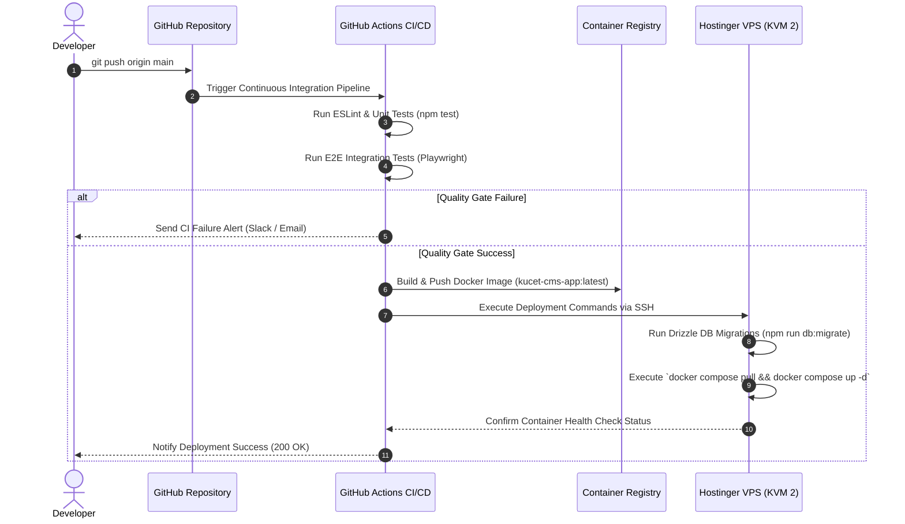

# 🚀 Production Deployment Architecture & DevOps Specification

This document provides a detailed specification of the production deployment topology, multi-container Docker Compose setup, Nginx reverse proxy configuration, and automated CI/CD pipeline for the **Kakatiya University College of Engineering and Technology (KUCET) Management System**.

---

## 📌 Related Documentation
- [Master Index](../README.md)
- [System Architecture](./system-architecture.md)
- [Backend Architecture](./backend.md)
- [Database Architecture](./database.md)
- [Storage Architecture](./storage.md)

---

## 💻 Production Hardware & Topology

The KUCET CMS application is hosted on a **Hostinger VPS KVM 2** virtual private server running Ubuntu 24.04 LTS.

### Host Topology Specifications
- **Virtual CPU**: 4 Dedicated vCPU Cores
- **System Memory**: 16 GB DDR5 RAM
- **Storage Tier**: 200 GB NVMe SSD Storage
- **Network Bandwidth**: 8 TB / Month (1 Gbps Uplink)
- **Primary Domain**: Hostinger VPS Ingress with Let's Encrypt Wildcard SSL Certificates

```
                                +-----------------------------------+
                                |       Internet Traffic (Clients)  |
                                +-----------------------------------+
                                                  |
                                                  v
                                +-----------------------------------+
                                |    Hostinger VPS Ingress (KVM 2)  |
                                +-----------------------------------+
                                                  |
                                                  v
                                +-----------------------------------+
                                |  Nginx Reverse Proxy Container    |
                                |     (Ports 80 / 443 | HTTP/2)     |
                                +-----------------------------------+
                                                  |
                   +------------------------------+------------------------------+
                   |                              |                              |
                   v                              v                              v
+------------------------------------+ +--------------------+ +------------------------------------+
| Next.js 16 App Container (Node 20) | | Redis 7 Container  | | Uptime Kuma Monitor Container      |
|           (Port 3000)              | |    (Port 6379)     | |            (Port 3001)             |
+------------------------------------+ +--------------------+ +------------------------------------+
                   |                              |
                   v                              v
+------------------------------------------------------------------------------------------------------+
| Mounted Persistent Storage Volume: /var/www/kucet-storage/public                                     |
+------------------------------------------------------------------------------------------------------+
```

---

## 🐳 Multi-Container Docker Compose Stack (`docker-compose.yml`)

Production services are orchestrated using Docker Compose inside an isolated bridge network (`cms-network`).

```yaml
name: deployment_package

services:
  app:
    build:
      context: .
      dockerfile: DEPLOYMENT_PACKAGE/Dockerfile
    container_name: kucet-cms-app
    restart: always
    expose:
      - "3000"
    ports:
      - "3000:3000"
    env_file:
      - .env.production
    volumes:
      - /var/www/kucet-storage/public:/var/www/kucet-storage/public
    depends_on:
      db:
        condition: service_healthy
      redis:
        condition: service_healthy
    networks:
      - cms-network

  nginx:
    image: nginx:alpine
    container_name: kucet-cms-proxy
    restart: always
    ports:
      - "80:80"
      - "443:443"
    volumes:
      - ./nginx/nginx.conf:/etc/nginx/nginx.conf:ro
      - /var/www/kucet-storage/public:/usr/share/nginx/html/uploads:ro
      - /etc/letsencrypt:/etc/letsencrypt:ro
    depends_on:
      - app
    networks:
      - cms-network

  uptime-kuma:
    image: louislam/uptime-kuma:1
    container_name: kucet-cms-monitor
    restart: always
    ports:
      - "3001:3001"
    volumes:
      - uptime-kuma-data:/app/data
    networks:
      - cms-network

  db:
    image: mysql:8.0
    container_name: kucet-cms-db
    restart: always
    env_file:
      - .env.production
    environment:
      MYSQL_DATABASE: ${DB_DATABASE:-kucet_cms}
      MYSQL_ROOT_PASSWORD: ${DB_ROOT_PASSWORD}
      MYSQL_USER: ${DB_USER}
      MYSQL_PASSWORD: ${DB_PASSWORD}
    ports:
      - "3306:3306"
    volumes:
      - db-data:/var/lib/mysql
    healthcheck:
      test: ["CMD", "mysqladmin", "ping", "-h", "localhost"]
      timeout: 20s
      retries: 10
    networks:
      - cms-network

  redis:
    image: redis:7-alpine
    container_name: kucet-cms-redis
    restart: always
    command: redis-server --appendonly yes
    ports:
      - "6379:6379"
    volumes:
      - redis-data:/data
    healthcheck:
      test: ["CMD", "redis-cli", "ping"]
      interval: 10s
      timeout: 5s
      retries: 5
    networks:
      - cms-network

networks:
  cms-network:
    driver: bridge

volumes:
  db-data:
  redis-data:
  uptime-kuma-data:
```

---

## ⚡ Nginx Upstream Optimization (`nginx.conf`)

The **Nginx** container acts as the primary ingress edge, terminating SSL, handling WebSocket upgrades, compressing assets, and protecting authentication routes against brute-force rate attacks.

### Nginx Configuration Highlights

```nginx
events {
    worker_connections 2048;
}

http {
    include       mime.types;
    default_type  application/octet-stream;
    sendfile        on;
    tcp_nopush      on;
    tcp_nodelay     on;
    keepalive_timeout 65;

    # Rate Limiting Zones
    limit_req_zone $binary_remote_addr zone=auth_limit:10m rate=5r/s;
    limit_req_zone $binary_remote_addr zone=api_limit:10m rate=30r/s;

    # Gzip & Brotli Compression
    gzip on;
    gzip_comp_level 6;
    gzip_types text/plain text/css application/json application/javascript text/xml application/xml;

    upstream nextjs_upstream {
        server app:3000 max_fails=3 fail_timeout=10s;
        keepalive 32;
    }

    server {
        listen 80;
        server_name cms.kucet.ac.in;
        return 301 https://$host$request_uri;
    }

    server {
        listen 443 ssl http2;
        server_name cms.kucet.ac.in;

        ssl_certificate /etc/letsencrypt/live/cms.kucet.ac.in/fullchain.pem;
        ssl_certificate_key /etc/letsencrypt/live/cms.kucet.ac.in/privkey.pem;
        ssl_protocols TLSv1.2 TLSv1.3;

        # Static Public Uploads Direct Delivery
        location /uploads/ {
            alias /usr/share/nginx/html/uploads/;
            expires 30d;
            add_header Cache-Control "public, no-transform";
        }

        # Auth Route Rate Limiting
        location /api/auth/ {
            limit_req zone=auth_limit burst=10 nodelay;
            proxy_pass http://nextjs_upstream;
            proxy_set_header Host $host;
            proxy_set_header X-Real-IP $remote_addr;
            proxy_set_header X-Forwarded-For $proxy_add_x_forwarded_for;
        }

        # Realtime WebSocket Proxying (Supabase & SSE)
        location /api/realtime/ {
            proxy_pass http://nextjs_upstream;
            proxy_http_version 1.1;
            proxy_set_header Upgrade $http_upgrade;
            proxy_set_header Connection "Upgrade";
            proxy_read_timeout 86400s;
        }

        # Application Route Proxying
        location / {
            limit_req zone=api_limit burst=50 nodelay;
            proxy_pass http://nextjs_upstream;
            proxy_http_version 1.1;
            proxy_set_header Host $host;
            proxy_set_header X-Real-IP $remote_addr;
            proxy_set_header X-Forwarded-For $proxy_add_x_forwarded_for;
            proxy_set_header X-Forwarded-Proto $scheme;
        }
    }
}
```

---

## 🤖 Automated CI/CD Pipeline & Deployment Workflow

Deployment is fully automated using GitHub Actions workflows (`.github/workflows/deploy.yml`).

### Workflow Quality Gates
1. **ESLint & Code Formatting Check**: Executes `npm run lint` to enforce standard syntax rules.
2. **Unit & Integration Test Suite**: Executes `npm test` via Vitest.
3. **End-to-End (E2E) Test Suite**: Executes Playwright test suites (`npx playwright test`).
4. **Docker Image Build**: Compiles Next.js standalone build in Docker context and tags image.
5. **VPS Deployment via SSH**: SSHs into Hostinger VPS, executes database migrations (`npm run db:migrate`), pulls latest containers, and performs a zero-downtime rolling update.



---

## 🛡️ Disaster Recovery & Backup Strategy

- **Database Snapshots**: Automated daily database export script (`src/db/backup.js`) dumps schema and data, uploading compressed `.sql.gz` archives to S3 storage and local backup volumes.
- **Persistent Volume Mounts**: VPS directory `/var/www/kucet-storage/public` is mounted persistently across container restarts to preserve uploaded documents.

---

> 💡 **Next Steps**: Return to the [Master Index](../README.md) for a summary of all system documentation.
