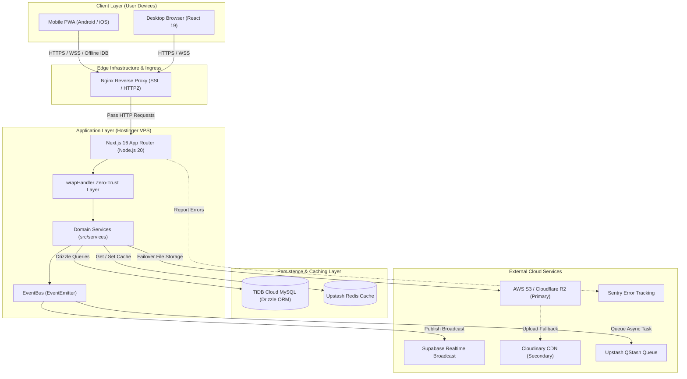

# 🏗️ High-Level System Architecture

This document provides a comprehensive specification of the **KUCET College Management System (CMS)** high-level system architecture, Domain-Driven Design (DDD) organization, core technology stack integrations, and architectural runtime patterns.

---

## 📌 Related Documentation
- [Master Index](../README.md)
- [Frontend Architecture](./frontend.md)
- [Backend Architecture](./backend.md)
- [Database Architecture](./database.md)
- [Storage Architecture](./storage.md)
- [Deployment Architecture](./deployment.md)

---

## 🏛️ Architectural Overview & Design Philosophy

The KUCET CMS architecture is engineered around the principles of **Domain-Driven Design (DDD)**, **Zero-Trust API Security**, and **High-Availability Multi-Cloud Resiliency**. Rather than relying on a monolithic monolith or fragmented microservices, KUCET CMS uses a **Modular Monolith** structure hosted inside the Next.js 16 App Router platform on Node.js 20 LTS.

```
+-----------------------------------------------------------------------------------+
|                                  KUCET CMS UI                                     |
|           (Student Portal | Faculty & HOD | Administrative Clerk | Admin)         |
+-----------------------------------------------------------------------------------+
                                         |
                                         v
+-----------------------------------------------------------------------------------+
|                           Nginx Reverse Proxy (SSL/HTTP2)                         |
+-----------------------------------------------------------------------------------+
                                         |
                                         v
+-----------------------------------------------------------------------------------+
|                        Next.js 16 App Router API Handlers                         |
|                       (wrapHandler Zero-Trust Zod Middleware)                      |
+-----------------------------------------------------------------------------------+
                                         |
                    +--------------------+--------------------+
                    |                                         |
                    v                                         v
+---------------------------------------+   +---------------------------------------+
|        Domain Services Layer          |   |            Domain Event Bus           |
| (Student, Faculty, Finance, etc.)     |   |         (EventBus.js Async)           |
+---------------------------------------+   +---------------------------------------+
        |                |              \           /            |
        v                v               v         v             v
+---------------+  +-----------+    +------------------+  +--------------------+
|  TiDB Cloud   |  |  Upstash  |    | Supabase Realtime|  |  Failover Storage  |
| MySQL Database|  |   Redis   |    |    Broadcast     |  | (S3/Cloudinary/FS) |
+---------------+  +-----------+    +------------------+  +--------------------+
```

---

## 📦 Domain-Driven Design (DDD) Layout

The system business logic is strictly partitioned into **8 Bounded Contexts**, each isolating database schemas, service logic, and domain event boundaries:

```
src/
├── db/schema/                  # Database Schema Definitions
│   ├── identity.js             # User accounts, profiles, roles, student details
│   ├── academic.js             # Departments, courses, subjects, timetables
│   ├── attendance.js           # Sessions, logs, GPS/PIN verification
│   ├── finance.js              # Fee structures, RTF/MTF scholarship proceedings
│   ├── operations.js           # Student requests, certificates, notices
│   ├── registry.js             # Admission batches, roll number sequences
│   ├── security.js             # JWT sessions, audit trail, rate limit tokens
│   └── archive.js              # Soft-deleted records & disaster recovery snapshots
└── services/                   # Business Logic Domain Services
    ├── identity/               # StudentProfileService, StudentService
    ├── academic/               # FacultyService, AcademicCalendarService
    ├── attendance/             # AttendanceService
    ├── finance/                # FinanceService, ScholarshipService
    ├── archive/                # ArchiveService, BackupService
    ├── security/               # SecurityService, PushNotificationService
    └── storage/                # MediaPromotionService, AssetService
```

### Bounded Context Overview

| Domain Module | Primary Responsibilities | Core Service Classes | Target Schema Files |
| :--- | :--- | :--- | :--- |
| **Identity** | User authentication, RBAC profiles, encrypted PII management | `StudentService.js`, `StudentProfileService.js` | [`identity.js`](../database/index.md) |
| **Academic** | Branch configuration, semester timetables, faculty workloads | `FacultyService.js` | [`academic.js`](../database/index.md) |
| **Attendance** | Live classroom sessions, GPS + PIN verification, offset logic | `AttendanceService.js` | [`attendance.js`](../database/index.md) |
| **Finance** | Fee collection, government scholarship proceedings (RTF/MTF) | `FinanceService.js`, `ScholarshipService.js` | [`finance.js`](../database/index.md) |
| **Operations** | Digital certificate generation, request verification workflows | `InstitutionAssetService.js` | [`operations.js`](../database/index.md) |
| **Registry** | Admission draft management, roll number generation intelligence | `StudentService.js` | [`registry.js`](../database/index.md) |
| **Security** | Session tracking, brute-force protection, audit log dispatching | `SecurityService.js`, `PushNotificationService.js` | [`security.js`](../database/index.md) |
| **Archive** | Soft deletion recovery, automated backup snapshots, media purge | `ArchiveService.js`, `BackupService.js` | [`archive.js`](../database/index.md) |

---

## 🛠️ Core Technology Stack Components

### 1. Next.js 16 App Router & React 19 Engine
- **Server Components**: Renders heavy UI components on the server, minimizing client JavaScript bundle size.
- **Server Actions**: Enables seamless data mutation without requiring manual boilerplate API endpoints.
- **Node.js 20 LTS Runtime**: Native ES modules, `AsyncLocalStorage` request context isolation, and modern crypto API.

### 2. TiDB Cloud MySQL (Distributed HTAP Database)
- **MySQL Compatibility**: Seamlessly connects via `mysql2/promise` driver and Drizzle ORM.
- **Serverless Elasticity**: Elastic scaling to handle peak traffic during semester admissions and internal exam marks publishing.
- **ACID Transactions**: Strict transactional guarantees for roll number generation and payment processing.

### 3. Upstash Redis Caching & Session Store
- **Distributed Session Cache**: Stores active JWT tokens, user permission caches, and rate-limiting counters.
- **Tag-Based Invalidation**: Fast invalidation of cached queries (e.g., `attendance:<student_id>`) upon domain event triggers.

### 4. Supabase Broadcast & Realtime Engine
- **Live Event Broadcasting**: Distributes real-time notifications, live attendance session indicators, and administrative alerts over WebSockets.
- **SSE Fallback**: Server-Sent Events fallback mechanism for restricted mobile networks.

### 5. Sentry Observability & Telemetry
- **Distributed Error Tracking**: Captures runtime crashes, unhandled rejections, and slow API queries in production.
- **Performance Profiling**: Tracks transaction trace IDs (`x-trace-id`) across middleware and service execution layers.

### 6. Upstash QStash Async Queue
- **Serverless Message Queue**: Manages background jobs, email dispatching via Brevo, PDF certificate generation, and media processing asynchronously without blocking user API responses.

---

## 📊 Mermaid System Architecture Diagram



---

## 🔄 Cross-Cutting System Concerns

1. **Authentication & Authorization**: Handled via HTTP-only JWT cookies verified in `wrapHandler`. Role requirements (`student`, `clerk`, `faculty`, `admin`) are enforced declaratively.
2. **Audit Logging**: Every mutating action (`POST`, `PUT`, `DELETE`, `PATCH`) invokes `logAudit()` asynchronously without delaying the client HTTP response.
3. **Structured Pino Logging**: Logs emitted as structured JSON containing trace IDs (`x-trace-id`), sanitized inputs, and execution timing metrics. PII fields are automatically redacted.
4. **Resilient Storage**: Managed through a polymorphic `FailoverStorageProvider` ensuring files are stored reliably even if primary cloud providers experience downtime.

---

> 💡 **Next Steps**: Learn more about the user-facing framework in [Frontend Architecture](./frontend.md) or explore API validation patterns in [Backend Architecture](./backend.md).
