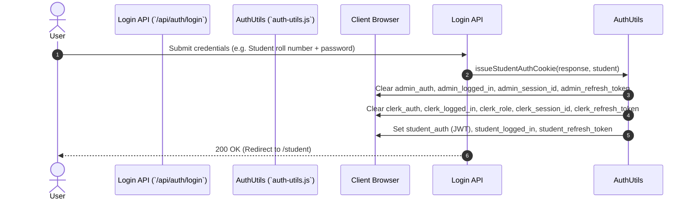
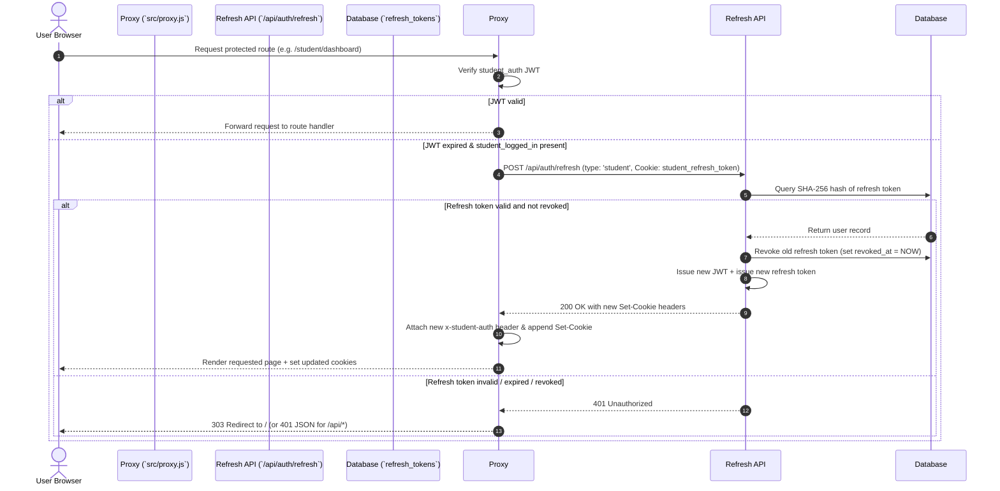

# Authentication Architecture & Token Lifecycle

## Overview

The KUCET College Management System (CMS) implements a defense-in-depth authentication framework combining stateless JSON Web Tokens (JWT) for high-performance Edge verification with stateful database-backed session tracking for security enforcement and remote revocation.

The authentication engine supports three distinct user domains (Students, Clerks/Faculty/HODs, and Super Admins) with strict boundary isolation to prevent privilege escalation or cookie leakage.

---

## Technical Stack & Cryptographic Primitives

- **JWT Signing & Verification Library**: `jose` (v6.x)
- **Signature Algorithm**: HMAC SHA-256 (`HS256`)
- **Key Generation & Secret Resolution**: Resolves secret key bytes via `getJwtSecretKey()`:
  ```javascript
  export function getJwtSecretKey() {
    return new TextEncoder().encode(process.env.JWT_SECRET || 'temporary_secret_at_least_32_chars_long');
  }
  ```
- **Password Hashing**: `bcrypt` with salt rounds = 10
- **Refresh Token Generation**: 40-byte cryptographically secure random bytes converted to hex string (`crypto.randomBytes(40).toString('hex')`)
- **Token Hashing for Storage**: SHA-256 hash digest (`crypto.createHash('sha256').update(token).digest('hex')`)

---

## Authentication Domain Cookies

The system uses role-partitioned HTTP-only cookies to maintain session boundaries. Cookie names and properties differ per user role:

| Role Domain | Primary Auth Cookie (HTTP-Only) | Client Companion Cookie (JS-Accessible) | Refresh Token Cookie (HTTP-Only) | Default Expiry (Access / Refresh) |
| :--- | :--- | :--- | :--- | :--- |
| **Student** | `student_auth` | `student_logged_in` | `student_refresh_token` | 15 Minutes / 14 Days (30 Days if Remember Me) |
| **Clerk / Faculty / HOD** | `clerk_auth` | `clerk_logged_in`, `clerk_role` | `clerk_refresh_token` | 15 Minutes / 14 Days (30 Days if Remember Me) |
| **Super Admin** | `admin_auth` | `admin_logged_in` | `admin_refresh_token` | 15 Minutes / 14 Days (30 Days if Remember Me) |

### Cookie Security Attributes
- `httpOnly: true` (for `*_auth` and `*_refresh_token` to prevent XSS access)
- `secure: process.env.NODE_ENV === 'production'` (enforces HTTPS in production)
- `sameSite: 'strict'` (for authentication cookies to prevent CSRF attacks)
- `path: '/'`

---

## Multi-Role Cookie Purging Protocol

To prevent cross-role session contamination (e.g., an admin user logging into a student account on the same browser), the authentication issuer explicitly executes a purge of all alternative role cookies before issuing new credentials.



---

## Token Lifecycle & Grace-Period Silent Refresh

To balance session persistence with rapid invalidation of compromised credentials, short-lived JWT access tokens (15 minutes) are paired with long-lived refresh tokens stored in the `refresh_tokens` database table.

### Middleware Silent Refresh Flow

When an access token expires (`ERR_JWT_EXPIRED`), the Edge middleware (`src/proxy.js`) automatically triggers a silent refresh using the refresh token before rejecting the request:



### Multi-Host Fallback Engine
To ensure silent refresh succeeds in dev environments, Docker containers, and cloud deployments (Vercel, Render), `src/proxy.js` uses candidate URLs:
1. `request.nextUrl.origin`
2. `http://127.0.0.1:${process.env.PORT || 10000}` (Loopback fallback)

---

## Next-Auth Google OAuth Integration

For faculty and institutional users, Next-Auth provides single sign-on (SSO) via Google OAuth.

- **Config Location**: `src/app/api/auth/[...nextauth]/route.js`
- **Domain Verification**: Restricts OAuth logins to verified institutional domains (`@kucet.ac.in`).
- **Account Binding**: Matches the Google email with active records in the `clerks` or `principal` tables.
- **Cookie Synchronization**: Upon successful Google authentication, Next-Auth triggers `issueClerkAuthCookie` or `issueAdminAuthCookie` to standardize session handling across password and OAuth workflows.

---

## Cross-References

- [Authorization & RBAC Matrix](./authorization.md)
- [Session Management & Revocation](./session-management.md)
- [Database Schema (Identity Domain)](../database/schema.md#1-identity-domain)
