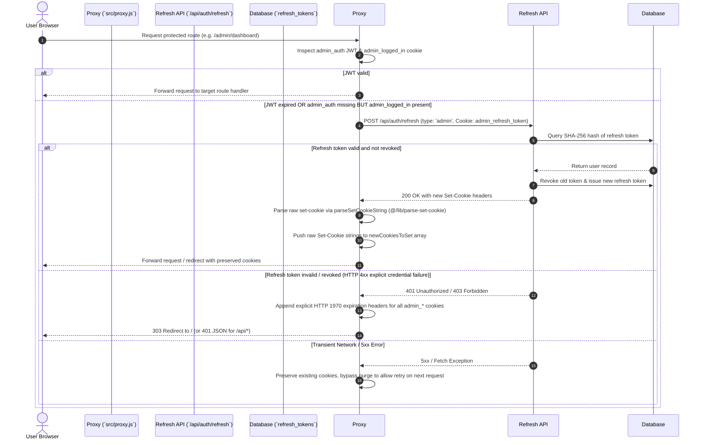

# Authentication Architecture & Token Lifecycle

## Overview

The KUCET College Management System (CMS) implements a defense-in-depth authentication framework combining stateless JSON Web Tokens (JWT) for high-performance Edge verification with stateful database-backed session tracking for security enforcement and remote revocation.

The authentication engine supports three distinct user domains (Students, Staff/Faculty/HODs, and Super Admins) with strict boundary isolation to prevent privilege escalation, cross-role cookie collision, or token leakage.

---

## Technical Stack & Cryptographic Primitives

- **JWT Signing & Verification Library**: `jose` (v6.x)
- **Signature Algorithm**: HMAC SHA-256 (`HS256`)
- **Key Generation & Secret Resolution**: Resolves secret key bytes via `getJwtSecretKey()`:
  ```javascript
  export function getJwtSecretKey() {
    return new TextEncoder().encode(process.env.JWT_SECRET || 'temporary_secret_at_least_32_chars_long');
  }
  ```
- **Password Hashing**: `bcrypt` with salt rounds = 12
- **Refresh Token Generation**: 40-byte cryptographically secure random bytes converted to hex string (`crypto.randomBytes(40).toString('hex')`)
- **Token Hashing for Storage**: SHA-256 hash digest (`crypto.createHash('sha256').update(token).digest('hex')`)

---

## Authentication Domain Cookies

The system uses role-partitioned HTTP-only cookies to maintain session boundaries. Cookie names and properties differ per user role:

| Role Domain | Primary Auth Cookie (HTTP-Only) | Client Companion Cookie (JS-Accessible) | Refresh Token Cookie (HTTP-Only) | Default Expiry (Access / Refresh) |
| :--- | :--- | :--- | :--- | :--- |
| **Student** | `student_auth` | `student_logged_in`, `student_session_id` | `student_refresh_token` | 15 Minutes / 14 Days (30 Days if Remember Me) |
| **Staff / Faculty / HOD** | `staff_auth` | `staff_logged_in`, `staff_role`, `staff_session_id` | `staff_refresh_token` | 15 Minutes / 14 Days (30 Days if Remember Me) |
| **Super Admin** | `admin_auth` | `admin_logged_in`, `admin_session_id` | `admin_refresh_token` | 15 Minutes / 14 Days (30 Days if Remember Me) |

### Cookie Security Attributes
- `httpOnly: true` (for `*_auth` and `*_refresh_token` to prevent XSS access)
- `secure: process.env.NODE_ENV === 'production'` (enforces HTTPS in production)
- `sameSite: 'strict'` (for access token cookies to prevent CSRF attacks; 'lax' for refresh tokens)
- `path: '/'`

---

## Multi-Role Cookie Purging Protocol (Session 205 & 207 Isolation)

To prevent cross-role session contamination (e.g., an admin user logging into a student account on the same browser or stale staff cookies interfering with super admin authorization), authentication issuers explicitly execute a full purge of all alternative role cookies before issuing new credentials.

### Login Cookie Purging Workflow
When authenticating via `/api/admin/login`, `/api/auth/employee-login`, or `/api/student/login`, `src/lib/auth-utils.js` executes explicit cookie purges:

```javascript
// Example from issueAdminAuthCookie in src/lib/auth-utils.js
// Clear cookies for other roles to enforce boundary isolation
const cookiesToClear = [
  'staff_auth', 'staff_logged_in', 'staff_role', 'staff_session_id', 'staff_refresh_token',
  'clerk_auth', 'clerk_logged_in', 'clerk_role', 'clerk_session_id', 'clerk_refresh_token',
  'student_auth', 'student_logged_in', 'student_session_id', 'student_refresh_token'
];
cookiesToClear.forEach(name => {
  response.cookies.delete(name);
});
```


---

## Token Lifecycle & Middleware Silent Refresh Engine

To balance session persistence with rapid invalidation of compromised credentials, short-lived JWT access tokens (15 minutes) are paired with long-lived refresh tokens stored in the `refresh_tokens` database table.

### Session 205 Cookie Persistence & Client Restore Engine (`src/proxy.js` & `HomeLoginLanding.client.js`)

In Session 205 (Parts 1–7), forensic investigation revealed that access token cookies (`admin_auth`, `clerk_auth`, `student_auth`) can be automatically expired and deleted by client browsers due to `Max-Age`/`Expires` policies while long-lived companion session cookies (`admin_logged_in`, `clerk_logged_in`, `student_logged_in`) or refresh tokens persist.

To guarantee persistent authentication across browser restarts and page refreshes, the system implements a dual-layer strategy:
1. **Edge Middleware Validation (`src/proxy.js`)**: Evaluates role payloads and raw `Set-Cookie` header arrays (`newCookiesToSet`) using `parseSetCookieString` without header comma-merging corruption.
2. **Client-Side Auth Restore Guard (`src/components/HomeLoginLanding.client.js` & `src/components/LoginPanel.js`)**: When a companion session flag (`_logged_in`) is detected while access tokens are expired or missing, client components trigger automatic silent token restoration via `/api/auth/refresh` before rendering public fallbacks.



---

## Session 205 Raw `newCookiesToSet` Array Invariant

### The Header Comma-Merging Corruption Bug
Standard Web API `Headers` objects and Next.js `NextResponse` header getters (such as `response.headers.forEach()` or `getSetCookie()`) corrupt multi-cookie responses in Edge environments by concatenating multiple `Set-Cookie` headers into a single comma-separated string (e.g., `Set-Cookie: admin_auth=...; Path=/, admin_logged_in=true; Path=/`). Browsers reject or misparse comma-joined `Set-Cookie` strings, causing session cookies to remain in browser storage while access tokens fail to save, trapping users on the home screen.

### The Invariant Fix in `src/proxy.js`
To completely bypass Next.js header getter bugs, `src/proxy.js` maintains a raw string array invariant:

```javascript
let newCookiesToSet = [];

// When silent refresh succeeds or when purging stale cookies:
allCookies.forEach(cookieStr => {
  response.headers.append('set-cookie', cookieStr);
  newCookiesToSet.push(cookieStr);
});

// When re-creating responses or applying redirects via withCookies():
const withCookies = (redirectResponse) => {
  if (refreshTriggered) {
    newCookiesToSet.forEach(cookieStr => {
      redirectResponse.headers.append('set-cookie', cookieStr);
    });
  }
  return redirectResponse;
};
```

---

## Explicit HTTP 1970 Expiration Headers on Logout

Upon explicit user logout or when a silent refresh fails due to an invalid/revoked refresh token, the system issues explicit HTTP 1970 expiration strings to purge client browser storage immediately across all cookie categories:

### Logout Endpoints Purging Protocol
Dedicated logout endpoints (`/api/admin/logout`, `/api/auth/logout`, `/api/clerk/logout`, `/api/student/logout`) delete all associated companion cookies:

```javascript
// Explicit HTTP 1970 Expiration Headers generated during purge
const cookiesToClear = [
  'admin_auth', 'admin_logged_in', 'admin_refresh_token', 'admin_session_id', 'session_id'
];
cookiesToClear.forEach(name => {
  response.cookies.delete(name); 
  // Sets: ${name}=; Path=/; Expires=Thu, 01 Jan 1970 00:00:00 GMT
});
```

### Stale Refresh Token Cleanup in Proxy
When silent refresh fails inside `src/proxy.js`, explicit HTTP 1970 expiration strings are pushed directly to `newCookiesToSet`:

```javascript
['admin_auth', 'admin_logged_in', 'admin_refresh_token', 'admin_session_id'].forEach(name => {
  const str = `${name}=; Path=/; Expires=Thu, 01 Jan 1970 00:00:00 GMT`;
  response.headers.append('set-cookie', str);
  newCookiesToSet.push(str);
});
```

---

---

## Session 207 — Staff Onboarding Pipeline (New 4-Stage Workflow)

> **Breaking Change in Session 207 (testvanilla):** The clerk self-registration system has been replaced with a formal 4-stage admin-controlled onboarding pipeline. Cookie names have changed. See [Session 207 Change Analysis](../history/session-207-testvanilla-changes.md).

### Cookie Name Changes (Session 207)

| Before (Session 206) | After (Session 207) |
|---|---|
| `clerk_auth` | `staff_auth` |
| `clerk_logged_in` | `staff_logged_in` |
| `clerk_role` | `staff_role` |
| `clerk_session_id` | `staff_session_id` |
| `clerk_refresh_token` | `staff_refresh_token` |

> ⚠️ All existing `clerk_auth` sessions are invalidated on deployment. Staff must re-login.

### Auth Function Rename

```javascript
// Session 206
issueClerkAuthCookie(response, clerk, rememberMe, ip, userAgent)
// JWT payload: { id, clerkId, email, role, is_hod, branch }
// Refresh token user_id = clerk.email (string)

// Session 207
issueStaffAuthCookie(response, staff, rememberMe, ip, userAgent)
// JWT payload: { id, staffId, email, role, is_hod, branch }
// Refresh token user_id = staff.id (integer)
```

### Stage 1 — Email OTP Verification

```
POST /api/public/staff-registration/email/send-otp  { email }
→ Sends 6-digit OTP, 10-minute TTL

POST /api/public/staff-registration/email/verify-otp  { email, otp }
→ Returns signed JWT verificationToken (purpose: 'staff_registration_email', 30min expiry)
```

### Stage 2 — Registration Submission

```
POST /api/public/staff-registration
  { fullName, email, mobile, requested_role, designation,
    verificationToken, academic_affiliations }

Validations:
  - Verify JWT token (email match + purpose check)
  - Faculty must include department_code + program_codes[]
  - Non-faculty must have no academic_affiliations
  - Duplicate check: clerks table, staffAccounts, staffRegistrationRequests
  - Inserts into staff_registration_requests (status='PENDING')
```

### Stage 3 — Admin Approval

```
GET  /api/admin/staff-requests           → List all requests
POST /api/admin/staff-requests/[id]/approve
  → db.transaction():
     1. INSERT staff_accounts (status=PENDING_ACTIVATION)
     2. INSERT staff_account_roles (role_id FK from staff_roles)
     3. INSERT staff_academic_affiliations (faculty only)
     4. crypto.randomBytes(32) → SHA-256 → staff_account_activation_tokens
     5. UPDATE staff_registration_requests → APPROVED
     6. INSERT audit_logs
  → Send activation email with 48hr link

POST /api/admin/staff-requests/[id]/reject       { admin_notes }
POST /api/admin/staff-requests/[id]/resend-activation  → new token + email
```

### Stage 4 — Token Activation & Password Setup

```
GET  /api/public/staff-registration/activate?token=<rawToken>
  → SHA-256 hash token → lookup in staff_account_activation_tokens
  → Validate: not expired, used_at IS NULL, account_status=PENDING_ACTIVATION
  → Returns: { name, email }

POST /api/public/staff-registration/activate  { token, password, confirmPassword }
  → Re-validates token
  → bcrypt.hash(password, 10)
  → UPDATE staff_accounts: password_hash, account_status='ACTIVE'
  → UPDATE staff_account_activation_tokens: used_at=NOW()
```

### Token Refresh — Staff (Session 207 Rewrite)

The `refreshAccessToken()` for `userType === 'staff'` now performs 4-table JOINs to reconstruct role/branch/HOD:

```javascript
// Queries: staffAccounts → staffAccountRoles → staffRoles
//                        → staffAcademicAffiliations → academicDepartments
// Resolves: { role, is_hod, branch } before re-issuing staff_auth cookie
// NOTE: user_id in refresh_tokens is now INTEGER staff ID, not email string
```

### HOD Promotion (Unchanged Workflow)

- HOD is NOT a self-registration option — Faculty register first, then Admin promotes.
- Single-HOD-per-branch invariant enforced via `staffAcademicAffiliations.is_hod`.
- Admin promotes/demotes from the Staff Management Console.

### Edge Proxy Route Protection Invariant (`src/proxy.js`)
All administrative API endpoints under `/api/admin/*` are strictly guarded at the Edge proxy layer requiring valid `adminPayload`. Public onboarding submissions are strictly segregated to `/api/public/staff-registration/*`, ensuring zero route protection bypasses in the middleware pipeline.

### Eager Registration Prefetching (`LoginPanel.js`)
To eliminate initial compilation latency when prospective students or staff click onboarding links, `LoginPanel.js` eagerly prefetches `/staff-registration` and `/admission` routes on mount via `router.prefetch()`.

---

## Cross-References

- [Authorization & RBAC Matrix](./authorization.md)
- [Session Management & Revocation](./session-management.md)
- [Session 207 Complete Change Analysis](../history/session-207-testvanilla-changes.md)
- [Backend Architecture & Service Ecosystem](../architecture/backend.md)
- [Chronological Incident Forensics](../history/resolved-incidents.md)
- [Engineering Lessons Learned](../development/lessons-learned.md)
- [Database Schema (Identity Domain)](../database/schema.md#1-identity-domain)
