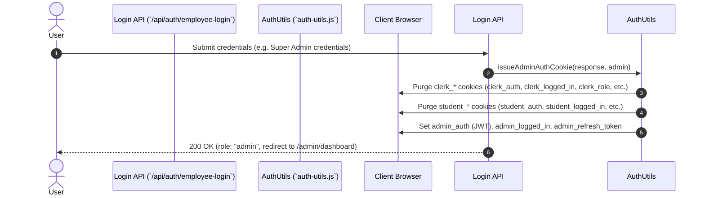
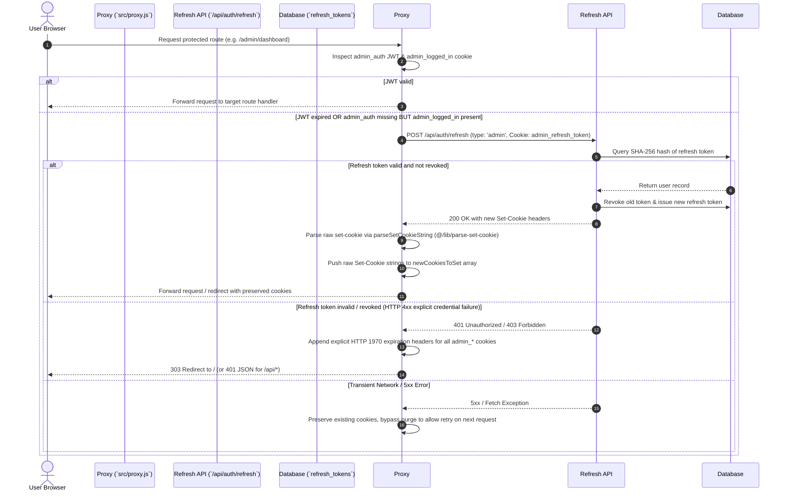

# Authentication Architecture & Token Lifecycle

## Overview

The KUCET College Management System (CMS) implements a defense-in-depth authentication framework combining stateless JSON Web Tokens (JWT) for high-performance Edge verification with stateful database-backed session tracking for security enforcement and remote revocation.

The authentication engine supports three distinct user domains (Students, Clerks/Faculty/HODs, and Super Admins) with strict boundary isolation to prevent privilege escalation, cross-role cookie collision, or token leakage.

---

## Technical Stack & Cryptographic Primitives

- **JWT Signing & Verification Library**: `jose` (v6.x)
- **Signature Algorithm**: HMAC SHA-256 (`HS256`)
- **Key Generation & Secret Resolution**: Resolves secret key bytes via `getJwtSecretKey()`:
  ```javascript
  export function getJwtSecretKey() {
    return new TextEncoder().encode(process.env.JWT_SECRET || 'temporary_secret_at_least_32_chars_long');
  }
  ```
- **Password Hashing**: `bcrypt` with salt rounds = 10
- **Refresh Token Generation**: 40-byte cryptographically secure random bytes converted to hex string (`crypto.randomBytes(40).toString('hex')`)
- **Token Hashing for Storage**: SHA-256 hash digest (`crypto.createHash('sha256').update(token).digest('hex')`)

---

## Authentication Domain Cookies

The system uses role-partitioned HTTP-only cookies to maintain session boundaries. Cookie names and properties differ per user role:

| Role Domain | Primary Auth Cookie (HTTP-Only) | Client Companion Cookie (JS-Accessible) | Refresh Token Cookie (HTTP-Only) | Default Expiry (Access / Refresh) |
| :--- | :--- | :--- | :--- | :--- |
| **Student** | `student_auth` | `student_logged_in`, `student_session_id` | `student_refresh_token` | 15 Minutes / 14 Days (30 Days if Remember Me) |
| **Clerk / Faculty / HOD** | `clerk_auth` | `clerk_logged_in`, `clerk_role`, `clerk_session_id` | `clerk_refresh_token` | 15 Minutes / 14 Days (30 Days if Remember Me) |
| **Super Admin** | `admin_auth` | `admin_logged_in`, `admin_session_id` | `admin_refresh_token` | 15 Minutes / 14 Days (30 Days if Remember Me) |

### Cookie Security Attributes
- `httpOnly: true` (for `*_auth` and `*_refresh_token` to prevent XSS access)
- `secure: process.env.NODE_ENV === 'production'` (enforces HTTPS in production)
- `sameSite: 'strict'` (for authentication cookies to prevent CSRF attacks)
- `path: '/'`

---

## Multi-Role Cookie Purging Protocol (Session 205 Isolation)

To prevent cross-role session contamination (e.g., an admin user logging into a student account on the same browser or stale clerk cookies interfering with super admin authorization), authentication issuers explicitly execute a full purge of all alternative role cookies before issuing new credentials.

### Login Cookie Purging Workflow
When authenticating via `/api/admin/login`, `/api/auth/employee-login`, or `/api/student/login`, `src/lib/auth-utils.js` executes explicit cookie purges:

```javascript
// Example from issueAdminAuthCookie in src/lib/auth-utils.js
// Clear cookies for other roles to enforce boundary isolation
const cookiesToClear = [
  'clerk_auth', 'clerk_logged_in', 'clerk_role', 'clerk_session_id', 'clerk_refresh_token',
  'student_auth', 'student_logged_in', 'student_session_id', 'student_refresh_token'
];
cookiesToClear.forEach(name => {
  response.cookies.delete(name);
});
```



---

## Token Lifecycle & Middleware Silent Refresh Engine

To balance session persistence with rapid invalidation of compromised credentials, short-lived JWT access tokens (15 minutes) are paired with long-lived refresh tokens stored in the `refresh_tokens` database table.

### Session 205 Cookie Persistence & Client Restore Engine (`src/proxy.js` & `HomeLoginLanding.client.js`)

In Session 205 (Parts 1–7), forensic investigation revealed that access token cookies (`admin_auth`, `clerk_auth`, `student_auth`) can be automatically expired and deleted by client browsers due to `Max-Age`/`Expires` policies while long-lived companion session cookies (`admin_logged_in`, `clerk_logged_in`, `student_logged_in`) or refresh tokens persist.

To guarantee persistent authentication across browser restarts and page refreshes, the system implements a dual-layer strategy:
1. **Edge Middleware Validation (`src/proxy.js`)**: Evaluates role payloads and raw `Set-Cookie` header arrays (`newCookiesToSet`) using `parseSetCookieString` without header comma-merging corruption.
2. **Client-Side Auth Restore Guard (`src/components/HomeLoginLanding.client.js` & `src/components/LoginPanel.js`)**: When a companion session flag (`_logged_in`) is detected while access tokens are expired or missing, client components trigger automatic silent token restoration via `/api/auth/refresh` before rendering public fallbacks.



---

## Session 205 Raw `newCookiesToSet` Array Invariant

### The Header Comma-Merging Corruption Bug
Standard Web API `Headers` objects and Next.js `NextResponse` header getters (such as `response.headers.forEach()` or `getSetCookie()`) corrupt multi-cookie responses in Edge environments by concatenating multiple `Set-Cookie` headers into a single comma-separated string (e.g., `Set-Cookie: admin_auth=...; Path=/, admin_logged_in=true; Path=/`). Browsers reject or misparse comma-joined `Set-Cookie` strings, causing session cookies to remain in browser storage while access tokens fail to save, trapping users on the home screen.

### The Invariant Fix in `src/proxy.js`
To completely bypass Next.js header getter bugs, `src/proxy.js` maintains a raw string array invariant:

```javascript
let newCookiesToSet = [];

// When silent refresh succeeds or when purging stale cookies:
allCookies.forEach(cookieStr => {
  response.headers.append('set-cookie', cookieStr);
  newCookiesToSet.push(cookieStr);
});

// When re-creating responses or applying redirects via withCookies():
const withCookies = (redirectResponse) => {
  if (refreshTriggered) {
    newCookiesToSet.forEach(cookieStr => {
      redirectResponse.headers.append('set-cookie', cookieStr);
    });
  }
  return redirectResponse;
};
```

---

## Explicit HTTP 1970 Expiration Headers on Logout

Upon explicit user logout or when a silent refresh fails due to an invalid/revoked refresh token, the system issues explicit HTTP 1970 expiration strings to purge client browser storage immediately across all cookie categories:

### Logout Endpoints Purging Protocol
Dedicated logout endpoints (`/api/admin/logout`, `/api/auth/logout`, `/api/clerk/logout`, `/api/student/logout`) delete all associated companion cookies:

```javascript
// Explicit HTTP 1970 Expiration Headers generated during purge
const cookiesToClear = [
  'admin_auth', 'admin_logged_in', 'admin_refresh_token', 'admin_session_id', 'session_id'
];
cookiesToClear.forEach(name => {
  response.cookies.delete(name); 
  // Sets: ${name}=; Path=/; Expires=Thu, 01 Jan 1970 00:00:00 GMT
});
```

### Stale Refresh Token Cleanup in Proxy
When silent refresh fails inside `src/proxy.js`, explicit HTTP 1970 expiration strings are pushed directly to `newCookiesToSet`:

```javascript
['admin_auth', 'admin_logged_in', 'admin_refresh_token', 'admin_session_id'].forEach(name => {
  const str = `${name}=; Path=/; Expires=Thu, 01 Jan 1970 00:00:00 GMT`;
  response.headers.append('set-cookie', str);
  newCookiesToSet.push(str);
});
```

---

---

## Clerk & Staff Self-Registration & First-Login Password Change Workflow

The system provides a defense-in-depth onboarding pipeline for institutional staff:

1. **Simplified Staff Self-Registration (`POST /api/auth/clerk-register`)**:
   - Staff click **"Register Yourself"** on the Clerk login panel.
   - Self-registration is strictly limited to 3 staff categories:
     1. **Faculty (`FACULTY`)**: Requires selecting an **Associated Academic Branch** (`CSE`, `CSD`, `ECE`, `EEE`, `MECH`, `CIVIL`, `IT`).
     2. **Scholarship Clerk (`SCHOLARSHIP_CLERK`)**: Financial / scholarship sanction staff.
     3. **Admission Clerk (`ADMISSION_CLERK`)**: Student admissions & registration staff.
   - **Designation Field Deprecation**: Free-text designation inputs have been completely removed to ensure standardized institutional records.
   - Input is validated against Zod zero-trust schemas, rate-limited, and checked for duplicates in `clerks` and pending `clerk_registration_requests`.
   - On submission, a record is created in `clerk_registration_requests` with `status: 'PENDING'`.

2. **Administrator Review & Role-Scoped Approval (`/api/admin/clerk-requests`)**:
   - Super Admins view pending requests organized into role-scoped tabs: **Academic Faculty**, **Scholarship Clerks**, and **Admission Clerks**.
   - **Approve Action**: System generates a strong random temporary password, creates an active `clerks` record mapped to `role: 'faculty'`, `'scholarship'`, or `'admission'` with `must_change_password: true`, updates request status to `APPROVED`, and sends a transactional email containing login credentials.
   - **Reject Action**: Administrator provides a rejection reason, updates request status to `REJECTED`, and sends a rejection notification email.

3. **Faculty -> HOD Promotion Workflow**:
   - HOD is **NOT** a self-registration option.
   - Faculty members register as standard Faculty.
   - Super Admin promotes an approved Faculty member to HOD via the **Staff Management Console** using **"Promote HOD"**.
   - The system enforces a strict invariant: **Exactly one active HOD per branch**.
   - Admin can demote an HOD back to Faculty using **"Demote HOD"** at any time.

4. **Mandatory First-Login Password Change**:
   - Upon first login using the temporary password, `/api/auth/employee-login` returns `mustChangePassword: true`.
   - The UI enforces a mandatory **Password Reset Modal** requiring a new compliant password before allowing navigation to dashboard routes.
   - Updating the password calls `/api/auth/change-password/clerk`, sets `must_change_password: false`, updates `password_changed_at`, and grants full access.

---

## Cross-References

- [Authorization & RBAC Matrix](./authorization.md)
- [Session Management & Revocation](./session-management.md)
- [Backend Architecture & Service Ecosystem](../architecture/backend.md)
- [Chronological Incident Forensics](../history/resolved-incidents.md#1-session-205-forensic-resolution-of-cookies-remain-but-app-shows-home-screen)
- [Comprehensive Engineering Lessons Learned](../development/lessons-learned.md#rule-11-never-rely-on-headersgetsetcookie-or-comma-joined-headers-for-multi-cookie-responses-in-nextjs-middleware)
- [Database Schema (Identity Domain)](../database/schema.md#1-identity-domain)
