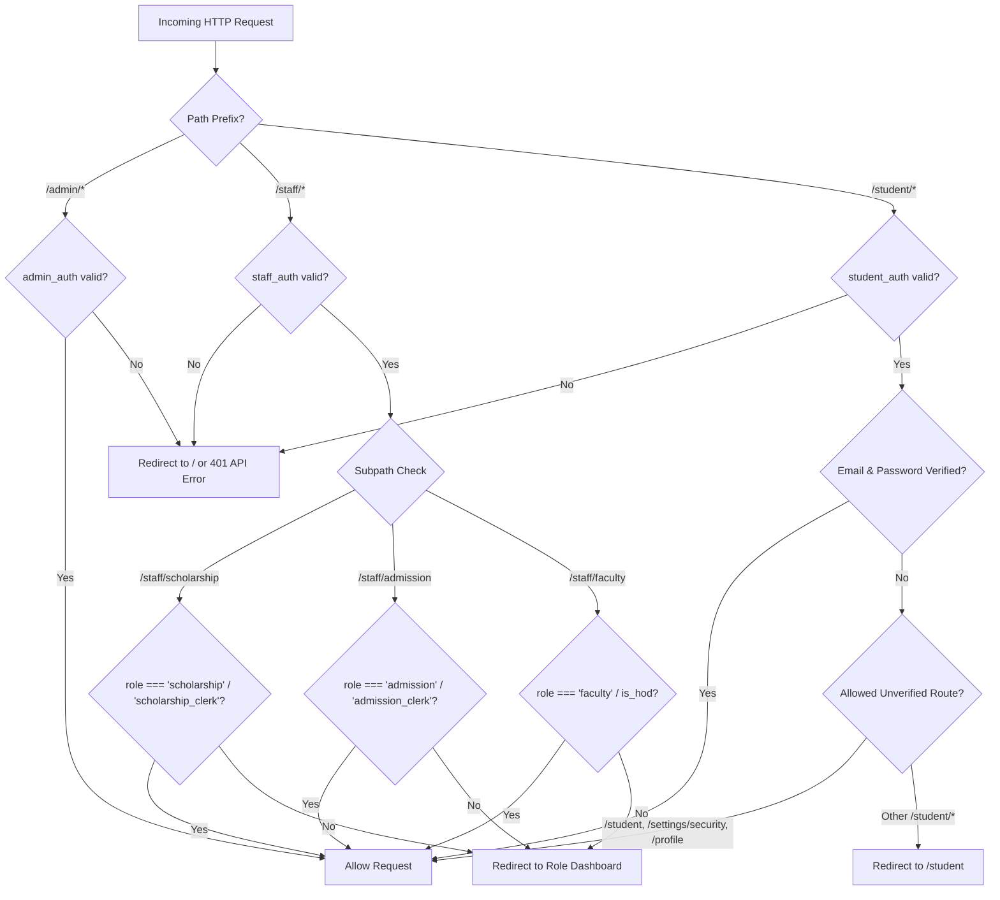

# Authorization System & Role-Based Access Control (RBAC)

## Overview

The KUCET CMS employs a fine-grained Role-Based Access Control (RBAC) framework designed to enforce principle of least privilege across all user roles. The system enforces authorization at two independent layers:
1. **Edge Middleware (`src/proxy.js`)**: Evaluates incoming request paths, user JWT tokens, and role credentials to block unauthorized HTTP access before hitting server controllers.
2. **Application Level (`src/lib/rbac.js`)**: Evaluates programmatic permissions for server actions, API route handlers, and UI component rendering.

---

## Fine-Grained RBAC Permission Matrix

All permissions in the system are explicitly enumerated in the `PERMISSIONS` dictionary (`src/lib/rbac.js`).

```javascript
export const PERMISSIONS = Object.freeze({
  ATTENDANCE_MARK: 'ATTENDANCE_MARK',
  ATTENDANCE_EDIT: 'ATTENDANCE_EDIT',
  MARK_ENTRY: 'MARK_ENTRY',
  MARK_APPROVE: 'MARK_APPROVE',
  FEE_VERIFY: 'FEE_VERIFY',
  FEE_EDIT: 'FEE_EDIT',
  CERTIFICATE_APPROVE: 'CERTIFICATE_APPROVE',
  ARCHIVE_RUN: 'ARCHIVE_RUN',
  ARCHIVE_RESTORE: 'ARCHIVE_RESTORE',
  REPORT_EXPORT: 'REPORT_EXPORT',
  VIEW_OWN_RECORDS: 'VIEW_OWN_RECORDS',
});
```

---

## Role Hierarchy & Mapping

The `DEFAULT_ROLE_PERMISSIONS` dictionary maps institutional roles to their granted permissions:

| Permission Name | Super Admin / Principal | HOD | Faculty | General Clerk | Scholarship Clerk | Admission Clerk | Student |
| :--- | :---: | :---: | :---: | :---: | :---: | :---: | :---: |
| `ATTENDANCE_MARK` | ✅ | ✅ | ✅ | ❌ | ❌ | ❌ | ❌ |
| `ATTENDANCE_EDIT` | ✅ | ✅ | ❌ | ❌ | ❌ | ❌ | ❌ |
| `MARK_ENTRY` | ✅ | ✅ | ✅ | ❌ | ❌ | ❌ | ❌ |
| `MARK_APPROVE` | ✅ | ✅ | ❌ | ❌ | ❌ | ❌ | ❌ |
| `FEE_VERIFY` | ✅ | ❌ | ❌ | ✅ | ✅ | ❌ | ❌ |
| `FEE_EDIT` | ✅ | ❌ | ❌ | ✅ | ✅ | ❌ | ❌ |
| `CERTIFICATE_APPROVE` | ✅ | ❌ | ❌ | ✅ | ❌ | ✅ | ❌ |
| `ARCHIVE_RUN` | ✅ | ❌ | ❌ | ❌ | ❌ | ❌ | ❌ |
| `ARCHIVE_RESTORE` | ✅ | ❌ | ❌ | ❌ | ❌ | ❌ | ❌ |
| `REPORT_EXPORT` | ✅ | ✅ | ❌ | ✅ | ✅ | ✅ | ❌ |
| `VIEW_OWN_RECORDS` | ✅ | ✅ | ✅ | ✅ | ❌ | ❌ | ✅ |

---

## Helper API & Evaluation Utility

The system provides synchronous evaluation utilities for checking permissions in server actions and UI components (`src/lib/rbac.js`):

### 1. `getRolePermissions(role)`
Normalizes the role string to lowercase and retrieves the array of granted permissions. Returns an empty array `[]` for unknown or missing roles.

### 2. `hasPermission(role, permission)`
Returns `true` if the specified role possesses the target permission.
```javascript
import { hasPermission, PERMISSIONS } from '@/lib/rbac';

if (!hasPermission(user.role, PERMISSIONS.ATTENDANCE_EDIT)) {
  throw new Error('Forbidden: Insufficient privileges to edit attendance.');
}
```

### 3. `hasAnyPermission(role, permissionsArray)`
Returns `true` if the specified role possesses **at least one** of the permissions listed in `permissionsArray`.

### 4. `hasAllPermissions(role, permissionsArray)`
Returns `true` if the specified role possesses **all** of the permissions listed in `permissionsArray`.

---

## Middleware Baseline Enforcement (`src/proxy.js`)

The Edge proxy middleware sits in front of all HTTP routes (except static assets and public auth endpoints) and enforces strict route boundaries based on JWT claims.



### Route Defense Specifications
1. **Admin Routes (`/admin/*`, `/api/admin/*`)**: Strictly requires a valid `admin_auth` cookie containing `role: 'admin'`.
2. **Staff Routes (`/staff/*`, `/api/staff/*`)**: Requires a valid `staff_auth` cookie. Sub-route checking ensures role segregation:
   - `/staff/scholarship/*` restricts to `scholarship_clerk` / `scholarship` staff.
   - `/staff/admission/*` restricts to `admission_clerk` / `admission` staff.
   - `/staff/faculty/*` restricts to `faculty` / `hod` staff.
   - `/staff/hod/*` requires `is_hod: true`.
3. **Student Routes (`/student/*`)**: Requires `student_auth`. Unverified students (who haven't set up passwords or verified email) are restricted exclusively to `/student`, `/student/profile`, and `/student/settings/security`.

---

## Cross-References

- [Authentication Architecture](./authentication.md)
- [Session Management](./session-management.md)
- [Staff Portal Documentation](../pages/staff-pages.md)
- [HOD Console Documentation](../pages/hod-pages.md)
