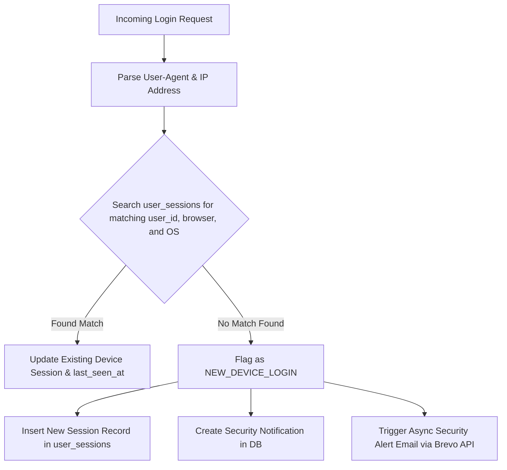

# Session Management & Remote Revocation

## Overview

The KUCET CMS maintains a stateful session orchestration layer powered by `SecurityService.js` and the `user_sessions` database table. While JWT tokens enable fast stateless edge authentication, the session management system provides real-time security tracking, hardware heuristic analysis, device-level session listing, immediate remote session revocation, and multi-cookie array preservation across redirects.

---

## Active Session Schema (`user_sessions`)

Every authenticated login (for Staff, Faculty, HODs, and Super Admins) creates or updates an active session record in `user_sessions`.

| Column Name | Data Type | Nullable | Description / Usage |
| :--- | :--- | :---: | :--- |
| `id` | `INT` | ❌ | Primary Key (Auto-Increment) |
| `user_id` | `INT` | ❌ | Foreign Key referencing User Table ID (`staff_accounts.id` or `principal.id`) |
| `user_type` | `VARCHAR(50)` | ❌ | User Domain (`STUDENT`, `STAFF`, `ADMIN`, `SYSTEM`) |
| `session_token_hash` | `VARCHAR(255)` | ❌ | SHA-256 Digest of the active refresh token |
| `browser` | `VARCHAR(100)` | 🔐 | Extracted User-Agent Browser Name (e.g., Chrome 124) |
| `operating_system` | `VARCHAR(100)` | 🔐 | Extracted OS (e.g., Windows 11, macOS, Android) |
| `device_name` | `VARCHAR(100)` | 🔐 | Extracted Device Name or Hardware Heuristic |
| `ip_address` | `VARCHAR(45)` | 🔐 | Client IPv4 or IPv6 Address |
| `location` | `VARCHAR(100)` | 🔐 | Geolocation / IP Lookup String |
| `is_current` | `BOOLEAN` | ❌ | Flag indicating if this session is the active browser session |
| `is_revoked` | `BOOLEAN` | ❌ | Revocation status (1 = Revoked, 0 = Active) |
| `last_seen_at` | `DATETIME` | ❌ | Timestamp of last API interaction or token refresh |
| `created_at` | `DATETIME` | ❌ | Session creation timestamp |
| `expires_at` | `DATETIME` | ❌ | Expiration timestamp matching refresh token validity |

---

## Device Heuristics & New Device Detection

When a user logs in, `SecurityService.detectNewDevice()` parses the incoming User-Agent header via `parseUA()` to extract hardware and browser signatures.



---

## Session Revocation & Token Reuse Protection

Users can view and manage their active sessions from their profile Security Center. Remote revocation operates in real time using Server-Sent Events (SSE).

### 1. Token Reuse Detection & Revocation Grace Period Invariant

When an expired or revoked refresh token is presented to `/api/auth/refresh/route.js`, the system detects potential token theft and revokes all active tokens for that user.

In Session 205, a critical bug was resolved where updating revoked tokens reset their `revoked_at` timestamp to `NOW()`, inadvertently restarting the 30-second grace period for subsequent stolen requests. 

To enforce strict token invalidation, the revocation query explicitly targets only active tokens:

```javascript
// In src/app/api/auth/refresh/route.js
// Revoke all ACTIVE tokens for this user as a security precaution.
// We must explicitly use SQL to only update tokens where revoked_at IS NULL,
// otherwise we reset the clock on previously revoked tokens and inadvertently
// trigger the grace period for subsequent requests!
const { sql } = await import('drizzle-orm');
await db.update(refreshTokens)
  .set({ revoked_at: now })
  .where(and(
      eq(refreshTokens.user_id, tokenRecord.user_id),
      eq(refreshTokens.user_type, type),
      sql`${refreshTokens.revoked_at} IS NULL`
  ));
```

### 2. Single Session Revocation (`SecurityService.revokeSession`)
Terminates a specific session ID:
```javascript
await SecurityService.revokeSession({ userType: 'STAFF', userId: 12, sessionId: 45 });
```
**Execution Workflow**:
1. Verifies session ownership (`id`, `user_id`, `user_type`).
2. Updates database record: `is_revoked = true`, `is_current = false`.
3. Dispatches `SESSION_REVOKED` security event log and triggers background alert email to user.
4. Creates a `WARNING` security notification in `security_notifications`.
5. Broadcasts real-time SSE event `SESSION_REVOKED` containing `sessionId`, `userId`, `userType`.

### 3. Revoke All Other Sessions (`SecurityService.revokeOtherSessions`)
Terminates all active sessions for a user **except** the current session:
```javascript
await SecurityService.revokeOtherSessions({
  userType: 'ADMIN',
  userId: 1,
  currentTokenHash: 'sha256_hash_of_current_refresh_token'
});
```
**Execution Workflow**:
1. Queries `user_sessions` for all active (`is_revoked = false`) records matching `user_id` and `user_type` where `session_token_hash != currentTokenHash`.
2. Executes bulk DB update setting `is_revoked = true` and `is_current = false`.
3. Dispatches `OTHER_SESSIONS_REVOKED` security event.
4. Broadcasts individual SSE revocation events for each terminated session ID.

---

## Session 205 Cookie Array Preservation & Stale Cookie Purging

To guarantee that cookie state transitions (such as token rotation or session invalidation) are correctly received by client browsers across Edge redirects, `src/proxy.js` implements a raw cookie array preservation invariant.

### 1. Cookie Preservation Across 303 Redirects (`withCookies`)
When middleware redirects an unauthenticated user or routes a user post-refresh, Next.js `NextResponse.redirect()` creates a brand-new response object that drops pre-existing headers. `src/proxy.js` uses `withCookies()` to transfer the buffered `newCookiesToSet` array:

```javascript
const withCookies = (redirectResponse) => {
  if (refreshTriggered) {
    newCookiesToSet.forEach(cookieStr => {
      redirectResponse.headers.append('set-cookie', cookieStr);
    });
  }
  return redirectResponse;
};
```

### 2. Automatic Stale Cookie Invalidation
If a silent refresh fails (due to an expired, invalid, or revoked refresh token), middleware automatically invalidates all domain cookies (`*_auth`, `*_logged_in`, `*_refresh_token`, `*_session_id`) using explicit HTTP 1970 expiration headers (`Expires=Thu, 01 Jan 1970 00:00:00 GMT`), preventing stale session state from lingering in the browser.

---

## Security Guards & Revocation Protection

To prevent session hijacking or invalid state transitions, `SecurityService.js` enforces strict safety guards:

### 1. Reactivation Protection Guard
If an incoming refresh request attempts to update a session that has already been flagged `is_revoked: true`, `SecurityService.updateSession` explicitly rejects the request and logs `[SESSION_REACTIVATION_ATTEMPT]`.

### 2. Session Ownership Validation Guard
If the `userId` or `userType` of an incoming update request does not match the stored session record in `user_sessions`, the system logs `[SESSION_OWNERSHIP_MISMATCH]` and forces the creation of a brand new isolated session record.

### 3. Real-Time Client Synchronization
The client browser stores a non-httpOnly companion cookie `*_session_id` (`staff_session_id`, `admin_session_id`, `student_session_id`). Client components establish an SSE event listener to `/api/events`. When a `SESSION_REVOKED` broadcast matching the client's `session_id` is received, the client immediately clears local state and redirects to the login screen with a security alert message.

---

## Cross-References

- [Authentication Architecture & Cookie Invariants](./authentication.md)
- [Authorization System](./authorization.md)
- [Backend Architecture](../architecture/backend.md)
- [Student Portal Security Center](../pages/student-pages.md#security-center)
- [Database Schema (Security Domain)](../database/schema.md#6-security-domain)
