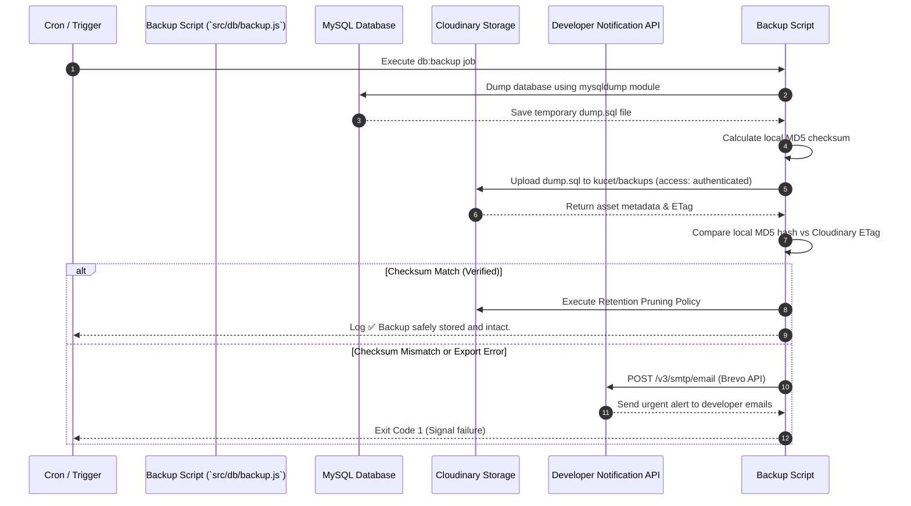
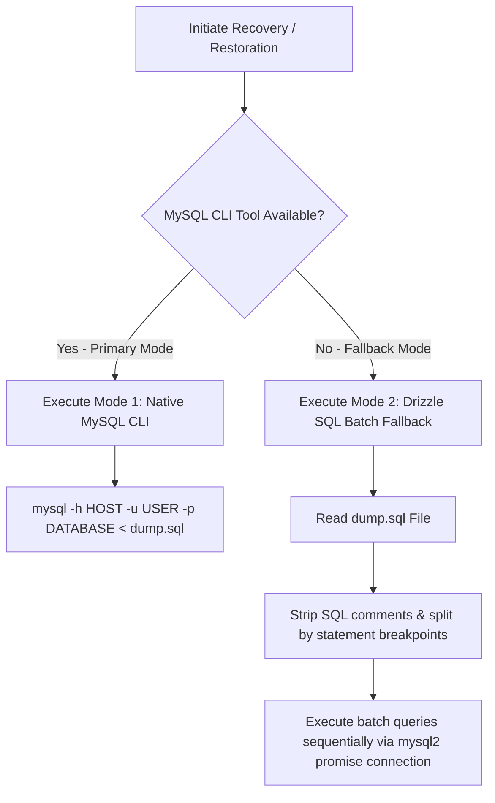

# Automated Backup Strategy & Disaster Recovery Engine

## Overview

The KUCET CMS maintains a zero-data-loss backup architecture designed to protect institutional records against hardware failures, accidental deletions, or cyber incidents.

The strategy combines automated daily database dumps, offsite authenticated storage, cryptographic checksum verification, multi-tier retention pruning, and a dual-mode restoration engine.

---

## Backup Workflow Architecture

Automated daily backups are triggered via scheduled cron jobs (GitHub Actions / Server Cron) executing `npm run db:backup` (`src/db/backup.js`).



---

## Retention Pruning Policy (`pruneBackups`)

To prevent cloud storage bloat while maintaining historical auditability, the system executes an automated retention pruning algorithm following each successful backup upload.

The pruning algorithm categorizes backups based on age and date signature:

| Retention Category | Retention Period | Inclusion Rule |
| :--- | :--- | :--- |
| **Daily Snapshots** | 30 Days | Keeps **100% of daily snapshots** created within the last 30 days. |
| **Weekly Snapshots** | 4 Weeks (28 Days) | Keeps snapshots created on **Sundays** older than 30 days. |
| **Monthly Snapshots** | 12 Months (365 Days) | Keeps snapshots created on the **1st day of the month** for up to 1 year. |

Backups that do not satisfy any of the three retention rules are marked as expired and batch-deleted from Cloudinary in chunks of 100 resources.

---

## System Checksums & Failure Alerting

### Cryptographic MD5 Verification
Before marking a backup job as successful, `src/db/backup.js` computes an MD5 checksum of the local file and compares it against the ETag returned by Cloudinary:

```javascript
const localHash = await calculateFileHash(backupPath);
if (result.etag === localHash) {
  console.info('🚀 CHECKSUM VERIFIED: Backup safely stored and intact.');
} else {
  throw new Error(`Checksum mismatch! Local: ${localHash}, Cloudinary: ${result.etag}`);
}
```

### Urgent Developer Failure Alerts
If an error occurs during database dumping, upload, or checksum validation, `src/db/backup.js` invokes `sendFailureEmail()` via the Brevo SMTP API, dispatching HTML alert notifications to institutional developer emails:
- `sunnysunnit@gmail.com`
- `testersybau67@gmail.com`
- `uzair.mdf@gmail.com`

---

## Dual-Mode Restoration Engine

Disaster recovery supports two independent restoration modes to guarantee recovery regardless of target environment CLI tooling.



### Mode 1: Native MySQL CLI (Primary)
Used in server environments where the `mysql` client binary is present:
```bash
mysql -h $DB_HOST -P $DB_PORT -u $DB_USER -p$DB_PASSWORD $DB_DATABASE < backup_dump.sql
```

### Mode 2: Drizzle SQL Batch Execution Fallback (Secondary)
Used in serverless, PaaS, or containerized environments (e.g. Render, Vercel) where the native MySQL CLI client is absent:
1. Reads the SQL dump file into memory.
2. Cleans comments and parses SQL statements.
3. Opens a transactional connection using `mysql2/promise`.
4. Sequentially executes queries with error handling for schema dependencies.

---

## Cross-References

- [Database Schema Reference](./schema.md)
- [Database Migration Workflow](./migrations.md)
- [Super Admin Infrastructure Monitoring](../pages/admin-pages.md#infrastructure-monitoring)
