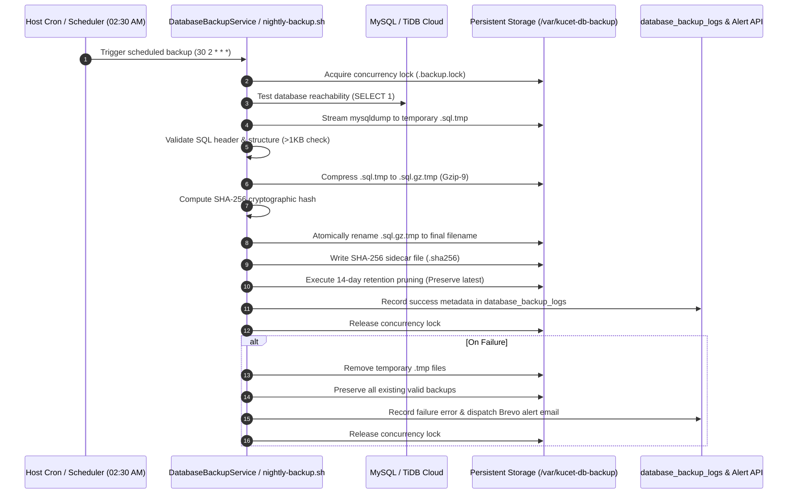
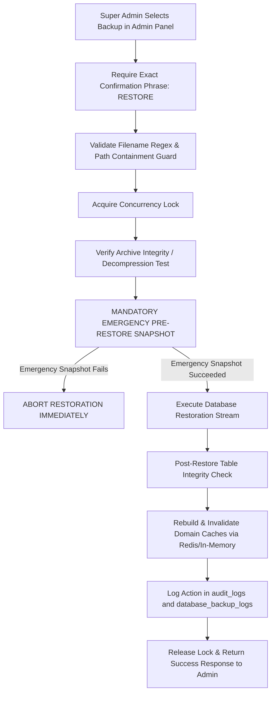

# Automated Database Backup Strategy & Disaster Recovery Engine

## 1. System Overview

The **KUCET College Management System (CMS)** maintains an enterprise-grade, hybrid database backup and disaster recovery engine. Designed to guarantee zero data loss and institutional continuity, the engine supports both self-hosted VPS MySQL deployments and managed TiDB Cloud distributed clusters with full TLS 1.2+ SSL encryption.

The architecture integrates automated daily snapshots, persistent storage mounting, cryptographic SHA-256 verification, 14-day retention pruning, guarded admin panel controls, and automated pre-restore safety guarantees.

---

## 2. Core Operational Specifications

| Property | Value / Requirement | Details |
| :--- | :--- | :--- |
| **Schedule** | Daily at **02:30 AM** VPS Time | Configured via host crontab (`30 2 * * *`) and `setup-cron.sh`. |
| **Retention Window** | **14 Days** | Backups older than 14 days are automatically pruned. |
| **Safety Invariant** | **Newest Snapshot Preservation** | The most recent valid backup is **never deleted**, regardless of age. |
| **Storage Location** | `/var/kucet-db-backup` | Mounted into application container; fallback to `./backups` in dev. |
| **Naming Convention** | `kucet_cms_YYYY-MM-DD_HH-mm-ss.sql.gz` | Emergency pre-restore snapshots append `_emergency_pre_restore`. |
| **Compression** | Gzip Level 9 (`.sql.gz`) | High compression ratio with streaming pipe. |
| **Integrity Check** | SHA-256 Checksum | Computed post-compression and saved to `.sha256` sidecar & DB logs. |
| **Concurrency Guard** | File Lock (`.backup.lock`) | 15-minute stale timeout prevents concurrent backup/restore tasks. |
| **Database Support** | Hybrid (MySQL 8.0 & TiDB Cloud) | Auto-detects SSL/TLS mode (`--ssl-mode=REQUIRED` / `minVersion: TLSv1.2`). |
| **Admin Controls** | Super Admin (`/admin/infrastructure?tab=backups`) | View registry, trigger manual dump, download, and safe restore. |

---

## 3. Architecture & Execution Workflow

### Automated Backup Pipeline (02:30 AM Daily)



---

## 4. Guarded Database Restoration Workflow

Database restoration is a critical high-risk operation. To eliminate catastrophic data loss and accidental admin overwrites, the engine enforces a strict multi-stage safety protocol:



### Safety Features
1. **Confirmation Guard**: Admin must type the exact word `RESTORE` to activate the restore button.
2. **Emergency Pre-Restore Snapshot**: The system automatically captures a live backup of the current database (`kucet_cms_YYYY-MM-DD_HH-mm-ss_emergency_pre_restore.sql.gz`) before applying the restore. If this emergency backup cannot be generated, the restoration process aborts immediately.
3. **Dual Execution Engine**:
   - **Mode 1 (Primary)**: Native `mysql` CLI with stdin streaming and `MYSQL_PWD` environment isolation.
   - **Mode 2 (Fallback)**: Node.js `mysql2/promise` sequential execution with multi-statement handling.
4. **Cache Invalidation**: Automatically calls `DisasterRecoveryService.rebuildDomainCaches()` to invalidate Redis and in-memory caches for `academic`, `config`, and `finance` domains.

---

## 5. Retention Pruning Policy

To prevent storage exhaustion while preserving institutional recoverability, `DatabaseBackupService.pruneRetention()` runs after every successful backup cycle:

1. Gathers all `.sql.gz` and `.sql` snapshots in `/var/kucet-db-backup`.
2. Sorts snapshots in descending order by timestamp (newest first).
3. **Inviolable Invariant**: Index `0` (the newest snapshot) is **always protected** from deletion, even if older than 14 days.
4. All other snapshots older than 14 days (`mtime > 14 days`) are safely unlinked along with their `.sha256` sidecars.

---

## 6. Hybrid Database Environment Compatibility

The backup engine is designed for dual deployment models:

### Model A: Local Dockerized / VPS MySQL
- Uses `docker exec kucet-cms-db mysqldump ...` or container-level `DatabaseBackupService`.
- Connects over local internal network bridge.

### Model B: TiDB Cloud (Serverless / Dedicated)
- Auto-detects `DB_SSL=true` or host containing `tidbcloud.com`.
- Enforces TLS 1.2+ encrypted channels (`rejectUnauthorized: true`, `--ssl-mode=REQUIRED`).
- Handles TiDB multi-table constraints cleanly during restoration.

---

## 7. Administrative Controls & API Reference

### Endpoints (`src/app/api/admin/infrastructure/backups/`)

| Method | Endpoint | Authorization | Description |
| :--- | :--- | :--- | :--- |
| `GET` | `/api/admin/infrastructure/backups` | Super Admin | Lists all persistent backups, metadata, sizes, types, and SHA-256 hashes. |
| `POST` | `/api/admin/infrastructure/backups` | Super Admin | Triggers an on-demand manual backup snapshot with progress feedback. |
| `GET` | `/api/admin/infrastructure/backups/download/[filename]` | Super Admin | Securely streams compressed backup file with path-traversal protection. |
| `POST` | `/api/admin/infrastructure/backups/restore` | Super Admin | Initiates guarded restore (requires `{ filename, confirmPhrase: "RESTORE" }`). |

---

## 8. CLI & Shell Tools

| Script | Purpose | Usage |
| :--- | :--- | :--- |
| `scripts/database-backup.sh` | Manual/automated backup entrypoint | `bash scripts/database-backup.sh` |
| `DEPLOYMENT_PACKAGE/SCRIPTS/nightly-backup.sh` | Host cron backup runner (2:30 AM) | `bash DEPLOYMENT_PACKAGE/SCRIPTS/nightly-backup.sh` |
| `scripts/deployment/backup-restore.sh` | CLI backup and recovery utility | `bash scripts/deployment/backup-restore.sh restore <file.sql.gz>` |
| `npm run db:backup` | Node.js backup execution | `npm run db:backup` |

---

## 9. Verification & Post-Mortem Checklist

After performing a restore or verifying disaster recovery readiness:
1. Verify table counts: `SELECT COUNT(*) FROM information_schema.tables WHERE table_schema = 'kucet_cms';`
2. Test admin login and role authorization.
3. Verify student and staff profile records.
4. Check `database_backup_logs` and `audit_logs` for operational records.
5. Verify that recent backup files in `/var/kucet-db-backup` have companion `.sha256` files.

---

## 10. Data Safety Hierarchy: Application vs. Database Recovery

To guarantee data safety and operational efficiency, the system strictly separates **operational business transitions** from **cluster disaster recovery**:

```
                              DATA SAFETY STRATEGY
                                       │
            ┌──────────────────────────┴──────────────────────────┐
            ▼                                                     ▼
┌─────────────────────────────────┐                 ┌─────────────────────────────────┐
│     APPLICATION-LEVEL LAYER     │                 │      DATABASE-LEVEL LAYER       │
│    (Operational Data Safety)    │                 │       (Disaster Recovery)       │
├─────────────────────────────────┤                 ├─────────────────────────────────┤
│ • Soft Rejection (REJECTED enum)│                 │ • Automated Daily Gzip-9 Dumps  │
│ • admission_status_history      │                 │ • SHA-256 Checksum Sidecars     │
│ • Preserved Proof Media Files   │                 │ • Emergency Pre-Restore Dumps   │
│ • 1-Click Surgical Restoration  │                 │ • Continuous WAL & PITR Logs    │
│ • Zero Physical SQL DELETEs     │                 │ • Cluster Hardware Recovery     │
└─────────────────────────────────┘                 └─────────────────────────────────┘
```

1. **Application-Level Operational Recovery:** Rejection of admission applications, student profile changes, or document disputes must **never** physically delete rows or assets. Instead, records transition into `REJECTED` status with full audit logging in `admission_status_history`, enabling staff to inspect rationale or surgically restore records in 1 click without affecting any other database record.
2. **Database-Level Disaster Recovery:** Full-cluster restoration via `DatabaseBackupService` and point-in-time recovery (PITR) is reserved for catastrophic cluster outages, disk corruption, or infrastructure migration.

