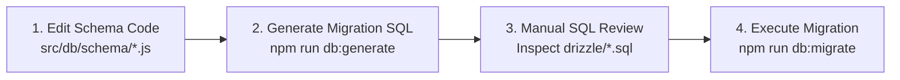
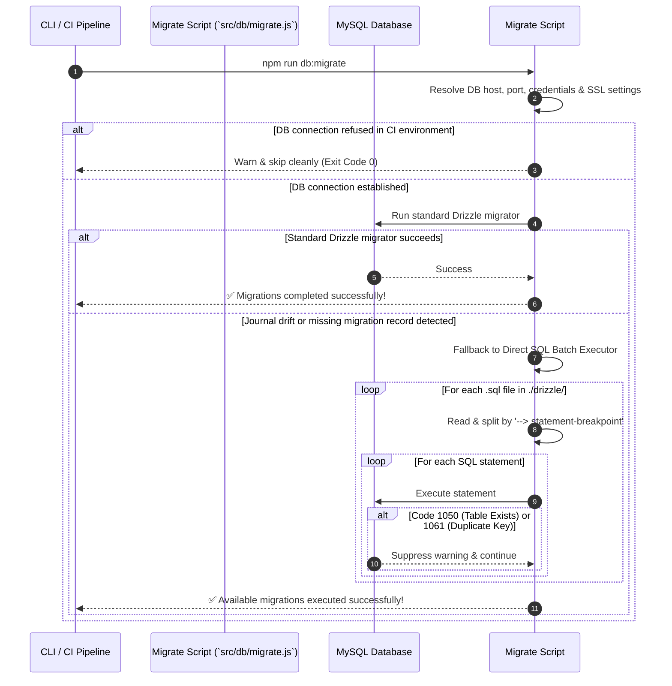

# Database Migration Workflow & Safe Schema Protocol

## Overview

Database schema evolution in KUCET CMS is governed by Drizzle Kit (`drizzle-kit`) and a custom migration runner (`src/db/migrate.js`). The system enforces strict version control for all database DDL changes to prevent data loss or schema drift across development, staging, and production environments.

---

## The Golden Rule: NEVER Use `db:push` in Production

> [!CAUTION]
> `npm run db:push` (`drizzle-kit push`) bypasses migration files and directly mutates the target database schema. In production environments, `db:push` can cause catastrophic data loss, dropped tables, or inconsistent state. `db:push` is restricted exclusively to ephemeral local development prototypes. Production migrations MUST follow the strict generate-review-migrate protocol detailed below.

---

## Safe Schema Update Protocol

Every database schema change must adhere to the 4-step deployment pipeline:



### Step 1: Modify Schema Definition
Edit the relevant modular domain file in `src/db/schema/` (e.g. adding a new column to `src/db/schema/identity.js`).

### Step 2: Generate Migration SQL
Execute Drizzle Kit generator:
```bash
npm run db:generate
```
This compares `src/db/schema.js` against existing migrations in `./drizzle/` and produces a new numbered SQL snapshot file (e.g., `./drizzle/0007_add_faculty_office.sql`).

### Step 3: Manual SQL Inspection
Open the generated `.sql` file in `./drizzle/` and review the DDL statements. Verify:
- Column data types and NULL constraints match requirements.
- Foreign key definitions enforce `ON DELETE RESTRICT` or `ON DELETE CASCADE` appropriately.
- Indexes have explicit names prefixed with `idx_` or `uq_`.

### Step 4: Execute Migration Runner
Run the migration execution script:
```bash
npm run db:migrate
```

---

## Fail-Safe Migration Execution Engine (`src/db/migrate.js`)

The project uses a custom migration execution runner that guarantees deployment stability even in heterogeneous hosting environments (Local MySQL, TiDB Cloud, Render, CI runners).



### Resilient Features of `migrate.js`
1. **TiDB Cloud & SSL Auto-Detection**: Automatically injects TLS v1.2 configuration when connecting to TiDB Cloud or when `DB_SSL=true`.
2. **Clean CI Bypass**: Prevents build failures in CI workflows where database secrets are deliberately withheld by catching `ECONNREFUSED` and exiting cleanly.
3. **Journal Drift Auto-Recovery**: If Drizzle's `__drizzle_migrations` meta table becomes desynchronized or missing historical journal files, the script falls back to parsing raw `.sql` files, splitting by `--> statement-breakpoint`, and executing statements individually while suppressing harmless duplicate errors (MySQL codes 1050, 1061, 1060).

---

## Automated CI Drift Verification

In GitHub Actions workflows (`.github/workflows/ci.yml`), schema integrity is verified prior to merging pull requests:
1. Running `npm run db:generate` in dry-run mode.
2. Checking `git status` to ensure developers didn't alter schema files without committing corresponding migration SQL files.

---

## Cross-References

- [Database Schema Reference](./schema.md)
- [Backup & Disaster Recovery Strategy](./backup-strategy.md)
