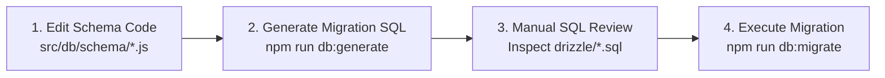
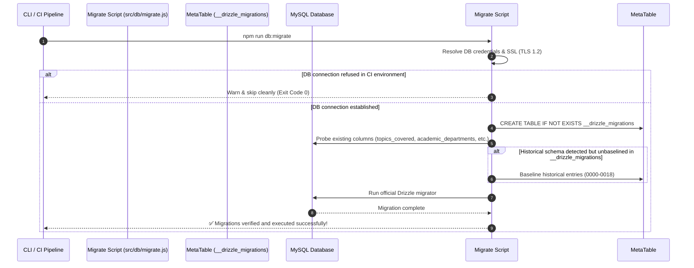

# Database Migration Workflow & Safe Schema Protocol

## Overview

Database schema evolution in KUCET CMS is governed by Drizzle Kit (`drizzle-kit`) and a custom migration runner (`src/db/migrate.js`). The system enforces strict version control for all database DDL changes to prevent data loss or schema drift across development, staging, and production environments.

---

## The Golden Rule: NEVER Use `db:push` in Production

> [!CAUTION]
> `npm run db:push` (`drizzle-kit push`) bypasses migration files and directly mutates the target database schema. In production environments, `db:push` can cause catastrophic data loss, dropped tables, or inconsistent state. `db:push` is restricted exclusively to ephemeral local development prototypes. Production migrations MUST follow the strict generate-review-migrate protocol detailed below.

---

## Safe Schema Update Protocol

Every database schema change must adhere to the 4-step deployment pipeline:



### Step 1: Modify Schema Definition
Edit the relevant modular domain file in `src/db/schema/` (e.g. adding a new column to `src/db/schema/identity.js`).

### Step 2: Generate Migration SQL
Execute Drizzle Kit generator:
```bash
npm run db:generate
```
This compares `src/db/schema.js` against existing migrations in `./drizzle/` and produces a new numbered SQL snapshot file (e.g., `./drizzle/0007_add_faculty_office.sql`).

### Step 3: Manual SQL Inspection
Open the generated `.sql` file in `./drizzle/` and review the DDL statements. Verify:
- Column data types and NULL constraints match requirements.
- Foreign key definitions enforce `ON DELETE RESTRICT` or `ON DELETE CASCADE` appropriately.
- Indexes have explicit names prefixed with `idx_` or `uq_`.

### Step 4: Execute Migration Runner
Run the migration execution script:
```bash
npm run db:migrate
```

---

## Fail-Safe Migration Execution Engine (`src/db/migrate.js`)

The project uses a custom migration execution runner that guarantees deployment stability across heterogeneous hosting environments (Local MySQL, TiDB Cloud, Render, CI runners, and Hostinger/Ubuntu VPS).



### Resilient Features of `migrate.js`
1. **TiDB Cloud & SSL Auto-Detection**: Automatically injects TLS v1.2 configuration when connecting to TiDB Cloud or when `DB_SSL=true`.
2. **Clean CI Bypass**: Prevents build failures in CI workflows where database secrets are deliberately withheld by catching `ECONNREFUSED` and exiting cleanly.
3. **Intelligent Baselining**: Probes database metadata to detect existing schema structures (e.g. `attendance_sessions.topic_covered`, `academic_departments`, `staff_registration_requests.address`, `admission_status_history`) and automatically baselines matching journal entries to prevent destructive or failing repeat executions.
4. **Official Drizzle Runner**: Executes migrations strictly in dependency order using Drizzle ORM's migration engine.

---

## Migration Version Registry (0000 – 0018)

| Index | Migration Tag | Applied Changes & Domain | Safety Level |
| :---: | :--- | :--- | :--- |
| `0000` | `0000_flippant_fabian_cortez` | Core schema initialization | `SAFE` |
| `0001` | `0001_sharp_polaris` | Initial indexes and constraints | `SAFE` |
| `0002` | `0002_flat_mephistopheles` | Student and academic references | `SAFE` |
| `0003` | `0003_zippy_agent_zero` | Attendance and session columns | `SAFE` |
| `0004` | `0004_funny_starfox` | Operations and request tables | `SAFE` |
| `0005` | `0005_redundant_adam_destine` | Finance and payment structures | `SAFE` |
| `0006` | `0006_cool_yellowjacket` | Timetable and schedule updates | `SAFE` |
| `0007` | `0007_flippant_harry_osborn` | Security events and notifications | `SAFE` |
| `0008` | `0008_solid_black_tarantula` | Archive domain tables and retention policies | `SAFE` |
| `0009` | `0009_tiny_sabretooth` | Bug reporting and feedback tables | `SAFE` |
| `0010` | `0010_tan_cerebro` | Certificate verification lookup tracking | `SAFE` |
| `0011` | `0011_curious_terrax` | Cloudinary relative storage key migrations | `SAFE` |
| `0012` | `0012_clerk_registration_requests` | Staff self-registration request workflow | `SAFE` |
| `0013` | `0013_thin_outlaw_kid` | Session and token expiration enhancements | `SAFE` |
| `0014` | `0014_zero_clerk_hard_break` | Zero-clerk hard break: rename to staff tables | `SAFE` |
| `0015` | `0015_database_backup_logs` | Database backup execution logs | `SAFE` |
| `0016` | `0016_reconcile_staff_and_hod_schema` | Academic departments, programs & HOD tables | `SAFE` |
| `0017` | `0017_add_staff_registration_address` | Address field for staff registration requests | `SAFE` |
| `0018` | `0018_admission_rejection_and_history` | Soft rejection metadata & `admission_status_history` | `SAFE` |

---

## Automated CI Drift Verification

In GitHub Actions workflows (`.github/workflows/ci.yml`), schema integrity is verified prior to merging pull requests:
1. Running `npx drizzle-kit check` to verify 0 schema drift between code and migrations.
2. Running `npm run test:unit` across the entire test suite.

---

## Cross-References

- [Database Schema Reference](./schema.md)
- [Backup & Disaster Recovery Strategy](./backup-strategy.md)
- [Database Architecture](../architecture/database.md)
- [Migration History Log](../history/migration-history.md)
