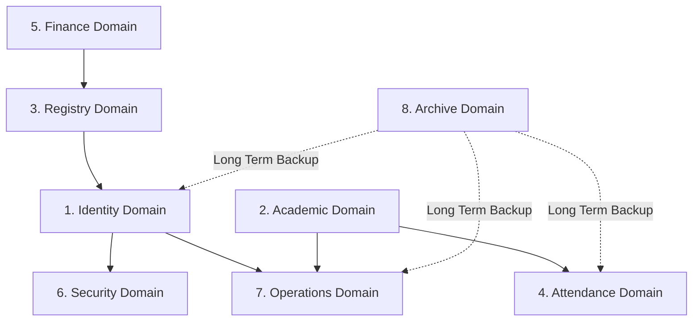

# Database Schema Reference

## Overview

The KUCET CMS database architecture is divided into 8 modular domains using Drizzle ORM (`drizzle-orm/mysql-core`). The MySQL database is configured with UTF-8 character encoding and InnoDB engine support to ensure ACID transactional compliance.

---

## Domain Architecture Overview

---

## 1. Identity Domain

Responsible for user authentication, accounts, roles, credentials, and session tokens.

### Table: `students`
Primary identity table for enrolled students.
- `id` (`INT`, PK, Auto-Increment)
- `admission_no` (`VARCHAR(255)`)
- `roll_no` (`VARCHAR(255)`, Unique Index: `uq_students_roll_no`, Index: `idx_roll_no`)
- `fee_reimbursement` (`ENUM('YES', 'NO', 'GOV')`, Default: `'NO'`)
- `name` (`VARCHAR(255)`)
- `date_of_birth` (`DATE`)
- `gender` (`VARCHAR(50)`)
- `mobile` (`VARCHAR(255)` - AES-256 Encrypted)
- `mobile_hash` (`VARCHAR(64)`, Index: `idx_students_mobile_hash` - Blind Index)
- `email` (`VARCHAR(255)`, Index: `idx_students_email`)
- `created_at` (`TIMESTAMP`, Default: `NOW()`, Index: `idx_students_created_at`)
- `is_email_verified` (`BOOLEAN`, Default: `false`)
- `email_verified_at` (`TIMESTAMP`)
- `password_hash` (`VARCHAR(255)`)
- `admission_date` (`DATE`)
- `added_by_clerk_id` (`INT`)
- `updated_at` (`TIMESTAMP`, On Update: `NOW()`)
- `updated_by_clerk_id` (`INT`)
- `student_status` (`ENUM('ACTIVE', 'DISCONTINUED')`, Default: `'ACTIVE'`)
- `academic_status` (`ENUM('REGULAR', 'ACTIVE', 'GRADUATED', 'DETAINED', 'SUSPENDED', 'DROPPED')`, Default: `'ACTIVE'`)
- `academic_offset_years` (`INT`, Default: `0`)
- `last_login_at` (`TIMESTAMP`)
- `last_login_ip` (`VARCHAR(64)`)
- `password_changed_at` (`TIMESTAMP`)

### Table: `clerks`
Identity table for Clerks, Faculty, and HODs.
- `id` (`INT`, PK, Auto-Increment)
- `name` (`VARCHAR(255)`, Not Null)
- `email` (`VARCHAR(255)`, Not Null, Index: `idx_clerks_email`)
- `employee_id` (`VARCHAR(255)`, Index: `idx_clerks_employee_id`)
- `password_hash` (`VARCHAR(255)`, Not Null)
- `role` (`VARCHAR(50)`, Default: `'scholarship'`, Not Null)
- `mobile` (`VARCHAR(255)` - Encrypted)
- `mobile_hash` (`VARCHAR(64)`)
- `pfp` (`TEXT` - Profile Image URL)
- `signature` (`TEXT` - Digital Signature URL)
- `address` (`TEXT`)
- `is_active` (`BOOLEAN`, Default: `true`, Not Null)
- `is_hod` (`BOOLEAN`, Default: `false`)
- `branch` (`VARCHAR(50)`)
- `last_login_at` (`TIMESTAMP`)
- `last_login_ip` (`VARCHAR(64)`)

### Table: `principal`
Super Admin account details.
- `id` (`INT`, PK, Auto-Increment)
- `email` (`VARCHAR(255)`, Not Null, Index: `idx_principal_email`)
- `password_hash` (`VARCHAR(255)`, Not Null)
- `last_login_at` (`TIMESTAMP`)
- `last_login_ip` (`VARCHAR(64)`)

### Table: `user_sessions`
Active device tracking and session storage.
- `id` (`BIGINT`, PK, Auto-Increment)
- `user_type` (`ENUM('STUDENT', 'CLERK', 'FACULTY', 'HOD', 'ADMIN')`)
- `user_id` (`BIGINT`, Composite Index: `idx_user_sessions_user` with `user_type`)
- `session_token_hash` (`VARCHAR(255)`, Index: `idx_user_session_token`)
- `device_name` (`VARCHAR(255)`)
- `browser` (`VARCHAR(100)`)
- `operating_system` (`VARCHAR(100)`)
- `ip_address` (`VARCHAR(64)`)
- `location` (`VARCHAR(255)`)
- `is_current` (`BOOLEAN`, Default: `false`)
- `is_revoked` (`BOOLEAN`, Default: `false`)
- `last_seen_at` (`TIMESTAMP`, Index: `idx_user_sessions_last_seen`)
- `created_at` (`TIMESTAMP`, Default: `NOW()`)
- `expires_at` (`TIMESTAMP`)

---

## 2. Academic Domain

Stores curriculum data, syllabus structures, academic calendars, and department configurations.

- **`system_configs`**: Key-value system configuration records (`config_key`, `config_value`, `category`).
- **`college_info`**: Institutional metadata (college name, principal signature, accreditation details).
- **`academic_calendar`**: Term start/end dates, holiday lists, exam windows.
- **`syllabus_structure`**: Semester-wise course structure, regulation years (e.g. R20, R23), branch codes (CSE, ECE, EEE, MECH, CIVIL).
- **`syllabus_subjects`**: Subject master records (subject code, title, credits, lecture hours, lab status, elective flag).
- **`semesters`**: Active academic term configurations.

---

## 3. Registry Domain

Manages student enrollment, personal demographics, academic history, admission drafts, and document verification.

- **`student_personal_details`**: Encrypted demographics (father name, mother name, caste, category, Aadhaar hash, permanent address).
- **`student_academic_background`**: SSC, Intermediate, EAMCET/ECET rank, hall ticket numbers, prior institution marks.
- **`student_admission_drafts`**: Staging table for multi-step admission forms before final roll number assignment.
- **`student_images`**: Cloudinary media pointers for student profile photos.
- **`student_signatures`**: Digital signature uploads.
- **`student_profile_requests`**: Profile update request workflow.

---

## 4. Attendance Domain

Captures lecture-level student and faculty attendance via manual, PIN, GPS geo-fencing, or QR codes.

- **`student_attendance`**: Granular attendance records (`student_id`, `session_id`, `status` (`PRESENT`/`ABSENT`/`LATE`), `marked_at`).
- **`attendance_sessions`**: Lecture session instances (`assignment_id`, `date`, `period_number`, `mode` (`MANUAL`/`PIN`/`GPS`/`QR`), `qr_code_hash`, `latitude`, `longitude`, `radius_meters`).
- **`attendance_session_logs`**: System audit trail of attendance submissions and faculty overrides.

---

## 5. Finance Domain

Handles tuition fee ledgers, payment transactions, scholarship sanctions, and idempotency guarantees.

- **`student_fee_payments`**: Financial transaction ledgers (`student_id`, `amount`, `payment_mode`, `transaction_ref`, `receipt_no`, `status`, `verified_by_clerk_id`).
- **`scholarship_sanctions`**: Jagananna Vidya Deevena (JVD) / Vasathi Deevena government sanction ledgers.
- **`scholarship_windows`**: Time-bound application windows.
- **`idempotency_keys`**: Idempotency token store (`key`, `request_hash`, `response_body`, `expires_at`) preventing duplicate fee charges.

---

## 6. Security Domain

Provides audit logging, intrusion detection alerts, and IP security.

- **`security_events`**: Audit log of critical events (`user_type`, `user_id`, `event_type`, `ip_address`, `details` JSON).
- **`security_notifications`**: In-app security warnings dispatched to users.
- **`audit_logs`**: Administrative action audit history.

---

## 7. Operations Domain

Handles marks entry, timetable scheduling, faculty assignments, student requests, and AI assistant history.

- **`student_marks`**: Exam marks (`student_id`, `subject_id`, `mid1_marks`, `mid2_marks`, `assignment_marks`, `external_marks`).
- **`branch_config`**: Departmental configurations.
- **`branch_timetable`**: Weekly class timetables (S1-S8, day of week, period slots, subject assignments).
- **`faculty_subject_assignments`**: Mapping between faculty (`clerks.id`) and assigned subject sections.
- **`student_requests`**: Bonafide, Custodian, and Transfer Certificate request workflows.
- **`certificate_verifications`**: Public QR verification records for issued certificates.
- **`assistant_conversations` & `assistant_messages`**: Chat history for the internal AI assistant.

---

## 8. Archive Domain

Long-term historical storage for graduated or archived cohorts. Mirror schemas of production tables:

- `archive_students`
- `archive_student_personal_details`
- `archive_student_academic_background`
- `archive_student_attendance`
- `archive_attendance_sessions`
- `archive_student_marks`
- `archive_student_payments`
- `archive_operations_log`
- `archive_retention_policies`

---

## Cross-References

- [Drizzle Migration Protocol](./migrations.md)
- [Backup & Disaster Recovery Strategy](./backup-strategy.md)
- [Authentication Architecture](../authentication/authentication.md)
