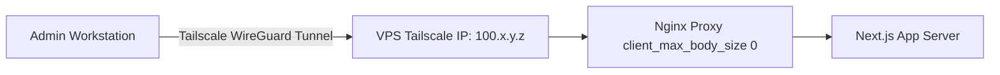

# Nginx Reverse Proxy Configuration & Performance Tuning

## 1. Nginx Reverse Proxy Architecture

The Nginx web server operates as the edge reverse proxy and static asset engine for the KUCET Management System. Running inside the `kucet-cms-proxy` container, Nginx inspects incoming HTTP/HTTPS traffic, serves static media directly from disk, enforces buffer limits, and routes application requests to the upstream Next.js container.

```mermaid
flowchart TD
    Client[Client Browser / Mobile] --> Edge[Edge Listener :80/:443]
    
    subgraph Nginx Proxy Engine (kucet-cms-proxy)
        Edge --> RouteCheck{URL Path Pattern}
        
        RouteCheck -->|/_next/static/*| ImmutableCache[365d Immutable Cache]
        RouteCheck -->|/uploads/*| DirectDisk[/usr/share/nginx/html/uploads]
        
        DirectDisk --> DiskStat{File Exists on Disk?}
        DiskStat -- Yes --> ServeStatic[Serve Static Binary Direct]
        DiskStat -- No (404/EACCES) --> AppFallback[@app_fallback Routing]
        
        RouteCheck -->|/api/* or Pages| UpstreamPool[Upstream Keepalive Pool]
        AppFallback --> UpstreamPool
    end
    
    UpstreamPool -->|Keepalive 64 Connections| NextJS[Next.js App Container :3000]
```

---

## 2. Upstream Connection Pooling & Keepalive Optimization

To minimize TCP handshake overhead (SYN/ACK latency) between Nginx and Next.js, Nginx maintains an active pool of persistent HTTP/1.1 keepalive connections.

```nginx
# Upstream Connection Pool Configuration (nginx.conf)
upstream nextjs_upstream {
    server kucet-cms-app:3000;
    keepalive 64; # Maintain up to 64 idle keepalive connections
}
```

### Upstream Proxy Headers

```nginx
location / {
    proxy_pass http://nextjs_upstream;
    proxy_http_version 1.1;
    proxy_set_header Upgrade $http_upgrade;
    proxy_set_header Connection ""; # Clear Connection header to enable keepalive
    proxy_set_header Host $host;
    proxy_cache_bypass $http_upgrade;
    proxy_set_header X-Real-IP $remote_addr;
    proxy_set_header X-Forwarded-For $proxy_add_x_forwarded_for;
    proxy_set_header X-Forwarded-Proto $scheme;
}
```

---

## 3. Buffer Tuning & Memory Optimizations

The Next.js framework sends large response headers (containing JWT authentication cookies, security tokens, and cache metadata). Standard Nginx proxy buffer limits often trigger `502 Bad Gateway` errors due to header overflow.

### Custom Proxy Buffer Settings

```nginx
# Handle large application headers and responses
proxy_buffer_size 128k;
proxy_buffers 4 256k;
proxy_busy_buffers_size 256k;
```

### Unlimited Upload Size Policy (`client_max_body_size`)

```nginx
# ALLOW LARGE UPLOADS (Admin / Bulk Import)
# Removes Nginx body size restrictions. Cloudflare edge enforces a 100MB limit 
# for public domain traffic, while local IP/Tailscale access remains unthrottled.
client_max_body_size 0;
```

---

## 4. Immutable Static Asset & Chunk Caching

Static JavaScript chunks, CSS stylesheets, and Web Assembly files generated by Next.js contain content hashes in their filenames (`/_next/static/chunks/...`). Nginx serves these with immutable long-term caching headers.

```nginx
# Cache Next.js Static Asset Bundles
location /_next/static {
    proxy_pass http://nextjs_upstream;
    proxy_http_version 1.1;
    proxy_set_header Connection "";
    expires 365d;
    access_log off;
    add_header Cache-Control "public, max-age=31536000, immutable";
}
```

### Static Storage Alias & Fallback Routing

User uploads (`/uploads/`) are served directly from the mounted volume with automated application fallback:

```nginx
location /uploads/ {
    alias /usr/share/nginx/html/uploads/;
    expires 30d;
    add_header Cache-Control "public, no-transform" always;
    add_header X-Frame-Options "SAMEORIGIN" always;
    add_header X-XSS-Protection "1; mode=block" always;
    add_header X-Content-Type-Options "nosniff" always;
    
    # Fallback to Next.js API asset view if file missing or un-indexed
    try_files $uri @app_fallback;

    # Security: Prevent execution of server scripts inside uploads folder
    location ~* \.(php|pl|py|jsp|sh|cgi)$ {
        deny all;
    }
}

location @app_fallback {
    proxy_pass http://nextjs_upstream;
    proxy_http_version 1.1;
    proxy_set_header Connection "";
    proxy_set_header Host $host;
    proxy_set_header X-Real-IP $remote_addr;
    proxy_set_header X-Forwarded-For $proxy_add_x_forwarded_for;
    proxy_set_header X-Forwarded-Proto $scheme;
}
```

---

## 5. Tailscale WireGuard Ingress Support

To support high-security administrative operations (such as bulk importing 5,000+ student records from large Excel files), Nginx supports direct ingress via private Tailscale WireGuard mesh IP addresses.



### Benefits of Tailscale Ingress
1. **Bypasses Cloudflare 100MB Boundary**: Allows uploading multi-hundred-megabyte Excel files directly to the server.
2. **Bypasses 100-second HTTP Timeouts**: Cloudflare drops HTTP connections exceeding 100 seconds; Tailscale direct IP connections permit long-running synchronous import queries.
3. **Zero Public Exposure**: The administrative API endpoints remain isolated from public crawlers.

---

## Cross-References

* [Self-Hosted VPS Production Setup](./vps.md)
* [SSL/TLS Security & Domain Certificate Management](./ssl.md)
* [Self-Hosted VPS Storage Architecture](../storage/self-hosted-storage.md)
* [Common Runtime & Build Errors Catalog](../troubleshooting/common-errors.md)
