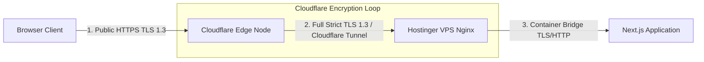

# SSL/TLS Security, Cloudflare Tunnel & Header Policy

## 1. SSL/TLS Architecture & Encryption Topology

The KUCET College Management System implements a dual-layer SSL/TLS encryption model. All transit data between browser clients, edge proxies, and application servers is encrypted end-to-end.



### Encryption Layer Standard

1. **Client to Cloudflare Edge**: Encrypted using Cloudflare Universal SSL certificates supporting TLS 1.2 and TLS 1.3 with ECC (Elliptic Curve Cryptography) keys.
2. **Cloudflare Edge to VPS Origin**: Encrypted under **Full (Strict)** SSL mode, validated via Let's Encrypt origin certificates or Cloudflare Zero-Trust Tunnels (`cloudflared`).

---

## 2. Certbot Automated Certificate Lifecycle

For direct origin HTTPS connections, Let's Encrypt TLS certificates are managed on the VPS via `certbot`.

### Certbot Automated Installation & Renewal

```bash
# Issue Let's Encrypt certificate for domain
certbot --nginx -d login.kucet.in

# Verify systemd auto-renewal timer status
systemctl status certbot.timer
```

### Renewal Policy

Certificates automatically renew when within 30 days of expiration. The systemd timer (`certbot.timer`) runs twice daily and restarts Nginx upon successful certificate issuance.

---

## 3. Cloudflare Tunnel Architecture (`cloudflared`)

To completely isolate the production VPS from public IP scanning and DDoS attacks, the infrastructure supports Cloudflare Zero-Trust Tunnels.

```mermaid
flowchart TD
    Client[Public Web Client] --> DNS[DNS: login.kucet.in]
    DNS --> CFE[Cloudflare Edge Network]
    
    subgraph Hostinger VPS (No Open Inbound Ports Required)
        CFE <===>|Outbound WireGuard/QUIC Tunnel| Daemon[cloudflared daemon]
        Daemon -->|Local Proxy http://localhost:80| Nginx[Nginx Proxy Container]
    end
```

### Tunnel Configuration (`/etc/cloudflared/config.yml`)

```yaml
tunnel: <YOUR-TUNNEL-UUID>
credentials-file: /root/.cloudflared/<YOUR-TUNNEL-UUID>.json

ingress:
  - hostname: login.kucet.in
    service: http://localhost:80
  - service: http_status:404
```

---

## 4. Production Security Headers Policy

To protect institutional users against Cross-Site Scripting (XSS), Clickjacking, and MIME-sniffing vulnerabilities, the following HTTP security headers are enforced via Nginx and Next.js [`next.config.js`](file:///D:/User/Desktop/CMS/next.config.js):

### Security Headers Specification

| HTTP Security Header | Configured Value | Protection Objective |
| :--- | :--- | :--- |
| **Strict-Transport-Security** | `max-age=31536000; includeSubDomains; preload` | Forces browsers to strictly use HTTPS connections for 1 year. |
| **X-Frame-Options** | `SAMEORIGIN` | Blocks framing attacks (Clickjacking) on external sites. |
| **X-Content-Type-Options** | `nosniff` | Prevents browsers from MIME-sniffing static file uploads. |
| **X-XSS-Protection** | `1; mode=block` | Enables legacy browser XSS filtering defense. |
| **Referrer-Policy** | `strict-origin-when-cross-origin` | Protects administrative URL parameter privacy on external links. |
| **Permissions-Policy** | `camera=(), microphone=(), geolocation=()` | Disables unauthorized hardware access APIs. |

### Nginx Header Implementation Snippet

```nginx
# Global Nginx Security Headers
add_header X-Frame-Options "SAMEORIGIN" always;
add_header X-XSS-Protection "1; mode=block" always;
add_header X-Content-Type-Options "nosniff" always;
add_header Referrer-Policy "strict-origin-when-cross-origin" always;
add_header Strict-Transport-Security "max-age=31536000; includeSubDomains; preload" always;
```

---

## Cross-References

* [Self-Hosted VPS Production Setup](./vps.md)
* [Nginx Reverse Proxy Configuration](./nginx.md)
* [Render PaaS Staging Deployment](./render.md)
* [Common Runtime & Build Errors Catalog](../troubleshooting/common-errors.md)
