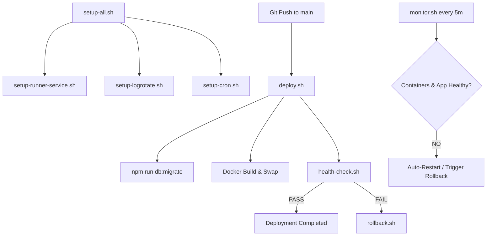

# Self-Hosted VPS Production Setup & Autonomous Infrastructure

## 1. Hardware Topology & VPS Specification

The production instance of the KUCET College Management System is hosted on a dedicated Hostinger KVM 2 Virtual Private Server located in the Mumbai Data Center.

| Resource Dimension | Provisioned Specification | Operational Purpose |
| :--- | :--- | :--- |
| **Compute** | 2 vCPU (Intel Xeon / AMD EPYC) | Application server threads & PDF generation |
| **Memory** | 8GB Physical RAM | Node.js heap, MySQL buffer pool, Redis cache |
| **Swap Space** | 4GB Dedicated Swap (`/swapfile`) | OOM protection during Next.js builds & PDF exports |
| **Storage** | 100GB NVMe Storage | Host operating system & persistent media storage |
| **Data Center** | Mumbai, India (ap-south-1) | Low latency (<30ms) for local student access |
| **Operating System** | Ubuntu 24.04 LTS (64-bit) | Production Linux operating system |

```mermaid
flowchart TD
    Internet[Internet / Cloudflare Edge] --> UFW[Host Firewall UFW :80/:443]
    
    subgraph Hostinger KVM 2 VPS (Ubuntu 24.04 LTS)
        UFW --> NginxContainer[kucet-cms-proxy :80]
        
        subgraph Docker Bridge Network (kucet_network)
            NginxContainer --> AppContainer[kucet-cms-app :3000]
            AppContainer --> DBContainer[kucet-cms-db :3306]
            AppContainer --> RedisContainer[kucet-cms-redis :6379]
        end
        
        subgraph Persistent VPS Host Disk
            DBContainer --> HostDB[(/var/lib/mysql)]
            AppContainer --> HostUploads[(/var/www/kucet-storage)]
        end
        
        KumaContainer[kucet-cms-kuma :3001] -->|Health Probe| AppContainer
    end
```

---

## 2. OS Preparation & Base Environment Setup

### 2.1 Swap File Provisioning (Critical Requirement)

To prevent the Linux Out-Of-Memory (OOM) killer from terminating Node.js or MySQL during peak load, a 4GB swap space is initialized on the host filesystem:

```bash
fallocate -l 4G /swapfile
chmod 600 /swapfile
mkswap /swapfile
swapon /swapfile
echo '/swapfile none swap sw 0 0' | tee -a /etc/fstab
```

### 2.2 Host UFW Firewall Configuration

```bash
ufw default deny incoming
ufw default allow outgoing
ufw allow OpenSSH
ufw allow 80/tcp
ufw allow 443/tcp
ufw --force enable
```

---

## 3. Docker Compose Microservice Architecture

The application stack is orchestrated via [`DEPLOYMENT_PACKAGE/docker-compose.yml`](file:///D:/User/Desktop/CMS/DEPLOYMENT_PACKAGE/docker-compose.yml).

```yaml
version: '3.8'

services:
  app:
    image: kucet-cms:latest
    container_name: kucet-cms-app
    restart: always
    env_file: .env.production
    volumes:
      - /var/www/kucet-storage:/app/storage
      - /var/kucet-db-backup:/var/kucet-db-backup
    depends_on:
      db:
        condition: service_healthy
      redis:
        condition: service_healthy
    networks:
      - cms-network

  nginx:
    image: nginx:alpine
    container_name: kucet-cms-proxy
    restart: always
    ports:
      - "80:80"
      - "443:443"
    volumes:
      - ./DEPLOYMENT_PACKAGE/nginx/nginx.conf:/etc/nginx/nginx.conf:ro
      - /var/www/kucet-storage:/usr/share/nginx/html/storage:ro
    depends_on:
      - app
    networks:
      - kucet_network

  db:
    image: mysql:8.0
    container_name: kucet-cms-db
    restart: always
    environment:
      MYSQL_DATABASE: kucet_cms
      MYSQL_USER: kucet_user
    volumes:
      - mysql_data:/var/lib/mysql
      - ./DEPLOYMENT_PACKAGE/CONFIGS/mysql/kucet.cnf:/etc/mysql/conf.d/kucet.cnf:ro
    healthcheck:
      test: ["CMD", "mysqladmin", "ping", "-h", "localhost"]
      interval: 10s
      timeout: 5s
      retries: 5
    networks:
      - kucet_network

  redis:
    image: redis:7-alpine
    container_name: kucet-cms-redis
    restart: always
    command: redis-server --appendonly yes
    healthcheck:
      test: ["CMD", "redis-cli", "ping"]
      interval: 10s
      timeout: 5s
      retries: 5
    networks:
      - kucet_network

  kuma:
    image: louislam/uptime-kuma:1
    container_name: kucet-cms-kuma
    restart: always
    ports:
      - "3001:3001"
    volumes:
      - kuma_data:/app/data
    networks:
      - kucet_network

networks:
  kucet_network:
    driver: bridge

volumes:
  mysql_data:
  kuma_data:
```

---

## 4. Autonomous Deployment Scripts Framework

The system features an autonomous, self-healing deployment pipeline located in [`DEPLOYMENT_PACKAGE/SCRIPTS/`](file:///D:/User/Desktop/CMS/DEPLOYMENT_PACKAGE/SCRIPTS/).



### Core Autonomous Scripts Reference

| Script Name | Execution Trigger | Primary Operational Responsibility |
| :--- | :--- | :--- |
| [`setup-all.sh`](file:///D:/User/Desktop/CMS/DEPLOYMENT_PACKAGE/SCRIPTS/setup-all.sh) | One-time manual setup | Master setup orchestrator. Prepares directories, logrotate, runner, and cron jobs. |
| [`prepare-storage.sh`](file:///D:/User/Desktop/CMS/DEPLOYMENT_PACKAGE/SCRIPTS/prepare-storage.sh) | Pre-Deploy / Rollback | Safely initializes upload directories with least privilege for UID 1001 (no chmod 777). |
| [`deploy.sh`](file:///D:/User/Desktop/CMS/DEPLOYMENT_PACKAGE/SCRIPTS/deploy.sh) | GitHub Actions CI / Push | Executes git pull, Drizzle migrations, Docker build, container swap, and health validation. |
| [`health-check.sh`](file:///D:/User/Desktop/CMS/DEPLOYMENT_PACKAGE/SCRIPTS/health-check.sh) | Post-Deploy / Monitor | Executes 13-point PASS/FAIL diagnostic check on HTTP endpoints, DB, Redis, and disk memory. |
| [`rollback.sh`](file:///D:/User/Desktop/CMS/DEPLOYMENT_PACKAGE/SCRIPTS/rollback.sh) | Failed Deploy / Alert | Restores Git commit state, reinstalls node_modules, rebuilds container, and re-verifies health. |
| [`monitor.sh`](file:///D:/User/Desktop/CMS/DEPLOYMENT_PACKAGE/SCRIPTS/monitor.sh) | Cron (`*/5 * * * *`) | Self-healing daemon. Auto-restarts stopped containers/runners; triggers rollback on 3 fails. |
| [`boot-recovery.sh`](file:///D:/User/Desktop/CMS/DEPLOYMENT_PACKAGE/SCRIPTS/boot-recovery.sh) | Cron (`@reboot`) | Executes on host reboot. Waits for Docker daemon, launches stack, and checks health. |
| [`nightly-backup.sh`](file:///D:/User/Desktop/CMS/DEPLOYMENT_PACKAGE/SCRIPTS/nightly-backup.sh) | Cron (`30 2 * * *`) | Creates Gzip-compressed mysqldump database archive to `/var/kucet-db-backup` with SHA-256 checksums and 14-day retention pruning. |
| [`offsite-backup.sh`](file:///D:/User/Desktop/CMS/DEPLOYMENT_PACKAGE/SCRIPTS/offsite-backup.sh) | Cron (`0 4 * * *`) | Uses Rclone to sync local backups and asset uploads to Google Drive offsite vault. |

---

## 5. Automated System Master Installation

To initialize the autonomous deployment framework on a fresh VPS:

```bash
cd /var/www/kucet-cms
sudo bash DEPLOYMENT_PACKAGE/SCRIPTS/setup-all.sh
```

### Verification Command

```bash
# Verify system health output in JSON format
bash DEPLOYMENT_PACKAGE/SCRIPTS/health-check.sh --json
```

---

## Cross-References

* [Nginx Reverse Proxy Configuration](./nginx.md)
* [SSL/TLS Security & Domain Certificate Management](./ssl.md)
* [Self-Hosted VPS Storage Architecture](../storage/self-hosted-storage.md)
* [System Debugging Guide](../troubleshooting/debugging-guide.md)
