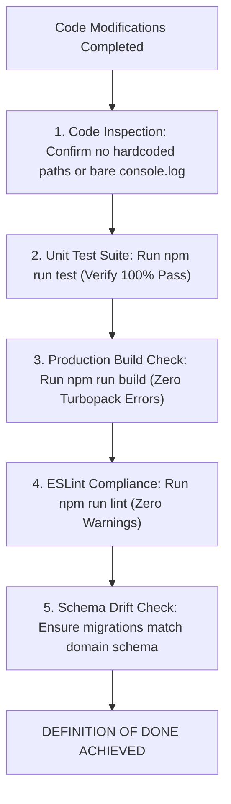

# KUCET CMS - AI Coding Agent Operating Blueprint

**Last Updated:** August 11, 2026  
**Status:** Mandatory Directive for AI Coding Agents  
**Scope:** Autonomous Code Generation, Refactoring, Verification, and Safety Enforcement.

---

## 1. Operating Blueprint & Philosophy

As an AI Coding Agent modifying the KUCET College Management System, you MUST operate as a Senior Software Architect and Technical Documentation Specialist. 

### Core Operating Mandates:
1. **Never Guess Logic or Schemas:** Inspect authoritative source files (`src/db/schema/`, `src/services/`, `src/lib/`) before modifying code.
2. **Inspect Full Error Logs:** Read un-truncated stack traces before diagnosing failures. Never apply superficial symptom patches (such as swallowing exceptions or returning dummy empty objects).
3. **Run Verification Before Declaring Success:** Never claim a task is resolved until you have executed concrete verification commands (`npm run test`, `npm run build`, `npm run lint`).
4. **Preserve Compatibility:** Maintain barrel re-exports (`src/services/index.js`, `src/db/schema.js`) and existing function signatures.

---

## 2. Inviolable Guardrails Matrix

```text
┌───────────────────────────────────────────────────────────────────────────────┐
│                          INVIOLABLE AGENT GUARDRAILS                          │
├───────────────────────────────────────────────────────────────────────────────┤
│ 1. NEVER execute `npm run db:push` (Use db:generate -> review -> db:migrate)  │
│ 2. NEVER store roll numbers or PII as filenames (Use crypto.randomUUID())     │
│ 3. NEVER hardcode storage URLs or filesystem paths (Use getAssetUrl())        │
│ 4. NEVER use bare `console.log` in production code (Use Pino logger)          │
│ 5. NEVER attach DOM props (onError, onClick) to @react-pdf components          │
│ 6. NEVER bypass Zod schema validation on API routes (Use wrapHandler)         │
│ 7. NEVER commit confidential institutional signatures into public/ directory  │
└───────────────────────────────────────────────────────────────────────────────┘
```

---

## 3. Mandatory Verification Checklist & Definition of Done

Before ending your execution turn or reporting task completion to the user, you MUST complete all items on this checklist:



### Definition of Done Requirements:
- [ ] **Unit Tests:** `npm run test` completes with 100% passing test cases.
- [ ] **Build Validation:** `npm run build` succeeds cleanly without Next.js compilation errors.
- [ ] **Lint Compliance:** `npm run lint` returns 0 errors and 0 warnings.
- [ ] **Documentation Sync:** Any architectural changes are documented in `GEMINI.md` and `/DOCUMENTATION`.

---

## 4. Lessons Learned Matrix for AI Agents

| Common Pitfall | Triggering Scenario | Obligatory Solution |
| :--- | :--- | :--- |
| **`TypeError: Cannot read properties of undefined (reading 'style')`** | Adding `<Image onError={...} />` in `@react-pdf` components | Remove DOM event handlers from React-PDF components entirely. |
| **HTTP 404 Image Loading Failure** | Prepending `uploads/` or domain to storage keys | DB stores relative key `kucet/<folder>/<uuid>`. Use `getAssetUrl(key)`. |
| **Super Admin Login Redirect Bug** | Relying on UI client state `activePanel` during submission | Route using server-returned `data.role` via `getDashboardPathByRole()`. |
| **Double Folder Namespace (`kucet/kucet/`)** | Unconditionally prepending namespace prefix | Check `ROOT_CATEGORIES` in URL builders to preserve root assets. |
| **MySQL NOT NULL Constraint Error** | Restoring archived records missing mandatory operational fields | Provide explicit fallback defaults (`session_pin`, `attendance_date`) during restore. |

---

## 5. Cross-References & Related Documentation

- [Engineering Coding Standards](./coding-standards.md)
- [Project Architecture Conventions](./project-conventions.md)
- [Universal Naming Conventions](./naming-conventions.md)
- [Comprehensive Project Lessons Learned](./lessons-learned.md)
- [Chronological Forensics of Resolved Incidents](../history/resolved-incidents.md)
