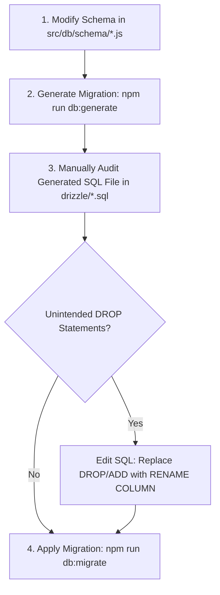

# KUCET CMS - Engineering Coding Standards

**Last Updated:** August 11, 2026  
**Status:** Mandatory Engineering Standard  
**Scope:** Frontend (React 19 / Next.js 16), Backend (Node.js / Next.js App Router API Routes), Database (Drizzle ORM), and Infrastructure Scripts.

---

## 1. Core Engineering Principles

All source code written for the KUCET College Management System must strictly adhere to the following principles:

1. **Zero-Trust Input Validation:** Never trust client-supplied input or raw external data. Every API boundary must validate request payloads using strict Zod schemas inside `wrapHandler`.
2. **Defensive Architecture:** Handle edge cases (null values, missing properties, network failures, corrupt database records) explicitly without throwing unhandled runtime exceptions.
3. **Immutability & Pure Functions:** Avoid mutating state or parameter objects directly. Prefer functional transformations (`map`, `filter`, `reduce`) and spread operators (`...`).
4. **Fail-Fast & Graceful Degradation:** Detect non-recoverable errors early while ensuring client user experience degrades gracefully without white-screen crashes.
5. **Backwards Compatibility:** Preserve legacy import paths and database column compatibility using barrel exports (`src/services/index.js`, `src/db/schema.js`) and snake_case aliases.

---

## 2. JavaScript / TypeScript Code Style

- **ECMAScript Version:** ES2024 / ES6+ features (`async/await`, destructuring, optional chaining `?.`, nullish coalescing `??`).
- **Module Syntax:** Standard ES Modules (`import` / `export`). CommonJS (`require`) is restricted strictly to root node utility scripts.
- **Strict Equality:** Always use `===` and `!==`. Loose equality (`==` or `!=`) is strictly prohibited.
- **Type Safety & JSDoc Annotations:** All service functions and complex utility functions must include structured JSDoc comments defining parameter types, return structures, and possible thrown errors:

```javascript
/**
 * Resolves the operational student profile by roll number.
 * 
 * @param {string} rollNo - Institutional student roll number (e.g., '24KUEC001').
 * @param {Object} [options={}] - Query options.
 * @param {boolean} [options.includeArchived=false] - Whether to search archival storage if absent in active registry.
 * @returns {Promise<Object|null>} Student record object or null if not found.
 * @throws {DatabaseError} Throws if database query fails.
 */
export async function getStudentByRollNo(rollNo, options = {}) {
  // Implementation...
}
```

---

## 3. React 19 & Next.js 16 Component Standards

### A. App Router Architecture
- **Server Components by Default:** Keep components as React Server Components (RSC) unless interactivity (event listeners, state, hooks) is explicitly required.
- **Client Component Directive:** Directives must appear at the very top of the file: `'use client';`.
- **Dynamic searchParams Handling:** In Next.js 16, `searchParams` passed to Page components is a Promise and MUST be unwrapped using `use()` or `await searchParams` before accessing properties:

```javascript
// Next.js 16 Page Component
export default async function StudentPage({ searchParams }) {
  const params = await searchParams;
  const tab = params.tab ?? 'overview';
  return <StudentTabViewer currentTab={tab} />;
}
```

### B. Hooks Safety & State Scoping
- Custom hooks must reside in `src/hooks/` and follow the `use<Feature>` naming convention.
- Always include proper dependency arrays in `useEffect`, `useCallback`, and `useMemo` to avoid infinite re-renders or stale closures.
- Use `useOptimistic` for instant UI updates during high-frequency user actions (e.g., attendance toggle).

### C. PDF Component Invariant (`@react-pdf/renderer`)
- **CRITICAL:** React components rendered via `@react-pdf/renderer` (`<Document>`, `<Page>`, `<View>`, `<Text>`, `<Image>`) execute in a server-side non-DOM environment.
- **Forbidden Props:** Never attach HTML DOM event handlers (`onClick`, `onError`, `onLoad`) or HTML-specific props (`alt`, `className`, `style` as string) to `@react-pdf` components. Passing `onError={(e) => e.currentTarget.style.display = 'none'}` causes a fatal `TypeError: Cannot read properties of undefined (reading 'style')` crash.

```javascript
// INCORRECT (Crashes PDF Engine)
<Image src={logoUrl} onError={(e) => { e.currentTarget.style.display = 'none'; }} />

// CORRECT (Safe PDF Rendering)
<Image src={logoUrl} style={styles.logo} />
```

---

## 4. Edge Middleware Header Handling & Cookie Buffering Rules

### A. Raw `Set-Cookie` String Array Buffering Invariant
In Edge middleware (`src/proxy.js`), multi-cookie mutations or header copies MUST be accumulated inside a raw JavaScript string array (`let newCookiesToSet = []`) and explicitly appended via `response.headers.append('set-cookie', cookieStr)`.

- **Prohibition:** NEVER iterate over `Headers` (e.g., `Headers.forEach`) or rely on header getter methods (`getSetCookie()`) to copy or forward cookie headers across middleware responses or redirects.
- **Rationale:** Next.js / Edge header getters automatically join multi-value headers using commas (`Set-Cookie: cookieA=1, cookieB=2`), which corrupts HTTP `Set-Cookie` formatting in client browsers.

```javascript
// CORRECT Edge Cookie Buffering Strategy
let newCookiesToSet = [];

allCookies.forEach(cookieStr => {
  response.headers.append('set-cookie', cookieStr);
  newCookiesToSet.push(cookieStr);
});

// Appending to 303 Redirect Responses
newCookiesToSet.forEach(cookieStr => {
  redirectResponse.headers.append('set-cookie', cookieStr);
});
```

### B. Explicit HTTP 1970 Cookie Expiration
When deleting cookies on logout or invalidating stale credentials, explicitly issue expiration headers with `Expires=Thu, 01 Jan 1970 00:00:00 GMT` for all associated domain cookies (`*_auth`, `*_logged_in`, `*_refresh_token`, `*_session_id`).

---

## 5. High-Frequency In-Memory Caching Rules

Functions invoked frequently across middleware or multiple API requests (such as `getCurrentCalendarSession()`) MUST implement process-level in-memory caching to protect database performance:

1. **Explicit Time-To-Live (TTL):** Define a clear cache expiration constant (`CACHE_TTL = 1000 * 60 * 5`).
2. **Timestamp Verification:** Check `nowTime - cacheTimestamp < CACHE_TTL` prior to executing database queries.
3. **Graceful Fallback:** Update cache variables on query completion or nullify on error.

```javascript
let cachedSession = null;
let cacheTimestamp = 0;
const CACHE_TTL = 1000 * 60 * 5; // 5 minutes

export async function getCurrentCalendarSession() {
  const nowTime = Date.now();
  if (cachedSession && (nowTime - cacheTimestamp < CACHE_TTL)) {
    return cachedSession;
  }
  
  const session = await fetchSessionFromDatabase();
  cachedSession = session;
  cacheTimestamp = nowTime;
  return cachedSession;
}
```

---

## 6. Universal Naming Conventions Summary

| Category | Convention | Examples |
| :--- | :--- | :--- |
| **Variables & Functions** | `camelCase` | `studentProfile`, `calculateCondonationRisk()` |
| **Constants & Enums** | `UPPER_SNAKE_CASE` | `STORAGE_FOLDERS`, `MAX_UPLOAD_SIZE_MB` |
| **React Components** | `PascalCase` | `StudentHistoryCard.js`, `AttendanceSheet.js` |
| **API Routes & URLs** | `kebab-case` | `/api/clerk/admission/student-management` |
| **SQL Tables & Columns** | `snake_case` | `student_personal_details`, `fee_reimbursement` |
| **Storage Keys** | Canonical relative key | `requests/pfp/7a59662b-8a4e.webp` |

*For complete details, see [naming-conventions.md](./naming-conventions.md).*

---

## 7. Drizzle ORM Schema & Migration Rules

### A. Modular Schema Design
Database schemas are modularized by domain inside `src/db/schema/`:
- `identity.js`: User credentials, roles, sessions, OTP codes.
- `academic.js`: Semesters, subjects, timetables, calendar.
- `registry.js`: Student profiles, personal details, admission drafts.
- `operations.js`: Attendance records, internal evaluation marks.
- `finance.js`: Payments, scholarships, idempotency guards.
- `archive.js`: Historical student registries, closed logs.
- `security.js`: Audit logs, security events, push subscriptions.

The barrel file `src/db/schema.js` re-exports all domain schemas to guarantee 100% backward compatibility across legacy imports.

### B. Inviolable Migration Workflow (Data Loss Prevention)

> [!CAUTION]
> **NEVER USE `npm run db:push` IN DEVELOPMENT OR PRODUCTION!**  
> `db:push` bypasses version control and can drop non-empty tables or columns without prompt, leading to permanent institutional data loss.

#### Safe 4-Step Database Migration Standard:



1. **Modify Domain Schema:** Edit column definitions or tables inside `src/db/schema/<domain>.js`.
2. **Generate Migration SQL:** Execute `npm run db:generate`. Drizzle Kit outputs a timestamped SQL file in `drizzle/` (e.g., `0011_curious_terrax.sql`).
3. **Manual SQL Audit:** Inspect the generated `.sql` file. Verify that column modifications do NOT contain destructive `DROP TABLE` or `DROP COLUMN` commands. Convert column renames from `DROP COLUMN ... ADD COLUMN` to `RENAME COLUMN`.
4. **Execute Safe Migration:** Apply the changes to the database environment using `npm run db:migrate`.

---

## 8. Logging Standards (Pino Logger)

- **Centralized Logger:** All logging MUST use the structured Pino logger instance imported from `@/lib/logger` (or `src/lib/logger.js`).
- **Ban on Bare `console.log`:** Plain `console.log`, `console.error`, and `console.warn` are prohibited in production server code and API routes. Use `logger.info()`, `logger.error()`, or `logger.warn()`.

```javascript
import logger from '@/lib/logger';

// INCORRECT
console.log('User logged in:', studentId);

// CORRECT
logger.info({ studentId, role: 'student', action: 'LOGIN_SUCCESS' }, 'User authenticated successfully');

// CORRECT Error Logging (Always pass the Error object as first param or in context)
try {
  await processPayment(payload);
} catch (error) {
  logger.error({ error, studentId: payload.studentId, amount: payload.amount }, 'Payment processing failed');
}
```

---

## 9. Error Handling Patterns

### A. Centralized API Handler Wrapper (`wrapHandler`)
All API endpoints under `src/app/api/` should be wrapped with `wrapHandler` to standardize zero-trust Zod schema validation, authentication checks, telemetry, and error responses.

### B. Safe JSON Parsing (`safeJsonParse`)
Never invoke raw `JSON.parse()` on untrusted input, API responses, or stored database metadata. Use `safeJsonParse()` to prevent unhandled runtime exceptions.

### C. Standardized API Response Payload Format

#### Success Response (HTTP 200 / 201):
```json
{
  "success": true,
  "data": {
    "rollNo": "24KUEC001",
    "name": "Jane Doe"
  }
}
```

#### Error Response (HTTP 400 / 401 / 403 / 404 / 409 / 500):
```json
{
  "success": false,
  "error": "Human readable error description",
  "code": "INVALID_INPUT_PAYLOAD"
}
```

---

## 10. Cross-References & Related Documentation

- [Project Architecture Conventions](./project-conventions.md)
- [Universal Naming Conventions](./naming-conventions.md)
- [Comprehensive Project Lessons Learned](./lessons-learned.md)
- [AI Coding Agent Blueprint & Guidelines](./ai-agent-guide.md)
- [Chronological Forensics of Resolved Incidents](../history/resolved-incidents.md#1-session-205-forensic-resolution-of-cookies-remain-but-app-shows-home-screen)
