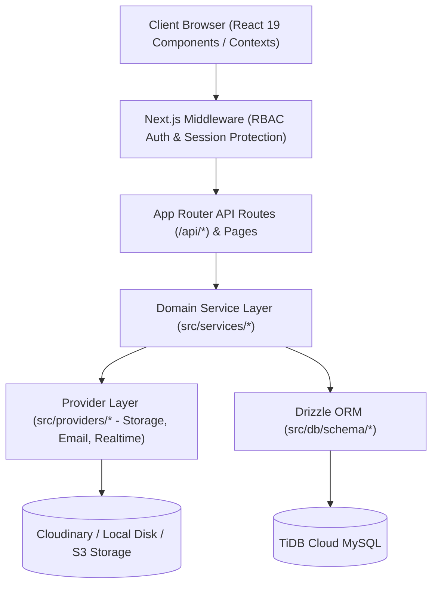

# KUCET CMS - Project Architecture Conventions

**Last Updated:** August 11, 2026  
**Status:** Mandatory Engineering Standard  
**Scope:** Folder Structure, Domain Service Organization (DDD), State Management Scoping, and API Payload Standards.

---

## 1. High-Level Architectural Pattern

The KUCET College Management System is designed around **Domain-Driven Design (DDD)** and clean layered architecture within Next.js 16 (App Router) and React 19.



---

## 2. Directory Layout Rules

The source code directory structure follows strict modular conventions:

```text
CMS/
├── DEPLOYMENT_PACKAGE/        # VPS Packaging, Docker Compose, Nginx, & Monitoring scripts
├── DOCUMENTATION/             # System documentation knowledge base
├── drizzle/                   # SQL migration files generated by Drizzle Kit (0000_... to 0011_...)
├── public/                    # Static public web assets (favicon, manifest, root PWA files)
├── scripts/                   # System automation, load testing, & storage migration scripts
├── src/
│   ├── app/                   # Next.js App Router (Pages, Layouts, API Routes)
│   │   ├── (auth)/            # Auth flow routes (login, forgot-password)
│   │   ├── admin/             # Super Admin console pages
│   │   ├── api/               # Server API routes (/api/admin/*, /api/clerk/*, /api/student/*)
│   │   ├── clerk/             # Clerk & HOD console pages
│   │   └── student/           # Student portal pages
│   ├── components/            # React UI components grouped by domain/role
│   │   ├── admin/             # Super Admin components
│   │   ├── clerk/             # Clerk & HOD components
│   │   ├── common/            # Shared reusable UI elements (Modals, Buttons, Badges)
│   │   ├── pdf/               # Server-rendered PDF certificate components (@react-pdf)
│   │   └── student/           # Student portal components
│   ├── db/                    # Drizzle ORM database client & domain schemas
│   │   ├── schema/            # Modular domain schema definitions
│   │   ├── schema.js          # Barrel re-export file for schema backward compatibility
│   │   └── index.js           # Database connection initialization
│   ├── hooks/                 # Reusable custom React hooks (useSecurityEvents, etc.)
│   ├── lib/                   # Utility libraries, helpers, clock, security, asset builders
│   ├── providers/             # Strategy provider implementations (Storage, Email, Realtime)
│   └── services/              # Domain-Driven Service layer
│       ├── academic/          # Faculty workload & timetable domain logic
│       ├── archive/           # Long-term academic data archival & restoration engine
│       ├── finance/           # Fee transactions, scholarships, & idempotency service
│       ├── identity/          # Student registry, profile, certificates, & device services
│       ├── institution/       # Confidential institutional asset management service
│       ├── security/          # Auth, session management, validation, & push notifications
│       ├── shared/            # Operational health & system diagnostics service
│       └── index.js           # Barrel export exposing unified service API
└── tests/                     # Unit and E2E testing suites (Vitest & Playwright)
```

---

## 3. Domain Service Structuring (DDD)

Business logic MUST NOT be embedded inside React components or API route handlers. All core operations reside in single-responsibility Domain Services under `src/services/`:

### A. Domain Service Taxonomy

1. **`identity/` (User & Student Domain)**
   - `StudentService.js`: Student account upsertion, promotion, activation, and roster queries.
   - `StudentProfileService.js`: Profile details, personal data updates, address parsing.
   - `StudentCertificateService.js`: Certificate request validation, fee calculation, issue tracking.
   - `DeviceService.js`: Remote device fingerprinting, session tracking, location heuristics.
2. **`academic/` (Faculty & Curriculum Domain)**
   - `FacultyService.js`: Faculty workload tracking, subject allocation, atomic timetable updates.
3. **`finance/` (Financial Oversight Domain)**
   - `FinanceService.js`: Fee transaction recording, ledger auditing, payment verification.
   - `ScholarshipService.js`: Government reimbursement sanctions, batch promotions.
   - `IdempotencyService.js`: Cryptographic financial lock keys preventing duplicate payments.
4. **`archive/` (Data Lifecycle & Restoration Domain)**
   - `ArchiveService.js`: Offloading closed semesters and graduated records into `archive_*` tables.
   - `ArchiveMediaService.js`: Archival asset promotion across storage namespaces.
   - `ArchiveRestoreService.js`: Zero-data-loss restoration engine for Super Admin console.
   - `OrphanMediaService.js`: Scanning and purging orphaned storage files.
   - `BackupService.js`: Nightly database/asset backup execution and retention pruning.
   - `DisasterRecoveryService.js`: Integrity validation and domain cache rebuilding.
5. **`security/` (Authentication & Integrity Domain)**
   - `SecurityService.js`: Session creation, remote revocation, OTP hashing, audit logging.
   - `ValidationService.js`: Deletion integrity validation against active foreign references.
   - `PushNotificationService.js`: Web Push API dispatching to subscribed devices.
6. **`institution/` (Confidential Asset Domain)**
   - `InstitutionAssetService.js`: Resolution and multi-candidate buffering for official seals, signatures, and logos.
7. **`shared/` (Diagnostics & System Domain)**
   - `HealthService.js`: 13-point operational health probe for databases, queues, and storage.

### B. Barrel Export Invariant (`src/services/index.js`)
To maintain clean imports and prevent path fragility, all domain services are exported via `src/services/index.js`. Root re-exports guarantee backward compatibility for legacy service references.

---

## 4. State Management Scoping

To keep the application fast and predictable, state is scoped across four specific tiers:

```text
┌─────────────────────────────────────────────────────────────────────────┐
│ 1. URL Segments: Resource Identification (/student/requests/req-128)   │
├─────────────────────────────────────────────────────────────────────────┤
│ 2. SearchParams: UI Filters & Active Views (?tab=config&page=2&q=ecet)  │
├─────────────────────────────────────────────────────────────────────────┤
│ 3. React Context: Global Auth & Session (StudentContext, ClerkContext) │
├─────────────────────────────────────────────────────────────────────────┤
│ 4. Local State: Transient Component Interaction (form inputs, modals)   │
└─────────────────────────────────────────────────────────────────────────┘
```

1. **URL Segments:** Used for canonical resource routing (e.g., `/clerk/admission/students/[rollno]`).
2. **SearchParams (`useSearchParams`):** Used for filter states, sorting, active sub-tabs, and pagination. Enables browser forward/back navigation, deep-linking, and bookmarking without re-fetching full HTML pages.
3. **React Context (`StudentContext`, `AdminContext`, `ClerkContext`):** Reserved exclusively for authenticated user session data, active role privileges, global notifications, and real-time broadcast event listeners.
4. **Local React Component State (`useState`, `useOptimistic`, `useReducer`):** Used for temporary UI interactions, form input drafts, modal visibility toggles, and instant UI feedback.

---

## 5. API Response Payload Normalization

All API route endpoints under `src/app/api/` return standardized JSON responses to ensure seamless client-side parsing.

### A. Normalized Success Response Structure
When an operation succeeds, the HTTP status code is set to `200 OK` (or `201 Created`) with the payload envelope:

```json
{
  "success": true,
  "data": {
    "rollNo": "24KUEC001",
    "fullName": "K. Rahul",
    "branch": "ECE",
    "academicYear": 2
  },
  "meta": {
    "timestamp": "2026-08-11T18:30:00.000Z",
    "requestId": "req_88f91a2c"
  }
}
```

### B. Normalized Error Response Structure
When an operation fails (due to input validation, authorization failure, or runtime error), the appropriate HTTP status code (400, 401, 403, 404, 409, 500) is returned with:

```json
{
  "success": false,
  "error": "The submitted transaction reference number (UTR) has already been processed.",
  "code": "DUPLICATE_TRANSACTION_REF",
  "details": null
}
```

---

## 6. Cross-References & Related Documentation

- [Engineering Coding Standards](./coding-standards.md)
- [UI Design System & Component Guidelines](./ui-guidelines.md)
- [Universal Naming Conventions](./naming-conventions.md)
- [System Architectural Decision Records (ADRs)](../history/architectural-decisions.md)
