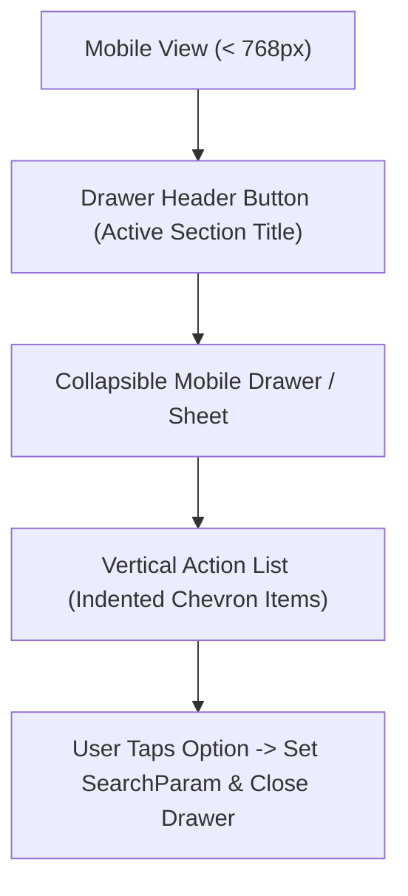

# KUCET CMS - UI Design System & Component Guidelines

**Last Updated:** August 11, 2026  
**Status:** Mandatory Engineering Standard  
**Scope:** Frontend Components, Styling, Accessibility, Mobile Navigation, and CSS Visual Effects.

---

## 1. Design System Philosophy

The KUCET College Management System delivers a modern, clean, mobile-first administrative user interface. The UI design prioritizes:
- **High Information Density with Visual Clarity:** Clean data tables, status badges, and uncluttered cards.
- **Mobile-First Responsiveness:** Seamless usability on devices ranging from smartphones to 4K displays.
- **Institutional Aesthetics:** Formal, trustworthy color schemes (Kakatiya University Navy & Gold accents).
- **Consistency:** Unified interaction patterns across Super Admin, HOD, Clerk, and Student portals.

---

## 2. Tailwind CSS 4 Theming & Color Tokens

The application uses **Tailwind CSS 4** for styling. Core institutional color semantics are defined as follows:

| Category | Tailwind Classes / Hex | Usage |
| :--- | :--- | :--- |
| **Primary Brand** | `bg-indigo-600` (`#4F46E5`), `text-indigo-600` | Primary buttons, active tabs, interactive icons |
| **Institutional Navy** | `bg-slate-900` (`#0F172A`), `text-slate-900` | Navigation sidebars, headers, major cards |
| **Accent Gold** | `bg-amber-500` (`#F59E0B`), `text-amber-600` | Fee status highlights, pending badges, alerts |
| **Success Green** | `bg-emerald-600` (`#059669`), `text-emerald-700` | Attendance present status, verified badges |
| **Danger Red** | `bg-rose-600` (`#E11D48`), `text-rose-700` | Attendance absent status, critical error alerts |
| **Background Neutral** | `bg-slate-50` (`#F8FAFC`), `dark:bg-slate-950` | Global page background |
| **Surface Neutral** | `bg-white`, `dark:bg-slate-900` | Main content cards, modals, tables |

---

## 3. Mobile-First Drawer Navigation Architecture

### A. Eradication of Horizontal Scroll Tabs
Legacy mobile layouts that relied on horizontal scrolling tab bars (`overflow-x-auto whitespace-nowrap`) have been completely deprecated. On mobile viewports, multi-tab modules (such as HOD Dashboard and Admin Infrastructure) MUST utilize dedicated **Mobile Section Drawers**:



### B. Navigation Components
- **Primary Sidebar (`Sidebar.js` / `AdminSidebar.js`):** Responsive collapsible sidebar with chevron expand/collapse transitions.
- **Mobile Header (`Header-MobileView`):** Integrated across all routes including public utility pages (`/dev`, `/verify`, `/reset-password`).

---

## 4. Accessibility Standards (WCAG 2.1 AA)

All user interface components must strictly satisfy WCAG 2.1 Level AA compliance:

1. **Semantic HTML Landmarks:** Every page layout must structure content using proper HTML5 landmark regions:
   - `<header>`: Top navigation bar and user profile dropdown.
   - `<nav>`: Primary sidebar and section drawers.
   - `<main>`: Core page content region (`id="main-content"`).
   - `<footer>`: Public legal links (Privacy Policy, Terms, Cookie Notice).
2. **Keyboard Focus Indicators:** All interactive elements (`<button>`, `<a>`, `<input>`) must feature visible focus rings:

```html
<button className="px-4 py-2 bg-indigo-600 text-white rounded-lg focus:outline-none focus:ring-2 focus:ring-indigo-500 focus:ring-offset-2">
  Submit Request
</button>
```

3. **ARIA Labels & Controls:** Non-text buttons (icon buttons, drawer toggles) MUST include explicit `aria-label` properties. Expandable drawers must state `aria-expanded={isOpen}`.
4. **Color Contrast:** Text-to-background contrast ratios must meet or exceed `4.5:1` for standard body text and `3.0:1` for large headings.

---

## 5. Responsive Spacing & Layout Protection Rules

### A. The Strict `100vw` Layout Prohibition Rule

> [!WARNING]
> **NEVER USE `w-screen` OR `100vw` INSIDE FLEX CONTAINER LAYOUTS!**  
> Using `100vw` forces the container to take the full width of the browser viewport including the vertical scrollbar width, causing severe horizontal layout breakage and unwanted horizontal scrollbars on Windows/Linux browsers.

#### Responsive Width Alternatives:

```html
<!-- INCORRECT (Breaks Layout on Windows Chrome/Firefox) -->
<div className="w-[100vw] flex flex-col">...</div>

<!-- CORRECT (Adapts strictly to container bounds) -->
<div className="w-full max-w-7xl mx-auto px-4 sm:px-6 lg:px-8">...</div>
```

### B. Overflow Prevention
- Containers displaying data tables or large grids must wrap elements inside `overflow-x-auto` while parent page wrappers enforce `overflow-x-hidden`.
- Never use fixed minimum widths (`min-w-[1200px]`) directly on outer flex cards.

---

## 6. Receipt Cutout CSS Visuals

Financial transaction records (e.g., student payment history in `FeeTransactionHistory.js`) feature an authentic physical receipt visual aesthetic with a **zigzag / sawtooth perforated bottom border**:

### CSS Sawtooth Edge Visual Implementation Snippet:

```css
/* Perforated Sawtooth Bottom Edge for Receipt Components */
.receipt-cutout-bottom {
  position: relative;
  background-color: #ffffff;
}

.receipt-cutout-bottom::after {
  content: "";
  position: absolute;
  bottom: -10px;
  left: 0;
  right: 0;
  height: 10px;
  background: radial-gradient(circle, transparent, transparent 50%, #ffffff 50%, #ffffff 100%);
  background-size: 16px 20px;
  background-position: 0 -10px;
}
```

### Tailwind Component Example:

```javascript
export function ReceiptCard({ transaction }) {
  return (
    <div className="relative bg-white dark:bg-slate-900 p-6 rounded-t-xl shadow-md border-x border-t border-slate-200 dark:border-slate-800 receipt-cutout-bottom">
      <div className="flex justify-between items-center border-b pb-4 mb-4 border-dashed border-slate-300">
        <h3 className="font-bold text-slate-900 dark:text-white">OFFICIAL FEE RECEIPT</h3>
        <span className="font-mono text-xs text-slate-500">#{transaction.receiptNo}</span>
      </div>
      <div className="space-y-2 text-sm text-slate-700 dark:text-slate-300">
        <div className="flex justify-between"><span>Amount Paid:</span><span className="font-semibold text-emerald-600">₹{transaction.amount}</span></div>
        <div className="flex justify-between"><span>Payment Mode:</span><span>{transaction.paymentMode}</span></div>
        <div className="flex justify-between"><span>UTR / Ref No:</span><span className="font-mono">{transaction.utrNo}</span></div>
      </div>
    </div>
  );
}
```

---

## 7. Cross-References & Related Documentation

- [Engineering Coding Standards](./coding-standards.md)
- [Project Architecture Conventions](./project-conventions.md)
- [Universal Naming Conventions](./naming-conventions.md)
- [Comprehensive Project Lessons Learned](./lessons-learned.md)
