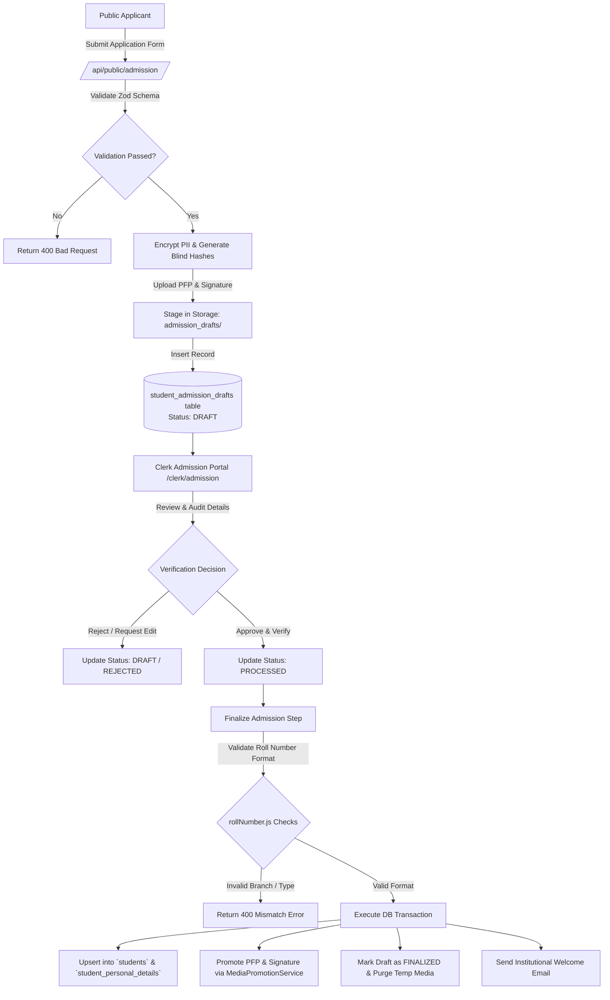
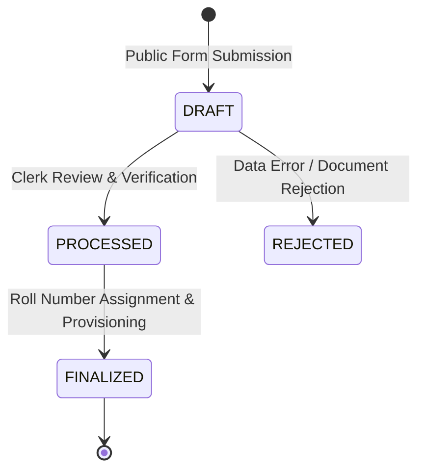
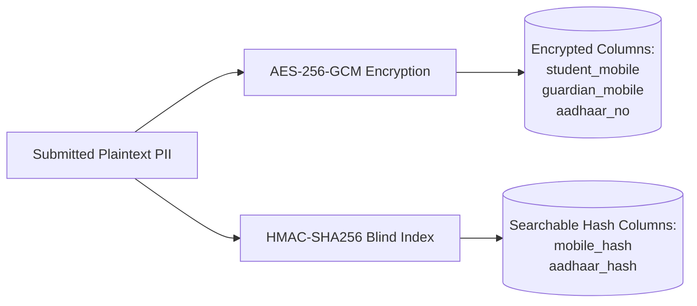

# Multi-Stage Admission System Documentation

## 1. Overview & Architecture

The **KUCET Multi-Stage Admission System** manages the entire lifecycle of student onboarding at Kakatiya University College of Engineering & Technology. It provides a secure public application portal, a multi-stage verification workflow for admission clerks, automated roll number generation according to institutional standards, and atomic database provisioning.

The system handles both **Regular B.Tech (TG EAPCET)** and **Lateral Entry B.Tech (TG ECET)** admissions, standardizing complex category allocations, SC sub-castes, EWS reservations, and sensitive Personally Identifiable Information (PII) encryption.



---

## 2. Public Application Form (`/admission`)

The public admission portal allows prospective students to submit their demographic, academic, and reservation details online without needing pre-existing authentication credentials.

### Key API Endpoint: `POST /api/public/admission`

- **Rate Limiting**: Enforces a strict rate limit of 5 requests per hour per IP (`getTieredKey(req, 'admission')`) to prevent spam and denial-of-service attempts.
- **Zero-Trust Validation**: Every incoming payload is validated using a comprehensive Zod schema (`admissionSchema`).
- **Data Policy Consent**: Mandatory boolean capture (`legal_consent: true`). Submissions without consent are rejected with HTTP 400.

### Input Validation & Sanitization Schema

| Field Name | Type / Format | Validation Rules & Constraints |
| :--- | :--- | :--- |
| `name` | String | Standardized uppercase, min 3 chars, letters/dots/spaces only |
| `admission_year` | String | Regex pattern `^\d{4}-\d{2,4}$` (e.g., `2025-2026`) |
| `entrance_exam` | Enum | `TG EAPCET`, `TG ECET`, `PGECET`, `Other` |
| `branch` | String | Department short code (`CSE`, `ECE`, `EEE`, `CSD`, `CIVIL`, `IT`, `MECH`) |
| `student_mobile` | String | Exactly 10 digits (digits extracted via regex `\D`) |
| `aadhaar_no` | String | Exactly 12 digits (optional/nullable) |
| `dob` | String | Date string format `YYYY-MM-DD` |
| `category` | String | Primary category (`OC`, `BC-A`, `BC-B`, `BC-C`, `BC-D`, `BC-E`, `SC`, `ST`, `EWS`) |
| `sub_caste` | String | Specific sub-caste enumeration (e.g., `SC-A`, `SC-B`, `SC-C`, `SC-D`, `Mundari`, etc.) |
| `inter_diploma_marks` | Numeric String | Float between `0` and `1000` |
| `fee_reimbursement` | Enum | `YES`, `NO`, `GOV` |
| `legal_consent` | Boolean | Must explicitly evaluate to `true` |

---

## 3. Draft Management & Clerk Review Pipeline

To ensure data integrity, public submissions are not placed directly into the active student registry. Instead, they follow a state machine pattern stored in the `student_admission_drafts` table.

### Draft Lifecycle States



1. **`DRAFT`**: The initial state upon public submission. Sensitive details are encrypted, blind indices are created, and assets are saved in temporary staging storage (`admission_drafts/pfp/` and `admission_drafts/signatures/`).
2. **`PROCESSED`**: The admission clerk inspects physical certificates (SSC memo, Intermediate/Diploma memo, Caste certificate, Income certificate) and marks the draft verified.
3. **`FINALIZED`**: The clerk assigns an institutional roll number and finalizes admission. The record is migrated to active student tables, and temporary draft storage is cleaned up.

### Clerk Management Features (`/clerk/admission`)

- **Bulk Import**: Allows admission clerks to upload CSV/Excel files containing draft records via `POST /api/clerk/admission/bulk-import`.
- **Search & Uniqueness Guard**: Generic anti-enumeration error messages (`"Please check your details and try again."`) prevent malicious users from checking if a mobile or Aadhaar number exists in the system.
- **Draft Correction**: Clerks can update any field in the draft via `PUT /api/clerk/admission/drafts/[id]` before finalization.

---

## 4. Alphanumeric Roll Number Generation Engine

KUCET follows a precise institutional roll number format implemented in `src/lib/rollNumber.js`. The format distinguishes between **Regular 4-Year B.Tech** and **3-Year Lateral Entry B.Tech (TG ECET)** students.

### Roll Number Structure & Patterns

```
Regular B.Tech (10 Characters):  [YY] 567 T [BB] [SS]
Lateral Entry  (11 Characters):  [YY] 567 T [BB] [SS] L   (or [YY]567[BB][SS]L)
```

- **`YY`**: 2-digit entry year (e.g., `22` for 2022, `25` for 2025).
- **`567`**: Kakatiya University institutional code for KUCET Warangal.
- **`T`**: Technical / Engineering Stream indicator suffix.
- **`BB`**: 2-digit Department / Branch Code.
- **`SS`**: 2-character Alphanumeric Serial Number (supports batches up to 1,296 students per branch, e.g., `01`..`99`, `A1`..`Z9`).
- **`L`**: Suffix designating TG ECET Lateral Entry.

### Branch Code Mapping (`branchCodes`)

| Branch Code | Department Name | Entrance Exam Qualified | Academic Duration |
| :---: | :--- | :--- | :--- |
| `09` | Computer Science & Engineering (CSE) | TG EAPCET / TG ECET | 4 Years (3 for Lateral) |
| `30` | Computer Science & Data Science (CSD) | TG EAPCET / TG ECET | 4 Years (3 for Lateral) |
| `15` | Electronics & Communication (ECE) | TG EAPCET / TG ECET | 4 Years (3 for Lateral) |
| `12` | Electrical & Electronics (EEE) | TG EAPCET / TG ECET | 4 Years (3 for Lateral) |
| `00` | Civil Engineering (CIVIL) | TG EAPCET / TG ECET | 4 Years (3 for Lateral) |
| `18` | Information Technology (IT) | TG EAPCET / TG ECET | 4 Years (3 for Lateral) |
| `03` | Mechanical Engineering (MECH) | TG EAPCET / TG ECET | 4 Years (3 for Lateral) |

### Batch Year Calculation Rules

The system automatically calculates student cohort batches using `getBatchFromRoll(rollNo)`:
- **Regular Entry**: `batchStart = 2000 + YY`, `batchEnd = batchStart + 4`. Cohort = `2022-2026`.
- **Lateral Entry (`L`)**: `batchStart = (2000 + YY) - 1`, `batchEnd = batchStart + 4`. Lateral entry students admitted in 2023 join the 2nd year of the 2022-2026 batch.

---

## 5. SC Sub-Castes & EWS Standardization

The KUCET admission module enforces government reservation guidelines for Telangana higher education institutions.

### SC Sub-Caste Categorization
To satisfy statutory reporting standards, the system mandates recording SC sub-castes (`SC-A`, `SC-B`, `SC-C`, `SC-D`). 
- In public and clerk forms, selecting category `SC` dynamically opens sub-caste inputs.
- Validated via `z.string().trim().max(100)` and standardized before entry into `student_admission_drafts.sub_caste` and `student_personal_details.sub_caste`.

### Economically Weaker Sections (EWS) Standardization
- General category applicants eligible for EWS reservation are flagged with `category = 'EWS'`.
- The allotment category (`seat_allotted_category`) preserves the exact seat quota under which the convener allotted the seat (e.g., `REG_EWS_OPEN`, `REG_BC_B_GIRLS`).
- Fee reimbursement eligibility (`fee_reimbursement: YES | NO | GOV`) is checked against income thresholds (up to ₹2,00,000 for SC/ST and ₹1,00,000/₹2,00,000 for EWS/BC depending on state notification).

---

## 6. PII Security, Consent & Encryption Architecture

Student data privacy is enforced through field-level encryption, blind indexing, and cryptographic consent recording.



### Cryptographic Security Controls
1. **AES-256-GCM Encryption**: Sensitive fields (`student_mobile`, `guardian_mobile`, `aadhaar_no`) are encrypted prior to storage in MySQL using the system encryption key (`ENCRYPTION_KEY`). Plaintext phone numbers or Aadhaar numbers are never stored in raw text.
2. **Blind Indexing (`hashForIndex`)**: To enable database lookups for uniqueness checks without decrypting all rows, the system creates deterministic HMAC-SHA256 hashes stored in `mobile_hash` and `aadhaar_hash`.
3. **Consent Timestamping**: The exact server timestamp of legal policy agreement is saved in `data_policy_consented_at` using `getNow()`.

---

## 7. Atomic Finalization & Student Provisioning

When an admission clerk finalizes a verified draft via `POST /api/clerk/admission/drafts/[id]/finalize`, the system executes an atomic transaction.

```javascript
// Source: src/app/api/clerk/admission/drafts/[id]/finalize/route.js
const result = await db.transaction(async (tx) => {
  // 1. Lock draft row for update
  const draft = await tx.select().from(studentAdmissionDrafts)
    .where(eq(studentAdmissionDrafts.id, id))
    .for('update');

  // 2. Validate roll number branch & admission type consistency
  const parsed = validateRollNo(rollNo);
  if (parsed.branch !== draft.branch) throw new Error('ROLL_BRANCH_MISMATCH');

  // 3. Upsert active student records
  const studentId = await StudentService.upsertStudent(studentData, clerkId, tx);

  // 4. Promote temporary draft assets to permanent storage
  await MediaPromotionService.promoteAdmissionMedia({ studentId, pfp: draft.pfp, signature: draft.signature }, tx);

  // 5. Update draft status & purge staging assets
  await tx.update(studentAdmissionDrafts)
    .set({ status: 'FINALIZED', pfp: null, signature: null })
    .where(eq(studentAdmissionDrafts.id, id));

  return { studentId, rollNo };
});
```

### Post-Finalization Automated Actions
- **Idempotency Guard**: Protects against double-submits via `idempotency-key` HTTP headers managed by `IdempotencyService`.
- **Welcome Email Dispatch**: Asynchronously sends an institutional onboarding email with login credentials (default password set to Date of Birth `YYYY-MM-DD`).
- **Audit Logging**: Inserts an immutable log entry into audit tables (`action: 'FINALIZE_ADMISSION'`).

---

## 8. Cross-References

- Database Schemas: [03_DATABASE.md](../database/03_DATABASE.md)
- Storage Lifecycle & Media Promotion: [requests.md](./requests.md)
- Institutional Certificates: [certificates.md](./certificates.md)
- Identity & User Management: [02_AUTHENTICATION.md](../authentication/02_AUTHENTICATION.md)
