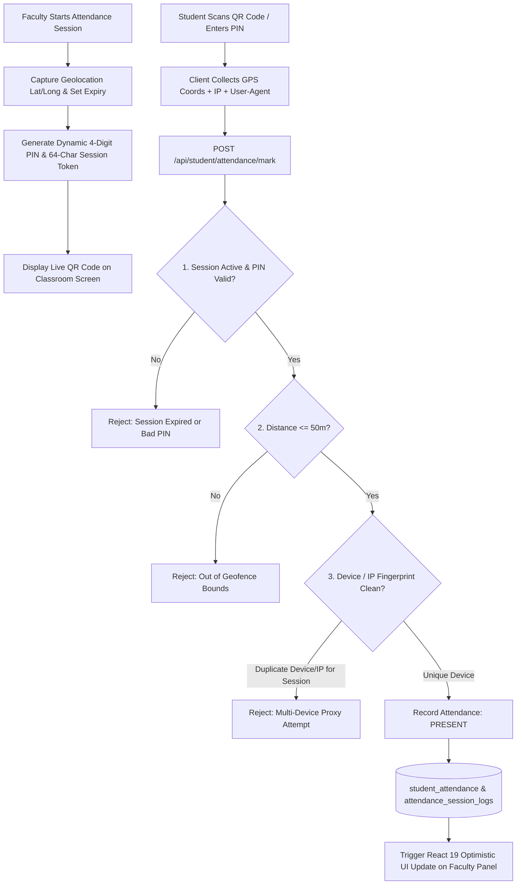
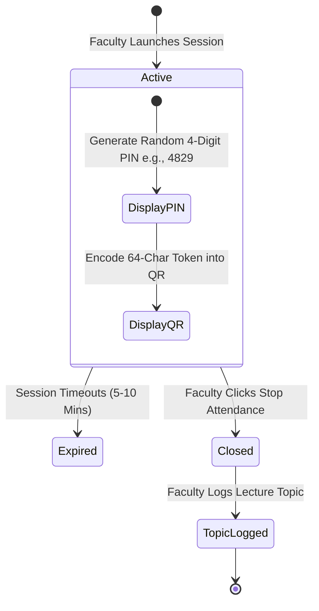

# Proxy-Free Attendance System Documentation

## 1. Overview & Security Philosophy

The **KUCET Proxy-Free Attendance System** eliminates traditional roll-call proxy attendance through multi-factor cryptographic and physical verification. It enforces spatial geofencing, temporal dynamic PINs, encrypted QR token scanning, device fingerprinting, and IP address logging.

Faculty members start live attendance sessions from their mobile or desktop devices. Students within a 50-meter campus geofence scan a dynamic QR code or submit a 4-digit PIN while their device fingerprint and location are verified in real time.



---

## 2. 50m GPS Geofence Verification Engine

To ensure students are physically present inside the designated lecture hall or lab, the system computes the spatial distance between the faculty member's device location and the student's submission location using the **Haversine Distance Formula**.

### Spatial Distance Calculation Algorithm

```javascript
/**
 * Computes surface distance between two WGS84 coordinates in meters
 */
function haversineDistance(lat1, lon1, lat2, lon2) {
  const R = 6371000; // Earth's radius in meters
  const dLat = (lat2 - lat1) * (Math.PI / 180);
  const dLon = (lon2 - lon1) * (Math.PI / 180);
  
  const a = 
    Math.sin(dLat / 2) * Math.sin(dLat / 2) +
    Math.cos(lat1 * (Math.PI / 180)) * Math.cos(lat2 * (Math.PI / 180)) * 
    Math.sin(dLon / 2) * Math.sin(dLon / 2);
    
  const c = 2 * Math.atan2(Math.sqrt(a), Math.sqrt(1 - a));
  return R * c;
}
```

### Geofence Enforcement Parameters

| Parameter | Operational Value | Verification Rule |
| :--- | :--- | :--- |
| **Max Radius Boundary** | `50.0 Meters` | Submissions where `distance > 50.0m` are rejected (`FAILED_LOCATION`). |
| **GPS Accuracy Threshold** | `<= 25.0 Meters` | If device reports accuracy `> 25m`, student is prompted to enable High Accuracy Location Services. |
| **Database Precision** | `decimal(10, 8)` / `decimal(11, 8)` | High precision latitude/longitude storage in `attendance_sessions`. |

---

## 3. Dynamic 4-Digit PINs & Tokenized Session Lifecycle

Attendance sessions are short-lived to prevent remote code sharing via messaging apps.



### Session Lifecycle Rules
1. **Dynamic Generation**: When faculty clicks "Start Session", the backend generates a random 4-digit PIN (`session_pin`) and a cryptographically secure 64-character token (`session_token`).
2. **Short TTL Expiry**: Sessions auto-expire after a configured window (typically 5 to 10 minutes).
3. **Session Re-keying**: Faculty can refresh the PIN at any time during an active lecture to invalidate previously shared PINs.

---

## 4. Alphanumeric QR Code Scanning (`QRScannerPanel.js`)

The front-end scanner component (`src/components/staff/faculty/QRScannerPanel.js`) provides an interactive camera interface for scanning dynamic session QR codes.

### Key Technical Characteristics
- **Dynamic Encoding**: The QR code encodes a high-entropy session URL:  
  `https://cms.kucet.ac.in/student/attendance/scan?token=e3b0c44298fc1c149afbf4c8996fb92427ae41e4649b934ca495991b7852b855`
- **Auto Camera Selection**: Uses WebRTC `getUserMedia()` prioritizing environment/rear facing cameras on mobile browsers.
- **Client-Side Decoding**: Processes frames using `jsQR` canvas analysis to extract session tokens instantly.

---

## 5. Device & Network Fingerprinting (`attendance_session_logs`)

To prevent a single student from logging in on multiple phones or submitting attendance for absent peers, every submission creates a audit record in `attendance_session_logs`.

```javascript
// Source: src/db/schema/attendance.js
export const attendanceSessionLogs = mysqlTable('attendance_session_logs', {
  id: int('id').autoincrement().primaryKey().notNull(),
  session_id: int('session_id').notNull(),
  student_id: int('student_id').notNull(),
  device_hash: varchar('device_hash', { length: 255 }),
  ip_address: varchar('ip_address', { length: 45 }),
  ua_hash: varchar('ua_hash', { length: 32 }),
  status: mysqlEnum('status', ['SUCCESS', 'FAILED_LOCATION', 'FAILED_EXPIRED', 'FAILED_PIN', 'LOCKED']),
  created_at: timestamp('created_at').defaultNow(),
}, (table) => ({
  sessionIpUaIdx: index('idx_session_ip_ua').on(table.session_id, table.ip_address, table.ua_hash),
  studentSessionIdx: index('idx_asl_student_session').on(table.student_id, table.session_id),
}));
```

### Fraud Prevention Rules
- **IP + User-Agent Locking**: If two attendance attempts within the same session share identical `ip_address` AND `ua_hash`, subsequent attempts are flagged and rejected as potential proxies.
- **Hardware Hash Tracking**: Canvas fingerprinting and WebGL renderer identification produce a client `device_hash`. A single physical device cannot mark attendance for more than one student per session.

---

## 6. Lecture Topic Tracking (`LectureTopicModal.js`)

To comply with NBA/NAAC syllabus coverage audits, faculty members must log the curriculum topics covered during each session before closing it.

### Workflow Integration
1. When faculty clicks **"Stop Session"**, the `LectureTopicModal.js` component renders.
2. Faculty enters topic descriptions (e.g., `"Unit 3: Graph Traversal Algorithms - BFS & DFS Implementation"`).
3. The API updates `attendance_sessions.topic_covered` via `POST /api/staff/faculty/attendance/session/topic`.
4. Topic logs are surfaced in HOD analytics and student syllabus progress trackers.

---

## 7. React 19 Optimistic Updates in Attendance Roster

The faculty live monitoring UI utilizes **React 19 Optimistic State Updates** (`useOptimistic` hook) to ensure responsive rendering without UI lag.

```javascript
// Optimistic UI state pattern in Faculty Attendance Panel
const [optimisticStudents, setOptimisticStudents] = useOptimistic(
  studentsList,
  (current, updatedStudentId) =>
    current.map(student =>
      student.id === updatedStudentId
        ? { ...student, status: 'PRESENT', scanTime: new Date().toLocaleTimeString() }
        : student
    )
);

// Triggered via WebSockets or Server-Sent Events (SSE) upon student scan
function handleStudentScanned(studentId) {
  startTransition(() => {
    setOptimisticStudents(studentId);
  });
}
```

---

## 8. Cross-References

- Examinations & Evaluation System: [examinations.md](./examinations.md)
- Institutional Reports & Attendance Archival: [reports.md](./reports.md)
- Database Attendance Schema: [03_DATABASE.md](../database/03_DATABASE.md)
- Student Request System: [requests.md](./requests.md)
