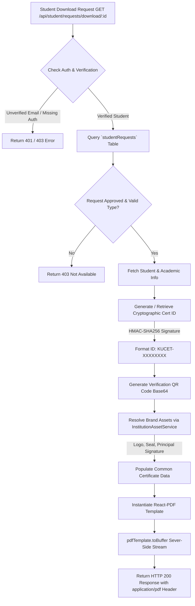
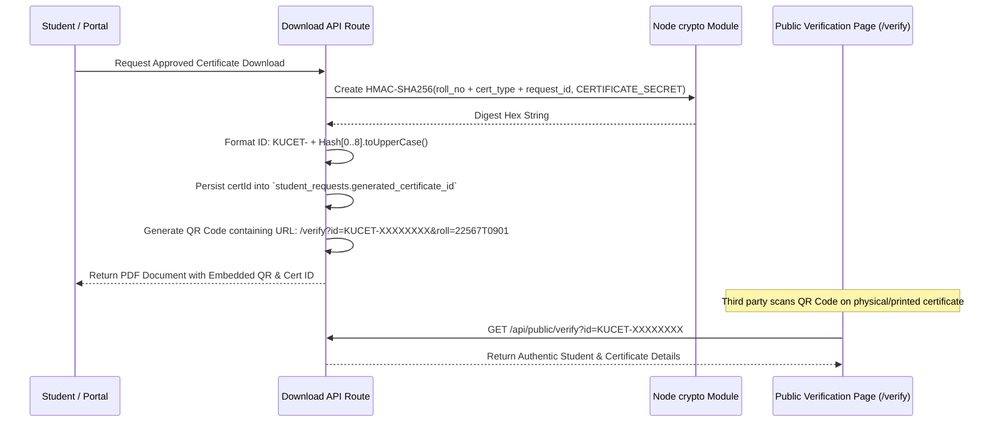
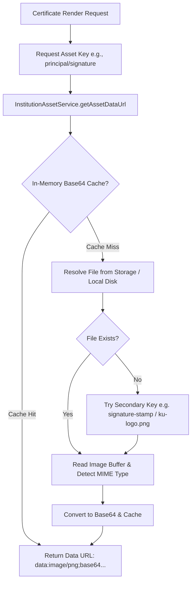
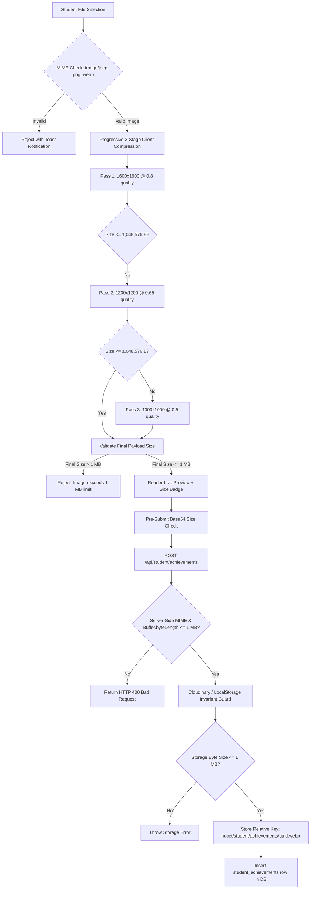

# Digital Certificate Engine Documentation

## 1. Overview & Rendering Pipeline

The **KUCET Digital Certificate Engine** renders tamper-proof, high-resolution PDF certificates on the server using `@react-pdf/renderer`. It generates institutional documents—such as Bonafide, Migration, Transfer, and Conduct certificates—on-the-fly when requested by authorized students or administrative personnel.

Each generated document incorporates cryptographic HMAC-SHA256 signatures, dynamic QR verification codes, embedded institutional seals, and authoritative signatures resolved through `InstitutionAssetService`.



---

## 2. Server-Side PDF Rendering Architecture

Certificate rendering takes place in Next.js Server Components / API Route Handlers (`/api/student/requests/download/[request_id]/route.js`). 

Rather than relying on client-side canvas rendering or headless browser screenshot tools (e.g., Puppeteer), KUCET utilizes `@react-pdf/renderer` to achieve deterministic layout calculation, sub-pixel vector rendering, lightweight memory consumption, and rapid response times.

### Server Component Execution Pattern

```javascript
// Source: src/app/api/student/requests/download/[request_id]/route.js
import React from 'react';
import { pdf } from '@react-pdf/renderer';

// Map request type to specific React-PDF Document Component
const Template = certificateComponents[certRequest.certificate_type];

// Construct props data object with academic info and resolved assets
const certProps = {
  certId: 'KUCET-A7B8C9D0',
  studentName: 'Goutham Rao',
  fatherName: 'Ramesh Rao',
  admissionNo: '22567T0901',
  course: 'CSE',
  academicYear: '2024-25',
  logoUrl: 'data:image/png;base64,...',
  signatureUrl: 'data:image/png;base64,...',
  stampUrl: 'data:image/png;base64,...',
  qrUrl: 'data:image/png;base64,...'
};

// Render React Element into Node Buffer
const pdfBuffer = await pdf(<Template {...certProps} />).toBuffer();

// Return response as downloadable PDF binary
return new NextResponse(pdfBuffer, {
  status: 200,
  headers: {
    'Content-Type': 'application/pdf',
    'Content-Disposition': `attachment; filename="${filename}"`
  }
});
```

---

## 3. HMAC-SHA256 Tamper Protection & Public Verification

To eliminate document forgery, every certificate issued by the platform receives an immutable cryptographic **Certificate ID** (`certId`) and an embedded **QR Code**.



### Cryptographic Hash Generation Formula
```javascript
const SECRET_SALT = process.env.CERTIFICATE_SECRET || "institutional_default_salt";
const hash = crypto.createHmac('sha256', SECRET_SALT)
                   .update(`${student.roll_no}-${certRequest.certificate_type}-${requestIdNum}`)
                   .digest('hex');
const certId = `KUCET-${hash.substring(0, 8).toUpperCase()}`;
```

---

## 4. Supported Certificate Types & Template Specifications

The system ships with 9 dedicated `@react-pdf/renderer` templates located in `src/pdf/templates/`.

| Certificate Type | Template File | Primary Use Case & Key Fields Rendered |
| :--- | :--- | :--- |
| **Bonafide Certificate** | `BonafideCertificatePDF.js` | General proof of enrollment, Passport, Bank Loan, Bus Pass, Scholarship applications. Displays Year, Semester, Attendance %, and Purpose. |
| **Custodian Certificate** | `CustodianCertificatePDF.js` | Verification that original certificates are deposited with the college administration. Displays Hall Ticket number and custody roster. |
| **Study Conduct Certificate** | `StudyConductCertificatePDF.js` | Attestation of student character and conduct during course duration (`Satisfactory` / `Good`). |
| **Migration Certificate** | `MigrationCertificatePDF.js` | Inter-university transfers and higher education admissions. Issued upon graduation or program migration. |
| **Course Completion Certificate** | `CourseCompletionCertificatePDF.js` | Provisional completion proof prior to convocation degree distribution. Includes completion year and course branch. |
| **Income Tax (IT) Certificate** | `IncomeTaxCertificatePDF.js` | Parents' IT return submission proving tuition fee payments (`₹35,000/-`). |
| **Transfer Certificate (TC)** | `TransferCertificatePDF.js` | Formal withdrawal or graduation clearance record. Includes conduct rating and admission details. |
| **No Objection Certificate** | `NoObjectionCertificatePDF.js` | Internships, industry projects, or external academic visits. Includes date ranges (`fromDate`, `toDate`). |
| **ID Card** | `IDCardPDF.js` | Official institutional identity card with barcode, profile photo, emergency contact, and blood group. |

---

## 5. Multi-Purpose Bonafide Rules & Purpose Formatting

Bonafide certificates are requested for diverse administrative needs. The system implements dynamic purpose parsing and title formatting using `src/lib/certificate-utils.js`.

### Purpose Parsing Logic
When a student requests a Bonafide Certificate, the `purpose` field in `student_requests` can store either a plain string or a JSON payload containing structured purpose data:

```javascript
// Source: src/lib/certificate-utils.js
export function parsePurpose(purposeStr) {
  if (!purposeStr) return { purpose_type: null, purpose_custom: null };
  const parsed = safeJsonParse(purposeStr, null);
  if (parsed && typeof parsed === 'object') {
    return {
      purpose_type: parsed.purpose_type || null,
      purpose_custom: parsed.purpose_custom || null
    };
  }
  return { purpose_type: purposeStr, purpose_custom: null };
}
```

### Dynamic Document Naming
- If `purpose_type` is `'Other'` and `purpose_custom` is `'State Bank Education Loan'`, `formatCertificateName()` returns:  
  `"Bonafide Certificate (State Bank Education Loan)"`
- File attachment names are sanitized for HTTP Content-Disposition headers:  
  `Bonafide_Certificate_(State_Bank_Education_Loan)_22567T0901.pdf`

---

## 6. Institutional Asset Resolution (`InstitutionAssetService`)

Certificates require high-resolution vector logos, official stamps, and principal signatures. The `InstitutionAssetService` provides a unified resolution layer with automated fallback chains.



### Asset Fallback Chain & Supported Keys

```javascript
// Asset resolution in certificate download handler:
const logoUrl = await InstitutionAssetService.getAssetDataUrl('institution/logo') 
    || await getBase64Image(getAssetUrl('/assets/ku-logo.png'));

const signatureUrl = await InstitutionAssetService.getAssetDataUrl('principal/signature') 
    || await InstitutionAssetService.getAssetDataUrl('principal/signature-stamp');

const stampUrl = await InstitutionAssetService.getAssetDataUrl('institution/seal');
```

- **MIME Detection**: Buffers are inspected for magic headers (`0xFF 0xD8` for JPEG, `0x89 0x50` for PNG) to construct valid base64 data URIs (`data:image/png;base64,...`) for seamless embedding into `@react-pdf/renderer` `<Image />` elements.

---

## 7. Approval Date Preservation & Records View Architecture

### 1. Historical Approval Date Preservation
When a student downloads an approved certificate (`/api/student/requests/download/[request_id]`), the generated certificate date reflects the exact timestamp when the administrative staff approved the request (`certRequest.updated_at`), rather than today's download date. If `updated_at` is unavailable, it gracefully defaults to the current verified clock time (`getNow()`).

### 2. Modernized Certificate Records View (`CertificateRecordsView.js`)
- Renders responsive records table with student names, roll numbers, certificate types, purpose tags, and status badges.
- Features duplicate proof detection flag badges (`is_flagged`) for suspicious student document submissions.
- Integrates sorting by approval date and direct navigation to `CertificateReviewModal` for fast administrative actions.

---

## 8. Student Achievement Certificates & Hard 1 MB Media Limit Pipeline

In addition to institutional PDF issuance, KUCET CMS allows students to register verifiable extracurricular, academic, and professional achievements (`/student/academics` -> Achievements tab) by uploading evidence certificates.

### 1. Inviolable 1 MB (1,048,576 Bytes) Storage Limit

To prevent storage abuse, memory bloat, and network latency on mobile connections, all certificate image uploads are subject to an inviolable **Hard 1 MB Limit** (`1,048,576 bytes`).



### 2. Multi-Layer Guard Architecture

1. **Client-Side Progressive Compression (`StudentAchievementModal.js`)**:
   - Uses `@/lib/image-compressor` to compress images across 3 progressive bounded passes before base64 encoding.
   - Preserves high visual fidelity for text legibility while guaranteeing payload reduction.
   - Calculates exact decoded byte size of the final base64 payload before form submission:
     `byteLength = Math.ceil((base64Data.length * 3) / 4) - padding`.
2. **Server-Side Zero-Trust Validation (`/api/student/achievements/route.js`)**:
   - Validates MIME type strictly against `image/jpeg`, `image/jpg`, `image/png`, and `image/webp` using regex. Non-image formats (e.g. PDFs or executables) are rejected with HTTP 400.
   - Validates decoded buffer length: `Buffer.byteLength(base64Data, 'base64') <= 1048576`. Returns HTTP 400 with exact byte and MB diagnostics if breached.
3. **Storage Provider Invariant Guard (`src/lib/cloudinary.js` & `LocalStorageProvider.js`)**:
   - `uploadToCloudinary` validates both `Buffer` length and raw Base64 data URI payload length against `MAX_SIZE = 1 * 1024 * 1024` (1,048,576 bytes).
   - `LocalStorageProvider.upload` enforces `file.length <= 1048576`.
4. **Automated Unit Test Verification**:
   - Covered by `tests/unit/api/student/certificate-upload-limit.test.js` (14 unit tests) verifying boundary cases: 500 KB (PASS), 999 KB (PASS), 1,048,575 bytes (PASS), 1,048,576 bytes (PASS), 1,048,577 bytes (REJECT), 2 MB (REJECT), 5 MB (REJECT), non-image MIME (REJECT).

---

## 9. Cross-References

- Student Requests Workflow: [requests.md](./requests.md)
- Admissions System: [admissions.md](./admissions.md)
- System Storage Architecture: [storage.md](../architecture/storage.md)
- Database Schema Documentation: [schema.md](../database/schema.md)


