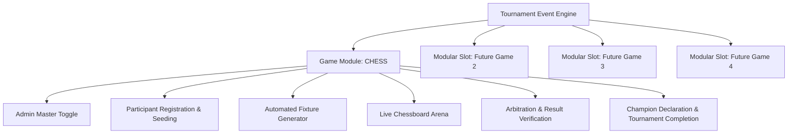
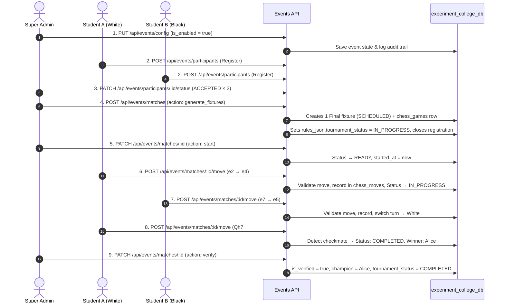

# Collegiate Tournament & Event System Architecture — Chess MVP

**System Version:** Session 212 (Tournament Workflow Complete)  
**Database:** `experiment_college_db` (Isolated Experimental Database)  
**Status:** Production-Ready MVP / `MY-EVENT` Branch  
**Test Suite Verification:** 68 test files (553 unit tests passing)

---

## 1. Executive System Overview

The **Collegiate Tournament & Event System** is a modular, multi-game tournament architecture designed for Kakatiya University College of Engineering and Technology. The system enables campus organizers and administrators to launch, manage, and verify collegiate esports, physical tournaments, and mind sports championships.

The first active game module is **CHESS**, powered by a FIDE-compliant chess engine, real-time board interaction, automated turn management, material advantage calculations, move history recording in Standard Algebraic Notation (SAN), and administrator result verification.



---

## 2. Experiment Database Configuration (`experiment_college_db`)

To ensure complete isolation from production academic tables, all event and chess state persists exclusively in the separate database `experiment_college_db`.

### 2.1 Database Connection Configuration
- **Location:** `src/modules/events/db/connection.js`
- **Drizzle Client:** `src/modules/events/db/index.js` (`eventDb`)
- **Schema Definition:** `src/modules/events/db/schema.js`
- **Idempotent Initializer:** `src/modules/events/db/init.js` (`initExperimentDb()`)

### 2.2 Environment Variables
| Variable | Required | Default / Fallback | Description |
| :--- | :--- | :--- | :--- |
| `EXPERIMENT_DATABASE_URL` | Optional | `null` | Full MySQL connection URI for experimental DB |
| `EXPERIMENT_DB_HOST` | Optional | `process.env.DB_HOST` (`127.0.0.1`) | Host of MySQL / TiDB instance |
| `EXPERIMENT_DB_PORT` | Optional | `process.env.DB_PORT` (`3306`) | Port of MySQL instance |
| `EXPERIMENT_DB_USER` | Optional | `process.env.DB_USER` (`cms_user`) | Dedicated DB username |
| `EXPERIMENT_DB_PASSWORD` | Optional | `process.env.DB_PASSWORD` | Database password |
| `EXPERIMENT_DB_DATABASE` | Optional | `experiment_college_db` | Target database name |
| `EXPERIMENT_DB_SSL` | Optional | `process.env.DB_SSL` (`false`) | SSL flag (`true`/`false`) for TiDB Cloud |

> [!NOTE]
> In local development, if `EXPERIMENT_DB_*` variables are omitted, the system connects to the local MySQL server and seamlessly creates/uses `experiment_college_db` without modifying `kucet_cms`.

### 2.3 Exclusive Event System Database Tables
1. `event_configs`: Event settings, rules, registration status, master `is_enabled` toggle, and JSON `rules_json` containing `tournament_status`, `champion`, `current_round`, `total_fixtures`, and `completed_at`.
2. `event_participants`: Contenders registered for tournaments (students, staff), approval status (`REGISTERED`, `ACCEPTED`, `REJECTED`, `WITHDRAWN`), seed numbers, and department affiliations.
3. `event_matches`: Tournament fixtures (White player, Black player, round name, scheduled time, match status, winner, result reason, verification stamp). Status lifecycle: `SCHEDULED → READY → IN_PROGRESS → COMPLETED` (also `CANCELLED`).
4. `chess_games`: Live chess state for each match (FEN, PGN, current turn, move count, check status, checkmate, stalemate, draw offers, captured pieces JSON).
5. `chess_moves`: Chronological log of each executed chess move (Move #, side, player user ID, SAN, from/to squares, promotion piece, FEN after move, timestamp).
6. `event_audit_logs`: Audit trail for tournament administration (toggle actions, approvals, fixture creations, result verifications, `START_TOURNAMENT`, `TOURNAMENT_COMPLETED`).

---

## 3. Admin Master Toggle & Access Control Matrix

The Chess tournament is governed by an administrative master switch:

```text
┌─────────────────────────────────────────────────────────┐
│              CHESS EVENT: ENABLED / DISABLED            │
└─────────────────────────────────────────────────────────┘
```

### 3.1 Behavior When DISABLED:
- **Direct URLs Guarded:** Navigating to `/events/chess` or `/events/chess/match/[id]` presents an institutional notice: *"The KUCET Chess Championship is currently disabled by administration."*
- **API Guarded:** Endpoints returning moves or registrations return `403 Forbidden`.
- **Navigation Isolation:** Event catalog reflects inactive status.
- **Admin Bypass:** Authenticated Super Admins can access the console to configure fixtures in advance.

### 3.2 Behavior When ENABLED:
- Public/Student tournament lobby is accessible at `/events/chess`.
- Contenders can register during open registration windows.
- Match participants can enter the live match arena (`/events/chess/match/[id]`).
- Spectators can view live games in read-only mode.

---

## 4. Tournament State Machine

Tournament state is stored in `event_configs.rules_json.tournament_status`:

```
null (no fixtures yet)
  │
  ▼ [Admin: Generate Fixtures]
IN_PROGRESS
  │
  ▼ [Final match verified with a winner]
COMPLETED ──► Registration blocked, fixture creation blocked
```

**`rules_json` fields set at tournament completion:**
```json
{
  "tournament_status": "COMPLETED",
  "champion": {
    "id": 1,
    "name": "Student A",
    "userId": "2026-CSE-001",
    "department": "CSE",
    "winnerSide": "white",
    "resultReason": "checkmate",
    "verifiedAt": "2026-09-08T00:00:00.000Z"
  },
  "completed_at": "2026-09-08T00:00:00.000Z"
}
```

---

## 5. Match Fixture Lifecycle

```text
SCHEDULED ──► [Admin: Start Match] ──► READY
                                         │
                                         ▼ [First player move]
                                      IN_PROGRESS
                                         │
                        ┌────────────────┴────────────────┐
                        ▼                                 ▼
                  checkmate / stalemate              resignation / draw
                        └────────────────┬────────────────┘
                                         ▼
                                     COMPLETED
                                         │
                                         ▼ [Admin: Verify Result]
                                   is_verified = true
                                         │
                                         ▼ [If Final round + has winner]
                               TOURNAMENT_COMPLETED
                               champion declared in rules_json

CANCELLED ◄── [Admin: Cancel Match] (from any non-terminal status)
```

---

## 6. End-to-End Chess Tournament Workflow (Session 212)



---

## 7. Automated Fixture Generation (`generateTournamentFixtures`)

**API:** `POST /api/events/matches` with body `{ "action": "generate_fixtures" }` (no player IDs needed)

**Logic:**
| Accepted Players | Round Name | Fixtures Created |
| :--- | :--- | :--- |
| 2 | Final | 1 |
| 3–4 | Semifinals | 2 |
| 5–8 | Quarterfinals | 4 |
| 9+ | Round 1 | ⌊N/2⌋ |

**Idempotency Guarantees:**
- If `tournament_status === 'COMPLETED'` → throws `400 Tournament COMPLETED`.
- If active fixtures already exist (SCHEDULED/READY/PUBLISHED/STARTED/IN_PROGRESS) → returns existing fixtures unchanged (`created: false`).
- Each individual `createMatch()` call also checks for existing active match between the same pair.

**Side Effects on Success:**
- Sets `rules_json.tournament_status = 'IN_PROGRESS'`
- Sets `rules_json.current_round` to round name
- Sets `registration_open = false` (closes registration automatically)
- Writes `START_TOURNAMENT` audit log

---

## 8. Champion Declaration & Tournament Completion

When `verifyMatchResult()` is called on a **Final round** match with a **winner**:

1. Fetches winner participant from `event_participants`
2. Deep-merges `champion` info into `rules_json`
3. Sets `tournament_status = 'COMPLETED'`
4. Sets `registration_open = false`
5. Writes `TOURNAMENT_COMPLETED` audit log
6. AdminEventControl.js displays amber champion banner with `Trophy` icon and winner's name

**Draw Handling:** If the Final match ends in a draw (`winner_id = null`), tournament completion is NOT triggered — admin must decide and create a new fixture for a rematch.

---

## 9. Chess Engine Features & Capabilities

- **FIDE Legal Move Validation:** Validates all pieces (King, Queen, Rook, Bishop, Knight, Pawn), castling (kingside/queenside), en passant, and pawn promotions (Queen, Rook, Bishop, Knight).
- **Interactive UI:** Smooth square selections, destination dot indicators, capture ring highlights, king in check glow, and coordinate notation (A-H, 1-8).
- **Turn Enforcement:** Zero-trust backend validation ensures only the authenticated player on their active turn can execute moves.
- **Captured Material Tracking:** Real-time computation of captured pieces and point differential (`+1`, `+3`, `+5`, etc.).
- **Live Auto-polling:** Synchronizes boards across different client devices every 2.5 seconds.
- **Outcome Detection:** Automated recognition of Checkmate, Stalemate, Threefold Repetition, Insufficient Material, Resignation, and Mutual Draw Agreement.
- **Status Guard:** Moves are rejected if match status is `SCHEDULED` (admin must start first) or `CANCELLED`/`COMPLETED`/`ABANDONED`.

---

## 10. Directory Map & File Architecture

```text
src/
├── app/
│   ├── admin/events/                 # Admin tournament console
│   │   ├── page.js                   # Events catalog & modular slot manager
│   │   └── chess/page.js             # Dedicated Chess Event admin manager
│   ├── api/events/                   # Event & Chess REST API routes
│   │   ├── config/route.js           # Event configuration & Admin toggle
│   │   ├── participants/route.js     # Participant registration & listing
│   │   ├── participants/[id]/status/ # Admin accept/reject status
│   │   ├── matches/route.js          # Fixture creation/generation & listing
│   │   ├── matches/[id]/route.js     # Match state, start, cancel, verify
│   │   ├── matches/[id]/move/route.js# Legal chess move submission
│   │   └── matches/[id]/action/route.js# Resign / Draw offers (lowercase normalized)
│   └── events/                       # Public & Student Tournament Hub
│       ├── page.js                   # Campus event catalog
│       └── chess/
│           ├── page.js               # Tournament Lobby & Leaderboard
│           └── match/[id]/page.js    # Interactive Match Arena
└── modules/events/                   # Isolated Event Module
    ├── db/                           # Dedicated experiment_college_db client
    │   ├── connection.js             # Dedicated MySQL pool
    │   ├── schema.js                 # Event & Chess Drizzle schemas
    │   ├── init.js                   # Idempotent table creator
    │   └── index.js                  # Drizzle instance export (eventDb)
    ├── services/                     # Domain services
    │   ├── EventConfigService.js     # Admin toggle & configuration (deep-merge rules_json)
    │   ├── ParticipantService.js     # Contender registrations (blocks COMPLETED tournaments)
    │   ├── MatchService.js           # Fixtures, lifecycle, champion detection
    │   └── ChessEngineService.js     # Chess rules, moves & FEN/PGN state
    ├── components/                   # Shared event components
    │   ├── EventGuard.js             # Toggle access guard
    │   ├── AdminEventControl.js      # Admin dashboard (champion banner, start match, generate fixtures)
    │   ├── TournamentLobby.js        # Public tournament hub
    │   └── ParticipantRegistrationModal.js # Registration modal
    └── games/chess/                  # Chess-specific UI & utilities
        ├── ChessBoard.js             # Interactive legal chess board
        ├── ChessGameView.js          # Scorecard, moves log & action bar (lowercase actions)
        └── chess-utils.js            # SVG piece vectors & point values
tests/unit/events/
├── chess-engine-service.test.js      # ChessEngineService: legal moves, turn enforcement, resignation, draw
├── event-api-routes.test.js          # API route integration: auth, create fixture, verify
├── event-config-and-workflow.test.js # EventConfigService toggle, participant approval, fixture lifecycle
├── match-service-workflow.test.js    # NEW: generateTournamentFixtures, idempotency, champion detection, E2E
└── participant-service.test.js       # ParticipantService registration, status, tournament block
```

tests/unit/events/
├── chess-engine-service.test.js      # ChessEngineService: legal moves, turn enforcement, resignation, draw
├── event-api-routes.test.js          # API routes: auth, toggle, registration, matches, results submission, verify
├── event-config-and-workflow.test.js # EventConfigService toggle, participant approval, fixture lifecycle
├── match-service-workflow.test.js    # generateTournamentFixtures, idempotency, winner derivation, next round
└── participant-service.test.js       # ParticipantService registration, status, tournament block
```

---

## 11. Testing & Verification Runbook (2-Player Tournament Scenario)

### Exact Step-by-Step Testing Procedure:

1. **Activate Chess Event:**
   - Admin navigates to `/admin/events/chess`.
   - Clicks **Activate Event** (sets `is_enabled = true`, `registration_open = true`).
   - Status badge displays `Event Active`.

2. **Student Registrations:**
   - Student A logs into CMS and visits `/events/chess`.
   - Clicks **1-Click Register**. Identity is resolved directly from student profile (Roll No: `2026-CSE-001`).
   - Student B logs in and clicks **1-Click Register** (Roll No: `2026-CSE-002`).

3. **Participant Approval:**
   - Admin visits `/admin/events/chess` > **Participants & Approvals** tab.
   - Admin clicks **Accept** for Student A and Student B (status becomes `ACCEPTED`).
   - Metrics grid shows `Accepted Players: 2`.

4. **Fixture Creation:**
   - Admin switches to **Match Fixtures** tab.
   - Empty state shows: *"2 accepted contenders ready (Student A and Student B)."*
   - Admin clicks **Start Tournament (Generate Final Fixture)**.
   - Fixture is generated: `Student A (White) vs Student B (Black)`, round `Final`, status `SCHEDULED`.
   - Registrations close automatically (`registration_open = false`).
   - Concurrency & idempotency: Clicking the button again returns the existing fixture without duplicates.

5. **Start Match:**
   - Admin clicks **Start Match** on the fixture card.
   - Status transitions from `SCHEDULED` → `READY`.
   - `started_at` timestamp is recorded.

6. **Submit Result (2 Pathways Available):**
   - **Pathway A (In-Person / Arbiter Reporting):** Admin/Arbiter clicks **Record Result** on the match card. Selects winner (e.g. White), outcome reason (e.g. Checkmate), and clicks **Submit Match Result**.
   - **Pathway B (Interactive Arena):** Players navigate to `/events/chess/match/:id`. First legal move transitions match to `IN_PROGRESS`. Players play until checkmate, resignation, or mutual draw agreement.
   - Match status transitions to `COMPLETED`.

7. **Result Auditing & Verification:**
   - Admin navigates to **Result Auditing** tab.
   - The completed match appears under `Pending Audit`.
   - Admin clicks **Verify Result**, enters arbiter audit notes (e.g., *"Fair play verified"*), and clicks **Seal & Verify Result**.
   - Match status updates to `is_verified = true`.

8. **Champion Declaration & Tournament Completion:**
   - Because this was the Final round with a winner:
     - `rules_json.tournament_status` transitions to `COMPLETED`.
     - `rules_json.champion` is permanently sealed with Student A's identity and victory details.
     - `eventAuditLogs` records `TOURNAMENT_COMPLETED`.
     - Golden/Amber Champion banner displays prominently across admin and public lobbies.
     - New registrations and fixture creations are disabled.
     - All match records remain accessible for historical viewing.

---

## 12. Modified Files Forensic Record

| File Modified | Reason for Modification | Specific Changes Made |
| :--- | :--- | :--- |
| `src/modules/events/services/MatchService.js` | Concurrency, Next-Round & Overwrite Guards | In-flight mutex lock (`fixtureGenerationPromise`), conflict guard against concurrent player matches, `isFinalRoundName` helper, auto-deriving `winnerId` from `winnerSide`, sealed match overwrite guards, multi-round bracket advancement |
| `src/app/api/events/matches/[id]/route.js` | Arbiter/Participant Result Submission | Added `record_result` action to PATCH handler with role-based auth (admin or match participant allowed, 403 for unauthorized users, 400 for sealed matches) |
| `src/modules/events/components/AdminEventControl.js` | UI Polish & Arbiter Workflow | KUCET design alignment (no AI styling), prominent Start Tournament button, smart prefill in Create Match modal, Record Result modal for arbiters, next round generation action, clean status badges |
| `tests/unit/events/event-api-routes.test.js` | API Route Integration Tests | Added comprehensive PATCH test suite covering start match, admin result submission, participant result submission, 403 unauthorized rejection, and sealed match overwrite protection |
| `tests/unit/events/match-service-workflow.test.js` | Service Unit Tests | Added test suites covering auto-derivation of winner IDs, overwrite guards, player conflict guards, and next-round bracket advancement |

