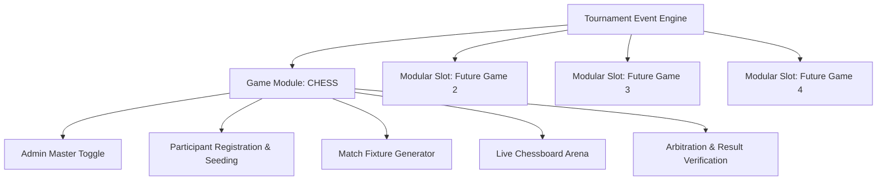
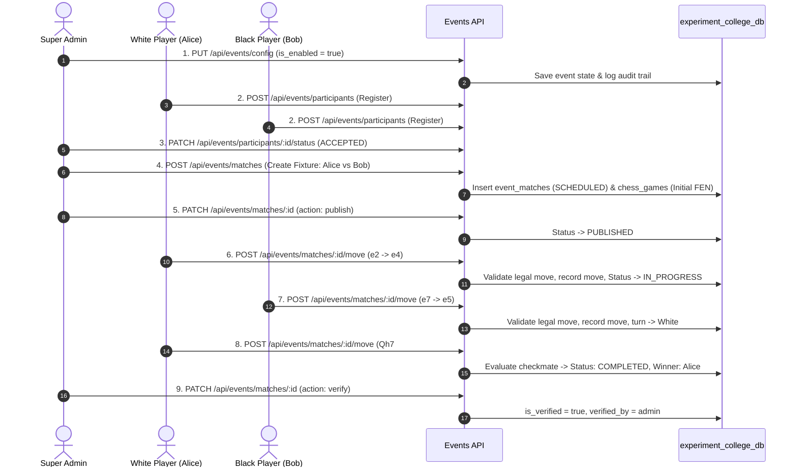

# Collegiate Tournament & Event System Architecture — Chess MVP

**System Version:** Module 1 (Session 212 / Experimental Module)  
**Database:** `experiment_college_db` (Isolated Experimental Database)  
**Status:** Functional MVP / Isolated Branch (`MY-EVENT`)  
**Test Suite Verification:** 64 test files (502 unit tests passing)

---

## 1. Executive System Overview

The **Collegiate Tournament & Event System** is a modular, multi-game tournament architecture designed for Kakatiya University College of Engineering and Technology. The system enables campus organizers and administrators to launch, manage, and verify collegiate esports, physical tournaments, and mind sports championships.

The first active game module is **CHESS**, powered by a FIDE-compliant chess engine, real-time board interaction, automated turn management, material advantage calculations, move history recording in Standard Algebraic Notation (SAN), and administrator result verification.



---

## 2. Experiment Database Configuration (`experiment_college_db`)

To ensure complete isolation from production academic tables, all event and chess state persists exclusively in the separate database `experiment_college_db`.

### 2.1 Database Connection Configuration
- **Location:** `src/modules/events/db/connection.js`
- **Drizzle Client:** `src/modules/events/db/index.js` (`eventDb`)
- **Schema Definition:** `src/modules/events/db/schema.js`
- **Idempotent Initializer:** `src/modules/events/db/init.js` (`initExperimentDb()`)

### 2.2 Environment Variables
| Variable | Required | Default / Fallback | Description |
| :--- | :--- | :--- | :--- |
| `EXPERIMENT_DATABASE_URL` | Optional | `null` | Full MySQL connection URI for experimental DB |
| `EXPERIMENT_DB_HOST` | Optional | `process.env.DB_HOST` (`127.0.0.1`) | Host of MySQL / TiDB instance |
| `EXPERIMENT_DB_PORT` | Optional | `process.env.DB_PORT` (`3306`) | Port of MySQL instance |
| `EXPERIMENT_DB_USER` | Optional | `process.env.DB_USER` (`cms_user`) | Dedicated DB username |
| `EXPERIMENT_DB_PASSWORD` | Optional | `process.env.DB_PASSWORD` | Database password |
| `EXPERIMENT_DB_DATABASE` | Optional | `experiment_college_db` | Target database name |
| `EXPERIMENT_DB_SSL` | Optional | `process.env.DB_SSL` (`false`) | SSL flag (`true`/`false`) for TiDB Cloud |

> [!NOTE]
> In local development, if `EXPERIMENT_DB_*` variables are omitted, the system connects to the local MySQL server and seamlessly creates/uses `experiment_college_db` without modifying `kucet_cms`.

### 2.3 Exclusive Event System Database Tables
1. `event_configs`: Event settings, rules, registration status, and the master `is_enabled` toggle.
2. `event_participants`: Contenders registered for tournaments (students, staff), approval status (`REGISTERED`, `ACCEPTED`, `REJECTED`), seed numbers, and department affiliations.
3. `event_matches`: Tournament fixtures (White player, Black player, round name, scheduled time, match status, winner, result reason, verification stamp).
4. `chess_games`: Live chess state for each match (FEN, PGN, current turn, move count, check status, checkmate, stalemate, draw offers, captured pieces JSON).
5. `chess_moves`: Chronological log of each executed chess move (Move #, side, player user ID, SAN, from/to squares, promotion piece, FEN after move, timestamp).
6. `event_audit_logs`: Audit trail for tournament administration (toggle actions, approvals, fixture creations, result verifications).

---

## 3. Admin Master Toggle & Access Control Matrix

The Chess tournament is governed by an administrative master switch:

```text
┌─────────────────────────────────────────────────────────┐
│              CHESS EVENT: ENABLED / DISABLED            │
└─────────────────────────────────────────────────────────┘
```

### 3.1 Behavior When DISABLED:
- **Direct URLs Guarded:** Navigating to `/events/chess` or `/events/chess/match/[id]` presents an institutional notice: *"The KUCET Chess Championship is currently disabled by administration."*
- **API Guarded:** Endpoints returning moves or registrations return `403 Forbidden`.
- **Navigation Isolation:** Event catalog reflects inactive status.
- **Admin Bypass:** Authenticated Super Admins can access the console to configure fixtures in advance.

### 3.2 Behavior When ENABLED:
- Public/Student tournament lobby is accessible at `/events/chess`.
- Contenders can register during open registration windows.
- Match participants can enter the live match arena (`/events/chess/match/[id]`).
- Spectators can view live games in read-only mode.

---

## 4. End-to-End Chess Tournament Workflow



---

## 5. Chess Engine Features & Capabilities

- **FIDE Legal Move Validation:** Validates all pieces (King, Queen, Rook, Bishop, Knight, Pawn), castling (kingside/queenside), en passant, and pawn promotions (Queen, Rook, Bishop, Knight).
- **Interactive UI:** Smooth square selections, destination dot indicators, capture ring highlights, king in check glow, and coordinate notation (A-H, 1-8).
- **Turn Enforcement:** Zero-trust backend validation ensures only the authenticated player on their active turn can execute moves.
- **Captured Material Tracking:** Real-time computation of captured pieces and point differential (`+1`, `+3`, `+5`, etc.).
- **Live Auto-polling:** Synchronizes boards across different client devices every 2.5 seconds.
- **Outcome Detection:** Automated recognition of Checkmate, Stalemate, Threefold Repetition, Insufficient Material, Resignation, and Mutual Draw Agreement.

---

## 6. Directory Map & File Architecture

```text
src/
├── app/
│   ├── admin/events/                 # Admin tournament console
│   │   ├── page.js                   # Events catalog & modular slot manager
│   │   └── chess/page.js             # Dedicated Chess Event admin manager
│   ├── api/events/                   # Event & Chess REST API routes
│   │   ├── config/route.js           # Event configuration & Admin toggle
│   │   ├── participants/route.js     # Participant registration & listing
│   │   ├── participants/[id]/status/ # Admin accept/reject status
│   │   ├── matches/route.js          # Fixture creation & listing
│   │   ├── matches/[id]/route.js     # Match state & publish/verify
│   │   ├── matches/[id]/move/route.js# Legal chess move submission
│   │   └── matches/[id]/action/route.js# Resign / Draw offers
│   └── events/                       # Public & Student Tournament Hub
│       ├── page.js                   # Campus event catalog
│       └── chess/
│           ├── page.js               # Tournament Lobby & Leaderboard
│           └── match/[id]/page.js    # Interactive Match Arena
└── modules/events/                   # Isolated Event Module
    ├── db/                           # Dedicated experiment_college_db client
    │   ├── connection.js             # Dedicated MySQL pool
    │   ├── schema.js                 # Event & Chess Drizzle schemas
    │   ├── init.js                   # Idempotent table creator
    │   └── index.js                  # Drizzle instance export (eventDb)
    ├── services/                     # Domain services
    │   ├── EventConfigService.js     # Admin toggle & configuration
    │   ├── ParticipantService.js     # Contender registrations
    │   ├── MatchService.js           # Fixtures & verification
    │   └── ChessEngineService.js     # Chess rules, moves & FEN/PGN state
    ├── components/                   # Shared event components
    │   ├── EventGuard.js             # Toggle access guard
    │   ├── AdminEventControl.js      # Admin dashboard interface
    │   ├── TournamentLobby.js        # Public tournament hub
    │   └── ParticipantRegistrationModal.js # Registration modal
    └── games/chess/                  # Chess-specific UI & utilities
        ├── ChessBoard.js             # Interactive legal chess board
        ├── ChessGameView.js          # Scorecard, moves log & action bar
        └── chess-utils.js            # SVG piece vectors & point values
```

---

## 7. Modified Files Forensic Record

To maintain isolation and minimize merge conflicts, existing CMS files were strictly preserved with only one minimal modification:

| File Modified | Reason for Modification | Specific Changes Made | Rationale Why Isolated File Could Not Be Used |
| :--- | :--- | :--- | :--- |
| `src/lib/menu-config.js` | Admin Sidebar Navigation | Added `{ label: 'CAMPUS EVENTS', route: '/admin/events' }` to `superAdmin` array. | The Admin Layout renders `Sidebar.js` which relies on `NAV_MENU_CONFIG['superAdmin']` as the single source of truth for navigation links. |
