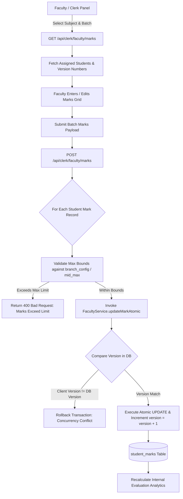
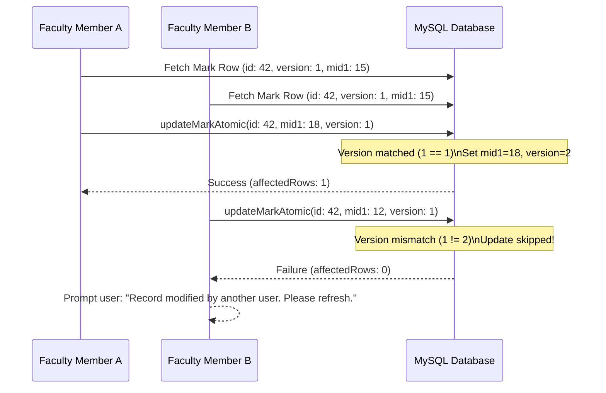

# Internal Marks & Evaluation System Documentation

## 1. Overview & Architectural Design

The **KUCET Internal Marks & Evaluation System** automates continuous internal assessment (CIE) tracking for all engineering departments. It handles Mid-term examinations (Mid 1 & Mid 2), continuous assignment evaluations, laboratory experiment scoring, optimistic concurrency locking, and automated departmental analytics.

The system enforces strict regulation rules (such as R22/R20 academic regulations) while ensuring concurrent mark entries by multiple teaching assistants or faculty members do not result in race conditions.



---

## 2. Semester Marks Entry & Component Breakdown

Continuous evaluation is divided into **Theory Subjects** and **Practical / Laboratory Subjects**.

### Schema Definition (`src/db/schema/operations.js`)

```javascript
// Source: src/db/schema/operations.js
export const studentMarks = mysqlTable('student_marks', {
  id: int('id').autoincrement().primaryKey().notNull(),
  student_id: int('student_id').notNull(),
  assignment_id: int('assignment_id').notNull(),
  is_published: boolean('is_published').default(true).notNull(),
  
  // Theory Components
  mid1_marks: decimal('mid1_marks', { precision: 5, scale: 2 }),
  mid2_marks: decimal('mid2_marks', { precision: 5, scale: 2 }),
  assignment_marks: decimal('assignment_marks', { precision: 5, scale: 2 }),
  
  // Practical / Laboratory Components
  lab_theory_marks: decimal('lab_theory_marks', { precision: 5, scale: 2 }),
  lab_execution_marks: decimal('lab_execution_marks', { precision: 5, scale: 2 }),
  lab_record_marks: decimal('lab_record_marks', { precision: 5, scale: 2 }),
  
  created_at: timestamp('created_at').defaultNow(),
  updated_at: timestamp('updated_at').onUpdateNow(),
  version: int('version').default(1).notNull(),
}, (table) => ({
  studentAssignmentIdx: index('idx_marks_student_assignment').on(table.student_id, table.assignment_id),
  studentAssignmentUniq: uniqueIndex('uq_marks_student_assignment').on(table.student_id, table.assignment_id),
}));
```

### Assessment Components & Weightages

| Subject Type | Component Name | Default Max Marks | Description / Purpose |
| :--- | :--- | :---: | :--- |
| **Theory** | `mid1_marks` | `20` or `30` | Mid-Semester Examination 1 written score. |
| **Theory** | `mid2_marks` | `20` or `30` | Mid-Semester Examination 2 written score. |
| **Theory** | `assignment_marks` | `5` or `10` | Continuous assignment / tutorial evaluation score. |
| **Practical** | `lab_theory_marks` | `10` | Day-to-day lab write-up / viva-voce evaluation. |
| **Practical** | `lab_execution_marks` | `25` | Practical program execution & output correctness. |
| **Practical** | `lab_record_marks` | `15` | Certified laboratory observation & record notebook marks. |

---

## 3. Departmental Pattern Recommendations & Configurations

Different academic departments or regulation years enforce specific internal evaluation max limits. The system configures these limits via `branch_config` and `faculty_subject_assignments`.

```javascript
// Configured in branch_config and faculty_subject_assignments
export const branchConfig = mysqlTable('branch_config', {
  id: int('id').autoincrement().primaryKey().notNull(),
  branch: varchar('branch', { length: 50 }).notNull(),
  academic_year: varchar('academic_year', { length: 9 }).notNull(),
  semester: tinyint('semester').notNull(),
  mid_max: int('mid_max').default(20),
  assignment_max: int('assignment_max').default(10),
  is_locked: boolean('is_locked').default(false),
});
```

### Regulation Weightage Formula
For standard Kakatiya University engineering regulations:
$$\text{Best Mid Weightage} = (0.80 \times \max(\text{Mid1}, \text{Mid2})) + (0.20 \times \min(\text{Mid1}, \text{Mid2}))$$
$$\text{Total Internal Score} = \text{Best Mid Weightage} + \text{Assignment Marks}$$

---

## 4. Version-Based Optimistic Locking (`updateMarkAtomic`)

To prevent data loss when multiple teaching assistants or faculty members edit the same section's marks grid simultaneously, the system uses **Optimistic Concurrency Control (OCC)** via `FacultyService.updateMarkAtomic`.

```javascript
// Source: src/services/academic/FacultyService.js
static async updateMarkAtomic(id, data, originalVersion, tx = db) {
  const result = await tx.update(studentMarks)
    .set({
      ...data,
      version: originalVersion + 1,
      updated_at: getNow()
    })
    .where(
      and(
        eq(studentMarks.id, id),
        eq(studentMarks.version, originalVersion) // Version check prevents race condition
      )
    );

  // If result.affectedRows === 0, another user updated the row concurrently
  return result.affectedRows > 0;
}
```



---

## 5. Internal Evaluation Analytics

The marks intelligence engine (`/api/intelligence/analytics/marks`) computes real-time performance analytics for Heads of Departments (HODs) and Principals.

### Key Metrics Computed
- **Class Pass Percentage**: Percentage of students scoring $\ge 40\%$ in internal evaluation components.
- **Section Distribution**: Normal distribution histogram categorizing student scores into ranges (`90-100%`, `75-89%`, `60-74%`, `<60%`).
- **Low Performance Alerts**: Automated flagging of students with low combined attendance and mid-term marks for remedial classes.

---

## 6. Cross-References

- Proxy-Free Attendance System: [attendance.md](./attendance.md)
- Academic Archival & Grade Archival: [reports.md](./reports.md)
- Database Schemas: [03_DATABASE.md](../database/03_DATABASE.md)
- User Authentication: [02_AUTHENTICATION.md](../authentication/02_AUTHENTICATION.md)
