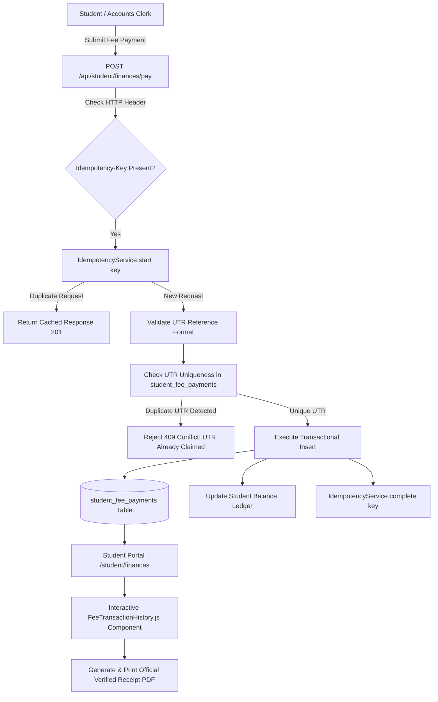
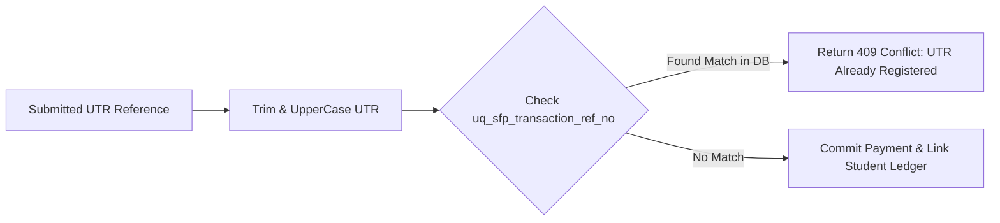

# Student Financial & Fee Management System Documentation

## 1. Overview & Financial Architecture

The **KUCET Financial & Fee Management System** manages student fee structures, tuition ledgers, government scholarship reimbursements, verified bank payments, and receipt generation.

The system ensures financial integrity through **Idempotent Transaction Processing**, **UTR Fraud Guards**, and automated **Government Scholarship Tracking** for Telangana fee reimbursement schemes.



---

## 2. Fee Summary Ledger & Balance Calculation

Student fee accounts are tracked across academic years. The system calculates net dues by comparing total assessed fees against verified student payments and government scholarship releases.

### Balance Calculation Formula
$$\text{Net Payable Dues} = (\text{Tuition Fee} + \text{Special Fee} + \text{Hostel Dues}) - (\text{Verified Student Payments} + \text{Released Scholarship Funds})$$

### Financial Table Schemas (`src/db/schema/finance.js`)

```javascript
// Source: src/db/schema/finance.js
export const studentFeePayments = mysqlTable('student_fee_payments', {
  id: int('id').autoincrement().primaryKey().notNull(),
  student_id: int('student_id').notNull(),
  academic_year: varchar('academic_year', { length: 9 }).notNull(),
  amount: decimal('amount', { precision: 10, scale: 2 }).notNull(),
  transaction_ref_no: varchar('transaction_ref_no', { length: 255 }).notNull(),
  transaction_date: date('transaction_date').notNull(),
  payment_mode: varchar('payment_mode', { length: 50 }),
  bank_name: varchar('bank_name', { length: 255 }),
  created_at: timestamp('created_at').defaultNow(),
}, (table) => ({
  studentIdx: index('idx_sfp_student').on(table.student_id),
  transactionRefUniq: uniqueIndex('uq_sfp_transaction_ref_no').on(table.transaction_ref_no),
}));
```

---

## 3. Scholarship Coverage Tracking & Government Reimbursement

Telangana state fee reimbursement schemes (such as epass / JVD) are managed via the `scholarship_sanctions` and `scholarship_windows` tables.

```javascript
// Source: src/db/schema/finance.js
export const scholarshipSanctions = mysqlTable('scholarship_sanctions', {
  id: int('id').autoincrement().primaryKey().notNull(),
  student_id: int('student_id').notNull(),
  academic_year: varchar('academic_year', { length: 9 }).notNull(),
  application_no: varchar('application_no', { length: 255 }).notNull(),
  proceeding_no: varchar('proceeding_no', { length: 255 }),
  sanctioned_amount: decimal('sanctioned_amount', { precision: 10, scale: 2 }),
  sanction_date: date('sanction_date'),
  released_amount: decimal('released_amount', { precision: 10, scale: 2 }),
  released_date: date('released_date'),
  status: mysqlEnum('status', ['PENDING', 'SANCTIONED', 'RELEASED', 'REJECTED']).default('PENDING'),
  thumb_status: mysqlEnum('thumb_status', ['PENDING', 'COMPLETED', 'FAILED']).default('PENDING'),
  hardcopy_submitted: tinyint('hardcopy_submitted').default(0),
  version: int('version').default(1).notNull(),
});
```

### Scholarship Lifecycle Rules
- **Application Tracking**: Links student profile to state portal `application_no`.
- **Proceeding Disbursal**: When government releases tranches, clerks update `proceeding_no` and `released_amount`.
- **Biometric Thumb Verification**: Tracks biometric authentication status (`thumb_status: PENDING | COMPLETED | FAILED`) required by government scholarship portals.

---

## 4. Interactive Fee Transaction History & Receipt Modal (`FeeTransactionHistory.js`)

The `FeeTransactionHistory.js` component (`src/components/student/FeeTransactionHistory.js`) presents student transaction ledgers and renders print-ready official receipts.

### Key Interactive Features
- **Responsive Layout**: Renders structured data tables on desktop screens and collapsible stacked cards on mobile displays.
- **Printable Modal Portal**: Uses React DOM `createPortal` to render printable receipts directly to `document.body`, bypassing component CSS clipping bounds.
- **Institutional Branding**: Embeds official university header (*Kakatiya University College of Engineering & Technology, Warangal*), transaction metadata, UTR reference, and system verification badge.

```jsx
// Receipt Modal Trigger Snippet in FeeTransactionHistory.js
<button
  type="button"
  onClick={() => setSelectedReceipt(payment)}
  className="px-2.5 py-1 bg-white border border-gray-300 rounded-sm text-xs font-semibold"
>
  Receipt PDF
</button>
```

---

## 5. UTR SHA-256 Fingerprinting Fraud Guard

To prevent students from submitting duplicate or fraudulent Unique Transaction Reference (UTR) numbers from previous payments or external receipts, the database enforces strict unique indexing.



- **Unique Database Constraint**: `uniqueIndex('uq_sfp_transaction_ref_no').on(table.transaction_ref_no)`.
- **Sanitization**: Standardizes input strings by trimming whitespace and converting letters to uppercase prior to querying or insertion.

---

## 6. Financial Idempotency Engine (`IdempotencyService`)

Payment submission endpoints integrate with `IdempotencyService` to prevent double-charging caused by network retries or double-clicking form submit buttons.

```javascript
// Source: src/services/IdempotencyService.js
export class IdempotencyService {
  static async start(key) {
    const existing = await db.query.idempotencyKeys.findFirst({
      where: eq(idempotencyKeys.idempotency_key, key)
    });

    if (existing) {
      if (existing.status === 'COMPLETED') {
        return { isDuplicate: true, response: existing.response_body, code: existing.response_code };
      }
      if (existing.status === 'STARTED') {
        throw new Error('CONCURRENT_REQUEST');
      }
    }

    await db.insert(idempotencyKeys).values({
      idempotency_key: key,
      status: 'STARTED',
      expires_at: new Date(Date.now() + 24 * 60 * 60 * 1000)
    });

    return { isDuplicate: false };
  }

  static async complete(key, code, response) {
    await db.update(idempotencyKeys)
      .set({ status: 'COMPLETED', response_code: code, response_body: response })
      .where(eq(idempotencyKeys.idempotency_key, key));
  }
}
```

---

## 7. Cross-References

- Database Finance Schemas: [03_DATABASE.md](../database/03_DATABASE.md)
- Digital Certificate Engine (Income Tax Certificate): [certificates.md](./certificates.md)
- Student Requests System: [requests.md](./requests.md)
- Archival & Financial Reports: [reports.md](./reports.md)
