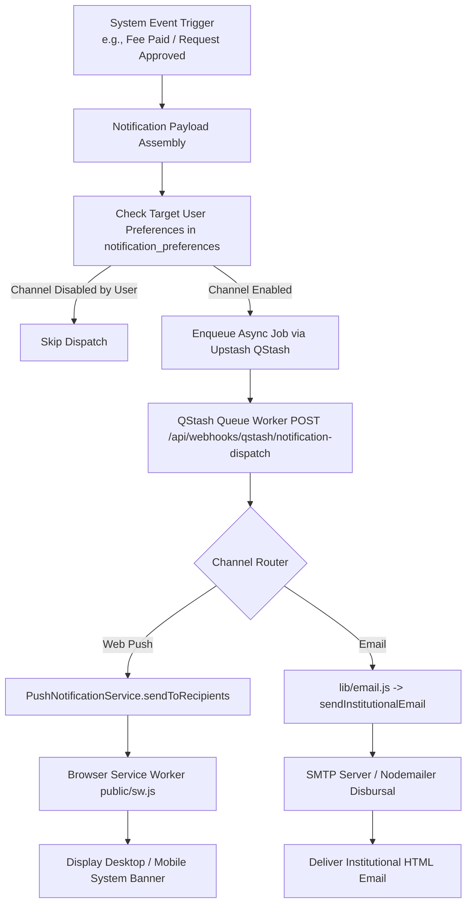
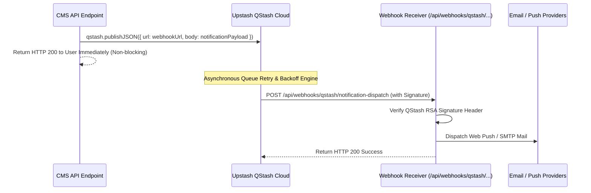

# Multi-Channel Notification Engine Documentation

## 1. Overview & Multi-Channel Architecture

The **KUCET Multi-Channel Notification Engine** delivers operational alerts across three channels: **Browser Web Push Notifications**, **Transactional Institutional Emails**, and **In-App Portal Alerts**.

The system utilizes Upstash QStash for asynchronous queueing, preventing slow third-party email or push gateways from blocking HTTP web responses.



---

## 2. Web Push Notifications (`PushNotificationService.js` & `sw.js`)

Web Push notifications operate using the W3C Push API and VAPID (Voluntary Application Server Identification) cryptographic standards via the `web-push` library.

### Client Service Worker (`public/sw.js`)
The service worker handles incoming push events, caches offline routes (ID card, fee receipts, timetables), and manages notification click handlers:

```javascript
// Source: public/sw.js
self.addEventListener('push', (event) => {
  if (!event.data) return;

  try {
    const data = event.data.json();
    const title = data.title || 'KUCET CMS Notification';
    const options = {
      body: data.body || '',
      icon: data.icon || '/favicon.ico',
      badge: '/favicon.ico',
      data: {
        url: data.url || '/',
        ...data.data
      },
      tag: data.category || 'general',
      renotify: true
    };

    event.waitUntil(self.registration.showNotification(title, options));
  } catch (_e) {
    const rawText = event.data.text();
    event.waitUntil(
      self.registration.showNotification('KUCET CMS', {
        body: rawText,
        icon: '/favicon.ico'
      })
    );
  }
});

self.addEventListener('notificationclick', (event) => {
  event.notification.close();
  const targetUrl = event.notification.data?.url || '/';

  event.waitUntil(
    self.clients.matchAll({ type: 'window', includeUncontrolled: true }).then((clientList) => {
      for (const client of clientList) {
        if (client.url && 'focus' in client) {
          return client.focus();
        }
      }
      if (self.clients.openWindow) {
        return self.clients.openWindow(targetUrl);
      }
    })
  );
});
```

### Push Service Implementation (`src/services/security/PushNotificationService.js`)

```javascript
// Source: src/services/security/PushNotificationService.js
export class PushNotificationService {
  static async subscribe(userId, userType, subscription) {
    const { endpoint, keys } = subscription;
    // Inserts or updates browser push endpoint & P256DH / Auth keys
    await db.insert(pushSubscriptions).values({
      user_id: String(userId),
      user_type: userType.toLowerCase(),
      endpoint,
      p256dh: keys.p256dh,
      auth_secret: keys.auth,
    }).onDuplicateKeyUpdate({
      set: { endpoint, p256dh: keys.p256dh, auth_secret: keys.auth }
    });
  }

  static async sendToRecipients(recipients = [], notification = {}) {
    const vapidPublicKey = process.env.VAPID_PUBLIC_KEY || process.env.NEXT_PUBLIC_VAPID_PUBLIC_KEY;
    const vapidPrivateKey = process.env.VAPID_PRIVATE_KEY;
    const vapidEmail = process.env.VAPID_CONTACT_EMAIL || process.env.EMAIL_USER || 'mailto:admin@kucet.ac.in';

    if (!vapidPublicKey || !vapidPrivateKey) {
      logger.info('[PushNotificationService] VAPID keys not configured, skipping browser push dispatch');
      return { success: true, sentCount: 0, reason: 'VAPID keys not configured' };
    }

    webpush.setVapidDetails(vapidEmail.startsWith('mailto:') ? vapidEmail : `mailto:${vapidEmail}`, vapidPublicKey, vapidPrivateKey);

    // Queries active subscriptions, sends payload, and automatically deletes 404/410 dead endpoints from database
    // ...
  }
}
```

---

## 3. Transactional Institutional Email Engine (`src/lib/email.js`)

Transactional emails (onboarding credentials, fee payment receipts, request approvals, password resets, security login alerts) are dispatched via `sendInstitutionalEmail()`.

### Institutional Branding & Asset Delivery Strategy

1. **Static Application Logo (`public/assets/ku-college-logo.png`)**:
   - The official college logo is a static asset included with the application build.
   - Next.js serves static assets directly at `/assets/ku-college-logo.png`.
   - In production or publicly reachable deployments (`NEXT_PUBLIC_BASE_URL` with HTTPS and not a local/private host), the logo URL is generated dynamically as `${NEXT_PUBLIC_BASE_URL}/assets/ku-college-logo.png`.
   - In local development or private test environments (`localhost`, `127.0.0.1`, `*.ts.net`), the helper safely resolves to the canonical production URL `https://login.kucet.in/assets/ku-college-logo.png` so email clients (such as Gmail or Outlook) never receive broken localhost links.

2. **Distinction: Static Assets vs Uploaded Media**:
   - **Static Assets** (`public/assets/*`): Stored in repo, served directly by Next.js web server. Never uploaded or routed through dynamic storage providers.
   - **User-Uploaded Media** (`kucet/students/*`, `kucet/clerks/*`, `kucet/requests/*`): Stored in configured `StorageProvider` (Cloudinary or local disk) using cryptographic UUIDs and resolved through `getAssetUrl()`.

```javascript
// Source: src/lib/email.js
export const getEmailLogoUrl = () => {
  const envUrl = process.env.NEXT_PUBLIC_BASE_URL;
  if (envUrl && typeof envUrl === 'string') {
    const trimmed = envUrl.trim().replace(/\/+$/, '');
    const isLocalOrPrivate = /^(https?:\/\/)?(localhost|127\.0\.0\.1|0\.0\.0\.0|::1|.*\.ts\.net)(:\d+)?/i.test(trimmed);
    if (!isLocalOrPrivate && trimmed.startsWith('https://')) {
      return `${trimmed}/assets/ku-college-logo.png`;
    }
  }
  return 'https://login.kucet.in/assets/ku-college-logo.png';
};
```

---

## 4. Upstash QStash Asynchronous Queues

To guarantee low latency during API executions, push notifications and bulk email dispatches are offloaded to **Upstash QStash**.



---

## 5. User Notification Preferences (`notification_preferences`)

Users maintain granular control over notification channels and categories via `notification_preferences`.

### Schema Definition (`src/db/schema/security.js`)

```javascript
// Source: src/db/schema/security.js
export const notificationPreferences = mysqlTable('notification_preferences', {
  id: int('id').autoincrement().primaryKey().notNull(),
  user_id: varchar('user_id', { length: 255 }).notNull(),
  user_type: varchar('user_type', { length: 50 }).notNull(),
  categories: json('categories').notNull(), // Stores boolean map
  created_at: timestamp('created_at').defaultNow(),
  updated_at: timestamp('updated_at').onUpdateNow(),
});
```

### Configurable Notification Categories

```json
{
  "attendance": true,
  "marks": true,
  "fees": true,
  "system": true,
  "approvals": true
}
```

---

## 6. Cross-References

- User Security & Authentication: [02_AUTHENTICATION.md](../authentication/02_AUTHENTICATION.md)
- Student Requests System: [requests.md](./requests.md)
- Attendance System: [attendance.md](./attendance.md)
- Database Security Schema: [03_DATABASE.md](../database/03_DATABASE.md)
