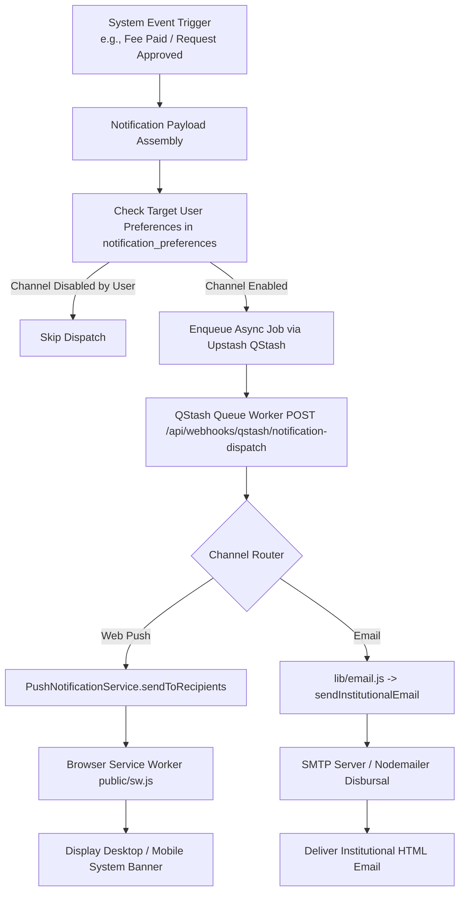
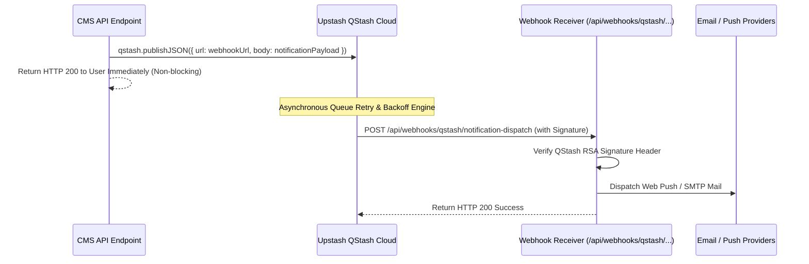

# Multi-Channel Notification Engine Documentation

## 1. Overview & Multi-Channel Architecture

The **KUCET Multi-Channel Notification Engine** delivers operational alerts across three channels: **Browser Web Push Notifications**, **Transactional Institutional Emails**, and **In-App Portal Alerts**.

The system utilizes Upstash QStash for asynchronous queueing, preventing slow third-party email or push gateways from blocking HTTP web responses.



---

## 2. Web Push Notifications (`PushNotificationService.js` & `sw.js`)

Web Push notifications operate using the W3C Push API and VAPID (Voluntary Application Server Identification) cryptographic standards.

### Client Service Worker (`public/sw.js`)
The service worker handles incoming push events, caches offline routes (ID card, fee receipts, timetables), and manages notification click handlers:

```javascript
// Source: public/sw.js
self.addEventListener('push', (event) => {
  const data = event.data ? event.data.json() : {};
  const title = data.title || 'KUCET Notification';
  const options = {
    body: data.body || 'You have a new update.',
    icon: '/favicon.ico',
    badge: '/favicon.ico',
    data: { url: data.url || '/student' }
  };
  event.waitUntil(self.registration.showNotification(title, options));
});

self.addEventListener('notificationclick', (event) => {
  event.notification.close();
  event.waitUntil(clients.openWindow(event.notification.data.url));
});
```

### Push Service Implementation (`PushNotificationService.js`)

```javascript
// Source: src/services/security/PushNotificationService.js
export class PushNotificationService {
  static async subscribe(userId, userType, subscription) {
    const { endpoint, keys } = subscription;
    // Inserts or updates browser push endpoint & P256DH / Auth keys
    await db.insert(pushSubscriptions).values({
      user_id: String(userId),
      user_type: userType.toLowerCase(),
      endpoint,
      p256dh: keys.p256dh,
      auth_secret: keys.auth,
    }).onDuplicateKeyUpdate({
      set: { endpoint, p256dh: keys.p256dh, auth_secret: keys.auth }
    });
  }
}
```

---

## 3. Transactional Institutional Email Engine (`src/lib/email.js`)

Transactional emails (onboarding credentials, fee payment receipts, request approvals, security login alerts) are dispatched via `sendInstitutionalEmail()`.

```javascript
// Source: src/lib/email.js
export async function sendInstitutionalEmail({ to, subject, title, bodyHtml, action }) {
  const htmlTemplate = `
    <div style="font-family: Arial, sans-serif; max-width: 600px; margin: 0 auto; border: 1px solid #e0e0e0;">
      <div style="background-color: #0b3578; color: white; padding: 20px; text-align: center;">
        <h1 style="margin: 0; font-size: 18px;">Kakatiya University College of Engineering & Technology</h1>
      </div>
      <div style="padding: 20px; color: #333333;">
        <h2 style="color: #0b3578; font-size: 16px;">${title}</h2>
        <div>${bodyHtml}</div>
        ${action ? `<div style="margin-top: 25px; text-align: center;">
          <a href="${action.url}" style="background-color: #0b3578; color: white; padding: 10px 20px; text-decoration: none; border-radius: 3px; font-weight: bold;">${action.label}</a>
        </div>` : ''}
      </div>
      <div style="background-color: #f5f5f5; padding: 12px; text-align: center; font-size: 11px; color: #666666;">
        Vidyaranyapuri, Warangal — 506009, Telangana
      </div>
    </div>
  `;

  return await mailTransporter.sendMail({
    from: process.env.EMAIL_FROM || '"KUCET CMS" <noreply@kucet.ac.in>',
    to,
    subject,
    html: htmlTemplate
  });
}
```

---

## 4. Upstash QStash Asynchronous Queues

To guarantee low latency during API executions, push notifications and bulk email dispatches are offloaded to **Upstash QStash**.



---

## 5. User Notification Preferences (`notification_preferences`)

Users maintain granular control over notification channels and categories via `notification_preferences`.

### Schema Definition (`src/db/schema/security.js`)

```javascript
// Source: src/db/schema/security.js
export const notificationPreferences = mysqlTable('notification_preferences', {
  id: int('id').autoincrement().primaryKey().notNull(),
  user_id: varchar('user_id', { length: 255 }).notNull(),
  user_type: varchar('user_type', { length: 50 }).notNull(),
  categories: json('categories').notNull(), // Stores boolean map
  created_at: timestamp('created_at').defaultNow(),
  updated_at: timestamp('updated_at').onUpdateNow(),
});
```

### Configurable Notification Categories

```json
{
  "attendance": true,
  "marks": true,
  "fees": true,
  "system": true,
  "approvals": true
}
```

---

## 6. Cross-References

- User Security & Authentication: [02_AUTHENTICATION.md](../authentication/02_AUTHENTICATION.md)
- Student Requests System: [requests.md](./requests.md)
- Attendance System: [attendance.md](./attendance.md)
- Database Security Schema: [03_DATABASE.md](../database/03_DATABASE.md)
