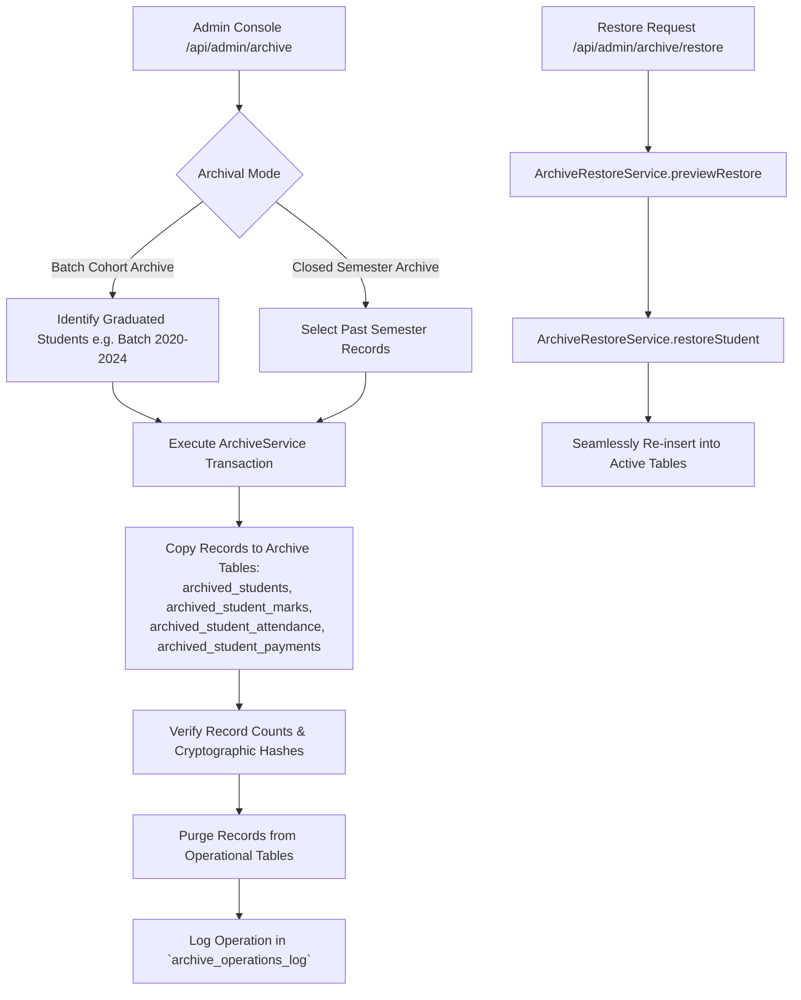
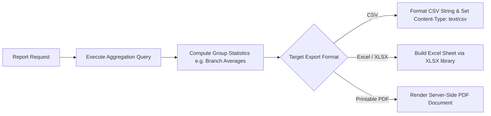

# Reporting & Academic Archival System Documentation

## 1. Overview & Architectural Design

The **KUCET Reporting & Academic Archival System** maintains historical institutional records, generates academic performance summaries, and executes long-term database archiving for graduated student cohorts and completed semesters.

By partitioning historical records away from primary operational tables, the system maintains high query performance on active tables while offering **Zero-Data-Loss Restoration** through `ArchiveService` and `ArchiveRestoreService`.



---

## 2. Long-Term Data Archival Engine (`ArchiveService.js`)

The `ArchiveService` (`src/services/archive/ArchiveService.js`) migrates inactive or graduated student data to archival schema tables (`src/db/schema/archive.js`).

### Operational vs. Archive Table Mapping

| Active Operational Table | Destination Archive Table | Partition / Index Key |
| :--- | :--- | :--- |
| `students` | `archived_students` | `roll_no`, `batch` |
| `student_personal_details` | `archived_student_personal_details` | `archive_student_id` |
| `student_academic_background` | `archived_student_academic_background` | `archive_student_id` |
| `student_attendance` | `archived_student_attendance` | `roll_no`, `academic_year`, `semester` |
| `student_marks` | `archived_student_marks` | `roll_no`, `academic_year`, `semester` |
| `student_fee_payments` | `archived_student_payments` | `roll_no`, `transaction_ref_no` |

---

## 3. Graduated Alumni & Closed Semester Relocation

Archival operations can be triggered by cohort batch or by specific semester filters via `POST /api/admin/archive`.

```javascript
// Source: src/services/archive/ArchiveService.js
export class ArchiveService {
  static async archiveGraduatedCohort({ batch, staffId }) {
    return await db.transaction(async (tx) => {
      // 1. Identify active students matching batch (e.g. '2020-2024')
      const targetStudents = await tx.select().from(students)
        .where(eq(students.batch, batch));

      // 2. Insert into archived_students
      for (const student of targetStudents) {
        const [archivedId] = await tx.insert(archiveStudents).values({ ...student });
        
        // 3. Relocate relational personal details, marks, and attendance
        await tx.insert(archiveStudentPersonalDetails).values({ ...personalData, archive_student_id: archivedId });
        await tx.insert(archiveStudentMarks).values(studentMarksRecords);
        await tx.insert(archiveStudentAttendance).values(studentAttendanceRecords);
      }

      // 4. Delete operational records post-migration
      await tx.delete(students).where(eq(students.batch, batch));

      // 5. Create immutable audit log entry
      await tx.insert(archiveOperationsLog).values({
        action: 'ARCHIVE_COHORT',
        batch,
        record_count: targetStudents.length,
        executed_by: staffId
      });
    });
  }
}
```

---

## 4. Zero-Data-Loss Restoration Engine (`ArchiveRestoreService.js`)

When a graduated student returns for transcript verification or historical records need editing, the `ArchiveRestoreService` (`src/services/archive/ArchiveRestoreService.js`) restores archived records back to active tables without data corruption.

```javascript
// Source: src/services/archive/ArchiveRestoreService.js
export class ArchiveRestoreService {
  static async previewRestore({ type = 'STUDENT', roll_no }) {
    const student = await db.select().from(archiveStudents).where(eq(archiveStudents.roll_no, roll_no));
    if (student.length === 0) return { found: false, message: 'Archived student not found.' };

    const att = await db.select().from(archiveStudentAttendance).where(eq(archiveStudentAttendance.roll_no, roll_no));
    const marks = await db.select().from(archiveStudentMarks).where(eq(archiveStudentMarks.roll_no, roll_no));

    return {
      found: true,
      student: student[0],
      counts: { attendance: att.length, marks: marks.length }
    };
  }

  static async restoreStudent({ roll_no, restored_by }) {
    return await db.transaction(async (tx) => {
      // Moves records from archive tables back to active operational tables
      // Restores PFP and media keys using ArchiveMediaService
    });
  }
}
```

---

## 5. Report Generation Engine & Export Formats

The reporting module generates academic performance ledgers, fee collection summaries, and attendance compliance reports for administrative review.



### Institutional Report Types
1. **Academic Performance Ledgers**: Tabulates Mid-1, Mid-2, Assignment, and Practical marks across branches and sections.
2. **Fee Collection & Scholarship Ledgers**: Summarizes verified student payments, outstanding dues, and pending government scholarship releases.
3. **Attendance Shortage Reports**: Identifies students below the mandatory $75\%$ attendance threshold for condonation or hall ticket retention.

---

## 6. Cross-References

- Database Archive Schemas: [03_DATABASE.md](../database/03_DATABASE.md)
- Internal Marks & Examinations: [examinations.md](./examinations.md)
- Proxy-Free Attendance System: [attendance.md](./attendance.md)
- Financial & Fee Management System: [fees.md](./fees.md)
