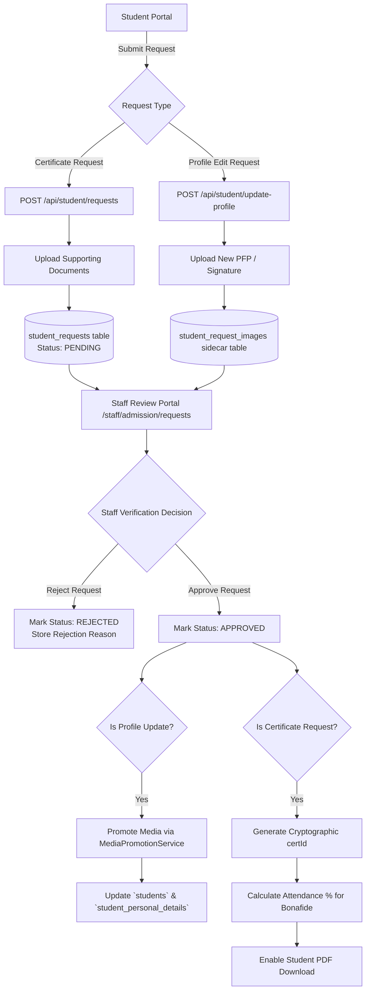
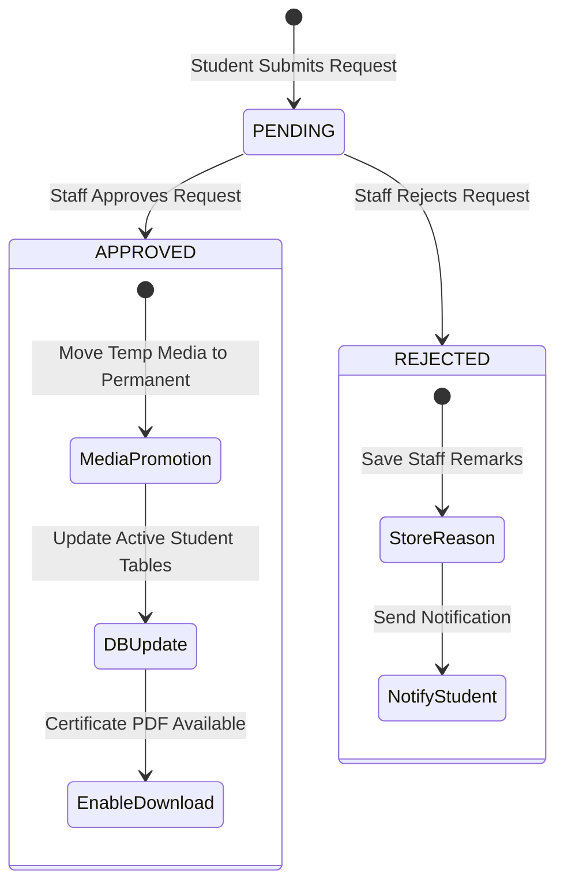

# Student Request Workflow Documentation

## 1. Overview & System Workflow

The **KUCET Student Request System** handles two main categories of administrative requests: **Profile Update Requests** and **Certificate Issuance Requests**.

To protect student registry integrity and prevent unauthorized modifications to institutional records, student profile edits and certificate requests must pass through a clerk approval pipeline.



---

## 2. Student Profile Update Flow

Students can request updates to personal information (e.g., father's name, mother's name, category, sub-caste, religion, income, address, profile photo, signature) via `POST /api/student/update-profile`.

### Profile Update Processing Rules
1. **Pending Request Guard**: A student cannot submit a new profile update request while a previous request is in `PENDING` status.
2. **Sidecar Data Packaging**: Proposed field changes are stored as a JSON object in `student_requests.proposed_changes`.
3. **Staging Storage**: New profile pictures or signatures uploaded by the student are saved in temporary staging folders (`requests/pfp/` and `requests/signatures/`).
4. **Approval & Promotion**: Upon staff approval, `StudentProfileService` applies changes to active tables, and `MediaPromotionService` moves staged assets to permanent paths (`students/pfp/` and `students/signatures/`).

---

## 3. Certificate Application Flow

Students apply for certificates (Bonafide, Migration, TC, Custodian, Conduct, IT, NOC, ID Card) through the student portal.

### Key Endpoint: `POST /api/student/requests`

```javascript
// Payload Structure for Certificate Application
{
  "certificate_type": "Bonafide Certificate",
  "purpose": JSON.stringify({
    "purpose_type": "Bank Loan",
    "purpose_custom": "State Bank of India Warangal Branch"
  }),
  "remarks": "Urgent request for loan processing",
  "attachments": ["kucet/requests/proof_123.jpg"]
}
```

### Attendance Calculation for Bonafide Certificates
For Bonafide Certificates, the staff verification endpoint calculates the student's current semester attendance percentage from `student_attendance` records:
- Evaluates total sessions held vs. present count for the student's active semester.
- Saves the calculated percentage (e.g., `84.5%`) into `student_requests.generated_attendance`.
- Automatically renders this verified attendance figure inside the generated PDF.

---

## 4. Staff Approval & Rejection Pipeline

Staff review pending requests through the `/staff/admission/requests` module (`/api/staff/admission/student-requests`).



### Staff Decision Handlers (`PUT /api/staff/admission/student-requests`)
- **Approval Payload**: `{ "status": "APPROVED", "remarks": "Documents verified." }`
- **Rejection Payload**: `{ "status": "REJECTED", "rejection_reason": "Incomplete fee receipt attachment." }`
- **Audit Logging**: Every approval or rejection logs an entry with staff ID, target student ID, and timestamp.

---

## 5. Verification Seals & Cryptographic Verification (`/verify`)

All approved certificate requests generate a public verification seal accessible via `/verify?id=KUCET-XXXXXXXX&roll=22567T0901`.

```javascript
// Source: src/app/api/public/verify/route.js
export async function GET(request) {
  const { searchParams } = new URL(request.url);
  const certId = searchParams.get('id');
  const rollNo = searchParams.get('roll');

  const cert = await db.query.studentRequests.findFirst({
    where: and(
      eq(studentRequests.generated_certificate_id, certId),
      eq(studentRequests.status, 'APPROVED')
    )
  });

  if (!cert) {
    return apiResponse({ valid: false, message: 'Certificate verification failed or invalid ID.' }, 444);
  }

  return apiResponse({
    valid: true,
    certificateId: cert.generated_certificate_id,
    studentName: cert.student.name,
    rollNo: cert.student.roll_no,
    certificateType: cert.certificate_type,
    issuedDate: cert.updated_at
  });
}
```

---

## 6. Media Asset Promotion Engine (`MediaPromotionService`)

The `MediaPromotionService` (`src/services/storage/MediaPromotionService.js`) handles asset promotion from temporary staging to permanent storage.

### Storage Lifecycle Flow

```
Temporary Staging:
kucet/requests/pfp/upload_123.jpg       --> Promoted To --> kucet/students/pfp/student_456.jpg
kucet/admission_drafts/signatures/a.png --> Promoted To --> kucet/students/signatures/student_456.png
```

### Transactional Promotion with Rollback Protection

```javascript
// Source: src/services/storage/MediaPromotionService.js
static async promoteRequestMedia({ studentId, newPfp, newSignature }, tx) {
  let movedPfpResult = null;
  let movedSigResult = null;

  try {
    // 1. Move PFP file in storage provider
    if (newPfp && this.isTemporaryPfp(newPfp)) {
      movedPfpResult = await this.promoteStudentProfile(newPfp);
    }
    // 2. Move Signature file in storage provider
    if (newSignature && this.isTemporarySignature(newSignature)) {
      movedSigResult = await this.promoteStudentSignature(newSignature);
    }

    // 3. Update DB records inside transaction
    await tx.insert(studentImages).values({ student_id: studentId, pfp: movedPfpResult.newKey })
      .onDuplicateKeyUpdate({ set: { pfp: movedPfpResult.newKey } });

    return { promotedPfp: movedPfpResult?.newKey, promotedSig: movedSigResult?.newKey };
  } catch (error) {
    // ROLLBACK SAFETY: Restore original temporary files if DB update fails
    const storage = getStorageProvider();
    if (movedPfpResult?.moved) {
      await storage.moveFile(movedPfpResult.newKey, originalFolder);
    }
    throw error;
  }
}
```

---

## 7. Sidecar Table Handling (`student_request_images`)

When students submit requests requiring file evidence (such as income certificates, fee payment receipts, or caste certificates), files are stored in the sidecar table `student_request_images`.

### Database Schema Definition

```javascript
// Source: src/db/schema/operations.js
export const studentRequestImages = mysqlTable('student_request_images', {
  id: int('id').autoincrement().primaryKey().notNull(),
  request_id: int('request_id').notNull(),
  image_url: text('image_url').notNull(),
  created_at: timestamp('created_at').defaultNow(),
}, (table) => ({
  requestIdx: index('idx_sri_request').on(table.request_id),
}));
```

### Attachment Lifecycle
1. **Upload**: During request submission, images are saved via `StorageProvider` and returned as keys (`kucet/requests/attachments/...`).
2. **Association**: Image URLs are inserted into `student_request_images` referencing the `request_id`.
3. **Clerk View**: The clerk request viewer resolves asset data URLs dynamically for verification.
4. **Purge Policy**: Rejected request sidecar files are purged by the archival cleanup job after 90 days.

---

## 9. Isolated Edit & Review Modals Architecture (`src/components/ui/edit-modals/`)

To guarantee component modularity, prevent cross-panel state contamination, and optimize client bundle re-rendering performance, all administrative review and modal interfaces are isolated into dedicated UI modules under `src/components/ui/edit-modals/`:

### 1. `AdmissionModal.js` (`/components/ui/edit-modals/AdmissionModal.js`)
- Consolidates applicant review, draft editing, document inspection, and admission decision actions (Verify / Reject / Restore / Save Draft).
- Features stateful image error fallbacks (`imgError`, `sigError`) avoiding direct DOM tree mutations.
- Multi-section layout: Primary Identity Record, Entrance Examination Details, Academic Background, Reservation/Quota, Address & Contacts, and Document Verification.

### 2. `CertificateReviewModal.js` (`/components/ui/edit-modals/CertificateReviewModal.js`)
- Dedicated portal modal for document verification and certificate approvals.
- Integrates `CertificateActionPanel` with async approval submission, automated rejection reason dialog triggers, and reactive list refresh across the records office.

### 3. `StudentUpdateReviewModal.js` (`/components/ui/edit-modals/StudentUpdateReviewModal.js`)
- Slide-over drawer modal rendering side-by-side comparisons of current student database records versus requested modifications (e.g. Current vs Requested PFP, Signature, and field data diffs).
- Direct document preview modal portal with high-resolution image zoom.

---

## 10. Cross-References

- Digital Certificate Engine: [certificates.md](./certificates.md)
- Admission System & Draft Staging: [admissions.md](./admissions.md)
- System Storage Architecture: [storage.md](../architecture/storage.md)
- User Authentication: [authentication.md](../authentication/authentication.md)

