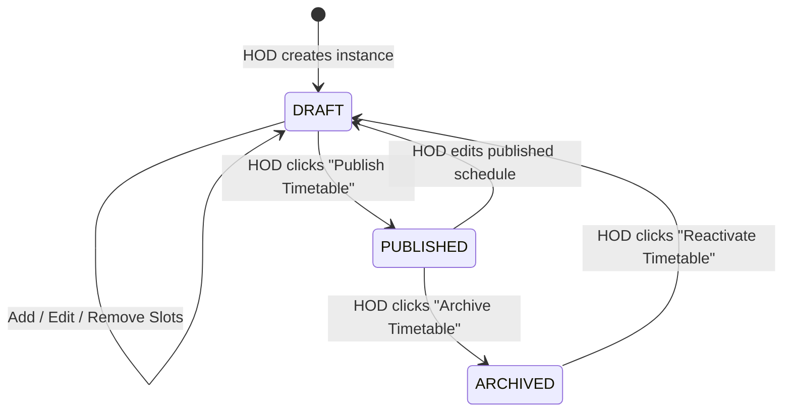

# Universal Timetable Engine & Departmental Lifecycle Architecture

**System Version:** Session 213 (Current Production Baseline)  
**Status:** Active Production / Synchronized  
**Schema Definition:** `src/db/schema/operations.js` (`timetable_instances`, `branch_timetable`)  
**API Endpoints:** `/api/staff/hod/timetable-instances/*`, `/api/staff/faculty/my-timetable`, `/api/student/timetable`

---

## 1. Executive Summary & Problem Context

Prior to Session 213, timetable scheduling operated on a flat table structure (`branch_timetable`). While functional for direct retrieval, it lacked essential departmental lifecycle governance:
1. **Live Intermediate Edits**: Any change made by an HOD to individual slots appeared immediately to faculty and students, causing students to view incomplete schedules during curriculum drafting.
2. **Atomic Semester Publishing**: Departments required the ability to prepare 42-slot weekly matrices (6 days $\times$ 7 periods) in a `DRAFT` state, test faculty assignments against conflict rules, and atomically transition them to `PUBLISHED`.
3. **Institutional Realignment (KUCET Context)**:
   - **No Sections**: Generic college management systems introduce Section A, Section B, Section C. Kakatiya University College of Engineering and Technology (KUCET) admits a single batch per branch/year. Sections do not exist in institutional reality.
   - **No Database `year_level` Denormalization**: Engineering semester numbers (1 through 8) deterministically map to B.Tech Year Levels 1 through 4 via `Math.ceil(semester / 2)`. Persisting `year_level` as an independent column was redundant and conflicted with unique constraints.

Session 213 established a clean, parent-child container architecture with zero data bloat, robust faculty scheduling conflict checks, and real-time push notification updates to students.

---

## 2. Relational Database Schema & Invariants

```text
┌────────────────────────────────────────────────────────────┐
│                    timetable_instances                     │
├────────────────────────────────────────────────────────────┤
│ id: int AUTO_INCREMENT PK                                  │
│ branch: varchar(50) NOT NULL                               │
│ semester: tinyint NOT NULL                                 │
│ academic_year: varchar(9) NOT NULL                         │
│ status: enum('DRAFT', 'PUBLISHED', 'ARCHIVED') NOT NULL    │
│ created_by: int NULL                                       │
│ created_at: timestamp DEFAULT NOW()                        │
│ updated_at: timestamp ON UPDATE CURRENT_TIMESTAMP          │
│ published_at: timestamp NULL                               │
│ updated_by: int NULL                                       │
│                                                            │
│ CONSTRAINT uq_timetable_instance UNIQUE                    │
│   (branch, semester, academic_year)                        │
└─────────────────────────────┬──────────────────────────────┘
                              │ 1
                              │
                              │ has many
                              │
                              ▼ *
┌────────────────────────────────────────────────────────────┐
│                      branch_timetable                      │
├────────────────────────────────────────────────────────────┤
│ id: int AUTO_INCREMENT PK                                  │
│ timetable_instance_id: int NULL (INDEX idx_bt_instance)    │
│ branch: varchar(50) NOT NULL                               │
│ semester: tinyint NOT NULL                                 │
│ section: varchar(5) DEFAULT 'A'                            │
│ day_of_week: enum('MON','TUE','WED','THU','FRI','SAT')     │
│ period_number: int NOT NULL (1 to 7)                       │
│ subject_code: varchar(50) NULL                             │
│ faculty_id: int NULL (INDEX idx_bt_faculty)                │
│ academic_year: varchar(9) NOT NULL                         │
│ room_no: varchar(20) NULL                                  │
│ version: int DEFAULT 1 NOT NULL                            │
│ created_at / updated_at                                    │
│                                                            │
│ CONSTRAINT uq_timetable_slot UNIQUE                        │
│   (branch, semester, section, day_of_week, period_number,  │
│    academic_year)                                          │
└────────────────────────────────────────────────────────────┘
```

### Inviolable Invariants:
1. **Zero Section Bloat**: `timetable_instances` does NOT contain a `section` column. `uq_timetable_instance` enforces uniqueness strictly on `(branch, semester, academic_year)`.
2. **Computed Year Level**: `year_level` is NOT stored in the database. Client and server layers derive it on demand using:
   $$\text{year\_level} = \left\lceil \frac{\text{semester}}{2} \right\rceil$$
3. **Zero Legacy Data Loss**: Any historical `branch_timetable` records created prior to Migration 0019 are backfilled into a `PUBLISHED` parent instance, ensuring faculty and students never experience blank timetable views.

---

## 3. Departmental & Academic Lifecycle States



| Lifecycle State | Who Can Edit? | Student Visibility | Faculty Visibility |
| :--- | :---: | :---: | :---: |
| `DRAFT` | HOD only | ❌ Invisible | ❌ Invisible |
| `PUBLISHED` | HOD (with edit mode toggle) | ✅ Visible | ✅ Visible (Personal Teaching Schedule) |
| `ARCHIVED` | Read-only (must reactivate to edit) | ❌ Replaced by active | ❌ Invisible |

---

## 4. API Endpoints Reference

### 4.1 HOD Endpoints (`/api/staff/hod/timetable-instances/*`)

- **`GET /api/staff/hod/timetable-instances`**:
  - Lists all timetable instances belonging to the HOD's affiliated department branches.
  - Returns `{ data: [...instances], systemYear: '2025-26' }`.
  - Super Admin (`role === 'admin'`) receives access to all branches college-wide.

- **`POST /api/staff/hod/timetable-instances`**:
  - Creates a new instance in `DRAFT` state.
  - Zod Input Validation:
    ```javascript
    const createInstanceSchema = z.object({
      branch: z.string().trim().min(1).max(50),
      semester: z.number().int().min(1).max(8),
      academic_year: z.string().regex(/^\d{4}-\d{2}$/, 'Format must be YYYY-YY')
    });
    ```

- **`GET /api/staff/hod/timetable-instances/[id]`**:
  - Retrieves the parent instance and all child slot entries joined with `syllabus_subjects` and `staffAccounts` (instructor name).

- **`PUT /api/staff/hod/timetable-instances/[id]`**:
  - Transitions instance status between `DRAFT`, `PUBLISHED`, and `ARCHIVED`.
  - On `status === 'PUBLISHED'`, sets `published_at = NOW()` and broadcasts SSE event `TIMETABLE_CHANGED`.

- **`POST /api/staff/hod/timetable-instances/[id]/entries`**:
  - Creates or updates an individual class slot (`day_of_week`, `period_number`, `subject_code`, `faculty_id`, `room_no`).
  - **Faculty Conflict Prevention Engine**: Checks whether the instructor is already scheduled during that period in any other published or in-draft class across the entire institution, strictly excluding the slot currently being modified to avoid false-positive self-conflicts.

- **`DELETE /api/staff/hod/timetable-instances/[id]/entries?entryId=[id]`**:
  - Removes a scheduled lecture slot and broadcasts `TIMETABLE_CHANGED`.

---

### 4.2 Faculty & Student Endpoints

- **`GET /api/staff/faculty/my-timetable`**:
  - Returns the authenticated faculty member's personal weekly schedule across all branches and semesters.
  - Joins `branch_timetable` with `timetable_instances` filtering by `timetable_instances.status = 'PUBLISHED'`.

- **`GET /api/student/timetable`**:
  - Resolves logged-in student's branch and semester from roll number.
  - Returns the published timetable for the current academic session.

---

## 5. UI & Component Architecture

### Component Hierarchy:
- **`UniversalTimetable.js`**: Shared, responsive 6-day $\times$ 7-period grid with break markers (11:10 Short Break, 01:00 Lunch Break), live active-period highlighting, and mobile swipe controls.
- **`SlotEditorModal.js`**: HOD modal for assigning theory/lab subjects or institutional activities (Library, Sports, Seminars) to periods with instant previous-period duplication.
- **`PersonalSchedule.js`**: Faculty personal timetable view.
- **`/staff/faculty/time-table/page.js`**: Role-aware hub rendering HOD department management or faculty personal schedule depending on `staffData.is_hod`.

---

## 6. Zero-Downtime Migration & Data Backfill Strategy

When deploying to production environments, existing rows in `branch_timetable` must be linked to parent instances to prevent an `INNER JOIN` visibility outage:

```sql
START TRANSACTION;

-- 1. Create a PUBLISHED parent instance for all existing timetable cohorts
INSERT IGNORE INTO timetable_instances (branch, semester, academic_year, status, published_at, created_at)
SELECT DISTINCT branch, semester, academic_year, 'PUBLISHED', NOW(), NOW()
FROM branch_timetable
WHERE branch IS NOT NULL AND semester IS NOT NULL;

-- 2. Link every existing slot to its newly created parent instance
UPDATE branch_timetable bt
JOIN timetable_instances ti 
  ON bt.branch = ti.branch 
 AND bt.semester = ti.semester 
 AND bt.academic_year = ti.academic_year
SET bt.timetable_instance_id = ti.id
WHERE bt.timetable_instance_id IS NULL;

COMMIT;
```

---

## 7. Verification & Automated Test Coverage

The subsystem is fully verified under Vitest:
- `tests/unit/api/staff/hod-timetable-instances.test.js` (8 tests):
  - Validates instance payload formatting and semester bounds (1-8).
  - Validates status transitions (`DRAFT`, `PUBLISHED`, `ARCHIVED`).
  - Validates faculty conflict detection and period slot assignment boundaries.
- **Test Suite Verification**: 72 test files (585 unit tests) passing 100%.
