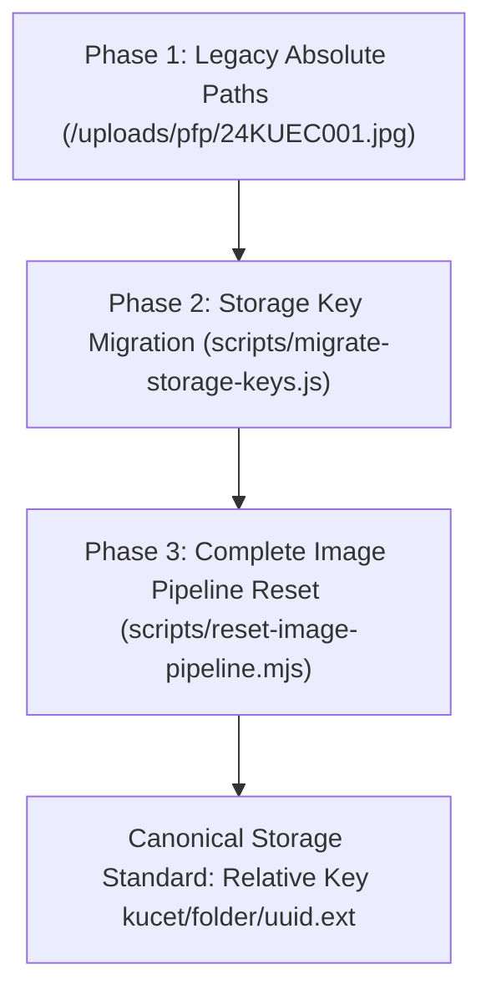

# Database & Infrastructure Migration Log

**Last Updated:** August 18, 2026  
**Status:** Historical & Architectural Log  
**Scope:** Drizzle ORM Schema Migrations (`0000` to `0013`), Storage Key Transformations, and Infrastructure Upgrades.

---

## 1. Drizzle ORM Migration Evolution (`0000` to `0013`)

The database schema evolution is managed version-by-version using Drizzle Kit. Each migration SQL script in `drizzle/` represents a milestone in database structure and data integrity.

| Migration Tag | File Name | Key Schema Transformations & Features Introduced |
| :--- | :--- | :--- |
| **`0000`** | `0000_flippant_fabian_cortez.sql` | **Initial Baseline Schema:** Created core tables for Identity (`students`, `clerks`, `principal`), Academic (`college_info`, `syllabus_subjects`), Registry (`student_personal_details`), and Operations (`student_attendance`, `student_marks`). |
| **`0001`** | `0001_sharp_polaris.sql` | **Session Management & Device Tracking:** Introduced `user_sessions` and `otp_codes` tables with HTTP-only token tracking, remote revocation, and IP/User-Agent heuristics. |
| **`0002`** | `0002_flat_mephistopheles.sql` | **Financial Infrastructure:** Added `student_payments` and `scholarship_sanctions` tables for institutional fee tracking and government reimbursement management. |
| **`0003`** | `0003_zippy_agent_zero.sql` | **Financial Integrity Guards:** Created `idempotency_keys` table for transaction locks and added SHA-256 fingerprinting to payment evidence. |
| **`0004`** | `0004_funny_starfox.sql` | **Security Audit & Push Engine:** Added `security_events`, `audit_logs`, `push_subscriptions`, and `notification_preferences` tables. |
| **`0005`** | `0005_redundant_adam_destine.sql` | **Academic Timetable & Calendar:** Added `academic_calendar`, `branch_timetable`, and `faculty_subject_assignments` for multi-semester HOD scheduling. |
| **`0006`** | `0006_cool_yellowjacket.sql` | **Address & Admission Schema:** Expanded `student_personal_details` and `student_admission_drafts` with Current and Permanent address columns. |
| **`0007`** | `0007_flippant_harry_osborn.sql` | **SC Sub-Caste & EWS Standard:** Expanded category enum to support four SC sub-castes (`SC-A`, `SC-B`, `SC-C`, `SC-D`) and standardized `OC-EWS` to `EWS`. |
| **`0008`** | `0008_solid_black_tarantula.sql` | **Academic Data Archival Engine:** Created `archive_students`, `archive_student_personal_details`, `archive_student_attendance`, `archive_student_marks`, `archive_student_payments`, and `archive_operations_log` tables. |
| **`0009`** | `0009_tiny_sabretooth.sql` | **Restoration Constraint Alignment:** Added fallback default column parameters (`session_pin`, `attendance_date`, `expires_at`) to match operational constraints during data restoration. |
| **`0010`** | `0010_tan_cerebro.sql` | **Institutional Asset Metadata:** Added institutional asset protection tracking and logical asset key resolution tables. |
| **`0011`** | `0011_curious_terrax.sql` | **Payment Screenshot Consolidation:** Consolidated request payment evidence into `student_request_images` sidecar table and safely dropped legacy redundant column `student_requests.payment_screenshot`. |
| **`0012`** | `0012_clerk_registration_requests.sql` | **Staff Onboarding & Branch Verification:** Added `clerk_registration_requests` table for multi-role pending staff approvals and HOD branch constraint validation. |
| **`0013`** | `0013_thin_outlaw_kid.sql` | **Performance & Foreign Key Indexes:** Optimized indexes across active operations and registration lookup tables. |
| **`0014`** | `0014_zero_clerk_hard_break.sql` | **Zero Clerk Hard Break & Staff Unification:** Migrated all role enums from `clerk` to `staff`, dropped legacy `clerks` and `clerk_registration_requests` tables. |
| **`0015`** | `0015_database_backup_logs.sql` | **Database Backup & Recovery Engine:** Created `database_backup_logs` operational metadata table tracking backup filenames, SHA-256 checksums, durations, types, and statuses. |
| **`0016`** | `0016_elective_groups.sql` | **Elective Groups & Curriculum Structure:** Created `elective_groups` and `elective_group_subjects` tables for professional, open, and mandatory non-credit course buckets. |

---

## 2. Cloudinary & Storage Key Migrations

Over the course of production hardening, the storage architecture underwent three major migrations:



### A. Storage Key Migration Script (`scripts/migrate-storage-keys.js`)
- **Objective:** Stripped absolute domain URLs (`https://res.cloudinary.com/...`) and local directory prefixes (`uploads/`, `public/`) from all database image columns.
- **Result:** Transformed legacy records into clean relative storage keys (e.g., `requests/pfp/7a59662b-8a4e.webp`).

### B. Complete Pipeline Reset & Canonical Rebuild (`scripts/reset-image-pipeline.mjs`)
- **Executed:** Session 200 (August 10, 2026).
- **Actions Performed:**
  1. Deleted 181 orphaned user-uploaded assets from Cloudinary across root category namespaces (`students/`, `requests/`, `clerks/`, `admission_drafts/`, `certificates/`) and `kucet/` subtree folders.
  2. Preserved institutional branding media under `kucet/institution/`.
  3. Reset corrupted image columns to `NULL` across operational tables.
  4. Enforced randomized UUID filenames (`crypto.randomUUID()`) for all future uploads.

---

## 3. Deprecations & Schema Transformations

- **Legacy Column Drop (`student_requests.payment_screenshot`):** Consolidated into sidecar table `student_request_images` via migration `0011_curious_terrax.sql`.
- **Legacy Category Enum (`OC-EWS`):** Standardized to `EWS` across database constraints, validation schemas, and import sanitizers.
- **Legacy Local Path Fallbacks (`process.cwd() + '/public/uploads'`):** Replaced with central configuration `src/lib/storage-config.js` and `LocalStorageProvider.getLocalStorageBasePath()`.
- **Session 207 — `clerk_registration_requests` renamed → `staff_registration_requests`:** Columns `branch`, `department`, `mobile` dropped; new columns `requested_role`, `academic_affiliations` (JSON), `email_verified_at` added.

---

## 4. Session 206 Hardening & Environment Synchronization

- **QStash Webhook Signature Verification:** Implemented `verifySignatureAppRouter` across all 7 background endpoints (`archive-job`, `notification-dispatch`, `generate-pdf`, `report-generation`, `send-email`, `bulk-import`, `dlq`).
- **Web Push Engine (VAPID):** Added `PushNotificationService.sendToRecipients()` with `web-push`, automatic VAPID authorization, and dead subscription pruning (404/410).
- **Synchronous Fallback Processing:** Added transaction-level batch processing for admissions bulk import when external queueing services are disabled.
- **Environment Template Alignment:** Rebuilt `.env.example` and `DEPLOYMENT_PACKAGE/.env.production.template` to reflect the 32 active variables across 12 distinct functional categories.

---

## 5. Session 207 (testvanilla) — Staff Identity System Overhaul

> ⚠️ **Migration not yet run.** This branch is pre-merge. Run `npm run db:generate` then `npm run db:migrate` before deploying.

### New Tables Introduced

| Table | Schema File | Purpose |
|---|---|---|
| `staff_accounts` | `identity.js` | Unified staff identity (replaces `clerks` for new hires) |
| `staff_roles` | `identity.js` | Role code lookup (`FACULTY`, `ADMISSION_CLERK`, `SCHOLARSHIP_CLERK`) |
| `staff_account_roles` | `identity.js` | Many-to-many: staff ↔ roles with `assigned_by` audit |
| `staff_academic_affiliations` | `identity.js` | Faculty → department + program links (replaces `clerks.branch`) |
| `staff_account_activation_tokens` | `identity.js` | SHA-256 hashed one-time activation tokens (48hr expiry) |
| `academic_departments` | `academic.js` | Institutional department registry |
| `academic_programs` | `academic.js` | Programs/courses per department |

### Modified Table

| Table | Was | Change |
|---|---|---|
| `staff_registration_requests` | `clerk_registration_requests` | Renamed + 3 cols dropped + 3 cols added (`requested_role`, `academic_affiliations JSON`, `email_verified_at`) |

### Required Seed SQL After Migration

```sql
-- Seed staff_roles
INSERT INTO staff_roles (role_code, description) VALUES
  ('FACULTY',           'Teaching staff — course and attendance management'),
  ('ADMISSION_CLERK',   'Manages student admissions and enrollment'),
  ('SCHOLARSHIP_CLERK', 'Manages scholarship applications and payments');

-- Seed academic_departments
INSERT INTO academic_departments (department_code, department_name, is_active) VALUES
  ('CSE',   'Computer Science & Engineering', 1),
  ('ECE',   'Electronics & Communication Engineering', 1),
  ('MECH',  'Mechanical Engineering', 1),
  ('CIVIL', 'Civil Engineering', 1),
  ('EEE',   'Electrical & Electronics Engineering', 1),
  ('IT',    'Information Technology', 1);
```

### Cookie Invalidation Warning
All `clerk_auth` sessions are invalidated on deployment. Staff must re-login. Existing `clerks` table records remain intact — only new registrations go to `staff_accounts`.

### Full Analysis
See [Session 207 Complete Change Analysis](./session-207-testvanilla-changes.md) for exhaustive schema definitions, API reference, workflow diagrams, and deployment checklist.

---

## 5. Session 207 Infrastructure & Storage Pipeline Hardening (August 21, 2026)

### Infrastructure & Deployment Orchestration Updates
- **Canonical Storage Hierarchy**: Standardized host media persistence to `/var/www/kucet-storage` and container mount to `/app/storage`. Removed obsolete legacy `/var/www/kucet-storage/public` paths across all deployment manifests and health checks.
- **Least-Privilege Storage Initialization**: Created [`DEPLOYMENT_PACKAGE/SCRIPTS/prepare-storage.sh`](../../DEPLOYMENT_PACKAGE/SCRIPTS/prepare-storage.sh) to safely configure permissions on upload subdirectories (`students/pfp`, `staff/signatures`, `requests/proofs`, etc.) for Docker user `nextjs` (`UID 1001`, `GID 1001`) with mode `775` while keeping institutional assets read-only (`755`) and database backups locked down (`/var/kucet-db-backup`, `700`). Completely eliminated `chmod 777`.
- **Idempotent Network Attachment**: Implemented inspect-before-connect logic in [`deploy.sh`](../../DEPLOYMENT_PACKAGE/SCRIPTS/deploy.sh) and [`rollback.sh`](../../DEPLOYMENT_PACKAGE/SCRIPTS/rollback.sh), eliminating Docker daemon conflict errors.
- **Diagnostic Health Check**: Rebuilt [`health-check.sh`](../../DEPLOYMENT_PACKAGE/SCRIPTS/health-check.sh) to execute active container-level write/read/delete tests inside `/app/storage/kucet/.health_test` with user-scoped temporary logs (`/tmp/kucet_health_check_${UID}.log`).

---

## 6. Session 207 Final Hard-Break Cleanup & Faculty Attendance Validation (August 22, 2026)

### Key Engineering Milestones:
- **Zero Backward Compatibility**: Cleaned all remaining legacy role strings (`ADMISSION_CLERK`, `SCHOLARSHIP_CLERK`), deleted string replacement fallbacks in admin approval, and enforced strict canonical staff categories (`FACULTY`, `ADMISSION_STAFF`, `SCHOLARSHIP_STAFF`).
- **Faculty Attendance & Topic Module**: Standardized required lecture topic capture ($\ge 2$ characters, trimmed, max 500 characters), unified Topic Modal on both desktop and mobile attendance sheets, and secured PATCH topic API with session ownership validation.
- **Admission Drafts Auto-Loading**: Added zero-click mount fetching in admission requests and wired realtime SSE broadcasts (`ADMISSION_DRAFT_CREATED`, `ADMISSION_DRAFT_UPDATED`, `ADMISSION_DRAFT_FINALIZED`).
- **Storage & CSP Fixes**: Added asset proxy fallback to Cloudinary CDN on serverless/Render environments (`/api/assets/view/[...path]`) and resolved CSP blob worker warnings with `child-src 'self' blob:;`.
- **Test Suite Verification**: 50/50 test files passed (370/370 unit tests passed), 0 ESLint errors, 203/203 Next.js routes built.

---

## 7. Session 209 Multi-Service Production Deployment & Elective Groups Architecture (August 31, 2026)

### Key Engineering Milestones:
- **Elective Groups & Curriculum Structure (`src/db/schema/academic.js`)**:
  - Introduced `elective_groups` table with `group_type` enum (`PROFESSIONAL_ELECTIVE`, `OPEN_ELECTIVE`, `MANDATORY_NON_CREDIT`, `OTHER`), `subject_mode` (`theory`/`lab`), sequence numbers, and unique constraint on `(branch, semester, group_code)`.
  - Introduced `elective_group_subjects` junction table with foreign keys to `elective_groups.id` and `syllabus_subjects.subject_code` with `onDelete: 'restrict'`.
  - Upgraded `/api/staff/hod/syllabus` with full CRUD action dispatcher (`ADD_CORE_SUBJECT`, `ADD_ELECTIVE_GROUP`, `ADD_ELECTIVE_SUBJECT`, `EDIT_SUBJECT`, `EDIT_ELECTIVE_GROUP`, `DELETE_CORE_MAPPING`, `DELETE_ELECTIVE_GROUP`, `REMOVE_FROM_GROUP`) and authorized branch boundaries.
  - Revamped `SyllabusManager.js` UI with interactive modals, Theory/Lab badges, and real-time state synchronization.
- **Docker Compose Multi-Service Lifecycle**:
  - Updated `deploy.sh` and `rollback.sh` to build and manage both `app` and `realtime` containers concurrently (`up -d --build --no-deps app realtime`).
  - Removed `DEPLOYMENT_PACKAGE` exclusion from `.dockerignore` to allow BuildKit to copy `Dockerfile.realtime` configuration files.
  - Replaced `express` with Node.js built-in `http.createServer` in `socket-server.js` for zero-dependency native health checking on port 4000.
  - Hardened `health-check.sh` with container classification (critical vs optional) and HTTP retry loops, resolving Nginx upstream DNS resolution crash loops and preventing spurious deployment rollbacks.
- **Test Suite & Build Verification**: 57/57 test files passed (437/437 unit tests passed), 208 Next.js routes built.

---

## 8. Session 210 — Admission Soft Rejection, Status History & Controlled Restoration (August 31, 2026)

### Problem & Forensic Analysis:
Prior to Session 210, rejecting a student admission draft executed an unrecoverable hard deletion (`db.delete(studentAdmissionDrafts)` and `storage.delete(pfp, signature)`), permanently wiping student records and proof assets upon rejection.

### Architectural Solution:
- **Migration `0018_admission_rejection_and_history.sql`**:
  - Extended `student_admission_drafts.status` enum to `('DRAFT','PROCESSED','FINALIZED','REJECTED')`.
  - Added audit metadata columns: `rejection_reason`, `rejected_by_staff_id`, `rejected_at`, `restored_by_staff_id`, `restored_at`, `restoration_reason`.
  - Created immutable `admission_status_history` table (`id`, `draft_id`, `old_status`, `new_status`, `reason`, `changed_by_user_id`, `changed_by_user_type`, `metadata`, `created_at`).
- **Atomic Transactional Rejection (`PUT /api/staff/admission/drafts/[id]`)**:
  - Transitions status to `REJECTED` in a database transaction.
  - Inserts transition record into `admission_status_history` and `audit_logs`.
  - Preserves all uploaded candidate media and identity documentation intact.
- **Application-Level Controlled Restoration (`POST /api/staff/admission/drafts/[id]/restore`)**:
  - Allows authorized staff/admin to review rejected applications and restore them back to the intake queue with a mandatory restoration reason and audit logging.
- **Admission Queue UI Overhaul (`AdmissionRequestsPanel.js` & `AdmissionModal.js`)**:
  - Added dedicated **Rejected Applications** tab with quick search, rejection reason previews, full lifecycle audit history timeline, and 1-click application restoration.
- **Test Suite Verification**: 58/58 test files passed (454/454 unit tests passed).

---

## 9. Cross-References & Related Documentation

- [System Architectural Decision Records (ADRs)](./architectural-decisions.md)
- [Chronological Forensics of Resolved Incidents](./resolved-incidents.md)
- [Database Schema Reference](../database/schema.md)
- [Backend Architecture & Service Ecosystem](../architecture/backend.md)
- [Production Deployment & DevOps Specification](../architecture/deployment.md)
- [Head of Department (HOD) Console](../pages/hod-pages.md)


