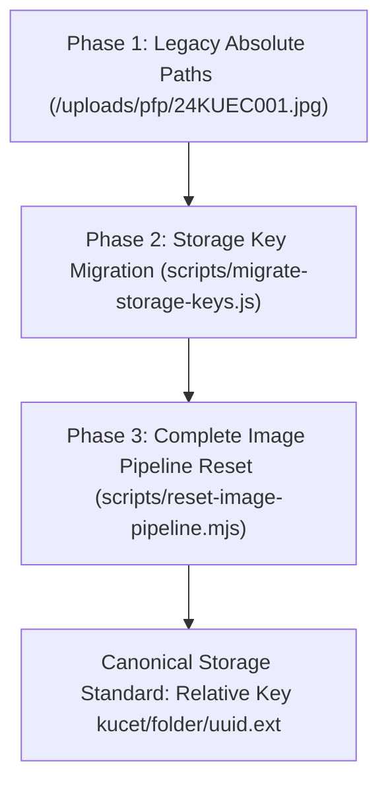

# Database & Infrastructure Migration Log

**Last Updated:** August 11, 2026  
**Status:** Historical & Architectural Log  
**Scope:** Drizzle ORM Schema Migrations (`0000` to `0011`), Storage Key Transformations, and Infrastructure Upgrades.

---

## 1. Drizzle ORM Migration Evolution (`0000` to `0011`)

The database schema evolution is managed version-by-version using Drizzle Kit. Each migration SQL script in `drizzle/` represents a milestone in database structure and data integrity.

| Migration Tag | File Name | Key Schema Transformations & Features Introduced |
| :--- | :--- | :--- |
| **`0000`** | `0000_flippant_fabian_cortez.sql` | **Initial Baseline Schema:** Created core tables for Identity (`students`, `clerks`, `principal`), Academic (`college_info`, `syllabus_subjects`), Registry (`student_personal_details`), and Operations (`student_attendance`, `student_marks`). |
| **`0001`** | `0001_sharp_polaris.sql` | **Session Management & Device Tracking:** Introduced `user_sessions` and `otp_codes` tables with HTTP-only token tracking, remote revocation, and IP/User-Agent heuristics. |
| **`0002`** | `0002_flat_mephistopheles.sql` | **Financial Infrastructure:** Added `student_payments` and `scholarship_sanctions` tables for institutional fee tracking and government reimbursement management. |
| **`0003`** | `0003_zippy_agent_zero.sql` | **Financial Integrity Guards:** Created `idempotency_keys` table for transaction locks and added SHA-256 fingerprinting to payment evidence. |
| **`0004`** | `0004_funny_starfox.sql` | **Security Audit & Push Engine:** Added `security_events`, `audit_logs`, `push_subscriptions`, and `notification_preferences` tables. |
| **`0005`** | `0005_redundant_adam_destine.sql` | **Academic Timetable & Calendar:** Added `academic_calendar`, `branch_timetable`, and `faculty_subject_assignments` for multi-semester HOD scheduling. |
| **`0006`** | `0006_cool_yellowjacket.sql` | **Address & Admission Schema:** Expanded `student_personal_details` and `student_admission_drafts` with Current and Permanent address columns. |
| **`0007`** | `0007_flippant_harry_osborn.sql` | **SC Sub-Caste & EWS Standard:** Expanded category enum to support four SC sub-castes (`SC-A`, `SC-B`, `SC-C`, `SC-D`) and standardized `OC-EWS` to `EWS`. |
| **`0008`** | `0008_solid_black_tarantula.sql` | **Academic Data Archival Engine:** Created `archive_students`, `archive_student_personal_details`, `archive_student_attendance`, `archive_student_marks`, `archive_student_payments`, and `archive_operations_log` tables. |
| **`0009`** | `0009_tiny_sabretooth.sql` | **Restoration Constraint Alignment:** Added fallback default column parameters (`session_pin`, `attendance_date`, `expires_at`) to match operational constraints during data restoration. |
| **`0010`** | `0010_tan_cerebro.sql` | **Institutional Asset Metadata:** Added institutional asset protection tracking and logical asset key resolution tables. |
| **`0011`** | `0011_curious_terrax.sql` | **Payment Screenshot Consolidation:** Consolidated request payment evidence into `student_request_images` sidecar table and safely dropped legacy redundant column `student_requests.payment_screenshot`. |

---

## 2. Cloudinary & Storage Key Migrations

Over the course of production hardening, the storage architecture underwent three major migrations:

### A. Storage Key Migration Script (`scripts/migrate-storage-keys.js`)
- **Objective:** Stripped absolute domain URLs (`https://res.cloudinary.com/...`) and local directory prefixes (`uploads/`, `public/`) from all database image columns.
- **Result:** Transformed legacy records into clean relative storage keys (e.g., `requests/pfp/7a59662b-8a4e.webp`).

### B. Complete Pipeline Reset & Canonical Rebuild (`scripts/reset-image-pipeline.mjs`)
- **Executed:** Session 200 (August 10, 2026).
- **Actions Performed:**
  1. Deleted 181 orphaned user-uploaded assets from Cloudinary across root category namespaces (`students/`, `requests/`, `clerks/`, `admission_drafts/`, `certificates/`) and `kucet/` subtree folders.
  2. Preserved institutional branding media under `kucet/institution/`.
  3. Reset corrupted image columns to `NULL` across operational tables.
  4. Enforced randomized UUID filenames (`crypto.randomUUID()`) for all future uploads.

---

## 3. Deprecations & Schema Transformations

- **Legacy Column Drop (`student_requests.payment_screenshot`):** Consolidated into sidecar table `student_request_images` via migration `0011_curious_terrax.sql`.
- **Legacy Category Enum (`OC-EWS`):** Standardized to `EWS` across database constraints, validation schemas, and import sanitizers.
- **Legacy Local Path Fallbacks (`process.cwd() + '/public/uploads'`):** Replaced with central configuration `src/lib/storage-config.js` and `LocalStorageProvider.getLocalStorageBasePath()`.

---

## 4. Cross-References & Related Documentation

- [System Architectural Decision Records (ADRs)](./architectural-decisions.md)
- [Chronological Forensics of Resolved Incidents](./resolved-incidents.md)
- [Old Cloudinary Storage Migration History](./old-cloudinary-migration.md)
- [Drizzle Migration Rules & Coding Standards](../development/coding-standards.md)
