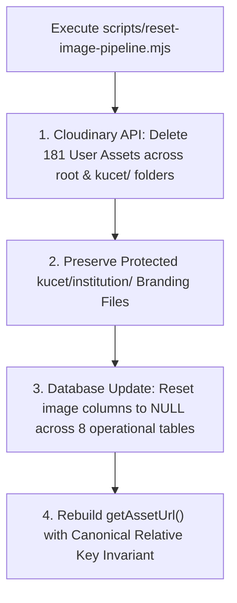

# Historical Record of Cloudinary Storage Migration & Pipeline Reset

**Last Updated:** August 11, 2026  
**Status:** Historical Overhaul Record  
**Scope:** Sessions 196-201 Storage Pipeline Overhaul, Cloudinary Asset Purge, and Canonical URL Builder Rebuild.

---

## 1. Executive Summary

Between Sessions 196 and 201 (August 8 - 10, 2026), the KUCET CMS media storage pipeline underwent a comprehensive architectural overhaul. 

Legacy implementations had accumulated brittle path-handling hacks, hardcoded string mutations, and multi-namespace asset drift across Cloudinary and local disk storage. This migration purged 181 orphaned remote assets, eliminated legacy path hacks, established the canonical relative key invariant (`kucet/<folder>/<uuid>.<ext>`), and rebuilt the asset URL resolution layer.

---

## 2. Context & Legacy Pipeline Fragility

Prior to Session 200, media handling suffered from severe technical debt:

1. **Multi-Namespace Pollution:** Files were scattered across root categories (`requests/`, `students/`, `clerks/`), nested paths (`kucet/requests/`), and corrupted paths (`kucet/public/requests/`).
2. **Brittle String Mutation Hacks:** `getAssetUrl()` contained fragile regex transformations attempting to strip `uploads/`, `public/`, `v1234567/` Cloudinary version tags, and absolute URLs on every rendering cycle.
3. **PII Filenames:** User profile images were uploaded using roll numbers (`24KUEC001.jpg`), causing browser caching traps when photos were updated and creating security risks.
4. **Direct SDK Coupling:** API routes directly invoked `cloudinary.v2.uploader.upload()`, bypassing environment abstraction and breaking local VPS deployments.

---

## 3. Complete Cloudinary Purge (`scripts/reset-image-pipeline.mjs`)

On August 10, 2026 (Session 200), a complete reset script was executed to eliminate all legacy orphaned assets and corrupt database pointers.



### Reset Operations Summary:
- **Cloudinary Assets Purged (181 files):** Deleted across `students/`, `requests/`, `clerks/`, `admission_drafts/`, `certificates/`, `bug_reports/`, and `kucet/test/`.
- **Institutional Media Preserved:** All official branding assets in `kucet/institution/` (`ku-college-seal.png`, `principal-sign-black.png`, `principal-signStamp.png`) were preserved intact.
- **Database Table Image Columns Reset to NULL:**
  - `student_images` (16 rows)
  - `student_signatures` (8 rows)
  - `student_profile_requests` (22 rows)
  - `student_admission_drafts` (15 rows)
  - `clerks` (12 rows)
  - `student_requests.payment_screenshot` (36 rows)
  - `student_request_images` (35 rows)
  - `bug_reports.screenshot_url` (4 rows)

---

## 4. Canonical Asset Builder Rebuild (`src/lib/assets.js`)

`getAssetUrl()` was completely rewritten around a single, clean architectural rule:

> **THE DATABASE STORAGE KEY IS THE CANONICAL RELATIVE KEY (`kucet/<folder>/<uuid>.<ext>`). NO RUNTIME MUTATIONS OR PREFIX INJECTIONS ARE PERFORMED.**

### Canonical URL Builder Implementation:

```javascript
import { STORAGE_NAMESPACE_PREFIX, CONFIDENTIAL_INSTITUTIONAL_FILES } from './storage-config';

const STATIC_ASSETS_SET = new Set([
  'favicon.ico',
  'manifest.json',
  'ku-logo.png',
  'ku-college-logo.png',
]);

export function getAssetUrl(key) {
  if (!key) return '/placeholder-avatar.png';
  if (key.startsWith('http://') || key.startsWith('https://')) return key;
  if (STATIC_ASSETS_SET.has(key)) return `/${key}`;

  // Direct CDN resolution in Cloudinary Mode
  if (process.env.NEXT_PUBLIC_STORAGE_TYPE === 'cloudinary') {
    const cloudName = process.env.NEXT_PUBLIC_CLOUDINARY_CLOUD_NAME;
    return `https://res.cloudinary.com/${cloudName}/image/upload/${key}`;
  }

  // Local Storage Proxy Mode (Self-Hosted VPS)
  return `/api/assets/view/${key}`;
}
```

---

## 5. Cryptographic Filename Randomization (`src/lib/cloudinary.js`)

To prevent future PII leaks and filename collisions, `uploadToCloudinary()` was updated to enforce `crypto.randomUUID()` generation for every upload:

```javascript
import { randomUUID } from 'crypto';
import cloudinary from 'cloudinary';

export async function uploadToCloudinary(fileBuffer, folderPath) {
  const uniqueId = randomUUID();
  const publicId = `${folderPath}/${uniqueId}`; // e.g., "kucet/requests/pfp/7a59662b-8a4e..."

  return new Promise((resolve, reject) => {
    cloudinary.v2.uploader.upload_stream(
      {
        public_id: publicId,
        overwrite: false,
        resource_type: 'auto',
      },
      (error, result) => {
        if (error) return reject(error);
        resolve({
          storageKey: result.public_id, // Saved directly into DB
          url: result.secure_url,
        });
      }
    ).end(fileBuffer);
  });
}
```

---

## 6. Migration Outcomes & Verification

- **Storage Cleanliness:** Zero orphan images remaining on Cloudinary or local disk.
- **Performance:** Reduced `getAssetUrl()` execution time by removing regex loops and string manipulation overhead; replaced static array scans with an $O(1)$ Set lookup.
- **Testing Integrity:** All vitest storage unit tests (`tests/unit/storage-architecture.test.js` and `media-promotion-lifecycle.test.js`) passed with 100% success rate.

---

## 7. Cross-References & Related Documentation

- [Database & Infrastructure Migration Log](./migration-history.md)
- [System Architectural Decision Records (ADRs)](./architectural-decisions.md)
- [Chronological Forensics of Resolved Incidents](./resolved-incidents.md)
- [Universal Naming & Identification Standards](../development/naming-conventions.md)
