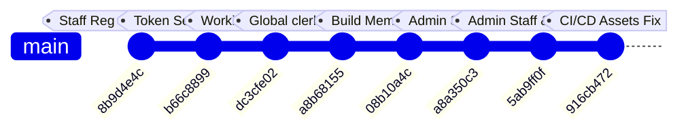

# Session 207 (testvanilla) — PR Changes, Commit Forensics & Workflow Audit

**Branch:** `testvanilla`  
**Base:** `main` (Post-Session 206)  
**Latest Commits Analyzed:** `a8b68155` → `08b10a4c` → `a8a350c3` → `5ab9ff0f` → `916cb472`  
**Status:** Pre-Merge Audit & Architectural Forensic Report  
**Analysis Date:** August 18, 2026  

---

## 1. Executive Summary

This document provides an in-depth forensic analysis of the latest Pull Request and incoming changes on the `testvanilla` branch, focusing on:
1. **Previous 3-4 Foundation Commits:** Global `clerk → staff` migration (212 files), memory-free build optimizations, and initial staff tables integration.
2. **Incoming Changes (Commits `a8a350c3`, `5ab9ff0f`, `916cb472`):** Implementation of the new Admin Staff Management console (`/admin/manage-staff`), multi-role staff API endpoints (`/api/admin/staff`), Admission Clerk / Faculty Edit Profile redesign (`/staff/settings/edit-profile`), `faculty_hod_assignments` database table, scoped `StaffContext` performance enhancements, and asset URL normalization.
3. **Workflow & Code Integrity Audit:** Comprehensive scan for workflow disconnects, broken modules, authentication bugs, schema mismatches, and edge-case security risks with actionable remediation plans.

---

## 2. Chronological Breakdown of Commits (Previous 3-4 & Incoming)



### A. Foundation Commits (Previous 3-4 Commits)

#### 1. Commit `a8b68155` — Global `clerk → staff` Rename (212 Files)
- **Scope:** Complete architectural rename across all codebase tiers.
- **Route Renames:**
  - `/clerk/*` → `/staff/*` (Pages: admission, faculty, scholarship, HOD dashboards, settings).
  - `/api/clerk/*` → `/api/staff/*` (~50 API endpoints).
  - `src/components/clerk/*` → `src/components/staff/*` (40 component files).
  - `ClerkContext.js` → `StaffContext.js` (`useClerk()` → `useStaff()`).
- **Auth & Session Infrastructure:**
  - Cookies renamed: `clerk_auth` → `staff_auth`, `clerk_logged_in` → `staff_logged_in`, `clerk_refresh_token` → `staff_refresh_token`, `clerk_session_id` → `staff_session_id`.
  - Auth helper renamed: `issueClerkAuthCookie` → `issueStaffAuthCookie`.
  - Refresh token `user_id` type migrated from string (email) to integer ID.
  - Multi-table JOIN in `refreshAccessToken` to reconstruct role, department affiliations, and HOD status.

#### 2. Commit `08b10a4c` — Memory-Free Deployment + Test CI/CD
- **Scope:** Prevented Render/VPS Out-Of-Memory (OOM) build crashes during Next.js standalone bundling.
- **`next.config.mjs` Optimizations:**
  - `productionBrowserSourceMaps: false` (eliminated multi-GB source map generation in memory).
  - `sourcemaps: { disable: true }` in Sentry wrapper (fixed 8GB heap memory leak).
  - `experimental: { webpackBuildWorker: true }` for worker-isolated compilation.
- **Admin Manage Clerks Integration:** Added initial `staffAccounts` table queries into the admin manage clerks page before the full redesign in `5ab9ff0f`.
- **E2E Test Updates:** Updated Playwright test specs (`attendance-routing.spec.js`, `attendance.spec.js`, `student-fee-payment.spec.js`) to target new `/staff/` routes and `staff_*` cookies.

---

### B. Incoming Commits (Latest Pull Request)

#### 3. Commit `a8a350c3` — Admin Staff Management Foundation
- Commenced migration of the legacy Clerk management console to a unified Staff Management architecture.

#### 4. Commit `5ab9ff0f` — Admin Staff Management & Staff Edit Profile Module
- **Admin Console Overhaul:**
  - Renamed `/admin/manage-clerks` → `/admin/manage-staff`.
  - Renamed `src/components/admin/PendingClerkRequests.js` → `PendingStaffRequests.js`.
  - Created `/api/admin/staff` and `/api/admin/staff/[id]` (GET, PUT, DELETE) supporting multi-branch assignment, HOD assignment, status toggling, and hard-delete with relational guardrails.
  - Removed legacy routes `/api/admin/clerks/*` and `/api/admin/clerk-requests/*`.
- **Staff Edit Profile Overhaul (`src/app/staff/settings/edit-profile/page.js`):**
  - Expanded to 475 lines supporting Admission Clerk, Scholarship Clerk, and Faculty profile editing.
  - Integrated image compression (`compressImage`) with 1MB ceiling and format validation.
  - Added bottom-sheet / popover responsive instructions for mobile vs desktop.
  - Connected with `/api/staff/update-profile` for pfp, signature, and contact updates.
- **Database Schema Enhancements:**
  - Added `facultyHodAssignments` table in `src/db/schema/operations.js` with date ranges and department code mapping.
  - Expanded `mobile_hash` column in `staffAccounts` and `staffRegistrationRequests` from `varchar(64)` to `varchar(255)` to support storing AES-256 encrypted ciphertext.
- **Performance Optimization (`StaffContext.js`):**
  - Removed eager, all-in-one bootstrap data fetching.
  - Sub-resource queries (`admissionDrafts`, `pendingProfileRequests`, `studentHistory`) are now lazy-loaded within their respective page components.

#### 5. Commit `916cb472` — CI/CD Fix (Asset Pipeline Normalization)
- **Asset Normalization (`src/lib/assets.js`):**
  - Bypass caching and processing for base64 `data:` URIs immediately.
  - Defensive URL parsing: Automatically extract relative `kucet/...` storage key if a full Cloudinary URL is accidentally passed to `getAssetUrl()`.
  - Clean path normalization: Ensured private local asset delivery (`/api/assets/view/...`) does not include duplicate leading slashes.
  - Memory leak protection: Added automatic cache clearing when `CLIENT_ASSET_CACHE.size > 5000`.

---

## 3. Database Schema Changes & Migration Requirements

### New Table: `faculty_hod_assignments` (`src/db/schema/operations.js`)

```javascript
export const facultyHodAssignments = mysqlTable('faculty_hod_assignments', {
  id:               int('id').autoincrement().primaryKey().notNull(),
  staff_account_id: int('staff_account_id').notNull(),    // FK -> staff_accounts.id
  department_code:  varchar('department_code', { length: 20 }).notNull(),
  academic_year:    varchar('academic_year', { length: 9 }).notNull(),
  start_date:       date('start_date').notNull(),
  end_date:         date('end_date'),
  is_active:        boolean('is_active').default(true).notNull(),
  assigned_by:      int('assigned_by'),                   // FK -> principal.id
  created_at:       timestamp('created_at').defaultNow(),
  updated_at:       timestamp('updated_at').onUpdateNow(),
}, (table) => ({
  staffIdIdx: index('idx_hod_staff_id').on(table.staff_account_id),
  deptIdx:    index('idx_hod_dept_code').on(table.department_code),
}));
```

### Altered Tables (`src/db/schema/identity.js`)

| Table | Column | Before | After | Rationale |
|---|---|---|---|---|
| `staff_accounts` | `mobile_hash` | `VARCHAR(64)` | `VARCHAR(255)` | Accommodates AES-256 encrypted mobile string from `encrypt()` |
| `staff_registration_requests` | `mobile_hash` | `VARCHAR(64)` | `VARCHAR(255)` | Accommodates AES-256 encrypted mobile string from `encrypt()` |

---

## 4. Forensic Workflow & Code Integrity Audit

During deep inspection of the changes across the PR, the following workflow disconnects, logic bugs, and architectural inconsistencies were identified:

---

### 🚨 Critical Issue 1: HOD Resolution Disconnect on Login & `/api/staff/me`

#### Problem Breakdown:
1. When Super Admin promotes a Faculty to HOD in `/admin/manage-staff`, `PUT /api/admin/staff/[id]` executes:
   ```javascript
   await tx.insert(facultyHodAssignments).values({
     staff_account_id: idNum,
     department_code: dCode,
     academic_year: currentSession.academic_year,
     start_date: new Date()
   });
   ```
2. However, when that faculty logs in via `POST /api/auth/employee-login`:
   ```javascript
   // src/app/api/auth/employee-login/route.js (Lines 113-115)
   // TODO: Fetch isHod properly if needed
   isHod = false;
   ```
3. When the faculty accesses their profile via `GET /api/staff/me`:
   ```javascript
   // src/app/api/staff/me/route.js (Lines 62-65)
   if (affil.length > 0) {
     branch = affil[0].branch_code;
     isHod = false; // Hardcoded to false!
   }
   ```
4. When silent token refresh runs in `src/lib/auth-utils.js` (`refreshAccessToken`):
   ```javascript
   // Checks staffAcademicAffiliations.is_hod, but NOT facultyHodAssignments!
   const affil = await db.select({ branch_code: academicDepartments.department_code, is_hod: staffAcademicAffiliations.is_hod })
   ```

#### Impact:
A faculty member assigned as HOD by the Administrator **will never receive `is_hod: true` in their session or context**. As a result, the HOD Dashboard and departmental administration tools will remain inaccessible.

#### Required Remediation:
Unify HOD resolution across `/api/auth/employee-login`, `/api/staff/me`, and `auth-utils.js` by querying `facultyHodAssignments` (or setting both `facultyHodAssignments` and `staffAcademicAffiliations.is_hod` during promotion).

---

### ⚠️ Issue 2: Audit Log Action Name Mismatch in Staff Update

#### Problem:
In `src/app/api/admin/staff/[id]/route.js` (Line 214):
```javascript
await logAudit(req, {
  userId: user.id,
  userType: 'admin',
  action: 'UPDATE_CLERK', // Stale action name
  targetId: idNum,
  targetType: 'staff_accounts',
  before: staffBefore,
  after: { name, email, employee_id, is_hod, branches, is_active }
});
```

#### Remediation:
Update `action: 'UPDATE_CLERK'` to `action: 'UPDATE_STAFF'`.

---

### ⚠️ Issue 3: Mobile Hash vs. Encryption Semantic Inconsistency

#### Problem:
- Originally, `mobile_hash` was intended to be a blind search index (`hashForIndex(mobile)` - 64 hex characters).
- In `ClerkRegistrationService.js` and `update-profile/route.js`, it now does:
  ```javascript
  updateData.mobile_hash = encrypt(mobile);
  ```
- And `/api/staff/me` attempts:
  ```javascript
  decryptedMobile = decrypt(staff.mobile_hash);
  ```

#### Impact:
While functional due to expanding the column to `VARCHAR(255)`, storing reversible ciphertext in a column named `mobile_hash` violates database naming conventions. 

#### Recommendation:
In the next clean migration, rename `mobile_hash` to `mobile_ciphertext` or `encrypted_mobile` and maintain a separate deterministic `mobile_blind_index` if blind lookup is needed.

---

### 💡 Issue 4: Eager getStorageProvider() URL Generation in `/api/staff/me`

#### Problem:
In `src/app/api/staff/me/route.js`, image fields (`pfp`, `signature`) are pre-transformed to absolute URLs:
```javascript
const { getStorageProvider } = require('@/lib/providers/storage/factory');
return getStorageProvider().getUrl(val);
```
When client components like `EditProfilePage` then pass `clerk?.pfp` into `getAssetUrl()`, it passes a full URL rather than a relative storage key.

#### Status:
Mitigated in commit `916cb472` via URL extraction in `getAssetUrl()`, but architectural best practice is to return clean relative keys from API and perform URL resolution purely at the React render layer.

---

## 5. Summary of System Changes Across All 9 testvanilla Commits

| Commit | Scope | Key Functional Changes |
|---|---|---|
| `8b9d4e4c` | Staff Registration Flow | New tables: `staff_accounts`, `staff_roles`, `staff_account_roles`, `staff_academic_affiliations`, `staff_account_activation_tokens`. OTP email verification and public wizard `/staff-registration`. |
| `b66c8899` | Token & Password Setup | Public activation API `/api/public/staff-registration/activate` and setup UI `/register/staff/activate`. |
| `dc3cfe02` | Activation Polish | Password strength meter in `PasswordSetupClient.js` and forgot-password alignment. |
| `7957f29f` | Merge Resolution | Clean branch sync with main. |
| `a8b68155` | Global Clerk → Staff Migration | 212 files renamed (`/clerk/` → `/staff/`, `clerk_auth` → `staff_auth`, `StaffContext.js`). |
| `08b10a4c` | CI/CD Memory Optimization | Standalone build optimization (`productionBrowserSourceMaps: false`, Sentry sourcemap disable) to fix 8GB memory leak on Render. |
| `a8a350c3` | Staff Console WIP | Initial scaffolding of modern staff admin pages. |
| `5ab9ff0f` | Admin Staff & Edit Profile | `/admin/manage-staff` console, `/api/admin/staff` CRUD, `faculty_hod_assignments` table, lazy `StaffContext`. |
| `916cb472` | Asset Delivery Fix | `getAssetUrl()` data URI bypass, kucet URL auto-recovery, and cache bounding. |

---

## 6. Pre-Merge Verification & Deployment Checklist

Before merging `testvanilla` into `main` and deploying to production:

1. [ ] **Resolve HOD Disconnect:** Update `src/app/api/auth/employee-login/route.js`, `src/app/api/staff/me/route.js`, and `src/lib/auth-utils.js` to query `facultyHodAssignments`.
2. [ ] **Audit Action Standard:** Change `'UPDATE_CLERK'` to `'UPDATE_STAFF'` in `src/app/api/admin/staff/[id]/route.js`.
3. [ ] **Run Migration Generation:**
   ```bash
   npm run db:generate
   ```
   Verify generated SQL contains `CREATE TABLE faculty_hod_assignments` and `ALTER TABLE staff_accounts MODIFY mobile_hash VARCHAR(255)`.
4. [ ] **Run Database Migration:**
   ```bash
   npm run db:migrate
   ```
5. [ ] **Verify Test Suite:**
   ```bash
   npx vitest run
   ```
6. [ ] **Invalidate Old Sessions Notice:** Notify institutional staff that `clerk_auth` cookies will expire upon deployment and manual re-login is required.
