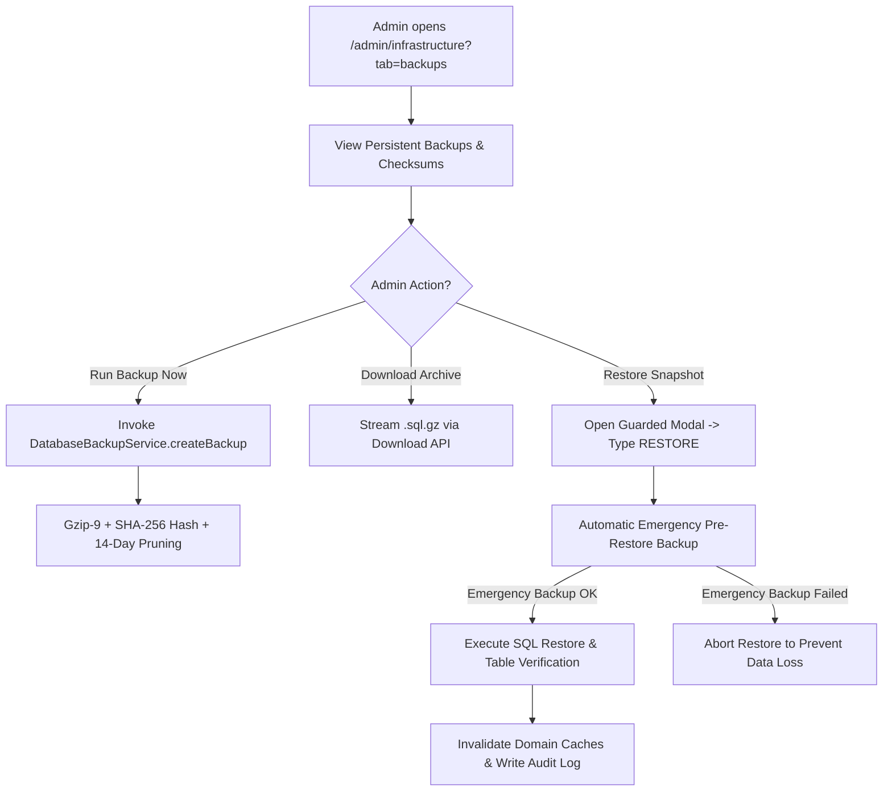

# Super Admin Console Workflows & Infrastructure Management

## Overview

The Super Admin Console (`/admin/*`) is the central control tower for system administrators, institution principals, and infrastructure engineers.

Access requires an active `admin_auth` JWT cookie signed with Super Admin privileges (`role: 'admin'`).

---

## Route Structure & Management Matrix

| Route Path | Feature Module | Core Functionality | Primary Services / APIs |
| :--- | :--- | :--- | :--- |
| `/admin/dashboard` | Executive Dashboard | Institution-wide metrics, system health, revenue counters | `HealthService.js`, `StudentService.js` |
| `/admin/manage-staff` | Staff & Faculty Directory | Unified directory to view, search, filter, edit, assign HOD/branches, or deactivate staff | `/api/admin/staff`, `/api/admin/staff/[id]` |
| `/admin/staff-requests` | Staff Registration Requests | Review, approve, reject, or resend activation for onboarding requests | `/api/admin/staff-requests` |
| `/admin/infrastructure` | Infrastructure & Backups | Server health, DB pool monitoring, backup execution & restore | `BackupService.js`, `DisasterRecoveryService.js` |
| `/admin/archive` | Archive & Retention Center | Data archiving jobs, policy configuration, record restore | `ArchiveService.js`, `ArchiveRestoreService.js` |
| `/admin/audit-logs` | Security Audit Trail | Complete system-wide security log inspector | `SecurityService.js` |

---

## Key Administrative Modules

### 1. Executive Dashboard (`/admin/dashboard`)
Provides real-time visibility into institution metrics:
- **Enrollment Overview**: Active student count categorized by branch (CSE, ECE, EEE, MECH, CIVIL) and regulation.
- **Faculty & Staff Status**: Count of active vs inactive staff, assigned HODs, and teaching faculty.
- **System Health Indicators**: Live status of database connections, Redis cache hit rates, Cloudinary storage usage, and Sentry error counts.

---

### 2. Staff & Faculty Account Management (`/admin/manage-staff`, `/admin/staff-requests`)
- **Role-Isolated 3-Tab Console**: Separated into distinct views for **Academic Faculty**, **Scholarship Clerks**, and **Admission Clerks**.
- **Pending Requests Banner (`PendingStaffRequests`)**: Super Admins review pending self-registration requests filtered by staff category directly above each directory.
- **HOD Promotion & Demotion**: Super Admins assign Head of Department (HOD) roles with atomic checks preventing multiple active HODs per department via `faculty_hod_assignments`.
- **Multi-Branch Affiliation**: Faculty management supports assigning multiple program/department affiliations and instant text search across employee ID, email, and name.
- **Access Control & Safe Deactivation**: Instant toggle switch to activate or suspend staff access (`account_status: ACTIVE` / `SUSPENDED`). Soft deactivation preserves relational history and audit trails.

---

### 3. Infrastructure & Database Backup Control (`/admin/infrastructure?tab=backups`)
- **Persistent VPS Backups**: Real-time registry of all local persistent snapshots stored at `/var/kucet-db-backup` (with size, date, type, and SHA-256 integrity checksums).
- **Manual Backup Trigger**: Instant on-demand database snapshot generation with live progress indicators and automatic 14-day retention pruning.
- **Secure File Download**: Authenticated streaming download of compressed `.sql.gz` database snapshots via `/api/admin/infrastructure/backups/download/[filename]`.
- **Guarded Disaster Recovery**: High-risk restoration modal requiring typing the exact phrase `RESTORE`. The system automatically creates an **Emergency Pre-Restore Backup** of the live database before overwriting data, and verifies post-restore table integrity.

---

### 4. Storage Explorer & Asset Auditor (`/admin/infrastructure/storage`)
- **Asset Inspection**: Browse uploaded student photographs, digital signatures, and certificate documents.
- **Orphan Media Pruner**: Identifies Cloudinary media assets no longer referenced by active database records in `student_images` or `student_signatures`, freeing up cloud storage.
- **ZIP Backup Exporter**: Bundles institutional media files into compressed `.zip` archives for offline archiving.

---

### 5. Archive & Retention Center (`/admin/archive`)
Governs long-term data lifecycle management to maintain database query performance:
- **Archive Engine Execution (`ARCHIVE_RUN`)**: Moves historical student records, attendance logs, and fee ledgers for graduated cohorts into `archive_*` tables.
- **Retention Policy Manager**: Configures retention windows (e.g. retain active attendance for 4 years, move to archive tables thereafter).
- **Historical Record Restoration (`ARCHIVE_RESTORE`)**: Enables searching archived cohorts and executing selective restoration back to active production tables if required for transcript re-issuance.

---

## Cross-References

- [Authentication Architecture](../authentication/authentication.md)
- [Database Schema Reference](../database/schema.md)
- [Backup Strategy & Disaster Recovery](../database/backup-strategy.md)
- [Institutional Staff Portal](./staff-pages.md)
- [Staff Management Feature](../features/staff-management.md)
