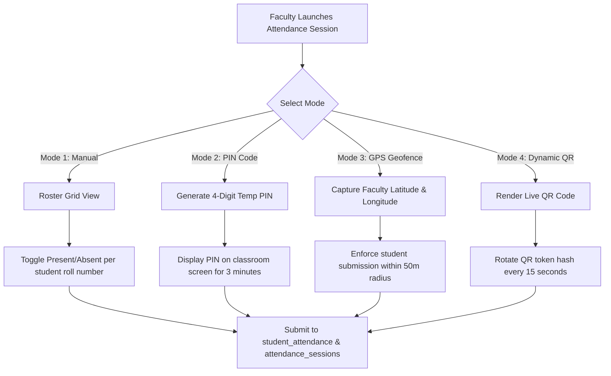

# Faculty Portal Workflows & Interface Specifications

## Overview

The Faculty Portal (`/staff/faculty/*`) provides teaching staff and department heads with tools for subject management, attendance recording, syllabus tracking, and examination marks submission.

Access is restricted to authenticated users holding `staff_auth` with `role: 'faculty'` or `is_hod: true`.

---

## Route Structure & Permission Requirements

| Route Path | Feature Description | Required RBAC Permission | Primary DB Tables |
| :--- | :--- | :---: | :--- |
| `/staff/faculty/dashboard` | Overview & Today's Schedule | `VIEW_OWN_RECORDS` | `faculty_subject_assignments`, `branch_timetable` |
| `/staff/faculty/academics` | Academics Hub: Subjects, Attendance, Evaluation, Students | `VIEW_OWN_RECORDS` | `faculty_subject_assignments` |
| `/staff/faculty/attendance/[assignmentId]` | Standalone Attendance Session | `ATTENDANCE_MARK` | `student_attendance`, `attendance_sessions` |
| `/staff/faculty/evaluation/[assignmentId]` | Standalone Marks Entry | `MARK_ENTRY` | `student_marks`, `students` |
| `/staff/faculty/time-table` | Faculty Personal Schedule | `VIEW_OWN_RECORDS` | `branch_timetable` |
| `/staff/faculty/attendance` | *(Deprecated — redirects to `/staff/faculty/academics`)* | — | — |
| `/staff/faculty/marks` | *(Deprecated — redirects to `/staff/faculty/academics`)* | — | — |

---

## Faculty Dashboard (`/staff/faculty/dashboard`)

The Faculty Dashboard serves as the modernized entry point for faculty members, featuring a unified Next.js `bg-[#0b3578]` glassmorphism gradient header. The layout uses a responsive flex-to-grid container that prominently features a vertically stacked "Priority Actions" module (which replaces the legacy grid cards). Additionally, the `PersonalSchedule` timetable integrates seamlessly via flex columns to provide immediate visibility into daily academic commitments.

---

## Faculty Profile (`/staff/faculty/profile`)

The streamlined Faculty Profile page now exclusively displays personal and demographic data. All security-specific fields—such as `last_login`, `joined`, and `account_status`—have been completely removed from this page, as they are now strictly managed within the dedicated Security Settings page.

---

## Academics Hub (`/staff/faculty/academics`)

The Academics Hub is the primary classroom console for faculty staff. It consolidates subject management, attendance, evaluation, and student lookup under a single tabbed interface, replacing the former `/staff/faculty/teaching` route.

The page contains **five tabs**:

### 1. My Subjects
Displays all faculty subject assignment cards sourced from `faculty_subject_assignments`. Each card includes:
- Subject name, course code, program, and semester metadata.
- A **bubble-type badge** at the top-right corner of the card indicating assignment status (e.g. active semester).
- Two action buttons: **Attendance** and **Evaluation**, which navigate to the respective standalone route pages using the `assignmentId` as the dynamic route parameter.

Design follows the Student Finance pages' design system (spacing, typography, card borders, and shadow tokens).

### 2. Attendance
Embedded tab entry point that navigates to the standalone Attendance page at `/staff/faculty/attendance/[assignmentId]` upon selecting a subject from My Subjects.

### 3. Evaluation
Embedded tab entry point that navigates to the standalone Evaluation (Marks Entry) page at `/staff/faculty/evaluation/[assignmentId]` upon selecting a subject from My Subjects.

### 4. Students
Renders the `StudentsLookupPanel` component inline within the hub. See the [Students Lookup Panel](#students-lookup-panel) section below for full documentation.

### 5. Syllabus Management
A dedicated tab available only to authorized Head of Departments (HODs). It embeds the `SyllabusManager.js` component to securely manage subject-branch mappings. HODs can view, add, and delete mappings, with the system enforcing unique mapping and blocking deletions if timetable or marks dependencies exist.

**Elective & Group Management:**
- **Hierarchical Table Structure**: Standard subjects render normally. Elective Groups render as distinct row headers, with a "+ Add Elective" fast-action shortcut directly on the header. Elective Subjects render directly beneath their parent group with visual indentation to clearly denote the parent-child relationship.
- **Creation Modal Modes**: The "Add Subject" modal features three mode toggles: **Standard Subject**, **Elective Group**, and **Elective Subject**. When creating an Elective Subject, the modal dynamically requires selecting a parent group from existing buckets.
- **API Safety Locks**: The backend API (`/api/staff/hod/syllabus`) explicitly validates `is_group` and `parent_group_code` attributes. A safety lock in the `DELETE_MAPPING` route blocks HODs from accidentally deleting an "Elective Group" if it still contains mapped child subjects.

### Mobile Behaviour
- Tabs wrap to multiple lines on narrow viewports instead of scrolling horizontally.
- The search bar is rendered **above** the filter controls on mobile screens.

---

## Students Lookup Panel

**Component:** `src/components/staff/faculty/StudentsLookupPanel.js`

The Students Lookup Panel provides faculty with two search modes to query enrolled students within their department boundary. It renders as an internal two-tab UI inside the Students tab of the Academics Hub.

### Department Boundary Enforcement
All queries are server-side validated. Authorized programs are derived exclusively from the faculty member's `staffAcademicAffiliations` records. Queries targeting programs outside the faculty's affiliated department return **HTTP 403 Forbidden**. For example, a CSE faculty member cannot query CIVIL branch students.

### Mode 1: Cohort Lookup
- **Inputs:** Program dropdown + Year of Study dropdown.
- Results are auto-fetched immediately upon both selections being made (no manual submit required).
- Year of study is derived from the active academic year via `getCollegeAcademicYear()` combined with roll number encoding conventions.
- **API:** `GET /api/staff/faculty/class-lookup?program=CSE&yearOfStudy=2`
- **Result limit:** 200 records.

### Mode 2: Global Search
- **Inputs:** Roll Number field and/or Student Name field.
- Search is triggered by clicking the **Search Records** button.
- Searches across all programs within the faculty's authorized department.
- **API:** `GET /api/staff/faculty/class-lookup?roll_no=XYZ` or `GET /api/staff/faculty/class-lookup?name=Goutham`
- **Result limit:** 50 records.

### Results Table Columns

| Column | Field |
| :--- | :--- |
| Roll No | `roll_no` |
| Student Name | `name` |
| Admission No | `admission_no` |
| Branch | `branch` |
| More | *Opens Student Profile Modal* |

The results table renders at full width (`w-full`, `min-w-[600px]`). Profile photos and batch year are intentionally excluded from the results payload.

### Extended Student Profile Modal
The "More" column in the data table opens a detailed student profile modal. This modal displays comprehensive information including: Name, Roll No, Father Name, Mother Name (fetched from `student_personal_details`), DOB, Phone, Email, Address, Current Year, and Batch. The address is dynamically constructed by combining up to 7 current address components (e.g., `curr_house_no`, `curr_street`), falling back to permanent address components if empty (the `country` is removed from the address string).

### Excel Export Data
The component features a styled native Excel (`.xlsx`) export using `xlsx-js-style` (replacing the previous basic CSV export). The generated Excel file includes 11 full columns:
1. Roll Number
2. Student Name
3. Branch
4. Email ID
5. Phone Number
6. Father Name
7. Mother Name
8. Date of Birth
9. Address
10. Current Year
11. Batch

Excel export filenames are dynamically generated based on the search state (e.g., `CSE_Year_2.xlsx` for Cohort Lookup or `Search_Results_21B81A0501.xlsx` for Global Search).

### API Source
**Route:** `src/app/api/staff/faculty/class-lookup/route.js`
- Returns fields: `id`, `roll_no`, `name`, `admission_no`, `branch`, along with additional personal details required for the extended modal and export.
- Department constraint applied server-side via `staffAcademicAffiliations`.

---

## Attendance Recording (`/staff/faculty/attendance/[assignmentId]`)

The Attendance page is a **standalone route** parameterized by `assignmentId` (`faculty_subject_assignments.id`). Faculty navigate here from the **My Subjects** tab in the Academics Hub by clicking the Attendance button on a subject card.

**Back navigation** on this page explicitly targets `/staff/faculty/academics` to return the faculty to the Academics Hub.

**Server-side ownership validation** ensures a faculty member can only open attendance sessions for their own assignment IDs. Unauthorized access to another faculty's `assignmentId` is rejected at the API layer.

The old route `/staff/faculty/attendance` (without parameter) silently redirects to `/staff/faculty/academics`.

### Attendance Recording Modes

The attendance module supports 4 multi-modal recording engines to adapt to different classroom settings:

#### 1. Manual Attendance Grid
Renders the complete class roster sorted by roll number. Includes quick bulk controls ("Mark All Present", "Mark All Absent") and instant statistics counters.

#### 2. PIN-Based Attendance
Generates a random 4-digit PIN valid for a short window (e.g. 3-5 minutes). Students enter this PIN on their mobile portal to check in.

#### 3. GPS Geo-Fenced Attendance
Captures the faculty's current device latitude and longitude via the Browser Geolocation API (`navigator.geolocation.getCurrentPosition`). When students check in, the system computes the Haversine distance between student and faculty GPS coordinates; check-ins exceeding the configured radius (e.g. 50 metres) are automatically rejected.

#### 4. Dynamic Anti-Proxy QR Code Engine
Displays an animated QR code modal. To prevent proxy attendance via screenshot sharing over messaging apps, the QR token hash rotates every 15 seconds. Scans are cryptographically validated against active session tokens stored in `attendance_sessions`.

---

## Lecture Topic & Syllabus Tracking

When finalizing an attendance session, faculty must complete the topic tracking log:
- **Topic Covered**: Detailed description of curriculum covered during the lecture.
- **Teaching Methodology**: Choice of Chalk & Board, PPT Presentation, Lab Demonstration, or Interactive Workshop.
- **Period Unit**: Identifies single or double period block.
- **Syllabus Progress Tracker**: Automatically increments percentage completion towards overall course units.

---

## Examination Marks Entry (`/staff/faculty/evaluation/[assignmentId]`)

The Evaluation page is a **standalone route** parameterized by `assignmentId` (`faculty_subject_assignments.id`). Faculty navigate here from the **My Subjects** tab in the Academics Hub by clicking the Evaluation button on a subject card.

**Back navigation** on this page explicitly targets `/staff/faculty/academics` to return the faculty to the Academics Hub.

**Server-side ownership validation** ensures a faculty member can only submit marks for their own assignment IDs. Unauthorized access to another faculty's `assignmentId` is rejected at the API layer.

The old route `/staff/faculty/marks` (without parameter) silently redirects to `/staff/faculty/academics`.

### Marks Entry Fields
- **Input Fields**: Mid-1 Marks (max 30), Mid-2 Marks (max 30), Assignment Marks (max 10), Lab Practical Marks.
- **Client Validation**: Enforces numerical bounds and prevents negative numbers or values exceeding maximum marks.
- **Lock-After-Approval Guard**: Once marks are submitted and approved by the Head of Department (`MARK_APPROVE`), the input grid transitions to read-only mode to prevent retroactive tampering.

---

## Cross-References

- [Authentication Architecture](../authentication/authentication.md)
- [Authorization System & RBAC Matrix](../authentication/authorization.md)
- [Student Portal Attendance View](./student-pages.md#3-subject-wise-attendance-analytics-studentattendance)
- [HOD Console & Subject Approval](./hod-pages.md#subject-allocation--marks-approval-workflow)
