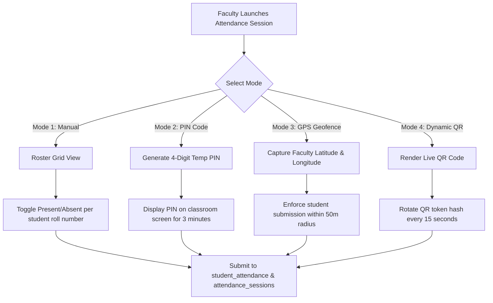

# Faculty Portal Workflows & Interface Specifications

## Overview

The Faculty Portal (`/staff/faculty/*`) provides teaching staff and department heads with tools for subject management, attendance recording, syllabus tracking, and examination marks submission.

Access is restricted to authenticated users holding `staff_auth` with `role: 'faculty'` or `is_hod: true`.

---

## Route Structure & Permission Requirements

| Route Path | Feature Description | Required RBAC Permission | Primary DB Tables |
| :--- | :--- | :---: | :--- |
| `/staff/faculty/dashboard` | Overview & Today's Schedule | `VIEW_OWN_RECORDS` | `faculty_subject_assignments`, `branch_timetable` |
| `/staff/faculty/attendance` | Multi-Modal Attendance Sheet & PIN/QR | `ATTENDANCE_MARK` | `student_attendance`, `attendance_sessions` |
| `/staff/faculty/marks` | Mid-Exam Marks Entry | `MARK_ENTRY` | `student_marks`, `students` |
| `/staff/faculty/materials` | Course Materials & Notes Upload | `VIEW_OWN_RECORDS` | `faculty_subject_assignments` |
| `/staff/faculty/time-table` | Faculty Personal Schedule | `VIEW_OWN_RECORDS` | `branch_timetable` |
| `/staff/faculty/class-list` | Enrolled Class List | `VIEW_OWN_RECORDS` | `students`, `student_academic_background` |

---

## Attendance Recording Modes

The faculty attendance module supports 4 multi-modal recording engines to adapt to classroom settings:

### 1. Manual Attendance Grid
Renders the complete class roster sorted by roll number. Includes quick bulk controls ("Mark All Present", "Mark All Absent") and instant statistics counters.

### 2. PIN-Based Attendance
Generates a random 4-digit PIN valid for a short window (e.g. 3-5 minutes). Students enter this PIN on their mobile portal to check in.

### 3. GPS Geo-Fenced Attendance
Captures the faculty's current device latitude and longitude via the Browser Geolocation API (`navigator.geolocation.getCurrentPosition`). When students check in, the system computes the Haversine distance between student and faculty GPS coordinates; check-ins exceeding the configured radius (e.g. 50 meters) are automatically rejected.

### 4. Dynamic Anti-Proxy QR Code Engine
Displays an animated QR code modal. To prevent proxy attendance via screenshot sharing over messaging apps, the QR token hash rotates every 15 seconds. Scans are cryptographically validated against active session tokens stored in `attendance_sessions`.

---

## Lecture Topic & Syllabus Tracking

When finalizing an attendance session, faculty must complete the topic tracking log:
- **Topic Covered**: Detailed description of curriculum covered during the lecture.
- **Teaching Methodology**: Choice of Chalk & Board, PPT Presentation, Lab Demonstration, or Interactive Workshop.
- **Period Unit**: Identifies single or double period block.
- **Syllabus Progress Tracker**: Automatically increments percentage completion towards overall course units.

---

## Examination Marks Entry Grid (`/staff/faculty/marks`)

The marks entry portal allows faculty to input internal assessment scores:
- **Input Fields**: Mid-1 Marks (max 30), Mid-2 Marks (max 30), Assignment Marks (max 10), Lab Practical Marks.
- **Client Validation**: Enforces numerical bounds and prevents negative numbers or values exceeding maximum marks.
- **Lock-After-Approval Guard**: Once marks are submitted and approved by the Head of Department (`MARK_APPROVE`), the input grid transitions to read-only mode to prevent retro-active tampering.

---

## Cross-References

- [Authentication Architecture](../authentication/authentication.md)
- [Authorization System & RBAC Matrix](../authentication/authorization.md)
- [Student Portal Attendance View](./student-pages.md#3-subject-wise-attendance-analytics-studentattendance)
- [HOD Console & Subject Approval](./hod-pages.md#subject-allocation--marks-approval-workflow)
