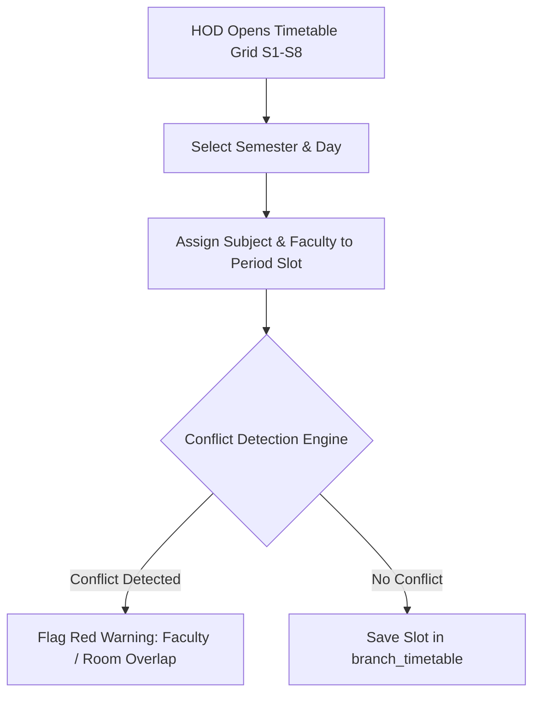

# Head of Department (HOD) Console Workflows & Interface Specifications

## Overview

The Head of Department (HOD) Console (`/clerk/hod/*`) equips department heads with high-level oversight of departmental academic scheduling, faculty workload balances, attendance condonation analytics, and marks approval workflows.

Access requires `clerk_auth` credentials where `is_hod: true` and a recognized departmental branch (`CSE`, `ECE`, `EEE`, `MECH`, `CIVIL`).

---

## Route Structure & Departmental Management Matrix

| Route Path | Feature Module | Core Functionality | Primary RBAC Permissions |
| :--- | :--- | :--- | :---: |
| `/clerk/hod/dashboard` | HOD Overview | Department summary, attendance health, faculty status | `VIEW_OWN_RECORDS` |
| `/clerk/hod/timetable` | Semester Timetable Matrix | Schedule 8 semesters (S1-S8), resolve room conflicts | `ATTENDANCE_EDIT` |
| `/clerk/hod/workload` | Faculty Workload Tracker | Weekly lecture hour distribution, substitutions | `REPORT_EXPORT` |
| `/clerk/hod/condonation` | Attendance Condonation | Identify low attendance, generate condonation lists | `REPORT_EXPORT` |
| `/clerk/hod/approvals` | Subject Allocation & Marks | Approve faculty subject requests, lock internal marks | `MARK_APPROVE` |

---

## Key Departmental Workflows

### 1. Semester Timetable Matrix (S1 - S8)
The timetable configuration grid (`branch_timetable`) manages weekly schedules across all 8 semesters:
- **Grid Layout**: Days (Monday to Saturday) vs Periods (Periods 1 through 7, including lunch break).
- **Subject & Faculty Pairing**: Assigns a subject and primary faculty member (`clerks.id`) to each period slot.
- **Conflict Detection Engine**: Automatically validates timetable allocations against active schedules across the institution to prevent:
  - Assigning the same faculty member to two different classes in the same period slot.
  - Assigning the same physical laboratory or lecture room simultaneously.

---

### 2. Faculty Workload Tracker & Substitutions (`/clerk/hod/workload`)
Maintains balanced teaching loads across departmental staff:
- **Workload Analytics**: Visualizes total weekly teaching hours per faculty member. Highlights overload (> 16 hours/week) or underload (< 8 hours/week) states.
- **Faculty Substitution Engine**: In the event of faculty leave, HODs assign temporary substitute faculty to specific class periods (`faculty_substitutions`), seamlessly transferring attendance recording permissions (`ATTENDANCE_MARK`) for that session.

---

### 3. Branch Condonation Analytics (`/clerk/hod/condonation`)
Monitors student attendance compliance across all branch sections:
- **Threshold Categorization**:
  - **Satisfactory ($\ge 75\%$)**: Regular exam eligibility.
  - **Condonation Range ($65\% - 74.9\%$)**: Eligible for condonation upon medical proof and fee payment.
  - **Detained ($< 65\%$)**: Highlighted in red; ineligible for university end-semester examinations.
- **Report Exporter (`REPORT_EXPORT`)**: Generates official PDF/Excel condonation list reports for submission to the Academic Audit Cell and University Registrar.

---

### 4. Subject Allocation & Marks Approval Workflow (`/clerk/hod/approvals`)
- **Subject Preference Review**: Evaluates subject interest submissions made by faculty (`faculty_subject_interests`) and formalizes final assignments (`faculty_subject_assignments`).
- **Internal Marks Approval (`MARK_APPROVE`)**: Review submitted Mid-1, Mid-2, and Lab marks. Clicking "Approve & Lock Marks" converts the marks grid to immutable read-only state in `student_marks` and enables transcript generation.

---

## Cross-References

- [Authentication Architecture](../authentication/authentication.md)
- [Authorization System & Fine-Grained RBAC](../authentication/authorization.md)
- [Faculty Portal & Attendance Sheets](./faculty-pages.md)
- [Student Portal Attendance View](./student-pages.md#3-subject-wise-attendance-analytics-studentattendance)
