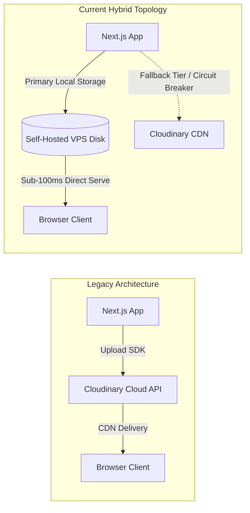
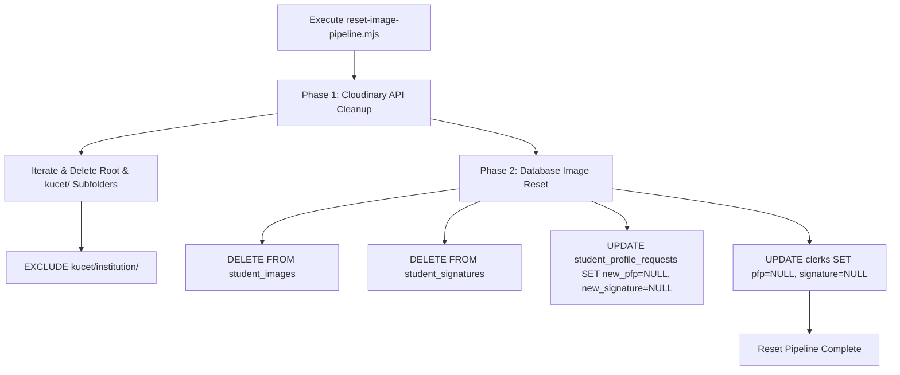

# Cloudinary Storage Architecture, Namespace & Purge Utilities

## 1. Cloudinary Storage Architecture & Historical Role

During the initial deployment phases of the KUCET College Management System, Cloudinary served as the primary asset storage and delivery network. Utilizing the `cloudinary` SDK (`v2.9.0`), the system delegated image scaling, WebP format conversion, and global distribution to Cloudinary's infrastructure.



### Architectural Evolution

1. **Phase I (Cloud-Native Storage)**: All student profile pictures, clerk signatures, and payment screenshots were uploaded directly to Cloudinary using API keys (`CLOUDINARY_CLOUD_NAME`, `CLOUDINARY_API_KEY`, `CLOUDINARY_API_SECRET`).
2. **Phase II (Hybrid VPS Migration)**: To eliminate third-party API dependencies, rate-limit costs, and external network latency, asset storage was migrated to local self-hosted VPS disk storage (`/var/www/kucet-storage/public`).
3. **Current Role (Secondary Fallback Tier)**: Cloudinary is maintained in [`CloudinaryStorageProvider.js`](file:///D:/User/Desktop/CMS/src/lib/providers/storage/CloudinaryStorageProvider.js) as a secondary fallback provider inside the `FailoverStorageProvider` chain and as a remote candidate source for institutional branding assets.

---

## 2. Cloudinary Public ID Structure

Cloudinary identifies assets using a string `public_id`. In the KUCET CMS architecture, the database storage key is mapped 1:1 to the Cloudinary `public_id` plus file extension.

### Canonical Namespace Standard

All assets residing on Cloudinary inherit the `kucet/` root prefix:

$$\text{CloudinaryPublicID} = \text{kucet/} \mathbin{/} \text{category} \mathbin{/} \text{subfolder} \mathbin{/} \text{uuid}$$

```javascript
// CloudinaryStorageProvider.js URL generation
getUrl(path, { transformations = 'f_auto,q_auto' } = {}) {
  if (!path || typeof path !== 'string') return '';
  if (path.startsWith('data:') || path.startsWith('http://') || path.startsWith('https://')) {
    return path;
  }

  const cleanPath = path.startsWith('/') ? path.substring(1) : path;
  
  // Determine Cloudinary resource_type from extension
  const extension = cleanPath.split('.').pop()?.toLowerCase() || '';
  let resourceType = 'image';
  if (['mp3', 'mp4', 'webm', 'mov'].includes(extension)) resourceType = 'video';
  else if (['pdf', 'docx', 'xlsx', 'csv'].includes(extension)) resourceType = 'raw';

  return `https://res.cloudinary.com/${this.cloudName}/${resourceType}/upload/${transformations}/${cleanPath}`;
}
```

---

## 3. Category Namespace Resolution (`ROOT_CATEGORIES`)

Legacy deployments stored assets across top-level un-prefixed Cloudinary folders. The current architecture standardizes all uploads under the `kucet/` tree while maintaining backward-compatible URL generation for legacy paths.

### Root Folder Taxonomy

| Namespace Category | Cloudinary Folder Path | Resource Type | Access Policy |
| :--- | :--- | :--- | :--- |
| **Student Profiles** | `kucet/students/pfp/` | `image` | Public Read / Controlled Write |
| **Student Signatures** | `kucet/students/signatures/` | `image` | Protected Read / Controlled Write |
| **Request Staging** | `kucet/requests/pfp/` | `image` | Ephemeral / Auto-Promoted |
| **Payment Proofs** | `kucet/certificates/payments/` | `image` | Clerk Audit Only |
| **Institutional Assets** | `kucet/institution/` | `image` | Permanently Immutable |

---

## 4. Cloudinary Purge & Reset Utility (`reset-image-pipeline.mjs`)

When transitioning environments or executing disaster recovery testing, the repository provides an automated administrative script: [`scripts/reset-image-pipeline.mjs`](file:///D:/User/Desktop/CMS/scripts/reset-image-pipeline.mjs).



### Two-Phase Purge Execution Protocol

1. **Phase 1: Cloudinary Asset Deletion**: Queries Cloudinary Admin API in batches of 500 (`cloudinary.api.resources`) and recursively purges assets across target folders while explicitly preserving `kucet/institution/`.
2. **Phase 2: Database Image Table Reset**: Connects directly to MySQL via `mysql2` and resets all image column references (`pfp`, `signature`, `payment_screenshot`, `screenshot_url`) to `NULL` or clears image junction rows.

### Execution Command

```bash
# Execute pipeline reset script (Requires CLOUDINARY_* and DB_* environment variables)
node scripts/reset-image-pipeline.mjs
```

> [!CAUTION]
> Running `reset-image-pipeline.mjs` is a **one-way destructive operation**. It permanently deletes remote Cloudinary media assets and clears database picture references.

---

## Cross-References

* [Universal Storage Abstraction Architecture](./file-storage.md)
* [Upload Pipelines & Asset Hierarchy](./uploads.md)
* [Self-Hosted VPS Storage Architecture](./self-hosted-storage.md)
