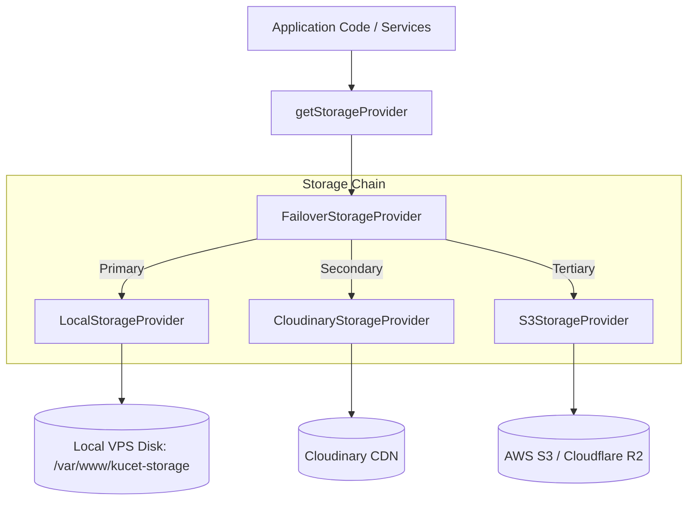
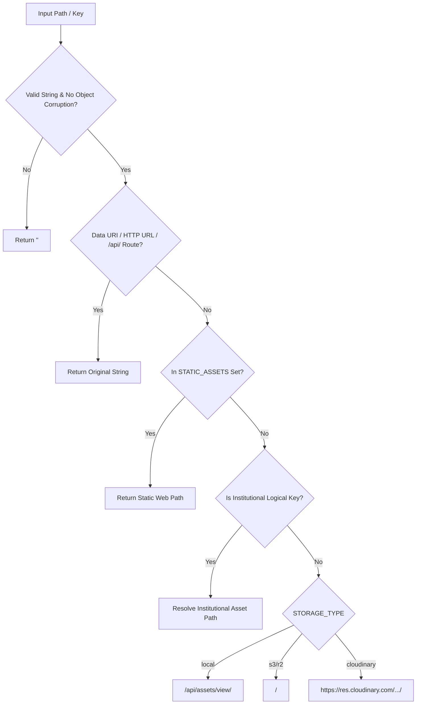

# Universal Storage Abstraction Architecture & Resolution

## 1. Universal Storage Abstraction Architecture

The KUCET College Management System employs a pluggable, multi-provider storage abstraction layer designed to decouple application code from physical storage backends. Whether assets are stored on a local VPS disk, an Amazon S3 / Cloudflare R2 bucket, or Cloudinary's CDN network, the core application interacts with a unified interface (`StorageProvider`).



### Design Principles

1. **Provider Isolation**: Services never invoke provider-specific SDKs directly. All upload, delete, copy, and move operations route through `StorageProvider`.
2. **Deterministic URL Generation**: Resolving relative storage keys to browser-ready URLs (`getUrl()`) is synchronous and deterministic, eliminating runtime network overhead for link building.
3. **Zero Vendor Lock-In**: Storage keys stored in the database are agnostic relative paths (`kucet/<folder>/<filename>`). Changing backends requires zero database migrations.

---

## 2. `StorageProvider` Abstract Interface Contract

All storage providers inherit from the base `StorageProvider` class defined in [`src/lib/providers/storage/StorageProvider.js`](file:///D:/User/Desktop/CMS/src/lib/providers/storage/StorageProvider.js).

### Class Definition & Standardized Result

```javascript
/**
 * Standardized result object returned by StorageProvider.upload()
 */
export class StorageResult {
  constructor({ path, url, filename, provider, mimeType }) {
    this.path = path;       // Relative storage key (e.g., kucet/students/pfp/abc.webp)
    this.url = url;         // Resolved browser URL
    this.filename = filename; // File basename
    this.provider = provider; // Provider identifier ('local' | 'cloudinary' | 's3')
    this.mimeType = mimeType || 'application/octet-stream';
  }
}
```

### Interface Methods

| Method Signature | Parameters | Description |
| :--- | :--- | :--- |
| `getUrl(path, options)` | `path: string`, `options?: object` | Converts a database storage key into a browser-accessible URL. |
| `upload(file, folder, publicId)` | `file: Buffer\|File\|string`, `folder: string`, `publicId?: string` | Uploads binary data or Base64 content to the target directory. |
| `delete(path)` | `path: string` | Deletes a physical file identified by its relative storage key. |
| `copyFile(sourcePath, targetFolder)` | `sourcePath: string`, `targetFolder: string` | Copies an existing asset to a new relative folder. |
| `moveFile(sourcePath, targetFolder)` | `sourcePath: string`, `targetFolder: string` | Relocates an asset to a target folder (Copy + Delete atomic sequence). |

---

## 3. `FailoverStorageProvider` Implementation

The [`FailoverStorageProvider`](file:///D:/User/Desktop/CMS/src/lib/providers/storage/FailoverStorageProvider.js) wraps an ordered chain of `StorageProvider` instances. If the primary provider fails due to a network partition, storage quota exhaustion, or circuit breaker trip, execution automatically cascades to fallback providers.

```javascript
export default class FailoverStorageProvider extends StorageProvider {
  constructor(providers = []) {
    super();
    this.providers = providers.filter(Boolean);
  }

  getUrl(storageKey, options = {}) {
    for (const provider of this.providers) {
      if (typeof provider.getUrl === 'function') {
        return provider.getUrl(storageKey, options);
      }
    }
    return storageKey;
  }

  async upload(fileBuffer, key, options = {}) {
    let lastError = null;
    for (const provider of this.providers) {
      try {
        return await provider.upload(fileBuffer, key, options);
      } catch (err) {
        lastError = err;
        logger.warn({ err: err.message, provider: provider.constructor.name, key }, 
          '[StorageFailover] Primary provider failed, trying fallback provider');
      }
    }
    throw new Error(`All storage providers failed to upload key "${key}": ${lastError?.message}`);
  }
}
```

### Provider Chain Initialization in `factory.js`

Provider order is dynamically assigned at startup in [`src/lib/providers/storage/factory.js`](file:///D:/User/Desktop/CMS/src/lib/providers/storage/factory.js) based on the `NEXT_PUBLIC_STORAGE_TYPE` or `STORAGE_TYPE` environment variable:

* **`local` Mode (Default VPS)**: `[ LocalStorageProvider, CloudinaryStorageProvider, S3StorageProvider ]`
* **`s3` / `r2` Mode**: `[ S3StorageProvider, CloudinaryStorageProvider, LocalStorageProvider ]`
* **`cloudinary` Mode**: `[ CloudinaryStorageProvider, LocalStorageProvider, S3StorageProvider ]`

---

## 4. Relative Storage Key Invariant Rule

> [!IMPORTANT]
> **Database Storage Key Invariant**: Absolute URLs (e.g., `https://res.cloudinary.com/...` or `https://login.kucet.in/uploads/...`) MUST NEVER be written to the database. Only store clean relative storage keys.

### Storage Key Format Standard

Canonical storage keys adhere strictly to the following syntax:

$$\text{StorageKey} = \text{kucet/} \mathbin{/} \text{category} \mathbin{/} \text{subfolder} \mathbin{/} \text{random-uuid}.\text{ext}$$

#### Valid Examples
* `kucet/students/pfp/b3f96f9f4d51487fb2d69fce.webp`
* `kucet/requests/signatures/71a9e1c8ab7d4b6d8d4e7e4a.png`
* `kucet/certificates/payments/5cb17d61a06c47d1b932af38.jpg`

#### Prohibited Anti-Patterns
* `https://res.cloudinary.com/djs0ry74r/image/upload/v1234/kucet/students/pfp/abc.jpg` *(Hardcoded CDN URL)*
* `/uploads/students/pfp/abc.jpg` *(Absolute filesystem path)*
* `21241A0501.jpg` *(Un-namespaced file using PII/roll number)*

---

## 5. Runtime URL Resolution (`getAssetUrl()`)

The [`getAssetUrl()`](file:///D:/User/Desktop/CMS/src/lib/assets.js) helper function is the single entry point for translating database storage keys into browser-executable URLs.



### Resolution Logic Implementation

```javascript
export function getAssetUrl(path, transformations = 'f_auto,q_auto') {
  if (!path || typeof path !== 'string') return '';
  if (path.includes('[object') || path.includes('undefined')) return '';

  // Pass-through: data URIs, absolute URLs, Next.js API routes
  if (path.startsWith('data:') || path.startsWith('http://') || path.startsWith('https://') || path.startsWith('/api/')) {
    return path;
  }

  const cleanPath = path.startsWith('/') ? path.substring(1) : path;
  const normalizedPath = `/${cleanPath}`;

  // Public static assets
  if (STATIC_ASSETS.has(normalizedPath)) {
    return normalizedPath;
  }

  // Institutional assets resolution
  const instFilename = resolveInstitutionalFilename(cleanPath);
  if (instFilename) {
    const storageType = (process.env.NEXT_PUBLIC_STORAGE_TYPE || process.env.STORAGE_TYPE || 'local').toLowerCase();
    if (storageType === 'local') return `/assets/${instFilename}`;
    const cloudName = process.env.NEXT_PUBLIC_CLOUDINARY_CLOUD_NAME || 'djs0ry74r';
    return `https://res.cloudinary.com/${cloudName}/image/upload/${transformations}/${instFilename}`;
  }

  const storageType = (process.env.NEXT_PUBLIC_STORAGE_TYPE || process.env.STORAGE_TYPE || 'local').toLowerCase();

  if (storageType === 'local') {
    return `/api/assets/view/${cleanPath}`;
  }

  if (storageType === 's3' || storageType === 'r2') {
    const s3Domain = process.env.NEXT_PUBLIC_S3_PUBLIC_DOMAIN || process.env.S3_PUBLIC_DOMAIN;
    if (s3Domain) return `${s3Domain.replace(/\/$/, '')}/${cleanPath}`;
  }

  // Cloudinary fallback
  const cloudName = process.env.NEXT_PUBLIC_CLOUDINARY_CLOUD_NAME || 'djs0ry74r';
  const extension = cleanPath.split('.').pop()?.toLowerCase() || '';
  let resourceType = 'image';
  if (['mp3', 'mp4', 'webm', 'wav'].includes(extension)) resourceType = 'video';
  else if (['pdf', 'docx', 'xlsx', 'csv'].includes(extension)) resourceType = 'raw';

  return `https://res.cloudinary.com/${cloudName}/${resourceType}/upload/${transformations}/${cleanPath}`;
}
```

---

## Cross-References

* [Upload Pipelines & Asset Hierarchy](./uploads.md)
* [Cloudinary Storage Architecture & History](./cloudinary-history.md)
* [Self-Hosted VPS Storage Architecture](./self-hosted-storage.md)
* [Self-Hosted VPS Production Setup](../deployment/vps.md)
