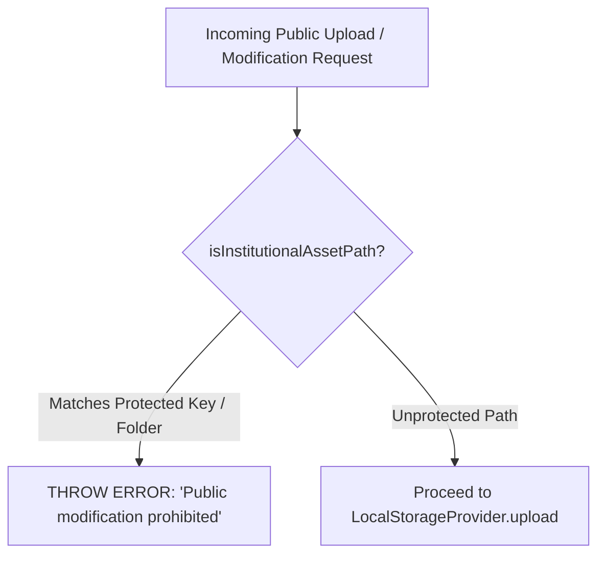

# Self-Hosted VPS Storage Architecture & Institutional Protection

## 1. Self-Hosted VPS Storage Architecture

The self-hosted storage architecture of the KUCET Management System is engineered for sub-100ms local network response times, complete data sovereignty, and zero egress bandwidth costs. Assets uploaded by students or administrative clerks are saved directly to persistent NVMe disk storage on the Hostinger VPS.

```mermaid
flowchart TD
    Client[Browser / Mobile Client] --> Proxy[Nginx Reverse Proxy :80/:443]
    
    Proxy -->|1. Direct Disk Lookup (X-Accel-Redirect)| Disk[(VPS Host Disk: /var/www/kucet-storage/kucet)]
    
    Proxy -->|2. Next.js App /api/assets/view/*| App[Next.js Container :3000]
    App -->|Read via getLocalStorageBasePath| Mount[(Docker Bind Mount: /app/storage)]
```

### Dual-Layer Delivery Strategy

1. **Layer 1 (Authorized Private Proxy - Standard Path)**: Client requests `/api/assets/view/[...path]`. Next.js authenticates and authorizes the user via `canUserAccessAsset(user, path)`. Next.js either returns the file buffer directly from `/app/storage/kucet/...` (with memory caching & ETag support) or issues an internal `X-Accel-Redirect: /internal_uploads/...` header to Nginx.
2. **Layer 2 (Nginx Internal X-Accel-Redirect - Fast Path)**: When `USE_NGINX_X_ACCEL=true`, Nginx directly streams the authorized static binary file from host storage `/var/www/kucet-storage/kucet/...`, achieving sub-10ms response time while preserving 100% access control security.

---

## 2. Host Disk Directory Structure

On the production Ubuntu VPS host, all persistent assets reside under the `/var/www/kucet-storage/` vault:

```
/var/www/kucet-storage/
└── kucet/                            # Primary Institutional Sub-Tree
    ├── students/
    │   ├── pfp/                      # Permanent Student Photos
    │   └── signatures/               # Permanent Student Signatures
    ├── requests/                     # Student Profile Updates & Proofs
    │   ├── pfp/
    │   ├── signatures/
    │   └── proofs/
    ├── certificates/                 # Certificate Evidence
    │   └── payments/                 # Payment Screenshots
    ├── admission_drafts/             # Draft Application Media
    │   ├── pfp/
    │   └── signatures/
    ├── clerks/                       # Staff Profiles & Signatures
    │   ├── pfp/
    │   └── signatures/
    ├── bug_reports/                  # Bug Report Attachments
    ├── ku-college-seal.png           # Official College Seal
    └── principal-sign.png            # Principal Digital Signature
```

---

## 3. Docker Bind Mount Mapping & Environment Configuration

To enable the Next.js containerized application to read and write to the host's physical storage, a Docker volume bind mount is established in [`DEPLOYMENT_PACKAGE/docker-compose.yml`](file:///D:/User/Desktop/CMS/DEPLOYMENT_PACKAGE/docker-compose.yml).

### Volume Mapping Configuration

```yaml
services:
  app:
    image: kucet-cms:latest
    container_name: kucet-cms-app
    volumes:
      - /var/www/kucet-storage:/app/storage
    environment:
      - STORAGE_PROVIDER=local
      - NEXT_PUBLIC_STORAGE_TYPE=local
      - LOCAL_STORAGE_PATH=/app/storage
```

### Path Resolution Helper ([`LocalStorageProvider.js`](file:///D:/User/Desktop/CMS/src/lib/providers/storage/LocalStorageProvider.js))

```javascript
export function getLocalStorageBasePath() {
  if (process.env.LOCAL_STORAGE_PATH) {
    return process.env.LOCAL_STORAGE_PATH;
  }
  return path.join(process.cwd(), 'public', 'uploads');
}
```

> [!NOTE]
> In Node.js source code, path operations targeting `LOCAL_STORAGE_PATH` use bundler ignore comments (`/* webpackIgnore: true */ /* turbopackIgnore: true */`) to prevent Webpack/Turbopack from attempting to bundle dynamic local disk paths at build time.

---

## 4. Operational Permissions & Security Guards

### UID / GID Ownership Protocol

Inside the Docker container, Next.js runs under a restricted non-root user (`nextjs`, `UID 1001`, `GID 1001`). To prevent `EACCES: permission denied` errors during file write operations:

```bash
# Set host directory ownership to Docker UID 1001
chown -R 1001:1001 /var/www/kucet-storage/public

# Grant read/write/execute permissions to owner and group
chmod -R 755 /var/www/kucet-storage/public
```

### Directory Traversal Protection

`LocalStorageProvider` sanitizes all incoming paths to block directory traversal attacks (`../` exploits):

```javascript
// LocalStorageProvider.js delete implementation
async delete(relativePath) {
  if (!relativePath || typeof relativePath !== 'string') return;
  
  const STORAGE_PATH = getLocalStorageBasePath();
  const cleanPath = cleanRelativePath(relativePath);
  const targetPath = path.join(STORAGE_PATH, cleanPath);

  // Security Guard: Prevent Directory Traversal Escapes
  if (!targetPath.startsWith(STORAGE_PATH)) {
    console.error('Security Violation: Directory traversal attempt blocked:', relativePath);
    return;
  }

  await fs.promises.unlink(targetPath).catch(() => {});
}
```

---

## 5. Institutional Asset Protection (`InstitutionAssetService`)

Institutional assets (Principal signatures, university logos, official seals) represent sensitive, high-trust digital credentials used for automated PDF certificate generation.



### Protection Enforcement Code ([`src/lib/institution-assets.js`](file:///D:/User/Desktop/CMS/src/lib/institution-assets.js))

```javascript
export function isInstitutionalAssetPath(pathOrFolder) {
  if (!pathOrFolder || typeof pathOrFolder !== 'string') return false;
  const clean = pathOrFolder.toLowerCase().trim().replace(/^[\/\\]+/, '');
  if (
    clean.startsWith('assets') ||
    clean.startsWith('institution') ||
    clean.includes('institution/') ||
    clean.includes('principal-sign') ||
    clean.includes('ku-college-seal') ||
    clean.includes('principal_ku_qr')
  ) {
    return true;
  }
  return resolveInstitutionalFilename(pathOrFolder) !== null;
}
```

### Server-Side Buffer Resolution for PDFs ([`src/services/institution/InstitutionAssetService.js`](file:///D:/User/Desktop/CMS/src/services/institution/InstitutionAssetService.js))

When generating hall tickets or transcripts on the server, `InstitutionAssetService.getAssetBuffer()` evaluates multiple candidate file paths to locate institutional images regardless of execution mode (standalone Next.js runner vs dev environment):

```javascript
// InstitutionAssetService.js multi-candidate resolver
const localCandidatePaths = [
  path.join(cwd, 'public', 'assets', filename),
  path.join(cwd, 'public', filename),
  path.resolve(cwd, '..', 'public', 'assets', filename),
  path.resolve(cwd, '..', '..', 'public', 'assets', filename),
  path.join(localBasePath, filename),
  path.join(localBasePath, 'kucet', filename),
];

for (const cand of localCandidatePaths) {
  if (fs.existsSync(cand)) {
    const buf = await fs.promises.readFile(cand);
    if (buf && buf.length > 0) return buf;
  }
}
```

---

## Cross-References

* [Universal Storage Abstraction Architecture](./file-storage.md)
* [Upload Pipelines & Asset Hierarchy](./uploads.md)
* [Self-Hosted VPS Production Setup](../deployment/vps.md)
* [Nginx Reverse Proxy Configuration](../deployment/nginx.md)
