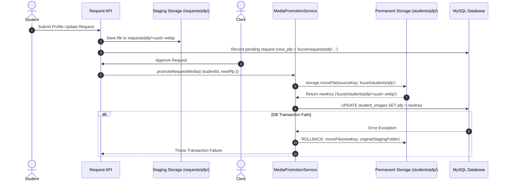

# Upload Pipelines, Asset Hierarchy & Lifecycle Management

## 1. Storage Hierarchy & Category Namespaces

The KUCET College Management System enforces a strict folder taxonomy across all storage backends. Hardcoded folder paths in API endpoints are prohibited; all locations must reference the central [`STORAGE_FOLDERS`](file:///D:/User/Desktop/CMS/src/lib/storage-config.js) registry.

### Operational Directory Structure

```
kucet/
├── students/
│   ├── pfp/                  # Permanent student profile photos
│   └── signatures/           # Permanent student digital signatures
├── requests/
│   ├── pfp/                  # Staging for pending profile photo updates
│   ├── signatures/           # Staging for pending signature updates
│   └── proofs/               # Verification proof documents (PDFs, identity cards)
├── certificates/
│   └── payments/             # Fee payment screenshot evidence
├── admission_drafts/
│   ├── pfp/                  # Staging for incomplete online admission drafts
│   └── signatures/           # Staging for incomplete admission signatures
├── staff/
│   ├── pfp/                  # Faculty / Institutional staff photos
│   └── signatures/           # Faculty & staff digital signatures
├── bug_reports/              # Issue tracking screenshot attachments
├── backups/                  # Encrypted database & asset system archives
└── institution/              # Protected institutional assets (Logos, Seals, Principal Signs)
```

---

## 2. Upload Limits & Client Compression

To prevent server storage exhaustion and maintain optimal HTTP transfer speeds, strict file size constraints are enforced at both client and server boundaries.

### File Size Limits (`UPLOAD_LIMITS`)

```javascript
// src/lib/storage-config.js
export const UPLOAD_LIMITS = Object.freeze({
  IMAGE_MAX_BYTES: 1 * 1024 * 1024,      // 1MB Max for Images (PFPs, Signatures, Screenshots)
  DOCUMENT_MAX_BYTES: 10 * 1024 * 1024,   // 10MB Max for PDF Documents & Evidence
});
```

### Client-Side Image Compression Protocol

Before uploading user profile images or signatures to API endpoints, the client browser processes files using an HTML5 Canvas pipeline:

1. **Dimension Rescaling**: Images exceeding 1200x1200px are downscaled proportionally.
2. **Format Re-encoding**: Input images (PNG, JPEG, HEIC) are converted to standard WebP or compressed JPEG.
3. **Quality Tuning**: Compression quality is target-adjusted (default `0.82`) to guarantee output size remains strictly under `1,048,576 bytes` (1MB).

```javascript
// Client Compression Pattern
export async function compressImage(file, maxDimension = 1200, quality = 0.82) {
  return new Promise((resolve, reject) => {
    const img = new Image();
    img.src = URL.createObjectURL(file);
    img.onload = () => {
      const canvas = document.createElement('canvas');
      let { width, height } = img;
      if (width > maxDimension || height > maxDimension) {
        if (width > height) {
          height = Math.round((height * maxDimension) / width);
          width = maxDimension;
        } else {
          width = Math.round((width * maxDimension) / height);
          height = maxDimension;
        }
      }
      canvas.width = width;
      canvas.height = height;
      const ctx = canvas.getContext('2d');
      ctx.drawImage(img, 0, 0, width, height);
      canvas.toBlob(
        (blob) => resolve(blob),
        'image/webp',
        quality
      );
    };
    img.onerror = (err) => reject(err);
  });
}
```

---

## 3. Cryptographic UUID Filename Generation

To guarantee global uniqueness and prevent filename collisions across multi-threaded upload workers, filenames are generated cryptographically using random 128-bit hex UUID strings.

```javascript
// LocalStorageProvider.js filename generation
import crypto from 'crypto';

const randomStr = crypto.randomBytes(10).toString('hex'); // 20-character hex string
const filename = `${randomStr}${extension}`;
```

---

## 4. Zero User Identifiers in Paths Rule (Privacy Invariant)

> [!CAUTION]
> **Strict Privacy Rule**: Storage key paths and filenames MUST NEVER contain student Roll Numbers, Hall Ticket Numbers, SSNs, personal names, or database auto-increment IDs.

### Rationale

1. **Enumeration Attack Prevention**: If files were named `21241A0501.jpg`, unauthenticated bad actors could systematically crawl student photos by incrementing roll numbers.
2. **GDPR / Privacy Compliance**: Prevents PII exposure through web server access logs and browser cache histories.
3. **Immutability of Key References**: A student's profile photo key remains valid even if their academic registration number or status is updated.

---

## 5. Staging vs Permanent Promotion (`MediaPromotionService`)

When students request profile picture updates or submit admission applications, files are initially stored in temporary staging directories (`requests/` or `admission_drafts/`). Files are ONLY moved to permanent student directories (`students/`) upon explicit clerk approval.

### Media Promotion Lifecycle Sequence



### Core Service Logic ([`MediaPromotionService.js`](file:///D:/User/Desktop/CMS/src/services/storage/MediaPromotionService.js))

```javascript
export class MediaPromotionService {
  static isTemporaryPfp(key) {
    if (!key || typeof key !== 'string') return false;
    return [/requests\/pfp\//, /admission_drafts\/pfp\//].some(p => p.test(key));
  }

  static async promoteRequestMedia({ studentId, newPfp, newSignature }, tx) {
    let promotedPfp = newPfp;
    let movedPfpResult = null;

    try {
      // 1. Physically move PFP if in temporary staging
      if (newPfp && this.isTemporaryPfp(newPfp)) {
        movedPfpResult = await this.promoteStudentProfile(newPfp);
        promotedPfp = movedPfpResult.newKey;
      }

      // 2. Perform DB Updates within Transaction
      const dbHandle = tx || db;
      if (promotedPfp) {
        await dbHandle.insert(studentImages)
          .values({ student_id: studentId, pfp: promotedPfp })
          .onDuplicateKeyUpdate({ set: { pfp: promotedPfp } });
      }

      return { promotedPfp };
    } catch (error) {
      // ROLLBACK SAFETY: Restore files if physical moves succeeded but DB failed
      const storage = getStorageProvider();
      if (movedPfpResult?.moved) {
        const origFolder = movedPfpResult.originalKey.substring(0, movedPfpResult.originalKey.lastIndexOf('/'));
        await storage.moveFile(movedPfpResult.newKey, origFolder).catch(rbErr => {
          logger.error({ err: rbErr.message }, '[MEDIA_PROMOTION_PFP_ROLLBACK_ERROR]');
        });
      }
      throw error;
    }
  }
}
```

---

## Cross-References

* [Universal Storage Abstraction Architecture](./file-storage.md)
* [Self-Hosted VPS Storage Architecture](./self-hosted-storage.md)
* [Common Runtime & Build Errors Catalog](../troubleshooting/common-errors.md)
