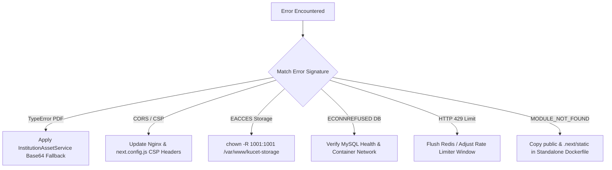

# Common Runtime & Build Errors Catalog & Resolution Protocols

## 1. Catalog of Frequent Runtime & Build Errors

This catalog provides definitive root-cause analyses and exact remediation commands for common runtime errors and build failures encountered in the KUCET Management System.



---

### 1.1 `TypeError: Cannot read properties of undefined` in PDF Generation

* **Symptom**: Hall ticket or transcript PDF generation fails with `HTTP 500` error: `TypeError: Cannot read properties of undefined (reading 'split')`.
* **Root Cause**: The student profile photo or signature path stored in the database is `null`, or `getAssetUrl()` received an undefined path object, causing standard string processing methods to crash.
* **Resolution Protocol**:
  1. Ensure all asset URL calls route through `InstitutionAssetService` or `getAssetUrl()`, which contain built-in null-guards.
  2. Fall back to standard inline Data URIs or default SVG avatars when image buffers are empty:
```javascript
// Robust PDF Image Fallback Pattern
const avatarDataUrl = await InstitutionAssetService.getAssetDataUrl(student.pfp) 
  || 'data:image/svg+xml;base64,...';
```

---

### 1.2 Content Security Policy (CSP) & CORS Directives Failure

* **Symptom**: Browser console logs `Refused to load the image 'https://res.cloudinary.com/...' because it violates the following Content Security Policy directive: "img-src 'self'"`.
* **Root Cause**: Next.js security headers or Nginx headers restrict image or API connection origins, blocking external CDN resources or cross-origin API calls.
* **Resolution Protocol**:
  1. Update `next.config.js` and `DEPLOYMENT_PACKAGE/nginx/nginx.conf` to explicitly include the missing origin domain in `img-src` and `connect-src`.
  2. Reload Nginx configuration:
```bash
docker compose -f DEPLOYMENT_PACKAGE/docker-compose.yml restart nginx
```

---

### 1.3 Storage Permission Denied (`EACCES: permission denied`)

* **Symptom**: Student upload API fails with error `EACCES: permission denied, open '/app/public/uploads/kucet/students/pfp/abc.webp'`.
* **Root Cause**: Host filesystem directory permissions are owned by `root` (UID 0), preventing the Docker container non-root user (`nextjs`, UID 1001) from writing files.
* **Resolution Protocol**:
  Execute the permission reset command on the VPS host:
```bash
sudo chown -R 1001:1001 /var/www/kucet-storage/public
sudo chmod -R 755 /var/www/kucet-storage/public
```

---

### 1.4 Database Connection Refused (`ECONNREFUSED` / `ETIMEDOUT`)

* **Symptom**: API endpoints crash with `Error: connect ECONNREFUSED 127.0.0.1:3306` or `DB connection timeout`.
* **Root Cause**:
  * Inside Docker containers, `DB_HOST` is improperly configured as `localhost` or `127.0.0.1` instead of the Docker Compose service name `db`.
  * MySQL container crashed or reached `max_connections` (150).
* **Resolution Protocol**:
  1. Verify `.env.production` sets `DB_HOST=db`.
  2. Check MySQL container status and inspect logs:
```bash
docker compose -f DEPLOYMENT_PACKAGE/docker-compose.yml ps db
docker logs --tail 50 kucet-cms-db
```
  3. Restart the database service:
```bash
docker compose -f DEPLOYMENT_PACKAGE/docker-compose.yml restart db app
```

---

### 1.5 Rate-Limit HTTP 429 Responses (`Too Many Requests`)

* **Symptom**: Users receive `HTTP 429 Too Many Requests` when navigating administrative pages or logging in.
* **Root Cause**: Upstash Redis or local sliding-window rate limiter keys triggered due to concurrent IP requests or automated monitoring probes.
* **Resolution Protocol**:
  1. Flush rate-limit keys in Redis CLI:
```bash
docker exec -it kucet-cms-redis redis-cli FLUSHDB
```
  2. If using MySQL rate limiting fallback, purge expired rows:
```sql
DELETE FROM rate_limit_attempts WHERE expires_at < NOW();
```

---

### 1.6 Next.js Standalone Module Not Found (`MODULE_NOT_FOUND`)

* **Symptom**: Docker container exits immediately on launch with `Error: Cannot find module '/app/server.js'`.
* **Root Cause**: The Docker build step omitted copying the `.next/standalone` folder or static assets into the runtime container image.
* **Resolution Protocol**:
  Verify [`DEPLOYMENT_PACKAGE/Dockerfile`](file:///D:/User/Desktop/CMS/DEPLOYMENT_PACKAGE/Dockerfile) includes the complete copy steps:
```dockerfile
# Copy standalone runner output
COPY --from=builder /app/.next/standalone ./
COPY --from=builder /app/.next/static ./.next/static
COPY --from=builder /app/public ./public
```

---

## 2. Diagnostics Matrix Reference Table

| Error Signature | Impacted Layer | Primary Suspect | Direct Remediation Command |
| :--- | :--- | :--- | :--- |
| `TypeError: Cannot read properties...` | Application / PDF | Null Asset Reference | Wrap asset call in `getAssetUrl()` / `InstitutionAssetService` |
| `CSP Directive Violation` | Security / Edge | Restrictive CSP Header | Add CDN domain to `img-src` in `nginx.conf` |
| `EACCES: permission denied` | Storage / OS | Host File Ownership Mismatch | `chown -R 1001:1001 /var/www/kucet-storage/public` |
| `ECONNREFUSED` | Database / Network | Incorrect `DB_HOST` setting | Set `DB_HOST=db` in `.env.production` |
| `HTTP 429 Too Many Requests` | Auth / Cache | Rate-Limiter Threshold Exceeded | Run `redis-cli FLUSHDB` |
| `MODULE_NOT_FOUND` | Deployment / Docker | Missing Standalone Copy | Verify Dockerfile `.next/standalone` copy step |

---

## Cross-References

* [System Debugging Guide](./debugging-guide.md)
* [Active Known Issues & Technical Debt](./known-issues.md)
* [Nginx Reverse Proxy Configuration](../deployment/nginx.md)
* [Self-Hosted VPS Storage Architecture](../storage/self-hosted-storage.md)
